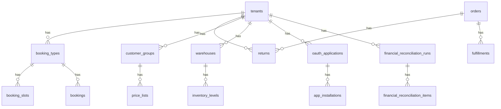

# Azadexa — مخطط قاعدة البيانات v2

> **الحالة:** 📋 موثَّق فقط — يُزامَن مع `ORION-Project-Plan-Report.md` §0.15  
> **هذا الملف توثيق وتخطيط فقط.** لا تُنشأ migrations لهذه الجداول في `migrations/versions/` حتى يُختار **Release Train** (§2.5 في الخطة الرئيسية).

## ملخص

| النطاق | العدد | الموقع |
|--------|-------|--------|
| MVP v1 | **64** | `migrations/versions/` — #1–40, #44–60, #133–140 |
| **v2 (هذا الملف)** | **80** | توثيق — يُنفَّذ train-by-train |
| إجمالي الخطة | **144** | `ORION-Project-Plan-Report.md` §33.1 |

**تركيب الـ 80 جدول v2:**
- **3** حجز: #41–43
- **72** تميز عالمي: #61–132 (يشمل `product_schema_markup`, `accessibility_audits`)
- **4** مطابقة/تدقيق: #141–144
- **1** اختياري مستقبلي: `commission_exceptions` (غير مُدرج في العدد 144)

---

## قواعد التنفيذ

1. **ممنوع** دمج كل الـ 80 جدول في migration واحدة.
2. كل **Release Train** (§2.5) يختار حزمة جداول فقط — مثلاً v1.2 = RMA + B2B.
3. كل جدول v2 يتبع معايير §4.0 (FK, RLS, `tenant_id`, `public_id` حيث ينطبق).
4. Feature flag per-tenant قبل تفعيل أي حزمة v2 في الإنتاج.
5. التفاصيل الكاملة لكل جدول (أعمدة، FK، فهارس) في `ORION-Project-Plan-Report.md` §4.x.

---

## ERD مبسط — مجالات v2



---

## جداول v2 حسب Release Train

### Train v1.2 — RMA + B2B (المرحلة 15–16)

| # | الجدول | الوصف | مرجع |
|---|--------|-------|------|
| 61 | return_reasons | أسباب المرتجع | §4.16 |
| 62 | returns | المرتجعات RMA | §4.16 |
| 63 | return_items | عناصر المرتجع | §4.16 |
| 64 | draft_orders | الطلبات المسودة | §4.16 |
| 65 | draft_order_items | عناصر المسودة | §4.16 |
| 66 | customer_groups | مجموعات العملاء B2B | §4.17 |
| 67 | customer_group_members | أعضاء المجموعة | §4.17 |
| 68 | price_lists | قوائم الأسعار | §4.17 |
| 69 | price_list_items | عناصر قائمة الأسعار | §4.17 |
| 70 | quotes | عروض الأسعار RFQ | §4.17 |
| 71 | quote_items | عناصر العرض | §4.17 |

### Train v1.2+ — الحجز (المرحلة 11)

| # | الجدول | الوصف | مرجع |
|---|--------|-------|------|
| 41 | booking_types | أنواع الحجز | §4.9 |
| 42 | booking_slots | فترات الحجز | §4.9 |
| 43 | bookings | الحجوزات | §4.9 |

> **ملاحظة v1.10:** الحجز **خارج MVP** — لا migration حتى train يُختار.

### Train v1.3 — اشتراكات + رقمي (المرحلة 17)

| # | الجدول | الوصف | مرجع |
|---|--------|-------|------|
| 72 | subscriptions | الاشتراكات | §4.18 |
| 73 | subscription_items | عناصر الاشتراك | §4.18 |
| 74 | subscription_invoices | فواتير الاشتراك | §4.18 |
| 75 | subscription_events | أحداث الاشتراك | §4.18 |
| 76 | digital_assets | الأصول الرقمية | §4.18 |
| 77 | digital_downloads | التنزيلات | §4.18 |
| 78 | license_keys | مفاتيح الترخيص | §4.18 |

### Train v1.3 — OMS / مخزون (المرحلة 18)

| # | الجدول | الوصف | مرجع |
|---|--------|-------|------|
| 79 | warehouses | المستودعات | §4.19 |
| 80 | inventory_levels | مستويات المخزون | §4.19 |
| 81 | inventory_transfers | نقل المخزون | §4.19 |
| 82 | inventory_transfer_items | عناصر النقل | §4.19 |
| 83 | fulfillments | التنفيذ | §4.19 |
| 84 | fulfillment_items | عناصر التنفيذ | §4.19 |

### Train v1.4 — ضرائب + BNPL + BOPIS (المراحل 19–20)

| # | الجدول | الوصف | مرجع |
|---|--------|-------|------|
| 85 | tax_jurisdictions | الولايات الضريبية | §4.20 |
| 86 | tax_rates | أسعار الضريبة | §4.20 |
| 87 | tax_nexus_rules | قواعد nexus | §4.20 |
| 88 | bnpl_providers | مزودو BNPL | §4.21 |
| 89 | bnpl_transactions | معاملات BNPL | §4.21 |
| 90 | pickup_locations | مواقع الاستلام | §4.22 |
| 91 | pickup_slots | فترات الاستلام | §4.22 |
| 92 | product_bundles | حزم المنتجات | §4.22 |
| 93 | bundle_items | عناصر الحزمة | §4.22 |
| 94 | metafield_definitions | تعريفات Metafield | §4.22 |
| 95 | metafields | قيم Metafield | §4.22 |

### Train v1.4 — هجرة واستيراد (المرحلة 21)

| # | الجدول | الوصف | مرجع |
|---|--------|-------|------|
| 96 | import_export_jobs | مهام الاستيراد/التصدير | §4.23 |
| 97 | stock_notifications | تنبيهات المخزون | §4.23 |

### Train v1.5 — App Store + قنوات (المراحل 22–23)

| # | الجدول | الوصف | مرجع |
|---|--------|-------|------|
| 100 | oauth_applications | تطبيقات OAuth | §4.24 |
| 101 | app_installations | تثبيت التطبيقات | §4.24 |
| 102 | app_webhook_subscriptions | webhooks التطبيقات | §4.24 |
| 103 | sandbox_stores | متاجر تجريبية | §4.24 |
| 104 | checkout_custom_fields | حقول checkout | §4.24 |
| 105 | checkout_field_values | قيم حقول checkout | §4.24 |
| 106 | channel_connections | اتصالات القنوات | §4.25 |
| 107 | channel_listings | قوائم القنوات | §4.25 |
| 108 | channel_sync_logs | سجلات المزامنة | §4.25 |
| 109 | fraud_rules | قواعد الاحتيال | §4.25 |
| 110 | fraud_reviews | مراجعات الاحتيال | §4.25 |
| 111 | chargebacks | الاستردادات البنكية | §4.25 |

### Train v1.5 — امتثال + WCAG (المرحلة 24)

| # | الجدول | الوصف | مرجع |
|---|--------|-------|------|
| 112 | consent_records | سجلات الموافقة | §4.26 |
| 113 | data_subject_requests | طلبات خصوصية GDPR | §4.26 |
| 114 | cookie_consent_settings | إعدادات الكوكيز | §4.26 |
| 115 | sso_providers | مزودو SSO | §4.26 |
| 131 | accessibility_audits | تدقيق WCAG | §4.41 |

### Train v2.0 — Workflow + بحث متقدم (المرحلة 25)

| # | الجدول | الوصف | مرجع |
|---|--------|-------|------|
| 116 | workflow_definitions | تعريفات سير العمل | §4.27 |
| 117 | workflow_runs | تشغيلات سير العمل | §4.27 |
| 118 | search_synonyms | مرادفات البحث | §4.28 |
| 119 | search_redirects | إعادة توجيه البحث | §4.28 |
| 120 | search_boost_rules | تعزيز البحث | §4.28 |

### Train v2.0 — شركاء + دروبشيب (المرحلة 26)

| # | الجدول | الوصف | مرجع |
|---|--------|-------|------|
| 121 | affiliate_programs | برامج الشركاء | §4.29 |
| 122 | affiliates | الشركاء | §4.29 |
| 123 | affiliate_commissions | عمولات الشركاء | §4.29 |
| 124 | affiliate_links | روابط الشركاء | §4.29 |
| 125 | gift_registries | سجلات الهدايا | §4.30 |
| 126 | gift_registry_items | عناصر سجل الهدايا | §4.30 |
| 127 | pod_connections | اتصالات POD | §4.31 |
| 128 | dropship_suppliers | موردو دروبشيب | §4.31 |
| 129 | dropship_orders | طلبات دروبشيب | §4.31 |

### Train v2.0 — SEO + دردشة + رصيد (المرحلة 27)

| # | الجدول | الوصف | مرجع |
|---|--------|-------|------|
| 98 | store_credits | رصيد المتجر | §4.32 |
| 99 | store_credit_transactions | حركات الرصيد | §4.32 |
| 130 | product_schema_markup | Schema.org JSON-LD | §4.40 |
| 132 | live_chat_sessions | جلسات الدردشة | §4.42 |

### Train post-MVP — مطابقة مالية وتدقيق (المرحلة 12 — v2 migration)

| # | الجدول | الوصف | مرجع |
|---|--------|-------|------|
| 141 | financial_reconciliation_runs | تشغيلات مطابقة مالية | §4.49 |
| 142 | financial_reconciliation_items | بنود المطابقة | §4.49 |
| 143 | platform_audit_reports | تقارير تدقيق Super Admin | §4.49 |
| 144 | platform_admin_audit_log | سجل إجراءات المالك | §4.49 |

> **v1.10:** جداول #141–144 **خارج MVP 64** — تُنفَّذ مع train المطابقة/التحكم الشامل.

---

## جدول اختياري مستقبلي — `commission_exceptions`

> **غير مُدرج في العدد 144.** البديل في MVP: `tenants.platform_commission_percent = 0.0000` للتجارب المجانية. يُوثَّق هنا كخيار v2+ إن احتُاجت فترات صلاحية زمنية.

| الحقل | النوع | الوصف |
|-------|-------|-------|
| id | BIGINT PK | المعرف |
| tenant_id | BIGINT FK UNIQUE | المستأجر |
| commission_percent | DECIMAL(5,4) | النسبة (0 = مجاني) |
| reason | TEXT | السبب |
| valid_from | DATE | من |
| valid_to | DATE NULL | إلى (NULL = مفتوح) |
| approved_by | BIGINT FK → users | الموافق |
| created_at | TIMESTAMPTZ | الإنشاء |
| is_active | BOOLEAN | نشط |

**سلسلة العمولة في MVP (بدون هذا الجدول):**

```python
COMMISSION_FALLBACK_CHAIN = [
    "tenants.platform_commission_percent",
    "platform_settings.default_commission_percent",
    Decimal("0.0100"),
]
```

---

## قائمة مرجعية كاملة — 80 جدول v2

| # | الجدول | Train مقترح |
|---|--------|-------------|
| 41 | booking_types | v1.2+ |
| 42 | booking_slots | v1.2+ |
| 43 | bookings | v1.2+ |
| 61 | return_reasons | v1.2 |
| 62 | returns | v1.2 |
| 63 | return_items | v1.2 |
| 64 | draft_orders | v1.2 |
| 65 | draft_order_items | v1.2 |
| 66 | customer_groups | v1.2 |
| 67 | customer_group_members | v1.2 |
| 68 | price_lists | v1.2 |
| 69 | price_list_items | v1.2 |
| 70 | quotes | v1.2 |
| 71 | quote_items | v1.2 |
| 72 | subscriptions | v1.3 |
| 73 | subscription_items | v1.3 |
| 74 | subscription_invoices | v1.3 |
| 75 | subscription_events | v1.3 |
| 76 | digital_assets | v1.3 |
| 77 | digital_downloads | v1.3 |
| 78 | license_keys | v1.3 |
| 79 | warehouses | v1.3 |
| 80 | inventory_levels | v1.3 |
| 81 | inventory_transfers | v1.3 |
| 82 | inventory_transfer_items | v1.3 |
| 83 | fulfillments | v1.3 |
| 84 | fulfillment_items | v1.3 |
| 85 | tax_jurisdictions | v1.4 |
| 86 | tax_rates | v1.4 |
| 87 | tax_nexus_rules | v1.4 |
| 88 | bnpl_providers | v1.4 |
| 89 | bnpl_transactions | v1.4 |
| 90 | pickup_locations | v1.4 |
| 91 | pickup_slots | v1.4 |
| 92 | product_bundles | v1.4 |
| 93 | bundle_items | v1.4 |
| 94 | metafield_definitions | v1.4 |
| 95 | metafields | v1.4 |
| 96 | import_export_jobs | v1.4 |
| 97 | stock_notifications | v1.4 |
| 98 | store_credits | v2.0 |
| 99 | store_credit_transactions | v2.0 |
| 100 | oauth_applications | v1.5 |
| 101 | app_installations | v1.5 |
| 102 | app_webhook_subscriptions | v1.5 |
| 103 | sandbox_stores | v1.5 |
| 104 | checkout_custom_fields | v1.5 |
| 105 | checkout_field_values | v1.5 |
| 106 | channel_connections | v1.5 |
| 107 | channel_listings | v1.5 |
| 108 | channel_sync_logs | v1.5 |
| 109 | fraud_rules | v1.5 |
| 110 | fraud_reviews | v1.5 |
| 111 | chargebacks | v1.5 |
| 112 | consent_records | v1.5 |
| 113 | data_subject_requests | v1.5 |
| 114 | cookie_consent_settings | v1.5 |
| 115 | sso_providers | v1.5 |
| 116 | workflow_definitions | v2.0 |
| 117 | workflow_runs | v2.0 |
| 118 | search_synonyms | v2.0 |
| 119 | search_redirects | v2.0 |
| 120 | search_boost_rules | v2.0 |
| 121 | affiliate_programs | v2.0 |
| 122 | affiliates | v2.0 |
| 123 | affiliate_commissions | v2.0 |
| 124 | affiliate_links | v2.0 |
| 125 | gift_registries | v2.0 |
| 126 | gift_registry_items | v2.0 |
| 127 | pod_connections | v2.0 |
| 128 | dropship_suppliers | v2.0 |
| 129 | dropship_orders | v2.0 |
| 130 | product_schema_markup | v2.0 |
| 131 | accessibility_audits | v1.5 |
| 132 | live_chat_sessions | v2.0 |
| 141 | financial_reconciliation_runs | post-MVP |
| 142 | financial_reconciliation_items | post-MVP |
| 143 | platform_audit_reports | post-MVP |
| 144 | platform_admin_audit_log | post-MVP |

**+ اختياري:** `commission_exceptions` (توثيق فقط — لا يُحسب في 144)

---

## مسار migration عند التنفيذ

```
migrations/v2/
├── 2026_xx_xx_v12_rma_b2b.py      # #61–71
├── 2026_xx_xx_v12_booking.py      # #41–43
├── 2026_xx_xx_v13_subscriptions.py
└── ...
```

كل ملف migration v2:
- `upgrade()` / `downgrade()` كاملة
- RLS policies من قالب `db/rls.sql`
- فهارس مركّبة حسب §4.44
- اختبارات عزل tenant في `tests/security/`

---

**مرجع كامل:** [ORION-Project-Plan-Report.md](../../ORION-Project-Plan-Report.md) — الإصدار 1.10
