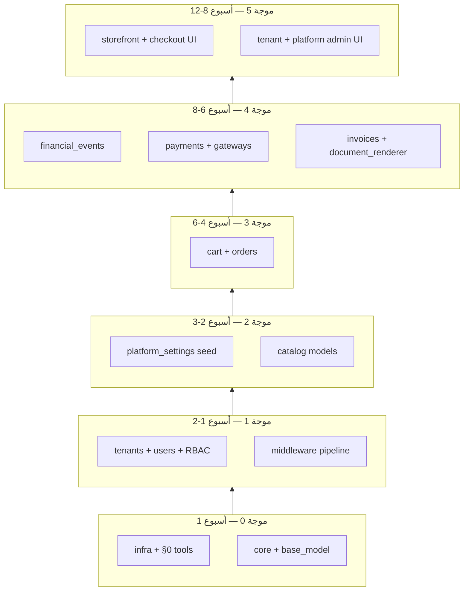
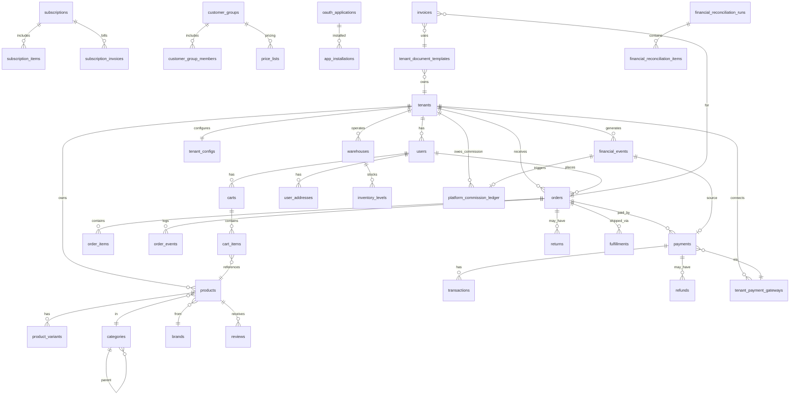
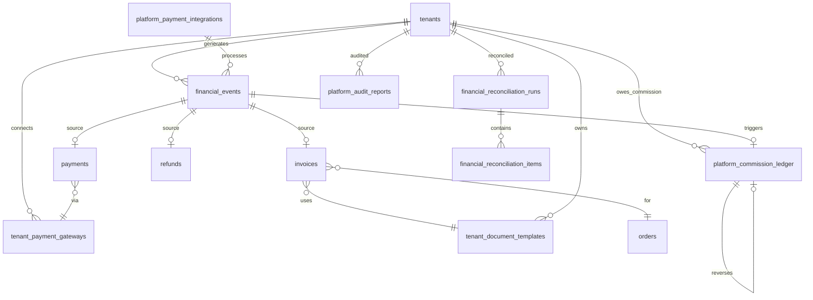
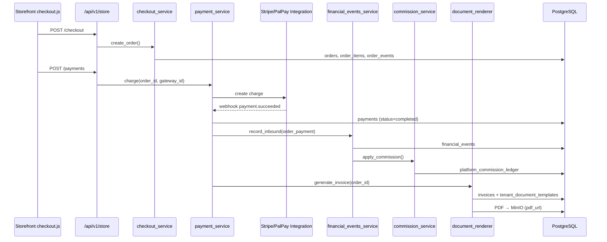

---
title: "Azadexa — خطة المشروع الشاملة"
subtitle: "منصة التجارة الإلكترونية SaaS متعدد المستأجرين (محرك Orion داخلي)"
version: "1.10"
date: "2026-06-26"
language: "ar"
status: "قيد التنفيذ — موجة 7 (#60–61) ✅ | التالي: #62 PayPal/BNPL (§0.15)"
document_type: "project-plan-report"
source: "Project Plan.txt"
platform_name: "Azadexa"
platform_owner: "Ahmad Ghannam"
sections: 33
phases: 28
duration_weeks_mvp: 26
duration_weeks_mvp_range: "24-28"
duration_weeks_full: 68
database_tables: 144
database_tables_mvp: 64
database_tables_v2: 80
implementation_wave: 7
implementation_wave_status: "موجة 7 — i18n + feature flags ✅ | التالي: #62 بوابات إضافية"
implementation_updated: "2026-06-27"
implementation_ci: "GitHub Actions — lint, pytest+Postgres, cov≥85%, manifest, pip-audit"
---

# 🚀 Azadexa — منصة التجارة الإلكترونية SaaS متعدد المستأجرين
## الخطة التفصيلية الشاملة — من الصفر إلى الإطلاق

> **العلامة التجارية:** Azadexa | **المحرك الداخلي:** Orion (كود فقط — لا يظهر للمستخدم النهائي)

---

**الإصدار:** 1.10 | **التاريخ:** 27 يونيو 2026 | **اللغة:** العربية | **الحالة:** **قيد التنفيذ — موجة 7 (#60–61) ✅ | #62+ ⬜** (§0.15)

---

## 📑 فهرس المحتويات

0. **سياسة الهندسة + أولوية البناء + قرارات v1.9–v1.10 + متتبع التنفيذ (§0.15)**
1. نظرة عامة (+ 1.4 MVP، 1.5 Azadexa docs، 1.6–1.8 عمولة/بوابات/نماذج)
2. الرؤية والأهداف (+ 2.4 الجدول الزمني، **2.5 Release Train**)
3. الهيكل المعماري (+ 3.3 Multi-Tenant، 3.4–3.10 ربط النظام)
4. مخطط قاعدة البيانات (4.0–4.51 — 144 جدول؛ **64 MVP** + 80 v2)
5–18. المراحل 1–14 (أسبوع 1–36)
19. المرحلة 15: المرتجعات والمسودات (أسبوع 37–38)
20. المرحلة 16: B2B والجملة (أسبوع 39–41)
21. المرحلة 17: الاشتراكات والرقمي (أسبوع 42–44)
22. المرحلة 18: المخزون المتعدد وOMS (أسبوع 45–47)
23. المرحلة 19: الضرائب وBNPL (أسبوع 48–49)
24. المرحلة 20: BOPIS والحزم وMetafields (أسبوع 50–51)
25. المرحلة 21: الاستيراد والهجرة (أسبوع 52–53)
26. المرحلة 22: منصة التطبيقات (أسبوع 54–56)
27. المرحلة 23: القنوات والاحتيال (أسبوع 57–58)
28. المرحلة 24: الامتثال وSSO (أسبوع 59–60)
29. المرحلة 25: أتمتة سير العمل والبحث (أسبوع 61–62)
30. المرحلة 26: الشركاء والهدايا والدروبشيب (أسبوع 63–64)
31. المرحلة 27: رصيد المتجر والدردشة (أسبوع 65)
32. المرحلة 28: الإطلاق العالمي (أسبوع 66–68)
33. المرفقات

---

## 0. سياسة الهندسة البرمجية الصارمة (إلزامية)

> **هذه السياسة تسبق كل مرحلة وكل PR.** لا يُدمج كود يخالفها. الاستثناء يتطلب موافقة كتابية من Tech Lead مع تسجيل في `ADR/` (Architecture Decision Record).

### 0.1 المبدأ الأعلى: اقرأ قبل أن تكتب

| القاعدة | التفاصيل |
|---------|----------|
| **لا تخمين** | قبل أي تعديل: اقرأ الملف المستهدف + المستدعِي + المستدعى + الاختبارات + migration المرتبطة |
| **لا تكديس** | لا تُضاف ميزة ولا abstraction ولا ملف دون حاجة مثبتة في الخطة أو ticket |
| **لا نسخ لصق أعمى** | ممنوع لصق كتل من AI أو Stack Overflow دون فهم وتوافق مع أنماط المشروع |
| **نطاق PR واحد** | PR = هدف واحد واضح (bug / feature / refactor) — لا «تنظيفات» عشوائية مع ميزة |
| **تتبع الخطة** | كل جدول/خدمة/route يجب أن يطابق §3–§4 — لا ارتجال في الهيكل |
| **موجة البناء** | تحقق من §0.12 — لا تبنِ ملفاً من موجة أعلى قبل إكمال الموجة الحالية |

**قبل فتح PR — قائمة تحقق المطور:**

```
[ ] قرأت الملفات المتأثرة كاملة (وليس grep فقط)
[ ] فهمت تدفق البيانات: Frontend → API → Service → Model → DB
[ ] لا تكرار لمنطق موجود (بحثت عن دالة/خدمة مشابهة)
[ ] الملف ضمن حدود الحجم (§0.3)
[ ] ترتيب البناء صحيح — موجة §0.12 (لا قفز)
[ ] الاختبارات تغطي السلوك الجديد أو المُصلَح
[ ] لا secrets ولا بيانات حساسة في الكود أو الـ logs
```

---

### 0.2 التنسيق وطول الأسطر (Consistency per File)

| البيئة | طول السطر | الأداة | ملاحظة |
|--------|-----------|--------|--------|
| **Python** | **88** حرفاً | `black` | معيار المشروع — لا استثناء |
| **HTML/Jinja2** | **100** حرفاً | `djlint` | نفس الحد داخل الملف الواحد |
| **CSS/JS** | **100** حرفاً | Prettier أو `.editorconfig` | |
| **SQL (migrations)** | **100** حرفاً | يدوي + مراجعة | أسماء صريحة، لا اختصارات غامضة |
| **Markdown/docs** | **120** حرفاً | soft wrap | |

**قواعد إلزامية:**
- **نفس الملف = نفس القاعدة** — ممنوع خلط 88 و 120 في ملف Python واحد
- **`.editorconfig`** في جذر المشروع — يُلتزم به في كل IDE
- **`pre-commit`** يشغّل: `black`, `flake8`, `isort`, `djlint` — **فشل = لا commit**
- **ترتيب imports:** `isort` — stdlib → third-party → local
- **Type hints** إلزامية على كل دالة public في Services و API handlers

```ini
# .editorconfig (جذر المشروع)
root = true
[*]
charset = utf-8
end_of_line = lf
insert_final_newline = true
trim_trailing_whitespace = true

[*.py]
indent_style = space
indent_size = 4
max_line_length = 88

[*.{html,jinja2,j2}]
indent_size = 2
max_line_length = 100

[*.{js,css}]
indent_size = 2
max_line_length = 100
```

---

### 0.3 حدود حجم الملفات (File Size Limits)

> الملف الطويل = صعب المراجعة + عرضة للأخطاء + يشجع التكرار.

| النوع | حد أقصى (سطر) | عند التجاوز |
|-------|---------------|-------------|
| `*_service.py` | **400** | تقسيم إلى services فرعية أو modules |
| `05-API/v1/*.py` (blueprint) | **300** | فصل handlers إلى `schemas.py` + `handlers/` |
| `03-MODELS/**/*.py` | **250** | mixins منفصلة؛ علاقات في `relationships.py` |
| `07-ADMIN/templates/*.html` | **350** | partials في `components/` |
| `06-STOREFRONT/**/*.html` | **350** | components |
| `*.js` (frontend) | **300** | modules منفصلة |
| `migrations/versions/*.py` | **200** | migration متعددة المراحل |
| **أي ملف** | **500** | **ممنوع تجاوزه** إلا باستثناء موثّق في ADR |

**CI:** سكربت `scripts/check_file_length.py` يفشل البناء إن تجاوز أي ملف الحد (قابل للتعديل per-path في `pyproject.toml`).

---

### 0.4 منع التكرار (DRY) والتكديس (No Over-Engineering)

#### DRY — ممنوع تكرار المنطق

| ممنوع | البديل الصحيح |
|-------|---------------|
| نفس استعلام SQL في 3 routes | دالة في Service واحدة |
| نسخ validation في API و Service | `schemas.py` (Marshmallow/Pydantic) مرة واحدة |
| تكرار حساب العمولة | `commission_service.apply()` فقط |
| قوالب HTML متشابهة 80% | Jinja2 `` أو macro |
| ثلاث دوال `get_tenant_*` متشابهة | دالة عامة + parameters |

**قاعدة Rule of Three:** لا تُنشأ abstraction إلا عند التكرار **الثالث** — قبلها: تكرار صريح أوضح من abstraction خاطئ.

#### No Stacking — ممنوع التكديس

| ممنوع | السبب |
|-------|-------|
| Factory داخل Factory | يصعب التتبع |
| Wrapper بلا قيمة | طبقة زائدة |
| Generic `BaseXService` لكل شيء | يخفي المنطق |
| Event لكل سطر كود | فقط عند حدود واضحة (§3.8) |
| Microservice مبكر | monolith modular حتى 10K tenant |
| Feature flag لكل سطر | flags للميزات الكبيرة فقط |

**طبقات ثابتة (لا إضافة طبقة سادسة):**

```
Route → Schema (validate) → Service → Model/Repository → DB
```

- **Route:** HTTP فقط — لا `db.session`، لا business logic
- **Service:** منطق الأعمال — orchestration
- **Model:** تعريف الجدول + علاقات بسيطة — لا استعلامات معقدة
- **استعلام معقد:** `repositories/` أو method مسمى في service

---

### 0.5 الأمان (Security — Non-Negotiable)

| المجال | القاعدة |
|--------|---------|
| **Secrets** | `.env` فقط — ممنوع في git؛ `credentials_encrypted` في DB للبوابات |
| **PCI** | لا تخزين CVV/PAN — tokenization عبر Stripe/PalPay |
| **SQL** | ORM/SQL parameterized فقط — **ممنوع** f-string في SQL |
| **XSS** | Jinja2 auto-escape؛ `|safe` يتطلب مراجعة أمنية |
| **CSRF** | Flask-WTF على كل form في Admin |
| **Auth** | JWT قصير العمر + refresh؛ revoke عند logout |
| **RBAC** | كل `/api/v1/tenant/*` يتحقق من `g.tenant_id`؛ platform منفصل |
| **RLS** | PostgreSQL RLS على كل جدول tenant-scoped (§4.0.6) |
| **Webhooks** | تحقق توقيع HMAC قبل أي معالجة (§3.10) |
| **Rate limit** | Flask-Limiter: login 5/min، API 100/min per tenant |
| **Headers** | CSP, HSTS, X-Frame-Options, X-Content-Type-Options |
| **Logs** | ممنوع تسجيل: passwords, tokens, PAN, `credentials_encrypted` |
| **Dependencies** | `pip-audit` + Dependabot أسبوعي |
| **Idempotency** | `Idempotency-Key` على checkout و payments |

**مراجعة أمنية إلزامية:** أي PR يلمس `payment`, `auth`, `webhooks`, `platform` → مراجعة ثانية من مطور آخر.

---

### 0.6 الأداء والسرعة (Performance)

| القاعدة | التطبيق |
|---------|---------|
| **N+1** | `joinedload`/`selectinload` — `pytest` يفشل عند N+1 في الاختبارات |
| **Pagination** | كل list API: `page`, `per_page` (max 100) — ممنوع `SELECT *` بدون حد |
| **Indexes** | كل فلتر في API له فهرس في §4.44 — لا استعلام جديد بدون `EXPLAIN` |
| **Cache** | Redis لـ: tenant_config, platform_settings, categories tree — TTL 5–60 دقيقة |
| **Cache invalidation** | عند `tenant.updated` / `platform_settings.updated` → `redis.publish('cache:invalidate', key)` أو حذف مباشر للمفتاح — لا انتظار TTL |
| **Celery** | PDF، email، reconciliation، reindex — **ليس** في request thread |
| **DB connections** | pool_size=10, max_overflow=20 — مراقبة في production |
| **Assets** | CSS/JS minified + CDN في production |
| **Cold start** | lazy import للـ AI modules فقط |

**أهداف SLA (MVP):**

| Endpoint | p95 |
|----------|-----|
| GET /api/v1/store/products | < 200ms |
| POST /api/v1/store/checkout | < 500ms |
| POST /api/v1/store/payments | < 2s (يشمل gateway) |
| Admin dashboards | < 1s |

---

### 0.7 جودة الكود والقراءة (Readability)

| القاعدة | التفاصيل |
|---------|----------|
| **تسمية** | `snake_case` Python/DB — `camelCase` JS — أسماء تعبّر عن الفعل/الكيان |
| **دوال** | ≤ 40 سطراً — إن زادت: تقسيم |
| **تعقيد** | cyclomatic complexity ≤ 10 (flake8 mccabe) |
| **تعليقات** | تشرح **لماذا** لا **ماذا** — الكود الواضح بلا تعليق |
| **Docstring** | على Services العامة فقط — Google style |
| **Magic numbers** | ثوابت في `core/constants.py` |
| **Dead code** | ممنوع — احذف لا تعلّق |
| **TODO** | `TODO(AZ-123): وصف` مع رقم ticket — لا TODO بلا تاريخ/مالك |

**ممنوع:**
- متغيرات بأسماء `data`, `temp`, `x`, `obj`
- `except: pass` أو `except Exception: pass`
- `print()` في production — `structlog` فقط
- تعديل 15 ملفاً لإصلاح bug في سطر واحد (ابحث عن السبب الجذري)

---

### 0.8 الاختبارات والمراجعة (Quality Gate)

| النوع | الحد الأدنى | الأداة |
|-------|-------------|--------|
| Unit (Services) | 80% coverage على `04-SERVICES/` | pytest + coverage |
| Integration (API) | كل endpoint MVP له test | pytest-flask |
| Tenant isolation | test: tenant A لا يرى B | `tests/security/` |
| Migration | up + down بدون خطأ | alembic |
| Lint | صفر warnings | flake8, black, isort |

**PR لا يُدمج إلا إذا:**
1. CI أخضر (lint + test + coverage manifest + file-length + pip-audit)
2. مراجعة واحدة على الأقل (اثنتان للأمان/مدفوعات)
3. وصف PR يذكر: الجداول، الـ routes، الشاشات المتأثرة
4. migration مرفقة إن تغيّر schema

---

### 0.9 Git وإدارة التغيير

| القاعدة | التفاصيل |
|---------|----------|
| **Branches** | `feature/AZ-123-short-desc` — `fix/`, `hotfix/` |
| **Commits** | Conventional: `feat(payments): add financial_events on capture` |
| **حجم PR** | ≤ 400 سطر diff (ideal ≤ 200) — PR كبير = تقسيم |
| **Rebase** | على `main` قبل merge — لا merge commits فوضوية |
| **ADR** | قرار معماري مهم → `01-FOUNDATION/docs/adr/NNNN-title.md` |

---

### 0.10 أدوات الإنforcement (تُفعَّل في المرحلة 1)

| الأداة | الوظيفة | الملف |
|--------|---------|-------|
| `black` | تنسيق Python 88 | `pyproject.toml` |
| `isort` | ترتيب imports | `pyproject.toml` |
| `flake8` + mccabe | lint + complexity | `.flake8` |
| `djlint` | HTML/Jinja | `.djlintrc` |
| `pre-commit` | قبل كل commit | `.pre-commit-config.yaml` |
| `pytest` + coverage | اختبارات + تقرير JSON | `pyproject.toml` |
| `check_coverage.py` | بوابة تغطية ملف-بملف (§0.8) | `scripts/` + `coverage_manifest.yaml` |
| `pip-audit` | ثغرات dependencies | CI job `security` |
| `check_file_length.py` | حدود §0.3 | `scripts/` |
| GitHub Actions | CI: lint → test → coverage-gate + security | `.github/workflows/ci.yml` |

```yaml
# .pre-commit-config.yaml (مختصر)
repos:
  - repo: https://github.com/psf/black
    rev: 24.1.0
    hooks: [{id: black}]
  - repo: https://github.com/pycqa/isort
    rev: 5.13.2
    hooks: [{id: isort}]
  - repo: https://github.com/pycqa/flake8
    rev: 7.0.0
    hooks: [{id: flake8}]
  - repo: local
    hooks:
      - id: file-length
        name: check file length
        entry: python scripts/check_file_length.py
        language: system
        types: [python, javascript, html]
```

---

### 0.11 مخالفات السياسة

| الدرجة | الإجراء |
|--------|---------|
| **تحذير** | تجاوز طول سطر، TODO بلا ticket |
| **رفض PR** | تجاوز حجم ملف، Route فيه business logic، secrets |
| **تصعيد** | ثغرة أمنية، تخطي RLS، دفع بلا financial_event |

> **الالتزام بهذه السياسة شرط قبول أي مطور في فريق Azadexa/Orion.**

---

### 0.12 أولوية البناء والترتيب الإلزامي (Build Order)

> **الهدف:** بناء الطبقات السفلية أولاً حتى لا نُعيد كتابة Services/Routes/Frontend لاحقاً. **ممنوع** القفز لموجة أعلى قبل إكمال موجة أدنى.

#### 0.12.1 المبدأ: من القاعدة إلى الواجهة — وليس العكس

```
الأساس (infra + core)
    ↓
الهوية (tenant + auth + RBAC)
    ↓
المنصة (platform_settings + middleware)
    ↓
الكتالوج (products — بدون واجهة متجر بعد)
    ↓
الطلبات (cart → order — بدون دفع بعد)
    ↓
المالية (financial_events قبل أي gateway)
    ↓
البوابات + الدفع + العمولة + المستندات
    ↓
الواجهات (storefront checkout ← آخر طبقة تعتمد على كل ما سبق)
    ↓
الميزات الثانوية (AI، تسويق، B2B…)
```

**قاعدة ذهبية:** إن احتجت تعديل migration سابقة لدعم ميزة لاحقة = **خطأ في الترتيب** — راجع §0.12.

---

#### 0.12.2 هرم الاعتماديات (لا تُكسر الترتيب)



---

#### 0.12.3 ترتيب الملفات والوظائف — تفصيلي (MVP)

##### موجة 0 — البنية التحتية (قبل أي Model) — ✅ مكتملة 2026-06-26

| # | الملف / الوظيفة | لماذا أولاً | الحالة |
|---|-----------------|-------------|--------|
| 1 | `.editorconfig`, `pyproject.toml`, `.flake8`, `.pre-commit-config.yaml` | §0 — كل كود لاحق يمر عبرها | ✅ |
| 2 | `scripts/check_file_length.py` | منع ملفات عملاقة من البداية | ✅ 🔒§0 |
| 3 | `docker-compose.dev.yml` (PostgreSQL + Redis) | كل شيء يعتمد على DB | 🟡 ملف جاهز — تشغيل يدوي |
| 4 | `02-CORE/orion/app.py`, `config.py`, `extensions.py`, `wsgi.py` | نقطة الدخول | ✅ |
| 5 | `02-CORE/core/exceptions.py`, `constants.py`, `crypto.py`, `utils.py` | Fernet + ثوابت v1.10 | ✅ |
| 6 | `03-MODELS/base/base_model.py`, `mixins.py` | كل Model يرثها | ✅ shell |
| 7 | `02-CORE/core/events.py` (واجهة publish/subscribe) | payment/order لاحقاً | ✅ |
| 8 | `05-API/v1/routes.py` (تسجيل blueprints) | هيكل URL ثابت | ✅ |

##### موجة 1 — المستأجر والمصادقة — ✅ 2026-06-27

| # | الملف / الوظيفة | يعتمد على | migration | الحالة |
|---|-----------------|-----------|-----------|--------|
| 9 | `03-MODELS/tenant/tenant.py`, `tenant_config.py` | base_model | `tenants`, `tenant_configs` | ✅ |
| 10 | `03-MODELS/user/user.py`, `role.py`, `permission.py` | tenant | `users`, `roles`, `permissions` | ✅ |
| 11 | migration: RLS policies template | tenants | `db/rls.sql` | ✅ 📋 |
| 12 | `02-CORE/core/middleware.py` | tenant — `joinedload(Tenant.config)` | — | ✅ |
| 13 | `02-CORE/core/permissions.py` | roles | — | ✅ shell |
| 14 | `04-SERVICES/auth/auth_service.py` | users | — | ✅ |
| 15 | `04-SERVICES/tenant_svc/tenant_service.py` | tenants | — | ✅ |
| 16 | `05-API/v1/auth.py` | auth_service | — | ✅ |
| 17 | `05-API/v1/tenants.py` | tenant_service | — | ✅ |
| 18 | **اختبارات عزل tenant** | `tests/security/test_tenant_isolation.py` | — | ✅ |

> **لا تبنِ** `product_service` أو `checkout` قبل إكمال #9–18.

##### موجة 2 — إعدادات المنصة والكتالوج (قبل السلة)

| # | الملف / الوظيفة | يعتمد على |
|---|-----------------|-----------|
| 19 | `03-MODELS/platform/platform_settings.py` | base_model |
| 20 | `scripts/seed_platform.py` (Azadexa, 1%, Ahmad Ghannam) | platform_settings |
| 21 | migration: `locales`, `categories`, `brands`, `products` | tenants |
| 22 | `03-MODELS/catalog/*` | tenant_id FK |
| 23 | `04-SERVICES/catalog/product_service.py`, `category_service.py` | models |
| 24 | `05-API/v1/products.py` → لاحقاً يُدمج في `storefront.py` | services |
| 25 | migration: جداول i18n (§4.15) — **هيكل فقط** | المرحلة 1 |

> **لا تبنِ** `06-STOREFRONT` themes قبل #22–24 (واجهة بدون API = إعادة عمل).

##### موجة 3 — السلة والطلبات (قبل المدفوعات)

| # | الملف / الوظيفة | يعتمد على |
|---|-----------------|-----------|
| 26 | migration: `carts`, `cart_items`, `orders`, `order_items`, `order_events` | products |
| 27 | `03-MODELS/order/cart.py`, `order.py` | catalog |
| 28 | `04-SERVICES/order/cart_service.py` | cart model |
| 29 | `04-SERVICES/order/checkout_service.py` | cart + order + inventory hooks |
| 30 | `04-SERVICES/order/order_service.py` | order model |
| 31 | `05-API/v1/storefront.py` (cart + checkout فقط — **بدون pay**) | services |
| 32 | triggers: `trg_inventory_reserve` (§4.45) | orders |

> **لا تبنِ** `payment_service` قبل `checkout_service` — ترتيب الأحداث يُحدد مرة واحدة.

##### موجة 4 — المالية والبوابات (الترتيب الحرج — أكثر ما يُعاد بناؤه إن أُهمل)

| # | الملف / الوظيفة | يعتمد على | ملاحظة حرجة |
|---|-----------------|-----------|-------------|
| 33 | migration: `financial_events` | tenants | **قبل** payments table |
| 34 | `03-MODELS/platform/financial_event.py` | — | جدول مركزي §4.49 |
| 35 | `04-SERVICES/platform/financial_events_service.py` | financial_event | كل مبلغ يمر هنا |
| 36 | migration: `payments`, `transactions`, `refunds` + FK `financial_event_id` | financial_events | |
| 37 | `03-MODELS/payment/payment.py`, `refund.py` | financial_events | |
| 38 | migration: `platform_commission_ledger`, `platform_payment_integrations` | financial_events | |
| 39 | `04-SERVICES/platform/commission_service.py` | ledger + events | بعد #35 |
| 40 | migration: `tenant_payment_gateways`, `tenant_gateway_webhooks` | tenants | |
| 41 | `04-SERVICES/tenant_gateways/gateway_service.py` | gateways model | |
| 42 | `09-INTEGRATIONS/payments/stripe_connect.py` | gateway_service | integration فقط |
| 43 | `04-SERVICES/payment/payment_service.py` | checkout + financial_events + gateway | orchestrator |
| 44 | `05-API/v1/webhooks.py` | payment_service | قبل اختبار دفع حقيقي |
| 45 | migration: `tenant_document_templates`, `invoices` | orders, payments | |
| 46 | `04-SERVICES/platform/document_renderer.py` | templates + platform_settings | تذييل Azadexa |
| 47 | `05-API/v1/payments.py` + ربط storefront checkout | payment_service | |
| 48 | `04-SERVICES/platform/reconciliation_service.py` | financial_events | Celery ليلي |
| 49 | event handlers: `order.paid` → financial → commission → invoice | §3.8 | في `core/events.py` |

**ترتيب الدوال داخل `payment_service.py` (يُكتب بهذا الترتيب):**

```
1. validate_payment_request()
2. resolve_gateway(tenant_gateway_id)
3. create_payment_record()          # payments row pending
4. charge_external_gateway()        # Stripe/PalPay API
5. on_payment_success():
   a. financial_events_service.record_inbound()   # أولاً
   b. commission_service.apply()                  # ثانياً
   c. order_service.mark_paid()                   # ثالثاً
   d. document_renderer.generate_invoice()        # رابعاً
   e. events.publish('order.paid')               # أخيراً
6. refund() → mirror with outbound + reversal
```

> **ممنوع** بناء `checkout.html` زر الدفع قبل #43–47.

##### موجة 5 — الواجهات (بعد API مستقر)

| # | الملف / الوظيفة | يعتمد على |
|---|-----------------|-----------|
| 50 | `07-ADMIN/static/js/api_client.js` | auth |
| 51 | `07-ADMIN/templates/admin_base.html`, sidebar | api_client |
| 52 | `07-ADMIN/tenant_admin/routes.py` + `tenant_dashboard.html` | tenant APIs |
| 53 | `07-ADMIN/tenant_admin` → `tenant_gateways.html`, `document_templates.html` | wave 4 APIs |
| 54 | `07-ADMIN/platform_admin` → `store_financial_report.html` | platform APIs |
| 55 | `06-STOREFRONT/.../store_api.js` | storefront API |
| 56 | `cart.js` → `checkout.js` (pay يستدعي `/api/v1/store/payments`) | wave 4 |
| 57 | `06-STOREFRONT/themes/default/templates/*` | store_api |

##### موجة 6+ — ميزات لاحقة (بعد MVP أسبوع 24–28)

| الترتيب | المجال | المرحلة | شرط البدء |
|---------|--------|---------|-----------|
| 58 | Shipping كامل | 7 | orders موجود |
| 59 | Discounts/vouchers | 8 | checkout موجود |
| 60 | i18n محتوى | 10 | products + locales |
| 61 | Feature flags UI | 12 | tenant admin |
| 62 | PayPal, BNPL | 8–19 | payment_service مستقر |
| 63 | RMA, B2B, OMS… | 15–28 | MVP live |

---

#### 0.12.4 ممنوعات البناء المبكر (تسبب إعادة عمل)

| ممنوع بناؤه مبكراً | السبب | ابنِه بعد |
|-------------------|-------|---------|
| `checkout.html` + زر دفع | لا payment_service | موجة 5 (#47) |
| Stripe integration | لا financial_events | #33–35 |
| `document_renderer` | لا invoices table + platform_settings | #19–20, #45 |
| Storefront themes كاملة | لا product API | #23–24 |
| `platform_audit_reports` UI | لا reconciliation_service | #48 |
| AI chatbot widget | لا products/orders | أسبوع 11+ |
| GraphQL | REST غير مكتمل | v2.0 |
| Microservices | monolith غير مكتمل | لا يُفكّر قبل 10K tenant |
| جداول المراحل 15–28 | MVP غير مكتمل | أسبوع 37+ |
| تخصيص commission في UI | لا commission_service | #39 |

---

#### 0.12.5 قرارات تُثبَّت مبكراً (تغييرها لاحقاً = migrations مؤلمة)

| القرار | متى يُقفل | المرجع | الحالة |
|--------|-----------|--------|--------|
| `tenant_id` على كل جدول | موجة 1 | §3.3 | ✅ models |
| `financial_events` كجدول مركزي للمال | موجة 4 #33 | §4.49 | ✅ |
| Route → Service → Model | موجة 0 | §0.4 | ✅ |
| Blueprint prefixes (`/store`, `/tenant`, `/platform`) | موجة 0 #8 | §3.9 | ✅ |
| `public_id` UUID على orders/products | موجة 3 | §4.1 | ✅ |
| Azadexa footer immutable | موجة 4 #46 | §1.5 | ✅ |
| عمولة 1% على كل event_type | موجة 4 #39 | §1.6 | ✅ |

---

#### 0.12.6 تعريف «جاهز للموجة التالية»

| الانتقال | معيار الجاهزية | الحالة |
|----------|----------------|--------|
| 0 → 1 | CI أخضر؛ `alembic upgrade head`؛ login يعمل | ✅ |
| 1 → 2 | tenant A لا يرى B؛ `g.tenant_id`؛ CI per-file coverage | ✅ |
| 2 → 3 | CRUD منتج عبر API؛ seed platform_settings | ✅ |
| 3 → 4 | checkout ينشئ order `pending` بدون دفع | ✅ |
| 4 → 5 | دفع تجريبي COD/Stripe → financial_event + ledger + invoice PDF | ✅ |
| 5 → MVP | storefront E2E: تصفح → سلة → دفع → إيصال + refund | ✅ |

---

#### 0.12.7 ربط الموجات بمراحل الخطة

| الموجة | أسابيع | مراحل الخطة | الحالة |
|--------|--------|-------------|--------|
| **0** | 1 | المرحلة 1 (بداية) | ✅ |
| **0–1** | 1–2 | المرحلة 1 (جزء) + المرحلة 2 (بداية) | ✅ |
| 2 | 2–3 | المرحلة 2–3 | ✅ |
| 3 | 4–5 | المرحلة 4–5 | ✅ |
| 4 | 6–8 | المرحلة 6 | ✅ |
| 5 | 9–14 | المراحل 7–12 (واجهات تدريجياً) | ✅ |
| MVP | 20 | المرحلة 14 | ⬜ |

> كل مهمة في §5–§18 يجب أن تُوسم بموجة §0.12 في وصف PR: `feat(wave-4): financial_events migration`.

---

### 0.13 قرارات المراجعة المعمارية (v1.9 — مُعتمدة)

> ملخص مراجعة تقنية عميقة — التناقضات المُصلحة والتوصيات المُدمجة في هذا الإصدار.

#### 0.13.1 تقسيم المخطط: MVP مقابل v2 (يمنع over-engineering)

| الطبقة | العدد | الموقع | متى يُنفَّذ |
|--------|-------|--------|-------------|
| **MVP v1** | **64 جدول** | `migrations/versions/` (Alembic) | حتى الإطلاق التجاري |
| **v2+** | **80 جدول** | `01-FOUNDATION/docs/schema-v2.md` + `migrations/v2/` لاحقاً | Release Train (§2.5) |
| **إجمالي الخطة** | **144** | هذا المستند | مرجع كامل |

**تركيب الـ 64 جدول MVP:**
- **51** جدول تشغيلي (#1–40 + #44–54 — بدون booking #41–43)
- **6** جداول i18n هيكل (#55–60 — migration مرحلة 1؛ Service ترجمة مرحلة 4+10)
- **8** جداول مالية/Azadexa (#133–140، §4.49)

**نُقل إلى `schema-v2.md` فقط (لا migration MVP):** `booking_types`, `booking_slots`, `bookings` (#41–43)، `product_schema_markup` (#130)، `accessibility_audits` (#131).

> **ممنوع** إنشاء جداول #61–132 في migration MVP — تبقى في `schema-v2.md` حتى Release Train.

#### 0.13.2 مصدر العمولة — سلسلة أولوية موحّدة (لا تكرار)

**مصدر واحد للنسبة:** `tenants.platform_commission_percent` فقط — **حُذف** من `tenant_configs`.

```python
# core/constants.py — يُستهلك من commission_service.py
COMMISSION_FALLBACK_CHAIN = [
    "tenants.platform_commission_percent",       # 1. per-tenant (NULL → التالي)
    "platform_settings.default_commission_percent",  # 2. منصة
    Decimal("0.0100"),                            # 3. hardcoded 1%
]
```

> تجربة مجانية: `tenants.platform_commission_percent = 0.0000` — لا جدول منفصل. `commission_exceptions` (تواريخ انتهاء) = **v2 اختياري** في `schema-v2.md`.

#### 0.13.3 الجدول الزمني الواقعي (مُحدَّث)

| البند | الإصدار السابق | **v1.9 الواقعي** | السبب |
|-------|---------------|------------------|-------|
| MVP إطلاق تجاري | أسبوع 20 | **أسبوع 24–28** | 3–5 مطورين؛ مدفوعات أعقد |
| المرحلة 6 (مدفوعات) | 3 أسابيع | **6 أسابيع (16–22)** | Stripe + PalPay + VP + financial_events + commission + invoices + webhooks |
| No-Code Builder | 4 أسابيع | **8+ أسابيع** | v1.2+ فقط |
| المراحل 15–28 | خطة جامدة 68 أسبوع | **Release Train** كل 8 أسابيع (§2.5) | مرونة حسب الطلب |

#### 0.13.4 أمان — إغلاق الفجوات

| الفجوة | القرار v1.9 / v1.10 |
|--------|---------------------|
| `custom_header_js` / `custom_footer_js` | **حُذف من MVP** — `custom_css` فقط؛ JS مخصص = v1.2+ مع CSP `nonce` |
| `webhook_secret` في `tenant_configs` | **حُذف** — الأسرار في `tenant_payment_gateways.webhook_secret` فقط |
| `credentials_encrypted` | **Fernet** (MVP) عبر `core/crypto.py`؛ `ENCRYPTION_KEY` من .env/Vault — §4.49 |
| `is_superuser` | **CHECK:** `is_superuser=TRUE` ⟹ `tenant_id IS NULL`؛ middleware يرفض خلاف ذلك |
| `webhook_secret` في API GET | **ممنوع** — `GATEWAY_RESPONSE_DENYLIST` في §0.14 |

#### 0.13.5 أداء — تحسينات مُعتمدة

| الموضوع | القرار |
|---------|--------|
| `search_vector` GIN | **محفز** `trg_products_search_vector` — فوق `SEARCH_VECTOR_SYNC_LIMIT` (1000) → Celery |
| `events` / `order_events` | **B-tree** `(tenant_id, created_at DESC)` في MVP — لا BRIN |
| BRIN على `financial_events` | للأرشفة — يتطلب `autovacuum` مضبوط |
| Reconciliation ليلي | **Celery queue per-tenant** — §3.8 |
| Redis tenant_config | **invalidation فوري** عبر event — §0.6 |

#### 0.13.6 توثيق `document_renderer` — تحقق إلزامي

```python
def validate_template(html: str) -> None:
    if "azadexa-platform-footer" not in html:
        raise TemplateValidationError("Footer placeholder required")
    if 'data-immutable="true"' not in html:
        raise TemplateValidationError("Immutable footer marker required")
```

#### 0.13.7 ما لن يُبنى في الكود (تنظيف الهيكل)

| العنصر | القرار |
|--------|--------|
| GraphQL | **لا مجلد** في `05-API/` — مرجع فقط: `01-FOUNDATION/docs/roadmap/graphql.md` |
| Microservices | monolith modular حتى 10K tenant — لا هيكل مجلدات يوحي بفصل مبكر |

---

### 0.14 قرارات المراجعة التقنية v1.10 (مُعتمدة)

#### ما يُبقى حتماً (لا نقاش)

| المكون | السبب |
|--------|-------|
| `financial_events` + `platform_commission_ledger` | قلب النظام المالي |
| `tenant_payment_gateways` + `platform_payment_integrations` | Dual-layer |
| `document_renderer` + validation | هوية Azadexa |
| `RLS` + `TenantResolverMiddleware` | عزل المستأجرين |
| `idempotency_key` | موثوقية الدفع |
| `public_id` UUID | أمان API |

#### ما حُذف من MVP (v1.10)

| العنصر | السبب | البديل |
|--------|-------|--------|
| `commission_exceptions` | `tenants.platform_commission_percent = 0` يكفي | v2 اختياري في `schema-v2.md` |
| `custom_header_js` / `custom_footer_js` | CSP معقد في MVP | `custom_css` فقط |
| `booking_*` (3 جداول) | خارج MVP | `schema-v2.md` |
| `product_schema_markup` | SEO متقدم | v2 |
| `accessibility_audits` | WCAG لاحق | v2 |

#### ثوابت وأمان API

```python
# core/constants.py
SEARCH_VECTOR_SYNC_LIMIT = 1000  # فوقها: tasks.search.reindex_product_bulk
GATEWAY_RESPONSE_DENYLIST = ("webhook_secret", "credentials_encrypted")
```

- `webhook_secret`: **write-only** (PUT) — لا يُرجع في GET
- `credentials_encrypted`: **never** في JSON response

#### تعديلات migration v1.10 (§4.0.9)

| # | الجدول | التعديل |
|---|--------|---------|
| 1 | `platform_settings` | `singleton CHAR(1) CHECK (singleton='1')` |
| 2 | `users` | `CHECK (is_superuser=FALSE OR tenant_id IS NULL)` |
| 3 | `order_events` | append-only — لا `updated_at` |
| 4 | `tenant_configs` | بدون JS مخصص |
| 5 | `events`, `order_events` | B-tree `(tenant_id, created_at DESC)` |

---

### 0.15 متتبع التنفيذ والالتزام بسياسة §0

> **آخر تحديث:** 2026-06-27 | **الموجة الحالية:** 7 ✅ (#60–61) → **التالي:** #62 PayPal/BNPL  
> **قاعدة البيانات:** PostgreSQL فقط (dev / test / prod / CI)  
> **CI:** [Orion-Store Actions](https://github.com/AbuAzad2025/Orion-Store/actions) — لا حاجة لتشغيل pytest محليًا قبل الدمج

#### مفتاح العلامات

| العلامة | المعنى |
|---------|--------|
| ✅ | مُنفَّذ ومُختبَر (pytest أو تحقق يدوي) |
| 🟡 | مُنفَّذ جزئياً — shell / بدون تكامل كامل |
| 📋 | موثَّق فقط — لا migration ولا كود تشغيلي |
| ⬜ | لم يُنفَّذ بعد |
| 🔒§0 | أداة أو قاعدة §0 مفعّلة في المستودع (CI / pre-commit) |

#### ملخص الموجات (§0.12)

| الموجة | الحالة | التقدم | ملاحظة |
|--------|--------|--------|--------|
| **0** — البنية التحتية | ✅ | 8/8 | 2026-06-26 |
| **1** — Tenant + Auth | ✅ | 10/10 | 2026-06-27 — انظر §0.12.3 |
| **2** — كتالوج | ✅ | 7/7 | 2026-06-27 — platform_settings + products API |
| **3** — سلة وطلبات | ✅ | 7/7 | 2026-06-27 — cart + checkout بدون دفع |
| **4** — مالية وبوابات | ✅ | 17/17 | 2026-06-27 — COD/Stripe sandbox، عمولة 1%، فواتير Azadexa |
| **5** — واجهات | ✅ | 8/8 | 2026-06-27 — admin + storefront + checkout.js |
| **6** — شحن + خصومات | ✅ | 2/2 | 2026-06-27 — #58 shipping + #59 vouchers |
| **7** — i18n + flags | ✅ | 2/2 | 2026-06-27 — #60 محتوى + #61 feature flags UI |
| **6+** — ما بعد MVP | 🟡 | 4/6 | #62–63 متبقية (Release Train) |

#### التوثيق والمخطط

| الملف | الحالة | ملاحظة |
|-------|--------|--------|
| `ORION-Project-Plan-Report.md` v1.10 | ✅ | مراجعة تقنية مدمجة |
| `01-FOUNDATION/docs/schema-v2.md` | 📋 | 80 جدول v2 — لا Alembic |
| `README.md` | ✅ | PostgreSQL + `docker-test-up` + CI |
| GitHub `AbuAzad2025/Orion-Store` | ✅ | push/PR → CI أخضر مطلوب |
| `.env.example` | ✅ | `DATABASE_URL` Postgres + `JWT_SECRET_KEY` |
| `docker-compose.test.yml` | ✅ | Postgres اختبار :5433 |
| `coverage_manifest.yaml` + `check_coverage.py` | ✅ 🔒§0 | تغطية ملف-بملف + ≥85% إجمالي |
| `tests/` (pytest + Postgres) | ✅ | ~110 اختبار؛ waves 0–7 + manifest |

#### معايير الانتقال (§0.12.6)

| الانتقال | الحالة | الفجوة المتبقية |
|----------|--------|----------------|
| **0 → 1** | ✅ | CI Postgres ✅؛ pytest+عزل ✅؛ JWT ✅؛ Alembic `wave1_001`+`wave1_002` ✅ |
| **1 → 2** | ✅ | عزل ✅؛ JWT ✅؛ `platform_settings` seed ✅؛ product CRUD API ✅ |
| **2 → 3** | ✅ | carts/orders migration ✅؛ checkout API ✅ (بدون pay) |
| **3 → 4** | ✅ | checkout ✅؛ `financial_events` + payments + commission + invoices ✅ |
| **4 → 5** | ✅ | admin HTML + storefront + checkout.js pay ✅ |
| **5 → MVP** | ✅ | E2E + pagination + refund + admin auth + reconciliation UI |
| **6 → 6+** | ✅ | shipping methods/zones + vouchers + checkout totals + APIs + UI |
| **7 → 7+** | ✅ | i18n translations + locale middleware + feature flags + admin UI |

#### موجة 7 — i18n وFeature Flags (#60–61)

| البند | السياسة | الحل | الحالة |
|--------|---------|------|--------|
| نماذج locales + ترجمات منتج/فئة | §4.15 | `03-MODELS/i18n/*` | ✅ |
| RLS على جداول الترجمة | §3.3 | migration `wave7_001` | ✅ |
| `g.locale` + سلسلة fallback | §3.5 | `i18n_service` + middleware | ✅ |
| دمج ترجمات في storefront | #60 | `translation_service` + `?locale=` | ✅ |
| APIs ترجمة tenant + `/api/v1/i18n/languages` | §14 | `tenant_portal` + `i18n.py` | ✅ |
| `multi_language` يتحكم باللغات | #61 | `feature_flag_evaluator` | ✅ |
| جداول feature_flags + overrides | §4.13 | migration `wave7_002` | ✅ |
| 3 flags MVP + tenant overrides | §16.4 | `ai_enabled`, `booking_enabled`, `multi_language` | ✅ |
| لوحة admin ميزات المتجر | #61 | `feature_flags_management.html` | ✅ |
| اختبارات + manifest wave 7 | §0.8 | 110 pytest، cov ~90% | ✅ |

**مؤجَّل (#62+):** PayPal/BNPL، page_translations (يحتاج `pages`)، glossary، currency_rates، rollout %، Redis/Celery.

#### موجة 6 — شحن وخصومات (#58–59)

| البند | السياسة | الحل | الحالة |
|--------|---------|------|--------|
| جداول shipping_methods/zones/rates | §4.7 | migration `wave6_001` + RLS | ✅ |
| جدول vouchers | §4.8 | migration `wave6_001` | ✅ |
| حساب الشحن flat-rate + عتبة مجاني | §10.5 | `shipping_svc/shipping_service.py` | ✅ |
| محرك خصومات (نسبة/ثابت + شحن مجاني) | §11.3 | `discount_svc/voucher_service.py` | ✅ |
| checkout: subtotal − خصم + شحن + ضريبة | §0.4 | `checkout_service.py` | ✅ |
| APIs `/api/v1/shipping/*` + `/api/v1/vouchers/*` | §3.9 | `shipping.py`, `vouchers.py` | ✅ |
| Storefront: اختيار شحن + كوبون | موجة 5–6 | `checkout.html`, `checkout.js` | ✅ |
| اختبارات + manifest wave 6 | §0.8 | 101 pytest، cov ~90.5% | ✅ |

**مؤجَّل (#60+):** Redis cache، Celery، Rate limiting، PalPay/BNPL، ثيمات إضافية، JWT account كامل، deliveries/تتبع، sales/promotions.

#### إغلاق فجوات موجات 0–5 (2026-06-27)

| الفجوة | السياسة | الحل | الحالة |
|--------|---------|------|--------|
| Pagination على list APIs | §0.6 | `core/pagination.py` — tenants, products, categories, storefront, tenant portal | ✅ |
| Headers أمنية (CSP, X-Frame…) | §0.5 | `core/security_headers.py` | ✅ |
| Event handlers (`order.paid`, `payment.refunded`) | §3.8 | `core/event_handlers.py` + تسجيل في `app.py` و `conftest` | ✅ |
| Refund + outbound financial events | §4.49 | `payment_service.refund()` + APIs | ✅ |
| `document_renderer` + PDF فواتير | §0.13.6 | `validate_template` + `pdf_service.py` (fpdf2) + migration `gap5_001` | ✅ |
| Reconciliation API + لوحة admin | §3.8 | `platform_reconciliation.py` + `reconciliation_dashboard.html` | ✅ |
| Admin login + حماية HTML | §0.5 | `admin_auth.py` + `guard_admin_html` | ✅ |
| Storefront: category, account, RTL, theme.json | موجة 5 | routes + templates + `rtl.css` | ✅ |
| Auth login بـ tenant slug | موجة 1 | `_resolve_tenant_id()` في `auth.py` | ✅ |
| E2E gap closure | §0.12.6 | `tests/integration/test_gap_closure_e2e.py` — 90 اختبار، cov ~91% | ✅ |

**مؤجَّل لموجة 6+ (خارج نطاق الإغلاق):** Redis cache، Celery ليلي، Rate limiting، PalPay/BNPL، ثيمات `modern`/`luxury`، JWT كامل في storefront account، جداول `financial_reconciliation_runs` v2.

#### الالتزام بسياسة §0 (ملخص)

| السياسة | الحالة | الدليل |
|---------|--------|--------|
| §0.2 تنسيق (black 88, editorconfig) | 🔒§0 | `.editorconfig`, `.pre-commit-config.yaml`, CI |
| §0.3 حدود حجم الملف | 🔒§0 | `scripts/check_file_length.py` + CI |
| §0.4 Route → Service (لا ORM في routes) | ✅ | `routes.py` — status فقط، لا `db.session` |
| §0.5 secrets في `.env` | ✅ | `.env.example`؛ `.gitignore` |
| §0.12 لا قفز موجات | ✅ | موجات 0–6 ✅؛ #60+ التالي |
| §0.13.2 `COMMISSION_FALLBACK_CHAIN` | ✅ | `constants.py` + `financial_events_service` |
| §0.14 `GATEWAY_RESPONSE_DENYLIST` | ✅ | `constants.py` + `strip_gateway_secrets` + tests |
| §0.14 Fernet `crypto.py` | ✅ | `core/crypto.py` + `test_crypto.py` |
| §0.8 coverage ملف-بملف + ≥85% | 🔒§0 | `coverage_manifest.yaml` + `--cov-fail-under=85` + CI |
| §0.6 Pagination على list APIs | ✅ | `core/pagination.py` + كل list endpoints |
| §0.5 Headers أمنية | ✅ | `core/security_headers.py` |
| §0.8 PostgreSQL في الاختبارات | 🔒§0 | `DATABASE_URL` + `docker-compose.test.yml` + CI service |

---

## 1. نظرة عامة

### 1.1 وصف المشروع

**Azadexa** هي منصة تجارة إلكترونية متعددة المستأجرين (Multi-Tenant SaaS) مبنية على Flask/Python (محرك داخلي: Orion). تتيح لأي تاجر إنشاء متجر احترافي خلال دقائق. تدعم أربع لغات (العربية، الإنجليزية، العبرية، الفرنسية) مع RTL كامل.

**مالك المنصة:** Ahmad Ghannam — `0562150193` | `+972562150193`

### 1.2 الميزات الرئيسية

- متعدد المستأجرين (Multi-Tenant SaaS)
- دعم 4 لغات مع RTL
- مدفوعات عالمية + محلية + BNPL (Tabby/Tamara/Klarna)
- مرتجعات واستبدال (RMA) وطلبات مسودة
- B2B جملة وعروض أسعار RFQ
- اشتراكات ومنتجات رقمية
- مخزون متعدد المستودعات وOMS
- BOPIS استلام من المتجر
- حزم منتجات وMetafields
- استيراد/هجرة من Shopify/WooCommerce/Salla/Zid
- منصة تطبيقات OAuth ومتجر تطبيقات
- مزامنة Amazon/eBay/Google/TikTok
- امتثال GDPR/CCPA وSSO مؤسسي
- أتمتة سير عمل وSearch Merchandising
- شركاء بعمولات وسجل هدايا ودروبشيب
- نظام حجز متقدم
- مساعد ذكي (Azadexa Assistant)
- فواتير وإيصالات ومدفوعات قابلة للتخصيص + تذييل Azadexa ثابت
- عمولة منصة 1% عبر ValuePayment (قابلة للتعديل لكل مستأجر)
- No-Code Theme Builder
- تخصيص حسب الصناعة
- نظام تحكم شامل (Feature Flags)
- تسويق وإعلانات متكامل

### 1.3 المستويات الإدارية

```
┌─────────────────────────────────────────────────────────────┐
│  🏛️ المستوى 1: مالك المنصة Azadexa (Ahmad Ghannam)          │
│      Super Admin — ValuePayment، تقارير مالية كل متجر، عمولة 1% │
│  🏢 المستوى 2: مدير المستأجر (Tenant Admin)                 │
│      ربط Stripe/PalPay حقيقي، قوالب مستندات، مدفوعات متجره فقط │
│  👤 المستوى 3: مستخدم النظام (End User / Customer)          │
└─────────────────────────────────────────────────────────────┘
```

### 1.4 نطاق MVP (تحسين)

| الفئة | الميزات | المراحل |
|-------|---------|---------|
| **Must (MVP)** | Multi-tenant، ValuePayment + عمولة 1%، فواتير/إيصالات بتذييل Azadexa، Auth/RBAC، كتالوج، سلة/طلبات، COD + Stripe، شحن محلي، عربي/إنجليزي + RTL | 1–7، 10 (جزئي)، 12 (جزئي)، 14 |
| **Should (v1.1)** | PayPal، كوبونات، Azadexa Assistant (OpenAI)، ثيمات متعددة، ترجمة تلقائية | 8، 9 (جزئي)، 11 |
| **Won't (v1.2+)** | No-Code Builder كامل، بحث بصري، ML محلي | 9، 12 (جزئي) |
| **World-class (v2.0)** | RMA، B2B، اشتراكات، OMS، BNPL، App Store، قنوات، امتثال، workflow | 15–28 (أسبوع 37–68) |

> **ملاحظة:** الإطلاق التجاري الأول (MVP) **أسبوع 24–28** (فريق 3–5). الإطلاق العالمي عبر **Release Train** (§2.5).

### 1.5 هوية المنصة Azadexa والمستندات المالية

#### قواعد العلامة التجارية (إلزامية — لا استثناء)

| العنصر | قابل للتخصيص من المستأجر | ثابت من المنصة |
|--------|--------------------------|----------------|
| **فاتورة (Invoice)** | الشعار، الألوان، الخط، رأس الصفحة، بيانات المتجر، الضريبة، الأعمدة | **تذييل Azadexa + شعار Azadexa** — دائماً |
| **إيصال (Receipt)** | نفس ما سبق | **تذييل Azadexa + شعار Azadexa** — دائماً |
| **إيصال دفع (Payment Receipt)** | نفس ما سبق | **تذييل Azadexa + شعار Azadexa** — دائماً |
| **بريد تأكيد الطلب** | محتوى المتجر، الشعار | سطر "Powered by Azadexa" + شعار صغير |

> **ممنوع:** إزالة أو إخفاء أو استبدال اسم **Azadexa** أو شعارها في التذييل. **Orion** لا يظهر في أي مستند موجه للعميل.

#### ما يخصصه المستأجر (Tenant Admin)

- قالب HTML/PDF: `invoice_template`, `receipt_template`, `payment_receipt_template`
- شعار المتجر، ألوان العلامة، خطوط، ترتيب الأعمدة
- نص رأس الصفحة، شروط الدفع، ملاحظات قانونية للمتجر
- عرض/إخفاء حقول اختيارية (SKU، باركود، خصم، ضريبة مفصلة)
- لغة المستند حسب `locale`

#### ما يحقنه النظام تلقائياً (غير قابل للحذف)

```html
<!-- platform_footer_block — injected server-side, not editable -->
<footer class="azadexa-platform-footer" data-immutable="true">
  
  <span>Powered by Azadexa</span>
  <span class="azadexa-commission-line">{commission_disclosure_if_applicable}</span>
</footer>
```

### 1.6 نموذج العمولة — 1% على كل حركة مالية (وارد + صادر)

| البند | التفاصيل |
|-------|----------|
| **نطاق العمولة** | **1%** على كل مبلغ يمر عبر المتجر — دفع، استرداد، تحويل، COD مؤكد، BNPL |
| **الاتجاه** | **وارد** (دفع عميل) + **صادر** (استرداد، payout، chargeback) |
| **بوابة المنصة** | ValuePayment — تحصيل عمولة Azadexa + تسوية للمالك |
| **بوابات المتجر** | Stripe Connect / PalPay / PayPal — **مفاتيح حقيقية per-tenant** |
| **المستفيد** | مالك Azadexa (Ahmad Ghannam) |
| **تخصيص per-tenant** | Super Admin يضبط `tenants.platform_commission_percent` (0.0000 = تجربة مجانية) |
| **سلسلة القراءة** | `COMMISSION_FALLBACK_CHAIN` — §0.13.2 |
| **الحساب** | `commission = ROUND(ABS(amount) × effective_percent, 2)` |
| **التسوية** | `financial_events` → `platform_commission_ledger`؛ عكس عند الاسترداد |
| **COD** | عمولة عند `cod_confirmed` فقط — لا عمولة على طلب ملغى |
| **الشفافية** | سطر العمولة في تقارير Super Admin فقط |

#### أنواع الأحداث المالية (event_type)

| الاتجاه | event_type | عمولة Azadexa | ملاحظة |
|---------|------------|---------------|--------|
| **وارد** | order_payment | +1% | دفع عميل → متجر |
| **وارد** | subscription_payment | +1% | اشتراك |
| **وارد** | invoice_payment | +1% | فاتورة B2B |
| **وارد** | cod_recorded | +1% | COD مؤكد في النظام |
| **وارد** | bnpl_capture | +1% | Tabby/Tamara |
| **صادر** | refund | +1% | استرداد للعميل |
| **صادر** | payout_to_merchant | +1% | تحويل للتاجر |
| **صادر** | chargeback | +1% | نزاع بنكي |
| **صادر** | store_credit_issue | +1% | إصدار رصيد متجر |
| **عكس** | commission_reversal | −عمولة أصلية | إلغاء كامل قبل التسوية |

**أمثلة:**

| المستأجر | النسبة | دفع 1,000 ILS | عمولة Azadexa |
|----------|--------|---------------|---------------|
| افتراضي | 1.00% | 1,000.00 | 10.00 |
| تاجر مميز | 0.50% | 1,000.00 | 5.00 |
| تجريبي | 0.00% | 1,000.00 | 0.00 |

### 1.7 البنية المزدوجة للمدفوعات والربط الحقيقي

```
┌──────────────────────────────────────────────────────────────────┐
│  لوحة Azadexa — Platform Super Admin (Ahmad Ghannam)              │
│  ├─ platform_payment_integrations (ValuePayment, Stripe Platform) │
│  ├─ platform_settings (عمولة 1%، شعار، تذييل)                     │
│  ├─ تقارير كل متجر + مطابقة مالية + كشف احتيال                   │
│  └─ تعديل platform_commission_percent لكل مستأجر                  │
└────────────────────────────┬─────────────────────────────────────┘
                             │ 1% على كل حركة مالية (وارد + صادر)
                             ▼
┌──────────────────────────────────────────────────────────────────┐
│  لوحة Tenant Admin — كل متجر                                      │
│  ├─ tenant_payment_gateways (Stripe Connect، PalPay، PayPal، …)   │
│  ├─ tenant_document_templates (فواتير/إيصالات قابلة للتخصيص)    │
│  ├─ tenant_financial_dashboard (مدفوعاته فقط)                    │
│  └─ ربط حقيقي: مفاتيح API، Webhooks، حساب Connect                 │
└────────────────────────────┬─────────────────────────────────────┘
                             │
                             ▼
                    financial_events (كل وارد/صادر)
                             │
              ┌──────────────┴──────────────┐
              ▼                             ▼
      payments / refunds            platform_commission_ledger
      invoices / payouts            (عمولة Azadexa + عكس عند الاسترداد)
```

### 1.8 لوحات الإدارة والنماذج (Forms ↔ Tables)

#### أ) لوحة Azadexa — Platform Super Admin

| الشاشة | النموذج / الإجراء | الجداول المرتبطة |
|--------|-------------------|------------------|
| إعدادات المنصة | `PlatformSettingsForm` | platform_settings |
| ربط ValuePayment | `PlatformGatewayConnectForm` | platform_payment_integrations |
| ربط Stripe للمنصة | `PlatformStripeForm` | platform_payment_integrations |
| عمولة المستأجرين | `TenantCommissionForm` | tenants |
| تقرير متجر مالي | `StoreFinancialReportView` | financial_events, platform_commission_ledger, orders, payments |
| مطابقة مالية | `ReconciliationDashboard` | financial_reconciliation_runs, financial_reconciliation_items |
| كشف احتيال | `FraudAuditView` | fraud_reviews, financial_events, platform_audit_reports |
| سجل عمولات المنصة | `CommissionLedgerTable` | platform_commission_ledger |
| سجل إجراءات المالك | `PlatformAdminAuditLog` | platform_admin_audit_log |

#### ب) لوحة Tenant Admin — كل متجر

| الشاشة | النموذج / الإجراء | الجداول المرتبطة |
|--------|-------------------|------------------|
| ربط Stripe | `TenantStripeConnectForm` | tenant_payment_gateways |
| ربط PalPay/PayPal/… | `TenantGatewayForm` | tenant_payment_gateways |
| Webhooks البوابة | `GatewayWebhookForm` | tenant_gateway_webhooks |
| قالب الفاتورة | `InvoiceTemplateForm` | tenant_document_templates |
| قالب الإيصال | `ReceiptTemplateForm` | tenant_document_templates |
| قالب إيصال الدفع | `PaymentReceiptTemplateForm` | tenant_document_templates |
| معاينة مستند | `DocumentPreview` (مع تذييل Azadexa) | tenant_document_templates, platform_settings |
| مدفوعات المتجر | `PaymentsListView` | payments, financial_events |
| تقارير مبيعات | `TenantSalesReport` | orders, invoices — **بدون** بيانات مستأجرين آخرين |

> **فصل صلاحيات:** Tenant Admin يرى `tenant_id` الخاص به فقط (RLS). Platform Admin يرى الكل عبر `platform_admin` role.

#### ج) ربط حقول القوالب بالجداول (Document Template ↔ DB)

| متغير القالب | مصدر البيانات | جدول / عمود |
|--------------|---------------|-------------|
| `{invoice_number}` | رقم الفاتورة | invoices.invoice_number |
| `{order_number}` | رقم الطلب | orders.order_number |
| `{customer_name}` | اسم العميل | orders.shipping_name أو users.full_name |
| `{customer_email}` | بريد العميل | orders.customer_email |
| `{line_items}` | عناصر الطلب | order_items + products + product_variants |
| `{subtotal}` | المجموع الفرعي | invoices.subtotal / orders.subtotal |
| `{tax_amount}` | الضريبة | invoices.tax_amount / orders.tax_amount |
| `{total_amount}` | الإجمالي | invoices.total_amount / orders.total |
| `{currency}` | العملة | orders.currency |
| `{payment_method}` | طريقة الدفع | payments.payment_method |
| `{payment_ref}` | مرجع الدفع | payments.gateway_transaction_id |
| `{store_name}` | اسم المتجر | tenants.name |
| `{store_logo}` | شعار المتجر | tenants.logo_url |
| `{store_address}` | عنوان المتجر | tenant_configs.business_address |
| `{issued_at}` | تاريخ الإصدار | invoices.issued_at |
| `{platform_logo}` | شعار Azadexa | platform_settings.platform_logo_url |
| `{platform_footer}` | تذييل ثابت | platform_settings.footer_html (**immutable**) |
| `{template_id}` | القالب المستخدم | tenant_document_templates.id |

---

## 2. الرؤية والأهداف

### 2.1 الرؤية

> "تمكين كل تاجر عبر **Azadexa** لبناء متجر إلكتروني احترافي خلال دقائق — بدون برمجة، باللغة التي يفضلها، مع ValuePayment وذكاء اصطناعي يدعم نجاحه."

### 2.2 الأهداف الاستراتيجية

| الهدف | المدة | المؤشر |
|-------|-------|--------|
| إطلاق MVP | **6–7 أشهر (أسبوع 24–28)** | 100 مستأجر |
| 1,000 مستأجر نشط | 12 شهر | $10K MRR |
| 10,000 مستأجر | 24 شهر | $100K MRR |
| التوسع الإقليمي | 36 شهر | 5 دول |

### 2.3 الجمهور المستهدف

- التجار الصغار والمتوسطين في فلسطين والأردن والسعودية
- أصحاب المطاعم والخدمات
- المصممين والحرفيين
- الشركات الناشئة
- المؤسسات غير الربحية

### 2.4 الجدول الزمني المُحسَّن (تحسين)

| المرحلة | الأصل | **v1.9** | السبب |
|---------|-------|----------|-------|
| MVP (إطلاق تجاري) | أسبوع 20 | **أسبوع 24–28** | مدفوعات + فريق 3–5 مطورين — واقعية |
| المدفوعات والشحن | أسبوع 16–18 | **16–22 (6 أسابيع)** | Stripe + PalPay + VP + financial_events + webhooks |
| الذكاء الاصطناعي | أسبوع 19–20 | **21–22** | OpenAI API فقط في MVP |
| No-Code Builder | أسبوع 21–22 | **v1.2+ (8+ أسابيع)** | ثيم افتراضي + ألوان في MVP |
| التعدد اللغوي | أسبوع 10 + 23 | **أسبوع 3–4 (هيكل) + 10 (محتوى)** | migration جداول في 1؛ Service ترجمة في 4 و10 — **مرحلة واحدة منطقية** |
| نظام الحجز | أسبوع 24 | **v1.2 (أسبوع 32+)** | خارج MVP |
| الإطلاق الكامل (مراحل 1–14) | أسبوع 36 | **أسبوع 36–38** | ~9 أشهر |
| المراحل 15–28 | أسبوع 68 جامد | **Release Train** (§2.5) | مرن حسب الطلب |

**افتراض الفريق:** 1 Tech Lead + 2 Backend + 1 Frontend + 1 DevOps (جزئي).

### 2.5 Release Train — المراحل 15–28 (بديل الخطة الجامدة)

> بدلاً من 14 مرحلة بأسابيع ثابتة، كل **8 أسابيع** دورة إصدار v1.x تجمع ميزات حسب أولوية السوق.

| Train | الأسابيع التقريبية | حزم محتملة (اختر حسب الطلب) |
|-------|-------------------|------------------------------|
| **v1.1** | 29–36 | PayPal، كوبونات متقدمة، تسويق بريدي |
| **v1.2** | 37–44 | RMA (15) + B2B (16) — migrations من `schema-v2.md` |
| **v1.3** | 45–52 | اشتراكات (17) + OMS (18) |
| **v1.4** | 53–60 | BNPL (19) + BOPIS/Metafields (20) + هجرة (21) |
| **v1.5** | 61–68 | App Store (22) + قنوات/احتيال (23) + امتثال (24) |
| **v2.0** | 69+ | Workflow، شركاء، إطلاق عالمي — بقية schema-v2 |

**قواعد Train:**
- كل train يبدأ بـ `schema-v2` migration للجداول المطلوبة فقط — لا 80 جدول دفعة واحدة
- Feature flag لكل حزمة قبل الإطلاق العام
- MVP (64 جدول) يبقى مستقراً — لا breaking migrations على v1

---

## 3. الهيكل المعماري

### 3.1 البنية التقنية

> **قبل أي تطوير:** الالتزام بـ **§0 سياسة الهندسة البرمجية** إلزامي.

```
┌─────────────────────────────────────────────────────────────┐
│                        🌐 CLIENT LAYER                       │
│  ├─ Web Storefront (Jinja2 + Tailwind) — `06-STOREFRONT`       │
│  ├─ Tenant Admin (`07-ADMIN/tenant_admin`) — `/admin/store`       │
│  ├─ Platform Admin (`07-ADMIN/platform_admin`) — `/admin/platform` │
│  ├─ Mobile PWA (Service Worker)                               │
│  └─ API Consumers (Apps, Partners, Webhooks)                    │
├─────────────────────────────────────────────────────────────┤
│                        🔀 API GATEWAY                        │
│  ├─ Nginx (Reverse Proxy + Load Balancer)                   │
│  ├─ Rate Limiting                                           │
│  ├─ SSL Termination                                         │
│  └─ Tenant Routing (Subdomain/Custom Domain)                │
├─────────────────────────────────────────────────────────────┤
│                        ⚙️ APPLICATION LAYER                  │
│  ├─ Flask App (WSGI)                                        │
│  ├─ REST API (v1, v2)                                       │
│  ├─ GraphQL (Future)                                        │
│  ├─ Middleware (Auth, Tenant, i18n, Logging)                │
│  ├─ Services (Business Logic)                               │
│  └─ AI Engine (Chatbot, Recommendations, NLP)               │
├─────────────────────────────────────────────────────────────┤
│                        🗄️ DATA LAYER                        │
│  ├─ PostgreSQL (Primary Database)                           │
│  ├─ Redis (Cache + Sessions + Queue)                        │
│  ├─ Elasticsearch (Search Engine)                           │
│  ├─ MinIO/S3 (File Storage)                               │
│  └─ Celery (Background Tasks)                               │
├─────────────────────────────────────────────────────────────┤
│                        🔌 INTEGRATION LAYER                  │
│  ├─ Stripe / PayPal / Local Gateways                        │
│  ├─ Aramex / DHL / Local Couriers                           │
│  ├─ Twilio / SendGrid / Firebase                            │
│  ├─ OpenAI / Hugging Face                                   │
│  └─ Social Media APIs                                       │
└─────────────────────────────────────────────────────────────┘
```

### 3.2 هيكل المجلدات

```
📁 ORION-ECOMMERCE/
│
├── 📁 01-FOUNDATION/
│   ├── 📁 infrastructure/
│   │   ├── docker-compose.dev.yml
│   │   ├── docker-compose.prod.yml
│   │   ├── docker-compose.test.yml
│   │   ├── 📁 nginx/
│   │   │   ├── nginx.conf
│   │   │   ├── ssl-letsencrypt.conf
│   │   │   └── rate-limiting.conf
│   │   ├── 📁 terraform/
│   │   │   ├── main.tf
│   │   │   ├── variables.tf
│   │   │   └── outputs.tf
│   │   └── 📁 kubernetes/
│   │       ├── deployment.yaml
│   │       ├── service.yaml
│   │       ├── ingress.yaml
│   │       └── hpa.yaml
│   ├── 📁 docs/
│   │   ├── ARCHITECTURE.md
│   │   ├── API-SPEC.md
│   │   ├── schema-v2.md          # 80 جدول v2+ — لا migration حتى Release Train
│   │   ├── DEPLOYMENT.md
│   │   ├── SECURITY.md
│   │   ├── I18N.md
│   │   ├── AI-INTEGRATION.md
│   │   └── 📁 roadmap/
│   │       └── graphql.md        # مخطط مستقبلي — لا تنفيذ في MVP
│   └── 📁 scripts/
│       ├── setup.sh
│       ├── seed.py
│       ├── backup.sh
│       └── migrate.sh
│
├── 📁 02-CORE/
│   ├── 📁 orion/
│   │   ├── __init__.py
│   │   ├── app.py
│   │   ├── config.py
│   │   ├── extensions.py
│   │   └── wsgi.py
│   ├── 📁 core/
│   │   ├── __init__.py
│   │   ├── tenant.py
│   │   ├── middleware.py
│   │   ├── permissions.py
│   │   ├── exceptions.py
│   │   ├── events.py
│   │   ├── validators.py
│   │   ├── constants.py
│   │   ├── crypto.py             # Fernet — credentials_encrypted (§4.49)
│   │   ├── i18n.py
│   │   └── utils.py
│   └── 📁 tests/
│       ├── conftest.py
│       └── test_core/
│
├── 📁 03-MODELS/
│   ├── 📁 base/
│   │   ├── base_model.py
│   │   ├── mixins.py
│   │   └── types.py
│   ├── 📁 tenant/
│   │   ├── tenant.py
│   │   ├── tenant_config.py
│   │   ├── tenant_billing.py
│   │   └── tenant_analytics.py
│   ├── 📁 user/
│   │   ├── user.py
│   │   ├── role.py
│   │   ├── permission.py
│   │   ├── customer.py
│   │   └── customer_group.py
│   ├── 📁 catalog/
│   │   ├── product.py
│   │   ├── product_variant.py
│   │   ├── category.py
│   │   ├── collection.py
│   │   ├── attribute.py
│   │   ├── brand.py
│   │   └── review.py
│   ├── 📁 order/
│   │   ├── cart.py
│   │   ├── cart_item.py
│   │   ├── order.py
│   │   ├── order_item.py
│   │   ├── order_event.py
│   │   └── wishlist.py
│   ├── 📁 payment/
│   │   ├── payment.py
│   │   ├── transaction.py
│   │   ├── refund.py
│   │   └── payout.py
│   ├── 📁 shipping/
│   │   ├── shipping_method.py
│   │   ├── shipping_zone.py
│   │   ├── shipping_rate.py
│   │   └── delivery.py
│   ├── 📁 discount/
│   │   ├── voucher.py
│   │   ├── sale.py
│   │   ├── promotion.py
│   │   ├── gift_card.py
│   │   └── loyalty.py
│   ├── 📁 booking/
│   │   ├── booking.py
│   │   ├── booking_slot.py
│   │   ├── booking_type.py
│   │   └── calendar.py
│   ├── 📁 content/
│   │   ├── page.py
│   │   ├── menu.py
│   │   ├── banner.py
│   │   └── blog.py
│   ├── 📁 media/
│   │   ├── image.py
│   │   ├── file.py
│   │   └── video.py
│   ├── 📁 notification/
│   │   ├── notification.py
│   │   ├── email_template.py
│   │   └── sms_template.py
│   ├── 📁 feature_flag/
│   │   ├── feature_flag.py
│   │   └── feature_flag_override.py
│   ├── 📁 analytics/
│   │   ├── event.py
│   │   ├── report.py
│   │   └── dashboard_widget.py
│   ├── 📁 platform/
│   │   ├── platform_settings.py
│   │   ├── platform_payment_integration.py
│   │   ├── tenant_document_template.py
│   │   ├── financial_event.py
│   │   ├── platform_commission_ledger.py
│   │   ├── financial_reconciliation.py
│   │   ├── platform_audit_report.py
│   │   └── platform_admin_audit_log.py
│   ├── 📁 tenant_gateway/
│   │   ├── tenant_payment_gateway.py
│   │   └── tenant_gateway_webhook.py
│   ├── 📁 invoice/
│   │   └── invoice.py
│   └── 📁 world/              # جداول المراحل 15–28
│       ├── returns.py
│       ├── b2b.py
│       ├── subscription.py
│       ├── oms.py
│       └── ... (حسب §4.16–4.41)
│
├── 📁 04-SERVICES/
│   ├── 📁 catalog/
│   │   ├── product_service.py
│   │   ├── category_service.py
│   │   ├── search_service.py
│   │   └── recommendation_service.py
│   ├── 📁 order/
│   │   ├── cart_service.py
│   │   ├── checkout_service.py
│   │   ├── order_service.py
│   │   └── fulfillment_service.py
│   ├── 📁 payment/
│   │   ├── payment_service.py
│   │   ├── stripe_service.py
│   │   ├── paypal_service.py
│   │   └── local_gateway_service.py
│   ├── 📁 shipping/
│   │   ├── shipping_service.py
│   │   ├── rate_calculator.py
│   │   └── tracking_service.py
│   ├── 📁 notification/
│   │   ├── email_service.py
│   │   ├── sms_service.py
│   │   ├── push_service.py
│   │   └── template_engine.py
│   ├── 📁 ai/
│   │   ├── chatbot_service.py
│   │   ├── recommendation_engine.py
│   │   ├── pricing_optimizer.py
│   │   ├── fraud_detector.py
│   │   └── sentiment_analyzer.py
│   ├── 📁 tenant/
│   │   ├── tenant_service.py
│   │   ├── onboarding_service.py
│   │   └── billing_service.py
│   ├── 📁 auth/
│   │   ├── auth_service.py
│   │   └── rbac_service.py
│   ├── 📁 platform/
│   │   ├── platform_settings.py
│   │   ├── commission_service.py
│   │   ├── financial_events_service.py
│   │   ├── reconciliation_service.py
│   │   ├── audit_report_service.py
│   │   ├── valuepayment_service.py
│   │   └── document_renderer.py
│   ├── 📁 tenant_gateways/
│   │   ├── gateway_service.py
│   │   ├── stripe_connect_service.py
│   │   ├── palpay_service.py
│   │   └── webhook_handler.py
│   ├── 📁 documents/
│   │   ├── invoice_generator.py
│   │   ├── receipt_generator.py
│   │   └── azadexa_footer.py
│   └── 📁 feature_flag/
│       ├── feature_flag_service.py
│       └── feature_flag_evaluator.py
│
├── 📁 05-API/
│   ├── 📁 v1/
│   │   ├── __init__.py
│   │   ├── routes.py
│   │   ├── auth.py
│   │   ├── products.py
│   │   ├── categories.py
│   │   ├── orders.py
│   │   ├── cart.py
│   │   ├── checkout.py
│   │   ├── payments.py
│   │   ├── customers.py
│   │   ├── shipping.py
│   │   ├── discounts.py
│   │   ├── search.py
│   │   ├── analytics.py
│   │   ├── tenants.py
│   │   ├── content.py
│   │   ├── media.py
│   │   ├── notifications.py
│   │   ├── bookings.py
│   │   ├── feature_flags.py
│   │   ├── platform.py
│   │   ├── tenant_gateways.py
│   │   ├── documents.py
│   │   ├── webhooks.py
│   │   ├── storefront.py
│   │   └── ai.py
│   ├── 📁 v2/
│   │   └── (placeholder)
│   └── (GraphQL — **لا مجلد كود**؛ مرجع: `01-FOUNDATION/docs/roadmap/graphql.md`)
│
├── 📁 06-STOREFRONT/
│   ├── 📁 engine/
│   │   ├── theme_engine.py
│   │   ├── template_processor.py
│   │   ├── component_registry.py
│   │   └── asset_compiler.py
│   ├── 📁 themes/
│   │   ├── 📁 default/
│   │   │   ├── 📁 templates/
│   │   │   │   ├── base.html
│   │   │   │   ├── index.html
│   │   │   │   ├── product.html
│   │   │   │   ├── category.html
│   │   │   │   ├── cart.html
│   │   │   │   ├── checkout.html
│   │   │   │   ├── account.html
│   │   │   │   └── 📁 components/
│   │   │   │       ├── header.html
│   │   │   │       ├── footer.html
│   │   │   │       ├── product_card.html
│   │   │   │       ├── cart_drawer.html
│   │   │   │       └── chatbot_widget.html
│   │   │   ├── 📁 static/
│   │   │   │   ├── css/
│   │   │   │   │   ├── main.css
│   │   │   │   │   └── rtl.css
│   │   │   │   ├── js/
│   │   │   │   │   ├── main.js
│   │   │   │   │   ├── cart.js
│   │   │   │   │   ├── checkout.js
│   │   │   │   │   ├── search.js
│   │   │   │   │   ├── store_api.js   # يستدعي /api/v1/store/*
│   │   │   │   │   └── ai-assistant.js
│   │   │   │   └── images/
│   │   │   └── theme.json
│   │   ├── 📁 modern/
│   │   ├── 📁 luxury/
│   │   └── 📁 marketplace/
│   └── 📁 builder/
│       ├── 📁 components/
│       │   ├── hero_section.py
│       │   ├── product_grid.py
│       │   ├── featured_collection.py
│       │   ├── testimonials.py
│       │   ├── newsletter.py
│       │   └── custom_html.py
│       ├── 📁 layouts/
│       │   ├── grid_system.py
│       │   ├── responsive_engine.py
│       │   └── animation_engine.py
│       └── 📁 editor/
│           ├── drag_drop.py
│           ├── style_editor.py
│           └── preview_engine.py
│
├── 📁 07-ADMIN/
│   ├── 📁 platform_admin/
│   │   ├── views.py
│   │   ├── widgets.py
│   │   ├── charts.py
│   │   └── routes.py          # /admin/platform/*
│   ├── 📁 tenant_admin/
│   │   ├── views.py
│   │   ├── widgets.py
│   │   ├── charts.py
│   │   └── routes.py          # /admin/store/*
│   ├── 📁 static/js/
│   │   ├── api_client.js      # wrapper موحّد لـ /api/v1
│   │   ├── platform_admin.js
│   │   └── tenant_admin.js
│   ├── 📁 templates/
│   │   ├── admin_base.html
│   │   ├── platform_dashboard.html
│   │   ├── store_financial_report.html
│   │   ├── reconciliation_dashboard.html
│   │   ├── fraud_audit.html
│   │   ├── tenant_dashboard.html
│   │   ├── tenant_gateways.html
│   │   ├── document_templates.html
│   │   ├── analytics.html
│   │   ├── orders_management.html
│   │   ├── products_management.html
│   │   ├── customers_management.html
│   │   ├── feature_flags_management.html
│   │   ├── booking_management.html
│   │   ├── settings.html
│   │   └── 📁 components/
│   │       ├── sidebar.html
│   │       ├── navbar.html
│   │       ├── data_table.html
│   │       ├── charts.html
│   │       └── ai_insights.html
│   └── 📁 static/
│       ├── css/
│       ├── js/
│       └── images/
│
├── 📁 08-AI/
│   ├── 📁 chatbot/
│   │   ├── orion_assistant.py
│   │   ├── intent_classifier.py
│   │   ├── entity_extractor.py
│   │   ├── response_generator.py
│   │   ├── context_manager.py
│   │   └── knowledge_base.py
│   ├── 📁 recommendations/
│   │   ├── collaborative_filtering.py
│   │   ├── content_based.py
│   │   ├── hybrid_engine.py
│   │   └── real_time_personalizer.py
│   ├── 📁 analytics/
│   │   ├── sales_forecaster.py
│   │   ├── churn_predictor.py
│   │   ├── pricing_optimizer.py
│   │   └── inventory_predictor.py
│   ├── 📁 vision/
│   │   ├── image_search.py
│   │   ├── product_recognizer.py
│   │   └── visual_recommender.py
│   └── 📁 nlp/
│       ├── sentiment_analyzer.py
│       ├── review_summarizer.py
│       ├── auto_translator.py
│       └── seo_generator.py
│
├── 📁 09-INTEGRATIONS/
│   ├── 📁 payments/
│   │   ├── stripe_connect.py
│   │   ├── valuepayment.py
│   │   ├── paypal.py
│   │   ├── apple_pay.py
│   │   ├── google_pay.py
│   │   ├── mada.py
│   │   ├── cliq.py
│   │   ├── palpay.py
│   │   └── cash_on_delivery.py
│   ├── 📁 shipping/
│   │   ├── aramex.py
│   │   ├── dhl.py
│   │   ├── fedex.py
│   │   ├── local_couriers.py
│   │   └── drone_delivery.py  # مؤجّل — v2.0+
│   ├── 📁 communication/
│   │   ├── twilio.py
│   │   ├── sendgrid.py
│   │   ├── firebase.py
│   │   ├── whatsapp_business.py
│   │   └── telegram_bot.py
│   ├── 📁 social/
│   │   ├── facebook_shop.py
│   │   ├── instagram_shopping.py
│   │   ├── tiktok_shop.py
│   │   └── google_merchant.py
│   └── 📁 erp/
│       ├── quickbooks.py
│       ├── zoho.py
│       └── custom_api.py
│
├── 📁 10-TASKS/
│   ├── celery_app.py
│   ├── 📁 workers/
│   │   ├── email_worker.py
│   │   ├── notification_worker.py
│   │   ├── report_worker.py
│   │   ├── ai_training_worker.py
│   │   └── cleanup_worker.py
│   └── 📁 schedules/
│       ├── daily_reports.py
│       ├── inventory_alerts.py
│       ├── abandoned_cart.py
│       └── subscription_renewal.py
│
├── 📁 11-CLI/
│   ├── commands.py
│   ├── 📁 management/
│   │   ├── create_tenant.py
│   │   ├── create_superuser.py
│   │   ├── backup_database.py
│   │   ├── generate_reports.py
│   │   └── train_ai_models.py
│   └── 📁 migrations/
│       └── (custom migration helpers)
│
├── 📁 12-TESTS/
│   ├── conftest.py
│   ├── 📁 unit/
│   ├── 📁 integration/
│   ├── 📁 e2e/
│   └── 📁 performance/
│
├── 📁 13-DEPLOYMENT/
│   ├── 📁 staging/
│   ├── 📁 production/
│   └── 📁 monitoring/
│       ├── prometheus.yml
│       ├── grafana-dashboards/
│       └── alerts/
│
├── .env.example
├── .env.development
├── .env.production
├── .env.testing
├── .gitignore
├── .pre-commit-config.yaml
├── .editorconfig
├── Dockerfile
├── Dockerfile.prod
├── Makefile
├── pyproject.toml
├── requirements.txt
├── requirements-dev.txt
├── requirements-ai.txt
├── setup.py
└── README.md
```

### 3.3 استراتيجية تعدد المستأجرين (تحسين)

**القرار المعتمد لـ MVP:** مخطط مشترك (Shared Schema) + عمود `tenant_id` في كل جدول مستأجر.

| النمط | القرار | الملاحظات |
|-------|--------|-----------|
| Shared Schema + `tenant_id` | ✅ MVP | أسرع تطويراً، أسهل صيانة، مناسب لـ 10K مستأجر |
| Schema-per-tenant | ❌ مؤجّل | للمؤسسات الكبرى فقط (خطة Enterprise) |
| DB-per-tenant | ❌ مؤجّل | تكلفة عالية؛ غير مطلوب في المرحلة الأولى |

**ضمانات العزل:**
- Middleware يضبط `g.tenant` من subdomain / custom domain / `X-Tenant-ID`
- كل استعلام ORM يمر عبر `TenantQuery` filter تلقائي
- PostgreSQL RLS كطبقة دفاع ثانية (تفعيل في المرحلة 2)
- فهرس مركّب `(tenant_id, id)` على الجداول عالية الحجم
- اختبارات عزل تلقائية: مستأجر A لا يرى بيانات مستأجر B

**توجيه PCI:** لا تخزين بيانات بطاقات — Tokenization عبر Stripe فقط.

### 3.4 وحدات المراحل العالمية الجديدة (v1.2)

```
📁 04-SERVICES/ (إضافات)
│   ├── returns/          # RMA — المرحلة 15
│   ├── b2b/              # جملة — المرحلة 16
│   ├── subscriptions/    # اشتراكات — المرحلة 17
│   ├── oms/                # مخزون متعدد — المرحلة 18
│   ├── tax/                # ضرائب — المرحلة 19
│   ├── bnpl/               # Tabby/Tamara — المرحلة 19
│   ├── bundles/            # حزم — المرحلة 20
│   ├── metafields/         # حقول مخصصة — المرحلة 20
│   ├── migration/          # هجرة Shopify/Salla — المرحلة 21
│   ├── app_platform/       # OAuth App Store — المرحلة 22
│   ├── channels/           # Amazon/eBay/TikTok — المرحلة 23
│   ├── fraud/              # احتيال — المرحلة 23
│   ├── compliance/         # GDPR/SSO — المرحلة 24
│   ├── workflows/          # أتمتة — المرحلة 25
│   ├── affiliates/         # شركاء — المرحلة 26
│   └── live_chat/          # دردشة — المرحلة 27
```

### 3.5 سلسلة Middleware وتحديد السياق (Request Pipeline)

كل طلب HTTP يمر بالترتيب التالي قبل الوصول إلى Route أو Service:

```
Client Request
    → Nginx (SSL, rate-limit, tenant host routing)
    → Flask WSGI
    → RequestIDMiddleware          # X-Request-ID
    → TenantResolverMiddleware     # g.tenant_id — Tenant.query.options(joinedload(Tenant.config))
    → LocaleMiddleware             # g.locale من Accept-Language أو tenant_configs
    → AuthMiddleware               # JWT/session → g.user
    → RBACMiddleware               # permissions من user_roles + role_permissions
    → RateLimitMiddleware          # Flask-Limiter per tenant/IP
    → AuditMiddleware              # platform_admin_audit_log للإجراءات الحساسة
    → Blueprint Route Handler
    → Service Layer
    → SQLAlchemy Model → PostgreSQL (RLS)
```

**كائن السياق `g` (يُمرَّر لكل Service):**

| الحقل | المصدر | الاستخدام |
|-------|--------|-----------|
| `g.tenant_id` | TenantResolver | فلترة ORM + RLS |
| `g.tenant` | tenants + tenant_configs (joinedload) | إعدادات المتجر — بدون N+1 |
| `g.user` | Auth | المالك/العميل |
| `g.role` | RBAC | platform_admin / tenant_admin / customer |
| `g.locale` | Locale | i18n + قوالب المستندات |
| `g.is_platform_admin` | role check | تجاوز RLS للتقارير فقط |

**قواعد التوجيه (Routing):**

| Host / Path | التطبيق | Middleware خاص |
|-------------|---------|----------------|
| `admin.azadexa.com/*` | Platform Admin | يتطلب `platform_admin` |
| `{store}.azadexa.com/admin/*` | Tenant Admin | `tenant_id` من subdomain |
| `{store}.azadexa.com/*` | Storefront | عميل نهائي |
| `custom-domain.com/*` | Storefront | `tenant_id` من `tenants.custom_domain` |
| `/api/v1/platform/*` | API Platform | `platform_admin` JWT |
| `/api/v1/tenant/*` | API Tenant | `tenant_admin` JWT + `g.tenant_id` |
| `/api/v1/store/*` | API Storefront | عميل/زائر + `g.tenant_id` |
| `/webhooks/*` | Webhooks | توقيع HMAC — بدون JWT |

---

### 3.6 خريطة الربط الشاملة: DB ↔ Models ↔ Services ↔ API ↔ Frontend

> **قاعدة:** لا يتصل Frontend بقاعدة البيانات مباشرة — دائماً عبر API → Service → Model.

#### النواة (MVP — أسابيع 1–20)

| المجال | جداول DB | Model (`03-MODELS`) | Service (`04-SERVICES`) | API Blueprint | Frontend |
|--------|----------|---------------------|-------------------------|---------------|----------|
| **مستأجر** | tenants, tenant_configs | tenant/ | tenant/ | tenants.py | platform: tenant_management.html |
| **مصادقة** | users, roles, permissions, user_sessions | user/ | auth/ | auth.py | login في كل تطبيق |
| **كتالوج** | products, categories, brands, collections | catalog/ | catalog/ | products.py, categories.py | storefront: product.html — tenant: products_management.html |
| **سلة** | carts, cart_items | order/ | order/cart_service | cart.py | storefront: cart.js → `/api/v1/store/cart` |
| **طلبات** | orders, order_items, order_events | order/ | order/order_service | orders.py, checkout.py | checkout.html, orders_management.html |
| **مدفوعات** | payments, transactions, refunds, financial_events | payment/, platform/ | payment/, platform/ | payments.py, webhooks.py | checkout.js, tenant_gateways.html |
| **عمولة** | platform_commission_ledger | platform/ | platform/commission_service | platform.py | store_financial_report.html |
| **بوابات** | tenant_payment_gateways, platform_payment_integrations | tenant_gateway/, platform/ | tenant_gateways/, platform/ | tenant_gateways.py, platform.py | tenant_gateways.html |
| **مستندات** | tenant_document_templates, invoices | platform/, invoice/ | platform/document_renderer | documents.py | document_templates.html |
| **شحن** | shipping_methods, shipping_zones, deliveries | shipping/ | shipping/ | shipping.py | checkout.html |
| **خصومات** | vouchers, sales, promotions | discount/ | discount/ | discounts.py | tenant admin |
| **محتوى** | pages, menus, banners | content/ | content/ | content.py | theme templates |
| **وسائط** | images, files | media/ | media/ | media.py | product images |
| **إشعارات** | notifications, email_templates | notification/ | notification/ | notifications.py | — (Celery) |
| **Feature Flags** | feature_flags, overrides | feature_flag/ | feature_flag/ | feature_flags.py | feature_flags_management.html |
| **تحليلات** | events, tenant_analytics | analytics/ | analytics/ | analytics.py | analytics.html |

#### التدفق المالي (ربط حرج — §4.49)

```
checkout.js → POST /api/v1/store/checkout
  → checkout_service.create_order()
  → POST /api/v1/store/payments
  → payment_service.charge() → 09-INTEGRATIONS/stripe_connect.py
  → financial_events_service.record_inbound()
  → commission_service.apply()
  → document_renderer.generate_invoice() → invoices + PDF
  → notification_service.send_order_confirmation()
```

---

### 3.7 هيكل الواجهات الثلاث ومساراتها

| التطبيق | URL Base | قوالب | JS Client | API Namespace |
|---------|----------|-------|-----------|---------------|
| **Storefront** | `{store}.azadexa.com` | `06-STOREFRONT/themes/*/templates/` | `store_api.js` | `/api/v1/store/*` |
| **Tenant Admin** | `{store}.azadexa.com/admin` | `07-ADMIN/templates/` | `tenant_admin.js` | `/api/v1/tenant/*` |
| **Platform Admin** | `admin.azadexa.com` | `07-ADMIN/templates/` | `platform_admin.js` | `/api/v1/platform/*` |

**`api_client.js` — عقد موحّد:**

```javascript
// 07-ADMIN/static/js/api_client.js
const API = {
  get:  (path) => fetch(`/api/v1${path}`, { headers: authHeaders() }),
  post: (path, body) => fetch(`/api/v1${path}`, { method:'POST', headers: authHeaders(), body: JSON.stringify(body) }),
};
// Tenant: API.get('/tenant/gateways')
// Platform: API.get('/platform/stores/42/financial-report')
```

**Storefront `store_api.js`:** يضيف `X-Tenant-ID` تلقائياً من subdomain — لا يحتاج login للتصفح؛ JWT للحساب والدفع.

---

### 3.8 نظام الأحداث الداخلي (Domain Events + Celery)

**Bus:** `core/events.py` — نمط publish/subscribe داخل التطبيق.

| الحدث | الناشر (Service) | المشتركون (Handlers) | جداول متأثرة |
|-------|------------------|----------------------|--------------|
| `tenant.created` | tenant_service | onboarding, seed templates | tenants, tenant_document_templates |
| `cart.updated` | cart_service | analytics (optional) | events |
| `order.created` | checkout_service | inventory reserve, notification | orders, order_events, inventory_levels |
| `order.paid` | payment_service | financial_events, commission, invoice, fulfillment | payments, financial_events, platform_commission_ledger, invoices |
| `payment.refunded` | payment_service | financial_events (outbound), commission reversal | refunds, financial_events, platform_commission_ledger |
| `cod.confirmed` | cod_service | financial_events (inbound) | payments, financial_events |
| `gateway.webhook.received` | webhook_handler | payment_service, order_service | tenant_gateway_webhooks, payments |
| `reconciliation.mismatch` | reconciliation_service | audit_report, notification (platform) | financial_reconciliation_items, platform_audit_reports |
| `subscription.renewed` | subscription_service | financial_events, notification | subscription_invoices, financial_events |

**Celery Workers (`orion/celery_app.py`):**

| Task | الجدولة | الوظيفة |
|------|---------|---------|
| `tasks.reconciliation.run_nightly` | يومي 02:00 UTC | **طابور per-tenant** — `reconcile_tenant.delay(tenant_id)` — ممنوع task واحدة لكل المستأجرين |
| `tasks.commission.settle_weekly` | أسبوعي | تسوية platform_commission_ledger → ValuePayment |
| `tasks.notifications.send_email` | on-demand | email_service |
| `tasks.documents.generate_pdf` | on-demand | document_renderer → MinIO |
| `tasks.search.reindex_product` | on event | Elasticsearch |
| `tasks.search.reindex_product_bulk` | on bulk import | فوق `SEARCH_VECTOR_SYNC_LIMIT` (1000) |
| `tasks.tenant.check_trial_expiry` | يومي | `trial_ends_at < NOW()` و`status='trial'` → `suspended` + `order_events` + إشعار |
| `tasks.tenant.check_suspended_until` | يومي | `suspended_until` منتهي → `active` |
| `tasks.analytics.aggregate_daily` | يومي | tenant_analytics |

**انتقالات `tenants.status`:** `pending → trial → active | suspended → cancelled`

```python
# TenantResolverMiddleware — منع N+1 على tenant_configs
Tenant.query.options(joinedload(Tenant.config)).filter_by(subdomain=subdomain).first()
```

---

### 3.9 تسجيل Blueprints ومسارات API (`05-API/v1/routes.py`)

```python
# هيكل التسجيل — كل blueprint له prefix وصلاحيات
app.register_blueprint(auth_bp,       url_prefix='/api/v1/auth')
app.register_blueprint(storefront_bp,  url_prefix='/api/v1/store')      # عميل
app.register_blueprint(tenant_bp,      url_prefix='/api/v1/tenant')      # tenant admin
app.register_blueprint(platform_bp,    url_prefix='/api/v1/platform')    # super admin
app.register_blueprint(webhooks_bp,    url_prefix='/webhooks')           # بدون JWT
app.register_blueprint(products_bp,    url_prefix='/api/v1/products')    # legacy → store
# Admin HTML (ليست JSON API):
app.register_blueprint(platform_admin_routes, url_prefix='/admin/platform')
app.register_blueprint(tenant_admin_routes, url_prefix='/admin/store')
```

**فصل المسؤوليات:**

| Blueprint | ملف | يستدعي Services |
|-----------|-----|-----------------|
| `storefront_bp` | storefront.py | cart, checkout, catalog, search |
| `tenant_bp` | tenant_gateways.py, documents.py, … | tenant_gateways, document_renderer, order |
| `platform_bp` | platform.py | commission, reconciliation, audit_report |
| `webhooks_bp` | webhooks.py | webhook_handler → payment_service |
| `payments_bp` | payments.py | payment_service (مشترك store + tenant) |

---

### 3.10 نقاط الدخول الخارجية (Webhooks & Integrations)

| Endpoint | المصدر | Handler | يحدّث |
|----------|--------|---------|-------|
| `POST /webhooks/stripe/{tenant_id}` | Stripe Connect | webhook_handler → stripe_connect_service | payments, orders, financial_events |
| `POST /webhooks/palpay/{tenant_id}` | PalPay | webhook_handler → palpay_service | payments, orders |
| `POST /webhooks/valuepayment` | ValuePayment (منصة) | valuepayment_service | platform_commission_ledger |
| `POST /webhooks/aramex` | Aramex | shipping/tracking_service | deliveries |
| `POST /webhooks/apps/{installation_id}` | App Store | app_platform | حسب app_webhook_subscriptions |

**تسلسل Webhook آمن:**

```
1. التحقق من التوقيع (HMAC / Stripe-Signature)
2. INSERT tenant_gateway_webhooks (status=received)
3. Idempotency check على external_reference
4. payment_service.process_webhook(payload)
5. financial_events_service (إن اكتمل الدفع)
6. UPDATE webhook status=processed
```

---

## 4. مخطط قاعدة البيانات (ERD)


### 4.0 معايير قاعدة البيانات العالمية (PostgreSQL Best Practices)

#### 4.0.1 مبادئ التصميم

| المبدأ | التطبيق في Azadexa |
|--------|-------------------|
| **3NF** | لا تكرار بيانات قابلة للاشتقاق؛ JSON للبيانات المرنة فقط |
| **Tenant isolation** | كل جدول تشغيلي يحتوي `tenant_id` + فهرس مركّب |
| **Soft delete** | `deleted_at TIMESTAMPTZ NULL` على الكيانات التجارية |
| **Audit trail** | `created_at`, `updated_at` إلزامي؛ `order_events` للطلبات |
| **Idempotency** | `UNIQUE` على tokens خارجية (`checkout_token`, `download_token`) |
| **Money** | `DECIMAL(12,2)` للمبالغ؛ `DECIMAL(7,4)` للنسب؛ لا `FLOAT` |
| **UTC** | جميع `TIMESTAMP` بـ `TIMESTAMPTZ` مخزّنة UTC |
| **Public IDs** | `uuid` اختياري `public_id` للـ APIs الخارجية (عدم كشف BIGINT) |

#### 4.0.2 تسمية المعايير (Naming Conventions)

```
الجداول:     snake_case جمع (products, order_items)
الأعمدة:     snake_case (tenant_id, created_at)
PK:          id BIGINT GENERATED ALWAYS AS IDENTITY
FK:          fk_{child}_{parent}  → fk_orders_tenants
فهرس:        idx_{table}_{columns} → idx_orders_tenant_status
فريد:        uq_{table}_{columns}  → uq_products_slug_tenant
CHECK:       ck_{table}_{rule}     → ck_products_price_nonneg
```

#### 4.0.3 سياسات المفاتيح الأجنبية (FK Policies)

| العلاقة | ON DELETE | ON UPDATE | مثال |
|---------|-----------|-----------|------|
| child → tenant | **CASCADE** | CASCADE | orders → tenants |
| child → user (عميل) | **SET NULL** | CASCADE | orders → users |
| child → product (سجل تاريخي) | **SET NULL** | CASCADE | order_items → products |
| child → product (تجميع) | **CASCADE** | CASCADE | cart_items → products |
| parent → child hierarchy | **SET NULL** | CASCADE | categories.parent_id |
| staff references | **SET NULL** | CASCADE | returns.approved_by |
| permissions junction | **CASCADE** | CASCADE | role_permissions |

> **قاعدة:** لا `ON DELETE CASCADE` من `users` إلى `orders` — الطلبات تاريخ تجاري.

#### 4.0.4 استراتيجية الفهرسة

| النوع | متى | مثال |
|-------|-----|------|
| **PK** | دائماً | `id` |
| **Tenant composite** | كل استعلام scoped | `(tenant_id, status, created_at DESC)` |
| **UNIQUE business** | slugs, SKUs, tokens | `(tenant_id, slug)` |
| **FK index** | كل FK column | `tenant_id`, `order_id` |
| **Partial index** | subset شائع | `WHERE deleted_at IS NULL` |
| **GIN** | JSONB, full-text | `attributes`, `tsvector` |
| **BRIN** | أرشفة مالية ضخمة | `financial_events.created_at` — **ليس** `events`/`order_events` في MVP |
| **Covering** | قوائم متكررة | `INCLUDE (name, price)` |

#### 4.0.5 قيود CHECK إلزامية

```sql
-- أمثلة تُطبَّق في migrations
ALTER TABLE products ADD CONSTRAINT ck_products_price_nonneg CHECK (price >= 0);
ALTER TABLE products ADD CONSTRAINT ck_products_qty_nonneg CHECK (quantity >= 0);
ALTER TABLE order_items ADD CONSTRAINT ck_order_items_qty_pos CHECK (quantity > 0);
ALTER TABLE reviews ADD CONSTRAINT ck_reviews_rating CHECK (rating BETWEEN 1 AND 5);
ALTER TABLE tax_rates ADD CONSTRAINT ck_tax_rates_rate CHECK (rate >= 0 AND rate <= 1);
```

#### 4.0.6 Row Level Security (RLS)

```sql
-- تفعيل على كل جدول بـ tenant_id (المرحلة 2)
ALTER TABLE products ENABLE ROW LEVEL SECURITY;
CREATE POLICY tenant_isolation ON products
  USING (tenant_id = current_setting('app.tenant_id')::bigint);
```

#### 4.0.7 التقسيم (Partitioning) — مرحلة 18+

| الجدول | الاستراتيجية | المفتاح |
|--------|---------------|---------|
| `events` | RANGE by month | `created_at` |
| `order_events` | RANGE by month | `created_at` |
| `tenant_analytics` | RANGE by year | `date` |
| `channel_sync_logs` | RANGE by month | `started_at` |

#### 4.0.8 Connection Pool & Performance

| الإعداد | القيمة المقترحة |
|---------|-----------------|
| `pool_size` | 20 (dev) / 50 (prod) |
| `max_overflow` | 10 / 20 |
| `pool_pre_ping` | true |
| `statement_timeout` | 30s (API) / 120s (reports) |
| `idle_in_transaction_session_timeout` | 60s |

#### 4.0.9 تقسيم Migrations: MVP (64) مقابل v2 (80)

| المجلد | الجداول | المحتوى |
|--------|---------|---------|
| `migrations/versions/` | **#1–40 + #44–60 + #133–140** (64 جدول) | كل ما يُبنى حتى MVP |
| `01-FOUNDATION/docs/schema-v2.md` | **#41–43 + #61–132 + #141–144** (+ `commission_exceptions` اختياري) | RMA، B2B، OMS، booking… — توثيق + ERD فقط |
| `migrations/v2/` | عند Release Train | migration لكل train حسب الحاجة |

**قاعدة:** مطور MVP يقرأ `schema-v2.md` للتخطيط — **لا ينفّذ** جداول v2 في Alembic الرئيسي.

**تعديلات migration v1.10 (إلزامية في MVP):**

| # | الجدول | التعديل |
|---|--------|---------|
| 1 | `platform_settings` | `singleton CHAR(1) NOT NULL DEFAULT '1' CHECK (singleton = '1')` — صف واحد |
| 2 | `users` | `CHECK (is_superuser = FALSE OR tenant_id IS NULL)` |
| 3 | `order_events` | append-only — لا `updated_at`؛ لا `UPDATE` من التطبيق |
| 4 | `tenant_configs` | بدون `platform_commission_percent`، `webhook_secret`، `custom_header_js`، `custom_footer_js` |
| 5 | `events`, `order_events` | `INDEX (tenant_id, created_at DESC)` — B-tree في MVP |

#### 4.0.10 أداء البحث والأحداث (من المراجعة v1.9)

```sql
-- search_vector: محفز — لا تحديث في request
CREATE OR REPLACE FUNCTION products_search_vector_update() RETURNS TRIGGER AS $$
BEGIN
  NEW.search_vector := to_tsvector('simple',
    coalesce(NEW.name,'') || ' ' || coalesce(NEW.description,''));
  RETURN NEW;
END; $$ LANGUAGE plpgsql;

CREATE TRIGGER trg_products_search_vector
  BEFORE INSERT OR UPDATE OF name, description ON products
  FOR EACH ROW EXECUTE FUNCTION products_search_vector_update();
```

| الجدول | فهرس | متطلب تشغيل |
|--------|------|-------------|
| `events`, `order_events` | B-tree `(tenant_id, created_at DESC)` | استعلامات tenant-scoped |
| `financial_events` | BRIN (created_at) | `autovacuum_vacuum_scale_factor = 0.05` على الجدول |

**bulk reindex:** إن `catalog_service.bulk_update()` يغيّر `count > SEARCH_VECTOR_SYNC_LIMIT` (1000) → `tasks.search.reindex_product_bulk` (Celery) بدل المحفز المتزامن.

---
### 4.1 النموذج الأساسي (Base Model)

**الحقول المشتركة في جميع الجداول التشغيلية:**

| الحقل | النوع | NULL | الوصف |
|-------|-------|------|-------|
| id | BIGINT PK IDENTITY | NO | المعرف الداخلي |
| public_id | UUID | NO | معرف API العام `gen_random_uuid()` |
| created_at | TIMESTAMPTZ | NO | الإنشاء UTC `DEFAULT NOW()` |
| updated_at | TIMESTAMPTZ | NO | التحديث UTC `DEFAULT NOW()` |
| is_active | BOOLEAN | NO | نشط/معطل `DEFAULT TRUE` |
| deleted_at | TIMESTAMPTZ | YES | حذف ناعم |
| tenant_id | BIGINT FK | YES* | معرف المستأجر (*NULL للجداول العامة فقط) |
| version | INT | NO | Optimistic locking `DEFAULT 1` |

**استثناءات:** `permissions`, `locales`, `currency_rates`, `role_permissions`, `user_roles`, `collection_products` — لا تحتوي كل حقول Base (جداول ربط/مرجعية).

**الفهارس المشتركة (كل جدول بـ tenant_id):**
- PRIMARY KEY (id)
- UNIQUE INDEX uq_{table}_public_id (public_id)
- INDEX idx_{table}_tenant_id (tenant_id)
- INDEX idx_{table}_tenant_active (tenant_id, is_active) WHERE deleted_at IS NULL
- INDEX idx_{table}_created_at (tenant_id, created_at DESC)
- FK fk_{table}_tenants (tenant_id) REFERENCES tenants(id) ON DELETE CASCADE

**محفز إلزامي:** `BEFORE UPDATE` → `updated_at = NOW(); version = version + 1` على الجداول الحرجة (orders, products, users).

---

### 4.2 جداول المستأجرين (Tenant Tables)

#### TABLE: tenants

| الحقل | النوع | الوصف | افتراضي |
|-------|-------|-------|---------|
| id | BIGINT PK AI | المعرف | - |
| created_at | TIMESTAMP | الإنشاء | CURRENT_TIMESTAMP |
| updated_at | TIMESTAMP | التحديث | CURRENT_TIMESTAMP |
| is_active | BOOLEAN | نشط | TRUE |
| deleted_at | TIMESTAMP NULL | حذف ناعم | NULL |
| name | VARCHAR(100) | اسم المتجر | - |
| slug | VARCHAR(100) UNIQUE | المعرف الفريد | - |
| domain | VARCHAR(255) UNIQUE | النطاق الفرعي | NULL |
| custom_domain | VARCHAR(255) UNIQUE | نطاق مخصص | NULL |
| logo_url | VARCHAR(500) | شعار المتجر | NULL |
| favicon_url | VARCHAR(500) | أيقونة | NULL |
| primary_color | VARCHAR(7) | اللون الرئيسي | '#3B82F6' |
| secondary_color | VARCHAR(7) | اللون الثانوي | '#1E40AF' |
| accent_color | VARCHAR(7) | لون التمييز | '#10B981' |
| email | VARCHAR(255) | البريد | - |
| phone | VARCHAR(50) | الهاتف | NULL |
| address | TEXT | العنوان | NULL |
| country_code | VARCHAR(2) | كود الدولة | 'PS' |
| city | VARCHAR(100) | المدينة | NULL |
| default_language | VARCHAR(5) | اللغة الافتراضية | 'ar' |
| default_currency | VARCHAR(3) | العملة | 'ILS' |
| timezone | VARCHAR(50) | المنطقة الزمنية | 'Asia/Jerusalem' |
| status | ENUM | الحالة | 'pending' |
| is_verified | BOOLEAN | موثق | FALSE |
| is_premium | BOOLEAN | مميز | FALSE |
| plan_type | ENUM | نوع الخطة | 'free' |
| plan_started_at | TIMESTAMP | بداية الخطة | NULL |
| plan_expires_at | TIMESTAMP | نهاية الخطة | NULL |
| max_products | INT | حد المنتجات | 50 |
| max_orders_per_month | INT | حد الطلبات | 100 |
| max_storage_mb | INT | حد التخزين | 512 |
| max_staff_users | INT | حد الموظفين | 2 |
| max_bookings_per_day | INT | حد الحجوزات | 10 |
| current_products_count | INT | عدد المنتجات الحالي | 0 |
| current_orders_this_month | INT | طلبات الشهر | 0 |
| current_storage_used_mb | INT | التخزين المستخدم | 0 |
| current_staff_count | INT | عدد الموظفين | 0 |
| onboarding_completed | BOOLEAN | اكتمال التهيئة | FALSE |
| onboarding_step | VARCHAR(50) | خطوة التهيئة | 'welcome' |
| industry_type | ENUM | نوع الصناعة | 'custom' |
| meta_title | VARCHAR(255) | عنوان SEO | NULL |
| meta_description | TEXT | وصف SEO | NULL |
| meta_keywords | TEXT | كلمات SEO | NULL |
| google_analytics_id | VARCHAR(50) | Google Analytics | NULL |
| facebook_pixel_id | VARCHAR(50) | Facebook Pixel | NULL |
| facebook_url | VARCHAR(500) | فيسبوك | NULL |
| instagram_url | VARCHAR(500) | انستغرام | NULL |
| twitter_url | VARCHAR(500) | تويتر | NULL |
| tiktok_url | VARCHAR(500) | تيك توك | NULL |
| youtube_url | VARCHAR(500) | يوتيوب | NULL |
| whatsapp_number | VARCHAR(50) | واتساب | NULL |
| telegram_username | VARCHAR(50) | تيليغرام | NULL |
| require_email_verification | BOOLEAN | توثيق البريد | TRUE |
| require_phone_verification | BOOLEAN | توثيق الهاتف | FALSE |
| two_factor_required | BOOLEAN | 2FA إجباري | FALSE |
| password_min_length | INT | حدث كلمة المرور | 8 |
| session_timeout_minutes | INT | مهلة الجلسة | 60 |
| feature_flags | JSON | مفاتيح الميزات | '{}' |
| trial_ends_at | TIMESTAMP | نهاية التجربة | NULL |
| suspended_until | TIMESTAMP | تعليق حتى | NULL |
| suspended_reason | TEXT | سبب التعليق | NULL |
| last_login_at | TIMESTAMP | آخر دخول | NULL |
| platform_commission_percent | DECIMAL(5,4) NULL | نسبة عمولة Azadexa | NULL |

> **سلسلة العمولة:** `COMMISSION_FALLBACK_CHAIN` — §0.13.2 (`tenants` → `platform_settings` → 1%).

**الفهارس:**
- PRIMARY KEY (id)
- UNIQUE uq_tenants_slug (slug)
- UNIQUE uq_tenants_domain (domain) WHERE domain IS NOT NULL
- UNIQUE uq_tenants_custom_domain (custom_domain) WHERE custom_domain IS NOT NULL
- INDEX idx_tenants_status_plan (status, plan_type) WHERE deleted_at IS NULL
- INDEX idx_tenants_created (created_at DESC)
- INDEX idx_tenants_industry (industry_type) WHERE is_active = TRUE

**RLS:** غير مفعّل (جدول جذر المنصة)

---

#### TABLE: tenant_configs

| الحقل | النوع | الوصف | افتراضي |
|-------|-------|-------|---------|
| id | BIGINT PK AI | المعرف | - |
| created_at | TIMESTAMP | الإنشاء | CURRENT_TIMESTAMP |
| updated_at | TIMESTAMP | التحديث | CURRENT_TIMESTAMP |
| tenant_id | BIGINT UNIQUE | معرف المستأجر | - |
| business_name | VARCHAR(255) | اسم العمل | NULL |
| business_type | ENUM | نوع العمل | 'individual' |
| tax_number | VARCHAR(50) | الرقم الضريبي | NULL |
| commercial_register | VARCHAR(50) | السجل التجاري | NULL |
| tax_rate | DECIMAL(5,4) | نسبة الضريبة | 0.00 |
| tax_included | BOOLEAN | الضريبة مشمولة | FALSE |
| tax_display | ENUM | عرض الضريبة | 'included' |
| default_shipping_method | VARCHAR(100) | طريقة الشحن | NULL |
| free_shipping_threshold | DECIMAL(10,2) | حد الشحن المجاني | NULL |
| free_shipping_enabled | BOOLEAN | شحن مجاني | FALSE |
| shipping_from_address | JSON | عنوان الشحن | NULL |
| order_confirmation_email | BOOLEAN | إيميل تأكيد الطلب | TRUE |
| order_sms_notification | BOOLEAN | SMS الطلب | FALSE |
| auto_fulfill_digital | BOOLEAN | تنفيذ تلقائي رقمي | TRUE |
| allow_guest_checkout | BOOLEAN | دفع زائر | TRUE |
| require_terms_acceptance | BOOLEAN | قبول الشروط | TRUE |
| product_reviews_enabled | BOOLEAN | التقييمات | TRUE |
| product_reviews_moderation | ENUM | مراجعة التقييمات | 'manual' |
| product_reviews_photos | BOOLEAN | صور التقييمات | TRUE |
| product_reviews_verified_only | BOOLEAN | تقييمات موثقة فقط | FALSE |
| product_wishlist_enabled | BOOLEAN | المفضلة | TRUE |
| product_compare_enabled | BOOLEAN | المقارنة | TRUE |
| low_stock_threshold | INT | حد المخزون المنخفض | 5 |
| low_stock_notification | BOOLEAN | تنبيه المخزون | TRUE |
| out_of_stock_behavior | ENUM | سلوك نفاد المخزون | 'show' |
| allow_backorders | BOOLEAN | الطلب المسبق | FALSE |
| email_notifications_enabled | BOOLEAN | إشعارات البريد | TRUE |
| sms_notifications_enabled | BOOLEAN | إشعارات SMS | FALSE |
| push_notifications_enabled | BOOLEAN | إشعارات Push | FALSE |
| whatsapp_notifications_enabled | BOOLEAN | إشعارات واتساب | FALSE |
| email_sender_name | VARCHAR(100) | اسم المرسل | NULL |
| email_sender_address | VARCHAR(255) | بريد المرسل | NULL |
| email_reply_to | VARCHAR(255) | الرد إلى | NULL |
| email_footer | TEXT | تذييل الإيميل | NULL |
| terms_of_service_url | VARCHAR(500) | شروط الخدمة | NULL |
| privacy_policy_url | VARCHAR(500) | سياسة الخصوصية | NULL |
| refund_policy_url | VARCHAR(500) | سياسة الاسترداد | NULL |
| shipping_policy_url | VARCHAR(500) | سياسة الشحن | NULL |
| cookie_policy_url | VARCHAR(500) | سياسة الكوكيز | NULL |
| custom_css | TEXT | CSS مخصص | NULL |
| webhook_url | VARCHAR(500) | رابط Webhook عام للمتجر | NULL |
| api_access_enabled | BOOLEAN | وصول API | FALSE |
| api_rate_limit | INT | حد API | 1000 |
| document_primary_color | VARCHAR(7) | لون المستندات | NULL |
| document_logo_url | VARCHAR(500) | شعار المستندات | NULL |
| document_font_family | VARCHAR(100) | خط المستندات | NULL |
| show_sku_on_invoice | BOOLEAN | إظهار SKU | TRUE |
| show_tax_breakdown | BOOLEAN | تفصيل الضريبة | TRUE |

> **حُذف من v1.9–v1.10:** `platform_commission_percent`, `webhook_secret`, قوالب HTML القديمة, **`custom_header_js` / `custom_footer_js`** (v1.2+ مع CSP nonce).

**الفهارس:**
- PRIMARY KEY (id)
- FOREIGN KEY (tenant_id) REFERENCES tenants(id) ON DELETE CASCADE
- UNIQUE INDEX idx_tenant_id (tenant_id)

---

#### TABLE: tenant_billing

| الحقل | النوع | الوصف | افتراضي |
|-------|-------|-------|---------|
| id | BIGINT PK AI | المعرف | - |
| created_at | TIMESTAMP | الإنشاء | CURRENT_TIMESTAMP |
| updated_at | TIMESTAMP | التحديث | CURRENT_TIMESTAMP |
| tenant_id | BIGINT | معرف المستأجر | - |
| invoice_number | VARCHAR(50) UNIQUE | رقم الفاتورة | - |
| billing_period_start | TIMESTAMP | بداية الفترة | - |
| billing_period_end | TIMESTAMP | نهاية الفترة | - |
| plan_amount | DECIMAL(10,2) | مبلغ الخطة | - |
| extra_products_charge | DECIMAL(10,2) | رسوم إضافية منتجات | 0.00 |
| extra_storage_charge | DECIMAL(10,2) | رسوم تخزين إضافية | 0.00 |
| extra_orders_charge | DECIMAL(10,2) | رسوم طلبات إضافية | 0.00 |
| tax_amount | DECIMAL(10,2) | مبلغ الضريبة | 0.00 |
| total_amount | DECIMAL(10,2) | المجموع | - |
| payment_status | ENUM | حالة الدفع | 'pending' |
| payment_method | VARCHAR(50) | طريقة الدفع | NULL |
| payment_date | TIMESTAMP | تاريخ الدفع | NULL |
| transaction_id | VARCHAR(255) | رقم العملية | NULL |
| notes | TEXT | ملاحظات | NULL |

**الفهارس:**
- PRIMARY KEY (id)
- FOREIGN KEY (tenant_id) REFERENCES tenants(id) ON DELETE CASCADE
- INDEX idx_tenant_id (tenant_id)
- UNIQUE INDEX idx_invoice_number (invoice_number)
- INDEX idx_billing_period (billing_period_start, billing_period_end)
- INDEX idx_payment_status (payment_status)

---

#### TABLE: tenant_analytics

| الحقل | النوع | الوصف | افتراضي |
|-------|-------|-------|---------|
| id | BIGINT PK AI | المعرف | - |
| created_at | TIMESTAMP | الإنشاء | CURRENT_TIMESTAMP |
| tenant_id | BIGINT | معرف المستأجر | - |
| date | DATE | التاريخ | - |
| page_views | INT | مشاهدات الصفحة | 0 |
| unique_visitors | INT | زوار فريدون | 0 |
| sessions | INT | الجلسات | 0 |
| bounce_rate | DECIMAL(5,2) | معدل الارتداد | 0.00 |
| avg_session_duration | INT | متوسط مدة الجلسة | 0 |
| orders_count | INT | عدد الطلبات | 0 |
| orders_value | DECIMAL(12,2) | قيمة الطلبات | 0.00 |
| avg_order_value | DECIMAL(10,2) | متوسط قيمة الطلب | 0.00 |
| conversion_rate | DECIMAL(5,2) | معدل التحويل | 0.00 |
| products_viewed | INT | منتجات مشاهدة | 0 |
| products_added_to_cart | INT | منتجات في السلة | 0 |
| products_purchased | INT | منتجات مشتراة | 0 |
| new_customers | INT | عملاء جدد | 0 |
| returning_customers | INT | عملاء عائدون | 0 |
| customer_signups | INT | تسجيلات | 0 |
| email_opens | INT | فتحات إيميل | 0 |
| email_clicks | INT | نقرات إيميل | 0 |
| sms_delivered | INT | SMS مسلمة | 0 |
| chatbot_conversations | INT | محادثات بوت | 0 |
| chatbot_resolutions | INT | حلول بوت | 0 |
| recommendations_clicked | INT | نقرات توصيات | 0 |

**الفهارس:**
- PRIMARY KEY (id)
- FOREIGN KEY (tenant_id) REFERENCES tenants(id) ON DELETE CASCADE
- UNIQUE INDEX idx_tenant_date (tenant_id, date)
- INDEX idx_date (date)

---

### 4.3 جداول المستخدمين والمصادقة (User & Auth Tables)

#### TABLE: users

| الحقل | النوع | الوصف | افتراضي |
|-------|-------|-------|---------|
| id | BIGINT PK AI | المعرف | - |
| created_at | TIMESTAMP | الإنشاء | CURRENT_TIMESTAMP |
| updated_at | TIMESTAMP | التحديث | CURRENT_TIMESTAMP |
| is_active | BOOLEAN | نشط | TRUE |
| deleted_at | TIMESTAMP NULL | حذف ناعم | NULL |
| tenant_id | BIGINT NULL | معرف المستأجر | NULL |
| email | VARCHAR(255) | البريد | - |
| username | VARCHAR(80) UNIQUE | اسم المستخدم | NULL |
| password_hash | VARCHAR(255) | hash كلمة المرور | - |
| first_name | VARCHAR(100) | الاسم الأول | NULL |
| last_name | VARCHAR(100) | الاسم الأخير | NULL |
| display_name | VARCHAR(200) | الاسم المعروض | NULL |
| avatar_url | VARCHAR(500) | صورة الملف | NULL |
| phone | VARCHAR(50) | الهاتف | NULL |
| phone_verified | BOOLEAN | هاتف موثق | FALSE |
| birth_date | DATE | تاريخ الميلاد | NULL |
| gender | ENUM | الجنس | NULL |
| is_verified | BOOLEAN | موثق | FALSE |
| is_admin | BOOLEAN | أدمن مستأجر | FALSE |
| is_staff | BOOLEAN | موظف | FALSE |
| is_superuser | BOOLEAN | سوبر أدمن | FALSE |
| is_customer | BOOLEAN | عميل | TRUE |
| last_login_at | TIMESTAMP | آخر دخول | NULL |
| last_login_ip | VARCHAR(45) | IP آخر دخول | NULL |
| failed_login_attempts | INT | محاولات فاشلة | 0 |
| locked_until | TIMESTAMP | مقفل حتى | NULL |
| two_factor_secret | VARCHAR(255) | سر 2FA | NULL |
| two_factor_enabled | BOOLEAN | 2FA مفعل | FALSE |
| password_changed_at | TIMESTAMP | تغيير كلمة المرور | CURRENT_TIMESTAMP |
| language | VARCHAR(5) | اللغة | 'ar' |
| currency | VARCHAR(3) | العملة | 'ILS' |
| timezone | VARCHAR(50) | المنطقة الزمنية | 'Asia/Jerusalem' |
| newsletter_subscribed | BOOLEAN | اشتراك النشرة | TRUE |
| sms_marketing | BOOLEAN | تسويق SMS | FALSE |
| google_id | VARCHAR(255) | Google ID | NULL |
| facebook_id | VARCHAR(255) | Facebook ID | NULL |
| apple_id | VARCHAR(255) | Apple ID | NULL |

**الفهارس:**
- PRIMARY KEY (id)
- FOREIGN KEY (tenant_id) REFERENCES tenants(id) ON DELETE CASCADE
- UNIQUE INDEX idx_email_tenant (email, tenant_id)
- INDEX idx_tenant_id (tenant_id)
- INDEX idx_username (username)
- INDEX idx_is_admin (is_admin)
- INDEX idx_is_superuser (is_superuser)

**القيود (CHECK):**
- `ck_users_superuser_no_tenant`: `(is_superuser = FALSE) OR (tenant_id IS NULL AND is_superuser = TRUE)`
- `ck_users_tenant_customer`: `(is_superuser = FALSE) OR (is_customer = FALSE)` — super admin ليس عميل متجر

> **Super Admin:** `tenant_id = NULL` + `is_superuser = TRUE` فقط — يتحقق `AuthMiddleware` (§3.5).
- INDEX idx_last_login (last_login_at)

---

#### TABLE: roles

| الحقل | النوع | الوصف | افتراضي |
|-------|-------|-------|---------|
| id | BIGINT PK AI | المعرف | - |
| created_at | TIMESTAMP | الإنشاء | CURRENT_TIMESTAMP |
| updated_at | TIMESTAMP | التحديث | CURRENT_TIMESTAMP |
| tenant_id | BIGINT | معرف المستأجر | - |
| name | VARCHAR(100) | اسم الدور | - |
| code | VARCHAR(50) | كود الدور | - |
| description | TEXT | الوصف | NULL |
| is_system_role | BOOLEAN | دور نظام | FALSE |

**الفهارس:**
- PRIMARY KEY (id)
- FOREIGN KEY (tenant_id) REFERENCES tenants(id) ON DELETE CASCADE
- UNIQUE INDEX idx_code_tenant (code, tenant_id)
- INDEX idx_tenant_id (tenant_id)

---

#### TABLE: permissions

| الحقل | النوع | الوصف | افتراضي |
|-------|-------|-------|---------|
| id | BIGINT PK AI | المعرف | - |
| created_at | TIMESTAMP | الإنشاء | CURRENT_TIMESTAMP |
| code | VARCHAR(100) UNIQUE | كود الصلاحية | - |
| name | VARCHAR(200) | اسم الصلاحية | - |
| description | TEXT | الوصف | NULL |
| category | VARCHAR(50) | الفئة | - |
| is_system | BOOLEAN | نظام | TRUE |

**الفهارس:**
- PRIMARY KEY (id)
- INDEX idx_category (category)
- INDEX idx_code (code)

---

#### TABLE: role_permissions

| الحقل | النوع | الوصف |
|-------|-------|-------|
| role_id | BIGINT | معرف الدور |
| permission_id | BIGINT | معرف الصلاحية |
| granted_at | TIMESTAMP | تاريخ المنح |

**الفهارس:**
- PRIMARY KEY (role_id, permission_id)
- FOREIGN KEY (role_id) REFERENCES roles(id) ON DELETE CASCADE
- FOREIGN KEY (permission_id) REFERENCES permissions(id) ON DELETE CASCADE

---

#### TABLE: user_roles

| الحقل | النوع | الوصف |
|-------|-------|-------|
| user_id | BIGINT | معرف المستخدم |
| role_id | BIGINT | معرف الدور |
| assigned_at | TIMESTAMP | تاريخ التعيين |
| assigned_by | BIGINT | عين بواسطة |

**الفهارس:**
- PRIMARY KEY (user_id, role_id)
- FOREIGN KEY (user_id) REFERENCES users(id) ON DELETE CASCADE
- FOREIGN KEY (role_id) REFERENCES roles(id) ON DELETE CASCADE
- FOREIGN KEY (assigned_by) REFERENCES users(id) ON DELETE SET NULL

---

#### TABLE: user_addresses

| الحقل | النوع | الوصف | افتراضي |
|-------|-------|-------|---------|
| id | BIGINT PK AI | المعرف | - |
| created_at | TIMESTAMP | الإنشاء | CURRENT_TIMESTAMP |
| updated_at | TIMESTAMP | التحديث | CURRENT_TIMESTAMP |
| user_id | BIGINT | معرف المستخدم | - |
| tenant_id | BIGINT | معرف المستأجر | - |
| label | VARCHAR(50) | التسمية | NULL |
| is_default | BOOLEAN | افتراضي | FALSE |
| is_default_billing | BOOLEAN | افتراضي فوترة | FALSE |
| is_default_shipping | BOOLEAN | افتراضي شحن | FALSE |
| full_name | VARCHAR(200) | الاسم الكامل | NULL |
| phone | VARCHAR(50) | الهاتف | NULL |
| address_line_1 | VARCHAR(255) | العنوان 1 | - |
| address_line_2 | VARCHAR(255) | العنوان 2 | NULL |
| city | VARCHAR(100) | المدينة | - |
| state | VARCHAR(100) | المحافظة | NULL |
| postal_code | VARCHAR(20) | الرمز البريدي | NULL |
| country_code | VARCHAR(2) | كود الدولة | 'PS' |
| latitude | DECIMAL(10,8) | خط العرض | NULL |
| longitude | DECIMAL(11,8) | خط الطول | NULL |
| delivery_instructions | TEXT | تعليمات التوصيل | NULL |

**الفهارس:**
- PRIMARY KEY (id)
- FOREIGN KEY (user_id) REFERENCES users(id) ON DELETE CASCADE
- FOREIGN KEY (tenant_id) REFERENCES tenants(id) ON DELETE CASCADE
- INDEX idx_user_id (user_id)
- INDEX idx_tenant_id (tenant_id)
- INDEX idx_is_default (is_default)

---

#### TABLE: user_sessions

| الحقل | النوع | الوصف | افتراضي |
|-------|-------|-------|---------|
| id | BIGINT PK AI | المعرف | - |
| created_at | TIMESTAMP | الإنشاء | CURRENT_TIMESTAMP |
| user_id | BIGINT | معرف المستخدم | - |
| session_token | VARCHAR(255) UNIQUE | رمز الجلسة | - |
| refresh_token | VARCHAR(255) UNIQUE | رمز التحديث | NULL |
| device_type | ENUM | نوع الجهاز | NULL |
| device_name | VARCHAR(100) | اسم الجهاز | NULL |
| device_id | VARCHAR(255) | معرف الجهاز | NULL |
| ip_address | VARCHAR(45) | عنوان IP | NULL |
| user_agent | TEXT | وكيل المستخدم | NULL |
| expires_at | TIMESTAMP | تاريخ الانتهاء | - |
| last_activity_at | TIMESTAMP | آخر نشاط | CURRENT_TIMESTAMP |
| is_valid | BOOLEAN | صالح | TRUE |

**الفهارس:**
- PRIMARY KEY (id)
- FOREIGN KEY (user_id) REFERENCES users(id) ON DELETE CASCADE
- INDEX idx_user_id (user_id)
- INDEX idx_session_token (session_token)
- INDEX idx_expires_at (expires_at)

---

### 4.4 جداول الكتالوج (Catalog Tables)

#### TABLE: categories

| الحقل | النوع | الوصف | افتراضي |
|-------|-------|-------|---------|
| id | BIGINT PK AI | المعرف | - |
| created_at | TIMESTAMP | الإنشاء | CURRENT_TIMESTAMP |
| updated_at | TIMESTAMP | التحديث | CURRENT_TIMESTAMP |
| is_active | BOOLEAN | نشط | TRUE |
| tenant_id | BIGINT | معرف المستأجر | - |
| name | VARCHAR(255) | الاسم | - |
| slug | VARCHAR(255) | المعرف | - |
| description | TEXT | الوصف | NULL |
| short_description | VARCHAR(500) | وصف مختصر | NULL |
| parent_id | BIGINT | معرف الأب | NULL |
| level | INT | المستوى | 0 |
| path | VARCHAR(500) | المسار | NULL |
| image_url | VARCHAR(500) | صورة | NULL |
| icon_url | VARCHAR(500) | أيقونة | NULL |
| banner_image_url | VARCHAR(500) | بنر | NULL |
| meta_title | VARCHAR(255) | عنوان SEO | NULL |
| meta_description | TEXT | وصف SEO | NULL |
| meta_keywords | TEXT | كلمات SEO | NULL |
| sort_order | INT | ترتيب | 0 |
| is_featured | BOOLEAN | مميز | FALSE |
| is_visible | BOOLEAN | مرئي | TRUE |
| show_in_menu | BOOLEAN | في القائمة | TRUE |

**الفهارس:**
- PRIMARY KEY (id)
- FOREIGN KEY (tenant_id) REFERENCES tenants(id) ON DELETE CASCADE
- FOREIGN KEY (parent_id) REFERENCES categories(id) ON DELETE SET NULL
- UNIQUE INDEX idx_slug_tenant (slug, tenant_id)
- INDEX idx_tenant_id (tenant_id)
- INDEX idx_parent_id (parent_id)
- INDEX idx_level (level)
- INDEX idx_is_featured (is_featured)
- INDEX idx_sort_order (sort_order)

---

#### TABLE: brands

| الحقل | النوع | الوصف | افتراضي |
|-------|-------|-------|---------|
| id | BIGINT PK AI | المعرف | - |
| created_at | TIMESTAMP | الإنشاء | CURRENT_TIMESTAMP |
| updated_at | TIMESTAMP | التحديث | CURRENT_TIMESTAMP |
| is_active | BOOLEAN | نشط | TRUE |
| tenant_id | BIGINT | معرف المستأجر | - |
| name | VARCHAR(255) | الاسم | - |
| slug | VARCHAR(255) | المعرف | - |
| description | TEXT | الوصف | NULL |
| logo_url | VARCHAR(500) | الشعار | NULL |
| website_url | VARCHAR(500) | الموقع | NULL |

**الفهارس:**
- PRIMARY KEY (id)
- FOREIGN KEY (tenant_id) REFERENCES tenants(id) ON DELETE CASCADE
- UNIQUE INDEX idx_slug_tenant (slug, tenant_id)
- INDEX idx_tenant_id (tenant_id)

---

#### TABLE: attributes

| الحقل | النوع | الوصف | افتراضي |
|-------|-------|-------|---------|
| id | BIGINT PK AI | المعرف | - |
| created_at | TIMESTAMP | الإنشاء | CURRENT_TIMESTAMP |
| updated_at | TIMESTAMP | التحديث | CURRENT_TIMESTAMP |
| is_active | BOOLEAN | نشط | TRUE |
| tenant_id | BIGINT | معرف المستأجر | - |
| name | VARCHAR(100) | الاسم | - |
| slug | VARCHAR(100) | المعرف | - |
| description | TEXT | الوصف | NULL |
| input_type | ENUM | نوع الإدخال | 'text' |
| is_filterable | BOOLEAN | قابل للتصفية | TRUE |
| is_visible | BOOLEAN | مرئي | TRUE |
| is_variant | BOOLEAN | متغير | FALSE |
| is_required | BOOLEAN | إجباري | FALSE |
| options | JSON | الخيارات | NULL |
| sort_order | INT | ترتيب | 0 |

**الفهارس:**
- PRIMARY KEY (id)
- FOREIGN KEY (tenant_id) REFERENCES tenants(id) ON DELETE CASCADE
- UNIQUE INDEX idx_slug_tenant (slug, tenant_id)
- INDEX idx_tenant_id (tenant_id)
- INDEX idx_is_variant (is_variant)

---

#### TABLE: products

| الحقل | النوع | الوصف | افتراضي |
|-------|-------|-------|---------|
| id | BIGINT PK AI | المعرف | - |
| created_at | TIMESTAMP | الإنشاء | CURRENT_TIMESTAMP |
| updated_at | TIMESTAMP | التحديث | CURRENT_TIMESTAMP |
| is_active | BOOLEAN | نشط | TRUE |
| deleted_at | TIMESTAMP NULL | حذف ناعم | NULL |
| tenant_id | BIGINT | معرف المستأجر | - |
| name | VARCHAR(255) | الاسم | - |
| slug | VARCHAR(255) | المعرف | - |
| sku | VARCHAR(100) | SKU | NULL |
| barcode | VARCHAR(100) | الباركود | NULL |
| description | TEXT | الوصف | NULL |
| short_description | VARCHAR(500) | وصف مختصر | NULL |
| price | DECIMAL(10,2) | السعر | - |
| compare_at_price | DECIMAL(10,2) | السعر قبل الخصم | NULL |
| cost_price | DECIMAL(10,2) | سعر التكلفة | NULL |
| tax_class | VARCHAR(50) | فئة الضريبة | 'standard' |
| is_tax_exempt | BOOLEAN | معفى من الضريبة | FALSE |
| track_inventory | BOOLEAN | تتبع المخزون | TRUE |
| quantity | INT | الكمية | 0 |
| low_stock_threshold | INT | حد المخزون المنخفض | 5 |
| allow_preorder | BOOLEAN | السماح بالطلب المسبق | FALSE |
| is_published | BOOLEAN | منشور | FALSE |
| is_featured | BOOLEAN | مميز | FALSE |
| is_digital | BOOLEAN | رقمي | FALSE |
| is_gift_card | BOOLEAN | بطاقة هدية | FALSE |
| is_subscription | BOOLEAN | اشتراك | FALSE |
| weight_kg | DECIMAL(8,3) | الوزن | NULL |
| dimensions_cm | JSON | الأبعاد | NULL |
| requires_shipping | BOOLEAN | يحتاج شحن | TRUE |
| shipping_class | VARCHAR(50) | فئة الشحن | 'standard' |
| meta_title | VARCHAR(255) | عنوان SEO | NULL |
| meta_description | TEXT | وصف SEO | NULL |
| meta_keywords | TEXT | كلمات SEO | NULL |
| canonical_url | VARCHAR(500) | الرابط الأساسي | NULL |
| primary_image_url | VARCHAR(500) | الصورة الرئيسية | NULL |
| images | JSON | الصور | NULL |
| videos | JSON | الفيديوهات | NULL |
| attributes | JSON | الخصائص | NULL |
| category_id | BIGINT | معرف الفئة | NULL |
| brand_id | BIGINT | معرف العلامة | NULL |
| view_count | INT | عدد المشاهدات | 0 |
| purchase_count | INT | عدد المشتريات | 0 |
| review_count | INT | عدد التقييمات | 0 |
| avg_rating | DECIMAL(2,1) | متوسط التقييم | 0.0 |
| published_at | TIMESTAMP | تاريخ النشر | NULL |
| public_id | UUID | معرف API | gen_random_uuid() |
| search_vector | TSVECTOR | فهرس البحث | NULL |

**العلاقات (FK):**
- tenant_id → tenants(id) ON DELETE CASCADE
- category_id → categories(id) ON DELETE SET NULL
- brand_id → brands(id) ON DELETE SET NULL

**القيود (CHECK):**
- ck_products_price_nonneg: price >= 0
- ck_products_qty_nonneg: quantity >= 0

**الفهارس:**
- PRIMARY KEY (id)
- UNIQUE uq_products_public_id (public_id)
- UNIQUE uq_products_slug_tenant (tenant_id, slug)
- UNIQUE uq_products_sku_tenant (tenant_id, sku) WHERE sku IS NOT NULL
- INDEX idx_products_tenant_published (tenant_id, is_published, created_at DESC) WHERE deleted_at IS NULL
- INDEX idx_products_tenant_category (tenant_id, category_id) WHERE is_published = TRUE
- INDEX idx_products_tenant_featured (tenant_id, is_featured) WHERE is_featured = TRUE
- INDEX idx_products_tenant_price (tenant_id, price)
- GIN idx_products_search_vector (search_vector)
- GIN idx_products_attributes (attributes)

**RLS:** ENABLED — policy tenant_isolation

---

#### TABLE: product_variants

| الحقل | النوع | الوصف | افتراضي |
|-------|-------|-------|---------|
| id | BIGINT PK AI | المعرف | - |
| created_at | TIMESTAMP | الإنشاء | CURRENT_TIMESTAMP |
| updated_at | TIMESTAMP | التحديث | CURRENT_TIMESTAMP |
| is_active | BOOLEAN | نشط | TRUE |
| product_id | BIGINT | معرف المنتج | - |
| tenant_id | BIGINT | معرف المستأجر | - |
| name | VARCHAR(255) | الاسم | - |
| sku | VARCHAR(100) | SKU | - |
| barcode | VARCHAR(100) | الباركود | NULL |
| price_override | DECIMAL(10,2) | سعر مخصص | NULL |
| compare_at_price_override | DECIMAL(10,2) | سعر قبل خصم مخصص | NULL |
| quantity | INT | الكمية | 0 |
| track_inventory | BOOLEAN | تتبع المخزون | TRUE |
| attributes | JSON | الخصائص | NULL |
| image_url | VARCHAR(500) | الصورة | NULL |
| images | JSON | الصور | NULL |
| is_default | BOOLEAN | افتراضي | FALSE |

**الفهارس:**
- PRIMARY KEY (id)
- FOREIGN KEY (product_id) REFERENCES products(id) ON DELETE CASCADE
- FOREIGN KEY (tenant_id) REFERENCES tenants(id) ON DELETE CASCADE
- UNIQUE INDEX idx_sku_tenant (sku, tenant_id)
- INDEX idx_product_id (product_id)
- INDEX idx_tenant_id (tenant_id)

---

#### TABLE: collections

| الحقل | النوع | الوصف | افتراضي |
|-------|-------|-------|---------|
| id | BIGINT PK AI | المعرف | - |
| created_at | TIMESTAMP | الإنشاء | CURRENT_TIMESTAMP |
| updated_at | TIMESTAMP | التحديث | CURRENT_TIMESTAMP |
| is_active | BOOLEAN | نشط | TRUE |
| tenant_id | BIGINT | معرف المستأجر | - |
| name | VARCHAR(255) | الاسم | - |
| slug | VARCHAR(255) | المعرف | - |
| description | TEXT | الوصف | NULL |
| collection_type | ENUM | نوع المجموعة | 'manual' |
| conditions | JSON | الشروط | NULL |
| sort_order | ENUM | ترتيب | 'manual' |
| image_url | VARCHAR(500) | الصورة | NULL |
| banner_image_url | VARCHAR(500) | البنر | NULL |
| meta_title | VARCHAR(255) | عنوان SEO | NULL |
| meta_description | TEXT | وصف SEO | NULL |
| is_visible | BOOLEAN | مرئي | TRUE |

**الفهارس:**
- PRIMARY KEY (id)
- FOREIGN KEY (tenant_id) REFERENCES tenants(id) ON DELETE CASCADE
- UNIQUE INDEX idx_slug_tenant (slug, tenant_id)
- INDEX idx_tenant_id (tenant_id)

---

#### TABLE: collection_products

| الحقل | النوع | الوصف |
|-------|-------|-------|
| collection_id | BIGINT | معرف المجموعة |
| product_id | BIGINT | معرف المنتج |
| sort_order | INT | ترتيب |
| added_at | TIMESTAMP | تاريخ الإضافة |

**الفهارس:**
- PRIMARY KEY (collection_id, product_id)
- FOREIGN KEY (collection_id) REFERENCES collections(id) ON DELETE CASCADE
- FOREIGN KEY (product_id) REFERENCES products(id) ON DELETE CASCADE

---

#### TABLE: reviews

| الحقل | النوع | الوصف | افتراضي |
|-------|-------|-------|---------|
| id | BIGINT PK AI | المعرف | - |
| created_at | TIMESTAMP | الإنشاء | CURRENT_TIMESTAMP |
| updated_at | TIMESTAMP | التحديث | CURRENT_TIMESTAMP |
| is_active | BOOLEAN | نشط | TRUE |
| tenant_id | BIGINT | معرف المستأجر | - |
| product_id | BIGINT | معرف المنتج | - |
| user_id | BIGINT | معرف المستخدم | - |
| variant_id | BIGINT | معرف المتغير | NULL |
| order_id | BIGINT | معرف الطلب | NULL |
| rating | INT | التقييم (1-5) | - |
| title | VARCHAR(255) | العنوان | NULL |
| body | TEXT | المحتوى | NULL |
| photos | JSON | الصور | NULL |
| videos | JSON | الفيديوهات | NULL |
| is_verified_purchase | BOOLEAN | شراء موثق | FALSE |
| is_helpful | INT | مفيد | 0 |
| sentiment_score | DECIMAL(3,2) | درجة المشاعر | NULL |
| ai_summary | TEXT | ملخص AI | NULL |
| moderation_status | ENUM | حالة المراجعة | 'pending' |
| moderation_reason | TEXT | سبب المراجعة | NULL |
| moderated_by | BIGINT | راجع بواسطة | NULL |
| moderated_at | TIMESTAMP | تاريخ المراجعة | NULL |

**الفهارس:**
- PRIMARY KEY (id)
- FOREIGN KEY (tenant_id) REFERENCES tenants(id) ON DELETE CASCADE
- FOREIGN KEY (product_id) REFERENCES products(id) ON DELETE CASCADE
- FOREIGN KEY (user_id) REFERENCES users(id) ON DELETE CASCADE
- FOREIGN KEY (variant_id) REFERENCES product_variants(id) ON DELETE SET NULL
- INDEX idx_tenant_id (tenant_id)
- INDEX idx_product_id (product_id)
- INDEX idx_user_id (user_id)
- INDEX idx_rating (rating)
- INDEX idx_moderation_status (moderation_status)

---

### 4.5 جداول السلة والطلبات (Cart & Order Tables)

#### TABLE: carts

| الحقل | النوع | الوصف | افتراضي |
|-------|-------|-------|---------|
| id | BIGINT PK AI | المعرف | - |
| created_at | TIMESTAMP | الإنشاء | CURRENT_TIMESTAMP |
| updated_at | TIMESTAMP | التحديث | CURRENT_TIMESTAMP |
| tenant_id | BIGINT | معرف المستأجر | - |
| cart_token | VARCHAR(255) UNIQUE | رمز السلة | - |
| user_id | BIGINT | معرف المستخدم | NULL |
| session_id | VARCHAR(255) | رمز الجلسة | NULL |
| status | ENUM | الحالة | 'active' |
| abandoned_at | TIMESTAMP | تاريخ التخلي | NULL |
| converted_at | TIMESTAMP | تاريخ التحويل | NULL |
| expires_at | TIMESTAMP | تاريخ الانتهاء | NULL |

**الفهارس:**
- PRIMARY KEY (id)
- FOREIGN KEY (tenant_id) REFERENCES tenants(id) ON DELETE CASCADE
- FOREIGN KEY (user_id) REFERENCES users(id) ON DELETE SET NULL
- INDEX idx_tenant_id (tenant_id)
- INDEX idx_user_id (user_id)
- INDEX idx_cart_token (cart_token)
- INDEX idx_status (status)
- INDEX idx_abandoned_at (abandoned_at)

---

#### TABLE: cart_items

| الحقل | النوع | الوصف | افتراضي |
|-------|-------|-------|---------|
| id | BIGINT PK AI | المعرف | - |
| created_at | TIMESTAMP | الإنشاء | CURRENT_TIMESTAMP |
| updated_at | TIMESTAMP | التحديث | CURRENT_TIMESTAMP |
| cart_id | BIGINT | معرف السلة | - |
| tenant_id | BIGINT | معرف المستأجر | - |
| product_id | BIGINT | معرف المنتج | - |
| variant_id | BIGINT | معرف المتغير | NULL |
| quantity | INT | الكمية | 1 |
| unit_price | DECIMAL(10,2) | سعر الوحدة | - |
| total_price | DECIMAL(10,2) | السعر الإجمالي | - |
| custom_attributes | JSON | خصائص مخصصة | NULL |
| gift_message | TEXT | رسالة هدية | NULL |

**الفهارس:**
- PRIMARY KEY (id)
- FOREIGN KEY (cart_id) REFERENCES carts(id) ON DELETE CASCADE
- FOREIGN KEY (tenant_id) REFERENCES tenants(id) ON DELETE CASCADE
- FOREIGN KEY (product_id) REFERENCES products(id) ON DELETE CASCADE
- FOREIGN KEY (variant_id) REFERENCES product_variants(id) ON DELETE SET NULL
- INDEX idx_cart_id (cart_id)
- INDEX idx_tenant_id (tenant_id)
- INDEX idx_product_id (product_id)

---

#### TABLE: orders

| الحقل | النوع | الوصف | افتراضي |
|-------|-------|-------|---------|
| id | BIGINT PK AI | المعرف | - |
| created_at | TIMESTAMP | الإنشاء | CURRENT_TIMESTAMP |
| updated_at | TIMESTAMP | التحديث | CURRENT_TIMESTAMP |
| tenant_id | BIGINT | معرف المستأجر | - |
| user_id | BIGINT | معرف المستخدم | NULL |
| order_number | VARCHAR(50) UNIQUE | رقم الطلب | - |
| checkout_token | VARCHAR(255) UNIQUE | رمز الدفع | NULL |
| status | ENUM | حالة الطلب | 'draft' |
| fulfillment_status | ENUM | حالة التنفيذ | 'unfulfilled' |
| payment_status | ENUM | حالة الدفع | 'pending' |
| customer_email | VARCHAR(255) | بريد العميل | - |
| customer_phone | VARCHAR(50) | هاتف العميل | NULL |
| customer_first_name | VARCHAR(100) | اسم العميل الأول | NULL |
| customer_last_name | VARCHAR(100) | اسم العميل الأخير | NULL |
| is_guest | BOOLEAN | زائر | FALSE |
| shipping_address | JSON | عنوان الشحن | - |
| shipping_method | VARCHAR(100) | طريقة الشحن | NULL |
| shipping_cost | DECIMAL(10,2) | تكلفة الشحن | 0.00 |
| shipping_tracking_number | VARCHAR(100) | رقم التتبع | NULL |
| shipped_at | TIMESTAMP | تاريخ الشحن | NULL |
| delivered_at | TIMESTAMP | تاريخ التوصيل | NULL |
| billing_address | JSON | عنوان الفوترة | NULL |
| billing_same_as_shipping | BOOLEAN | نفس الشحن | TRUE |
| subtotal | DECIMAL(10,2) | المجموع الفرعي | 0.00 |
| discount_amount | DECIMAL(10,2) | مبلغ الخصم | 0.00 |
| discount_code | VARCHAR(100) | كود الخصم | NULL |
| tax_amount | DECIMAL(10,2) | مبلغ الضريبة | 0.00 |
| tax_rate | DECIMAL(5,4) | نسبة الضريبة | 0.00 |
| shipping_amount | DECIMAL(10,2) | مبلغ الشحن | 0.00 |
| total_amount | DECIMAL(10,2) | المجموع | 0.00 |
| currency | VARCHAR(3) | العملة | 'ILS' |
| payment_method | VARCHAR(50) | طريقة الدفع | NULL |
| payment_provider | VARCHAR(50) | مزود الدفع | NULL |
| transaction_id | VARCHAR(255) | رقم العملية | NULL |
| paid_at | TIMESTAMP | تاريخ الدفع | NULL |
| customer_note | TEXT | ملاحظة العميل | NULL |
| staff_note | TEXT | ملاحظة الموظف | NULL |
| gift_message | TEXT | رسالة هدية | NULL |
| source | ENUM | المصدر | 'web' |
| referrer_url | VARCHAR(500) | رابط الإحالة | NULL |
| utm_source | VARCHAR(100) | UTM مصدر | NULL |
| utm_medium | VARCHAR(100) | UTM وسيلة | NULL |
| utm_campaign | VARCHAR(100) | UTM حملة | NULL |
| ai_fraud_score | DECIMAL(3,2) | درجة الاحتيال | NULL |
| ai_risk_level | ENUM | مستوى الخطر | NULL |
| confirmed_at | TIMESTAMP | تاريخ التأكيد | NULL |
| cancelled_at | TIMESTAMP | تاريخ الإلغاء | NULL |
| cancelled_reason | TEXT | سبب الإلغاء | NULL |
| public_id | UUID | معرف API العام | gen_random_uuid() |
| fulfillment_type | ENUM | shipping/pickup/digital | 'shipping' |
| pickup_location_id | BIGINT FK | موقع الاستلام | NULL |
| pickup_slot_at | TIMESTAMPTZ | موعد الاستلام | NULL |
| idempotency_key | VARCHAR(64) | مفتاح عدم التكرار | NULL |
| version | INT | optimistic locking | 1 |

**العلاقات (FK):**
- tenant_id → tenants(id) ON DELETE CASCADE
- user_id → users(id) ON DELETE SET NULL
- pickup_location_id → pickup_locations(id) ON DELETE SET NULL

**القيود (CHECK):**
- ck_orders_total_nonneg: total_amount >= 0
- ck_orders_subtotal_nonneg: subtotal >= 0

**الفهارس:**
- PRIMARY KEY (id)
- UNIQUE uq_orders_public_id (public_id)
- UNIQUE uq_orders_number (order_number)
- UNIQUE uq_orders_checkout_token (checkout_token) WHERE checkout_token IS NOT NULL
- UNIQUE uq_orders_idempotency (tenant_id, idempotency_key) WHERE idempotency_key IS NOT NULL
- INDEX idx_orders_tenant_status_created (tenant_id, status, created_at DESC)
- INDEX idx_orders_tenant_payment (tenant_id, payment_status, created_at DESC)
- INDEX idx_orders_user_history (tenant_id, user_id, created_at DESC) WHERE user_id IS NOT NULL
- INDEX idx_orders_customer_email (tenant_id, customer_email)
- INDEX idx_orders_pickup (tenant_id, pickup_location_id, pickup_slot_at) WHERE fulfillment_type = 'pickup'
- GIN idx_orders_shipping_address (shipping_address)

---

#### TABLE: order_items

| الحقل | النوع | الوصف | افتراضي |
|-------|-------|-------|---------|
| id | BIGINT PK AI | المعرف | - |
| created_at | TIMESTAMP | الإنشاء | CURRENT_TIMESTAMP |
| order_id | BIGINT | معرف الطلب | - |
| tenant_id | BIGINT | معرف المستأجر | - |
| product_id | BIGINT | معرف المنتج | NULL |
| variant_id | BIGINT | معرف المتغير | NULL |
| product_name | VARCHAR(255) | اسم المنتج | - |
| product_sku | VARCHAR(100) | SKU | NULL |
| product_image | VARCHAR(500) | صورة | NULL |
| product_attributes | JSON | خصائص | NULL |
| unit_price | DECIMAL(10,2) | سعر الوحدة | - |
| quantity | INT | الكمية | - |
| total_price | DECIMAL(10,2) | السعر الإجمالي | - |
| discount_amount | DECIMAL(10,2) | مبلغ الخصم | 0.00 |
| discount_code | VARCHAR(100) | كود الخصم | NULL |
| tax_amount | DECIMAL(10,2) | مبلغ الضريبة | 0.00 |
| tax_rate | DECIMAL(5,4) | نسبة الضريبة | 0.00 |
| fulfillment_status | ENUM | حالة التنفيذ | 'unfulfilled' |
| fulfilled_at | TIMESTAMP | تاريخ التنفيذ | NULL |
| is_gift | BOOLEAN | هدية | FALSE |
| gift_message | TEXT | رسالة هدية | NULL |
| gift_recipient_email | VARCHAR(255) | بريد المستلم | NULL |

**الفهارس:**
- PRIMARY KEY (id)
- FOREIGN KEY (order_id) REFERENCES orders(id) ON DELETE CASCADE
- FOREIGN KEY (tenant_id) REFERENCES tenants(id) ON DELETE CASCADE
- FOREIGN KEY (product_id) REFERENCES products(id) ON DELETE SET NULL
- FOREIGN KEY (variant_id) REFERENCES product_variants(id) ON DELETE SET NULL
- INDEX idx_order_id (order_id)
- INDEX idx_tenant_id (tenant_id)
- INDEX idx_product_id (product_id)

---

#### TABLE: order_events

> **append-only audit trail** — لا `updated_at`؛ لا `UPDATE` من التطبيق؛ business logic عبر `core/events.py` وليس من هذا الجدول.

| الحقل | النوع | الوصف | افتراضي |
|-------|-------|-------|---------|
| id | BIGINT PK AI | المعرف | - |
| created_at | TIMESTAMP | الإنشاء | CURRENT_TIMESTAMP |
| order_id | BIGINT | معرف الطلب | - |
| tenant_id | BIGINT | معرف المستأجر | - |
| event_type | VARCHAR(50) | نوع الحدث | - |
| event_group | ENUM | مجموعة الحدث | 'order' |
| message | TEXT | الرسالة | NULL |
| user_id | BIGINT | معرف المستخدم | NULL |
| user_type | ENUM | نوع المستخدم | 'system' |
| metadata | JSON | بيانات إضافية | NULL |

**الفهارس:**
- PRIMARY KEY (id)
- FOREIGN KEY (order_id) REFERENCES orders(id) ON DELETE CASCADE
- FOREIGN KEY (tenant_id) REFERENCES tenants(id) ON DELETE CASCADE
- FOREIGN KEY (user_id) REFERENCES users(id) ON DELETE SET NULL
- INDEX idx_order_id (order_id)
- INDEX idx_tenant_id (tenant_id)
- INDEX idx_event_type (event_type)
- INDEX idx_tenant_created (tenant_id, created_at DESC)

**RLS:** append-only — `INSERT` فقط؛ `DELETE` لـ platform_admin فقط.

---

#### TABLE: wishlists

| الحقل | النوع | الوصف | افتراضي |
|-------|-------|-------|---------|
| id | BIGINT PK AI | المعرف | - |
| created_at | TIMESTAMP | الإنشاء | CURRENT_TIMESTAMP |
| updated_at | TIMESTAMP | التحديث | CURRENT_TIMESTAMP |
| tenant_id | BIGINT | معرف المستأجر | - |
| user_id | BIGINT | معرف المستخدم | - |
| name | VARCHAR(100) | الاسم | 'My Wishlist' |
| is_public | BOOLEAN | عام | FALSE |
| share_token | VARCHAR(255) UNIQUE | رمز المشاركة | NULL |

**الفهارس:**
- PRIMARY KEY (id)
- FOREIGN KEY (tenant_id) REFERENCES tenants(id) ON DELETE CASCADE
- FOREIGN KEY (user_id) REFERENCES users(id) ON DELETE CASCADE
- INDEX idx_tenant_id (tenant_id)
- INDEX idx_user_id (user_id)

---

#### TABLE: wishlist_items

| الحقل | النوع | الوصف | افتراضي |
|-------|-------|-------|---------|
| id | BIGINT PK AI | المعرف | - |
| created_at | TIMESTAMP | الإنشاء | CURRENT_TIMESTAMP |
| wishlist_id | BIGINT | معرف المفضلة | - |
| product_id | BIGINT | معرف المنتج | - |
| variant_id | BIGINT | معرف المتغير | NULL |
| note | TEXT | ملاحظة | NULL |
| priority | ENUM | الأولوية | 'medium' |

**الفهارس:**
- PRIMARY KEY (id)
- FOREIGN KEY (wishlist_id) REFERENCES wishlists(id) ON DELETE CASCADE
- FOREIGN KEY (product_id) REFERENCES products(id) ON DELETE CASCADE
- FOREIGN KEY (variant_id) REFERENCES product_variants(id) ON DELETE SET NULL
- INDEX idx_wishlist_id (wishlist_id)
- INDEX idx_product_id (product_id)

---

### 4.6 جداول المدفوعات (Payment Tables)

#### TABLE: payments

| الحقل | النوع | الوصف | افتراضي |
|-------|-------|-------|---------|
| id | BIGINT PK AI | المعرف | - |
| created_at | TIMESTAMP | الإنشاء | CURRENT_TIMESTAMP |
| updated_at | TIMESTAMP | التحديث | CURRENT_TIMESTAMP |
| tenant_id | BIGINT | معرف المستأجر | - |
| order_id | BIGINT | معرف الطلب | - |
| user_id | BIGINT | معرف المستخدم | NULL |
| amount | DECIMAL(10,2) | المبلغ | - |
| currency | VARCHAR(3) | العملة | 'ILS' |
| payment_method | VARCHAR(50) | طريقة الدفع | - |
| payment_provider | VARCHAR(50) | مزود الدفع | - |
| status | ENUM | الحالة | 'pending' |
| provider_payment_id | VARCHAR(255) | معرف الدفع | NULL |
| provider_charge_id | VARCHAR(255) | معرف العملية | NULL |
| provider_customer_id | VARCHAR(255) | معرف العميل | NULL |
| card_last4 | VARCHAR(4) | آخر 4 أرقام | NULL |
| card_brand | VARCHAR(50) | نوع البطاقة | NULL |
| card_exp_month | INT | شهر الانتهاء | NULL |
| card_exp_year | INT | سنة الانتهاء | NULL |
| billing_details | JSON | تفاصيل الفوترة | NULL |
| failure_code | VARCHAR(100) | كود الفشل | NULL |
| failure_message | TEXT | رسالة الفشل | NULL |
| receipt_url | VARCHAR(500) | رابط الإيصال | NULL |
| refunded_amount | DECIMAL(10,2) | مبلغ المسترد | 0.00 |
| metadata | JSON | بيانات إضافية | NULL |
| is_valuepayment | BOOLEAN | عبر ValuePayment | FALSE |
| gross_amount | DECIMAL(10,2) | المبلغ الإجمالي قبل العمولة | NULL |
| platform_commission_percent | DECIMAL(5,4) | نسبة عمولة Azadexa | 0.0100 |
| platform_fee_amount | DECIMAL(10,2) | مبلغ عمولة المنصة | 0.00 |
| net_to_tenant_amount | DECIMAL(10,2) | صافي للمستأجر | NULL |
| valuepayment_transaction_id | VARCHAR(255) | معرف ValuePayment | NULL |
| document_receipt_pdf_url | VARCHAR(500) | PDF إيصال الدفع | NULL |
| financial_event_id | BIGINT FK UNIQUE | → financial_events | NULL |
| tenant_gateway_id | BIGINT FK NULL | → tenant_payment_gateways | NULL |
| platform_gateway_id | BIGINT FK NULL | → platform_payment_integrations | NULL |

**العلاقات (FK):**
- tenant_id → tenants(id) ON DELETE CASCADE
- order_id → orders(id) ON DELETE CASCADE
- user_id → users(id) ON DELETE SET NULL
- financial_event_id → financial_events(id) ON DELETE SET NULL
- tenant_gateway_id → tenant_payment_gateways(id) ON DELETE SET NULL
- platform_gateway_id → platform_payment_integrations(id) ON DELETE SET NULL

> **الربط الكامل:** كل payment ناجح يُنشئ `financial_event` (وارد) — انظر §4.49.

**القيود (CHECK):**
- ck_payments_amount_pos: amount > 0
- ck_payments_platform_fee: platform_fee_amount >= 0
- ck_payments_commission_pct: platform_commission_percent >= 0 AND platform_commission_percent <= 1

**الفهارس:**
- PRIMARY KEY (id)
- INDEX idx_payments_tenant_status (tenant_id, status, created_at DESC)
- INDEX idx_payments_order (order_id)
- INDEX idx_payments_valuepayment (valuepayment_transaction_id) WHERE is_valuepayment = TRUE
- INDEX idx_payments_platform_fee (tenant_id, platform_fee_amount) WHERE platform_fee_amount > 0

---

#### TABLE: transactions

| الحقل | النوع | الوصف | افتراضي |
|-------|-------|-------|---------|
| id | BIGINT PK AI | المعرف | - |
| created_at | TIMESTAMP | الإنشاء | CURRENT_TIMESTAMP |
| tenant_id | BIGINT | معرف المستأجر | - |
| payment_id | BIGINT | معرف الدفع | - |
| order_id | BIGINT | معرف الطلب | - |
| type | ENUM | نوع العملية | - |
| amount | DECIMAL(10,2) | المبلغ | - |
| currency | VARCHAR(3) | العملة | 'ILS' |
| status | ENUM | الحالة | 'pending' |
| provider_transaction_id | VARCHAR(255) | معرف العملية | NULL |
| provider_response | JSON | رد المزود | NULL |
| metadata | JSON | بيانات إضافية | NULL |

**الفهارس:**
- PRIMARY KEY (id)
- FOREIGN KEY (tenant_id) REFERENCES tenants(id) ON DELETE CASCADE
- FOREIGN KEY (payment_id) REFERENCES payments(id) ON DELETE CASCADE
- FOREIGN KEY (order_id) REFERENCES orders(id) ON DELETE CASCADE
- INDEX idx_tenant_id (tenant_id)
- INDEX idx_payment_id (payment_id)
- INDEX idx_order_id (order_id)
- INDEX idx_type (type)
- INDEX idx_status (status)

---

#### TABLE: refunds

| الحقل | النوع | الوصف | افتراضي |
|-------|-------|-------|---------|
| id | BIGINT PK AI | المعرف | - |
| created_at | TIMESTAMP | الإنشاء | CURRENT_TIMESTAMP |
| updated_at | TIMESTAMP | التحديث | CURRENT_TIMESTAMP |
| tenant_id | BIGINT | معرف المستأجر | - |
| payment_id | BIGINT | معرف الدفع | - |
| order_id | BIGINT | معرف الطلب | - |
| order_item_id | BIGINT | معرف عنصر الطلب | NULL |
| amount | DECIMAL(10,2) | المبلغ | - |
| currency | VARCHAR(3) | العملة | 'ILS' |
| reason | TEXT | السبب | NULL |
| status | ENUM | الحالة | 'pending' |
| provider_refund_id | VARCHAR(255) | معرف الاسترداد | NULL |
| processed_by | BIGINT | معالج بواسطة | NULL |
| processed_at | TIMESTAMP | تاريخ المعالجة | NULL |
| metadata | JSON | بيانات إضافية | NULL |
| financial_event_id | BIGINT FK UNIQUE | → financial_events (صادر) | NULL |

**الفهارس:**
- PRIMARY KEY (id)
- FOREIGN KEY (tenant_id) REFERENCES tenants(id) ON DELETE CASCADE
- FOREIGN KEY (payment_id) REFERENCES payments(id) ON DELETE CASCADE
- FOREIGN KEY (order_id) REFERENCES orders(id) ON DELETE CASCADE
- FOREIGN KEY (order_item_id) REFERENCES order_items(id) ON DELETE SET NULL
- FOREIGN KEY (financial_event_id) REFERENCES financial_events(id) ON DELETE SET NULL
- FOREIGN KEY (processed_by) REFERENCES users(id) ON DELETE SET NULL
- INDEX idx_tenant_id (tenant_id)
- INDEX idx_payment_id (payment_id)
- INDEX idx_order_id (order_id)
- INDEX idx_status (status)

---

#### TABLE: payouts

| الحقل | النوع | الوصف | افتراضي |
|-------|-------|-------|---------|
| id | BIGINT PK AI | المعرف | - |
| created_at | TIMESTAMP | الإنشاء | CURRENT_TIMESTAMP |
| updated_at | TIMESTAMP | التحديث | CURRENT_TIMESTAMP |
| tenant_id | BIGINT | معرف المستأجر | - |
| user_id | BIGINT | معرف المستخدم | - |
| amount | DECIMAL(10,2) | المبلغ | - |
| currency | VARCHAR(3) | العملة | 'ILS' |
| status | ENUM | الحالة | 'pending' |
| provider_payout_id | VARCHAR(255) | معرف الدفع | NULL |
| destination_account | VARCHAR(255) | حساب الوجهة | NULL |
| description | TEXT | الوصف | NULL |
| processed_at | TIMESTAMP | تاريخ المعالجة | NULL |
| metadata | JSON | بيانات إضافية | NULL |

**الفهارس:**
- PRIMARY KEY (id)
- FOREIGN KEY (tenant_id) REFERENCES tenants(id) ON DELETE CASCADE
- FOREIGN KEY (user_id) REFERENCES users(id) ON DELETE CASCADE
- INDEX idx_tenant_id (tenant_id)
- INDEX idx_user_id (user_id)
- INDEX idx_status (status)

---

### 4.7 جداول الشحن (Shipping Tables)

#### TABLE: shipping_methods

| الحقل | النوع | الوصف | افتراضي |
|-------|-------|-------|---------|
| id | BIGINT PK AI | المعرف | - |
| created_at | TIMESTAMP | الإنشاء | CURRENT_TIMESTAMP |
| updated_at | TIMESTAMP | التحديث | CURRENT_TIMESTAMP |
| is_active | BOOLEAN | نشط | TRUE |
| tenant_id | BIGINT | معرف المستأجر | - |
| name | VARCHAR(100) | الاسم | - |
| code | VARCHAR(50) | الكود | - |
| description | TEXT | الوصف | NULL |
| provider | VARCHAR(50) | المزود | NULL |
| type | ENUM | النوع | 'flat_rate' |
| base_cost | DECIMAL(10,2) | التكلفة الأساسية | 0.00 |
| free_shipping_threshold | DECIMAL(10,2) | حد الشحن المجاني | NULL |
| min_order_value | DECIMAL(10,2) | الحد الأدنى للطلب | NULL |
| max_order_value | DECIMAL(10,2) | الحد الأقصى للطلب | NULL |
| min_weight_kg | DECIMAL(8,3) | الحد الأدنى للوزن | NULL |
| max_weight_kg | DECIMAL(8,3) | الحد الأقصى للوزن | NULL |
| estimated_days_min | INT | أقل أيام تقديرية | NULL |
| estimated_days_max | INT | أكثر أيام تقديرية | NULL |
| is_default | BOOLEAN | افتراضي | FALSE |
| sort_order | INT | ترتيب | 0 |

**الفهارس:**
- PRIMARY KEY (id)
- FOREIGN KEY (tenant_id) REFERENCES tenants(id) ON DELETE CASCADE
- UNIQUE INDEX idx_code_tenant (code, tenant_id)
- INDEX idx_tenant_id (tenant_id)
- INDEX idx_is_default (is_default)

---

#### TABLE: shipping_zones

| الحقل | النوع | الوصف | افتراضي |
|-------|-------|-------|---------|
| id | BIGINT PK AI | المعرف | - |
| created_at | TIMESTAMP | الإنشاء | CURRENT_TIMESTAMP |
| updated_at | TIMESTAMP | التحديث | CURRENT_TIMESTAMP |
| is_active | BOOLEAN | نشط | TRUE |
| tenant_id | BIGINT | معرف المستأجر | - |
| name | VARCHAR(100) | الاسم | - |
| countries | JSON | الدول | NULL |
| regions | JSON | المناطق | NULL |
| postal_codes | JSON | الرموز البريدية | NULL |
| is_default | BOOLEAN | افتراضي | FALSE |

**الفهارس:**
- PRIMARY KEY (id)
- FOREIGN KEY (tenant_id) REFERENCES tenants(id) ON DELETE CASCADE
- INDEX idx_tenant_id (tenant_id)

---

#### TABLE: shipping_rates

| الحقل | النوع | الوصف | افتراضي |
|-------|-------|-------|---------|
| id | BIGINT PK AI | المعرف | - |
| created_at | TIMESTAMP | الإنشاء | CURRENT_TIMESTAMP |
| updated_at | TIMESTAMP | التحديث | CURRENT_TIMESTAMP |
| tenant_id | BIGINT | معرف المستأجر | - |
| shipping_method_id | BIGINT | معرف طريقة الشحن | - |
| shipping_zone_id | BIGINT | معرف المنطقة | - |
| weight_from_kg | DECIMAL(8,3) | الوزن من | 0.000 |
| weight_to_kg | DECIMAL(8,3) | الوزن إلى | NULL |
| price | DECIMAL(10,2) | السعر | 0.00 |

**الفهارس:**
- PRIMARY KEY (id)
- FOREIGN KEY (tenant_id) REFERENCES tenants(id) ON DELETE CASCADE
- FOREIGN KEY (shipping_method_id) REFERENCES shipping_methods(id) ON DELETE CASCADE
- FOREIGN KEY (shipping_zone_id) REFERENCES shipping_zones(id) ON DELETE CASCADE
- INDEX idx_tenant_id (tenant_id)
- INDEX idx_shipping_method_id (shipping_method_id)
- INDEX idx_shipping_zone_id (shipping_zone_id)

---

#### TABLE: deliveries

| الحقل | النوع | الوصف | افتراضي |
|-------|-------|-------|---------|
| id | BIGINT PK AI | المعرف | - |
| created_at | TIMESTAMP | الإنشاء | CURRENT_TIMESTAMP |
| updated_at | TIMESTAMP | التحديث | CURRENT_TIMESTAMP |
| tenant_id | BIGINT | معرف المستأجر | - |
| order_id | BIGINT | معرف الطلب | - |
| shipping_method_id | BIGINT | معرف طريقة الشحن | - |
| tracking_number | VARCHAR(100) | رقم التتبع | NULL |
| tracking_url | VARCHAR(500) | رابط التتبع | NULL |
| carrier | VARCHAR(100) | الناقل | NULL |
| status | ENUM | الحالة | 'pending' |
| shipped_at | TIMESTAMP | تاريخ الشحن | NULL |
| estimated_delivery_at | TIMESTAMP | تاريخ التوصيل المتوقع | NULL |
| delivered_at | TIMESTAMP | تاريخ التوصيل | NULL |
| delivery_address | JSON | عنوان التوصيل | NULL |
| delivery_instructions | TEXT | تعليمات التوصيل | NULL |
| signature_required | BOOLEAN | يتطلب توقيع | FALSE |
| signed_by | VARCHAR(200) | موقع من | NULL |
| metadata | JSON | بيانات إضافية | NULL |

**الفهارس:**
- PRIMARY KEY (id)
- FOREIGN KEY (tenant_id) REFERENCES tenants(id) ON DELETE CASCADE
- FOREIGN KEY (order_id) REFERENCES orders(id) ON DELETE CASCADE
- FOREIGN KEY (shipping_method_id) REFERENCES shipping_methods(id) ON DELETE SET NULL
- INDEX idx_tenant_id (tenant_id)
- INDEX idx_order_id (order_id)
- INDEX idx_tracking_number (tracking_number)
- INDEX idx_status (status)

---

### 4.8 جداول الخصومات (Discount Tables)

#### TABLE: vouchers

| الحقل | النوع | الوصف | افتراضي |
|-------|-------|-------|---------|
| id | BIGINT PK AI | المعرف | - |
| created_at | TIMESTAMP | الإنشاء | CURRENT_TIMESTAMP |
| updated_at | TIMESTAMP | التحديث | CURRENT_TIMESTAMP |
| is_active | BOOLEAN | نشط | TRUE |
| tenant_id | BIGINT | معرف المستأجر | - |
| code | VARCHAR(50) | الكود | - |
| name | VARCHAR(255) | الاسم | - |
| description | TEXT | الوصف | NULL |
| type | ENUM | النوع | 'percentage' |
| value | DECIMAL(10,2) | القيمة | - |
| min_order_value | DECIMAL(10,2) | الحد الأدنى للطلب | NULL |
| max_discount_amount | DECIMAL(10,2) | الحد الأقصى للخصم | NULL |
| usage_limit | INT | حد الاستخدام | NULL |
| usage_count | INT | عدد الاستخدامات | 0 |
| usage_limit_per_customer | INT | حد الاستخدام لكل عميل | NULL |
| start_date | TIMESTAMP | تاريخ البدء | NULL |
| end_date | TIMESTAMP | تاريخ الانتهاء | NULL |
| applies_to | ENUM | ينطبق على | 'entire_order' |
| applicable_products | JSON | منتجات قابلة للتطبيق | NULL |
| applicable_categories | JSON | فئات قابلة للتطبيق | NULL |
| applicable_collections | JSON | مجموعات قابلة للتطبيق | NULL |
| excluded_products | JSON | منتجات مستبعدة | NULL |
| is_stackable | BOOLEAN | قابل للتجميع | FALSE |
| is_free_shipping | BOOLEAN | شحن مجاني | FALSE |

**الفهارس:**
- PRIMARY KEY (id)
- FOREIGN KEY (tenant_id) REFERENCES tenants(id) ON DELETE CASCADE
- UNIQUE INDEX idx_code_tenant (code, tenant_id)
- INDEX idx_tenant_id (tenant_id)
- INDEX idx_is_active (is_active)
- INDEX idx_start_date (start_date)
- INDEX idx_end_date (end_date)

---

#### TABLE: sales

| الحقل | النوع | الوصف | افتراضي |
|-------|-------|-------|---------|
| id | BIGINT PK AI | المعرف | - |
| created_at | TIMESTAMP | الإنشاء | CURRENT_TIMESTAMP |
| updated_at | TIMESTAMP | التحديث | CURRENT_TIMESTAMP |
| is_active | BOOLEAN | نشط | TRUE |
| tenant_id | BIGINT | معرف المستأجر | - |
| name | VARCHAR(255) | الاسم | - |
| description | TEXT | الوصف | NULL |
| type | ENUM | النوع | 'percentage' |
| value | DECIMAL(10,2) | القيمة | - |
| start_date | TIMESTAMP | تاريخ البدء | NULL |
| end_date | TIMESTAMP | تاريخ الانتهاء | NULL |
| applies_to | ENUM | ينطبق على | 'all_products' |
| applicable_products | JSON | منتجات قابلة | NULL |
| applicable_categories | JSON | فئات قابلة | NULL |
| applicable_collections | JSON | مجموعات قابلة | NULL |

**الفهارس:**
- PRIMARY KEY (id)
- FOREIGN KEY (tenant_id) REFERENCES tenants(id) ON DELETE CASCADE
- INDEX idx_tenant_id (tenant_id)
- INDEX idx_is_active (is_active)
- INDEX idx_start_date (start_date)
- INDEX idx_end_date (end_date)

---

#### TABLE: promotions

| الحقل | النوع | الوصف | افتراضي |
|-------|-------|-------|---------|
| id | BIGINT PK AI | المعرف | - |
| created_at | TIMESTAMP | الإنشاء | CURRENT_TIMESTAMP |
| updated_at | TIMESTAMP | التحديث | CURRENT_TIMESTAMP |
| is_active | BOOLEAN | نشط | TRUE |
| tenant_id | BIGINT | معرف المستأجر | - |
| name | VARCHAR(255) | الاسم | - |
| description | TEXT | الوصف | NULL |
| type | ENUM | النوع | 'buy_x_get_y' |
| conditions | JSON | الشروط | NULL |
| rewards | JSON | المكافآت | NULL |
| start_date | TIMESTAMP | تاريخ البدء | NULL |
| end_date | TIMESTAMP | تاريخ الانتهاء | NULL |
| usage_limit | INT | حد الاستخدام | NULL |
| usage_count | INT | عدد الاستخدامات | 0 |
| priority | INT | الأولوية | 0 |

**الفهارس:**
- PRIMARY KEY (id)
- FOREIGN KEY (tenant_id) REFERENCES tenants(id) ON DELETE CASCADE
- INDEX idx_tenant_id (tenant_id)
- INDEX idx_is_active (is_active)
- INDEX idx_start_date (start_date)
- INDEX idx_end_date (end_date)

---

#### TABLE: gift_cards

| الحقل | النوع | الوصف | افتراضي |
|-------|-------|-------|---------|
| id | BIGINT PK AI | المعرف | - |
| created_at | TIMESTAMP | الإنشاء | CURRENT_TIMESTAMP |
| updated_at | TIMESTAMP | التحديث | CURRENT_TIMESTAMP |
| is_active | BOOLEAN | نشط | TRUE |
| tenant_id | BIGINT | معرف المستأجر | - |
| code | VARCHAR(50) UNIQUE | الكود | - |
| initial_amount | DECIMAL(10,2) | المبلغ الأولي | - |
| current_balance | DECIMAL(10,2) | الرصيد الحالي | - |
| currency | VARCHAR(3) | العملة | 'ILS' |
| recipient_email | VARCHAR(255) | بريد المستلم | NULL |
| recipient_name | VARCHAR(200) | اسم المستلم | NULL |
| sender_name | VARCHAR(200) | اسم المرسل | NULL |
| message | TEXT | الرسالة | NULL |
| expiry_date | TIMESTAMP | تاريخ الانتهاء | NULL |
| is_redeemed | BOOLEAN | تم الاسترداد | FALSE |
| redeemed_at | TIMESTAMP | تاريخ الاسترداد | NULL |
| redeemed_by | BIGINT | مسترد بواسطة | NULL |

**الفهارس:**
- PRIMARY KEY (id)
- FOREIGN KEY (tenant_id) REFERENCES tenants(id) ON DELETE CASCADE
- FOREIGN KEY (redeemed_by) REFERENCES users(id) ON DELETE SET NULL
- UNIQUE INDEX idx_code (code)
- INDEX idx_tenant_id (tenant_id)
- INDEX idx_is_active (is_active)

---

#### TABLE: loyalty_points

| الحقل | النوع | الوصف | افتراضي |
|-------|-------|-------|---------|
| id | BIGINT PK AI | المعرف | - |
| created_at | TIMESTAMP | الإنشاء | CURRENT_TIMESTAMP |
| updated_at | TIMESTAMP | التحديث | CURRENT_TIMESTAMP |
| tenant_id | BIGINT | معرف المستأجر | - |
| user_id | BIGINT | معرف المستخدم | - |
| points_balance | INT | رصيد النقاط | 0 |
| lifetime_points | INT | إجمالي النقاط | 0 |
| redeemed_points | INT | النقاط المستردة | 0 |
| tier | ENUM | المستوى | 'bronze' |
| tier_updated_at | TIMESTAMP | تحديث المستوى | NULL |

**الفهارس:**
- PRIMARY KEY (id)
- FOREIGN KEY (tenant_id) REFERENCES tenants(id) ON DELETE CASCADE
- FOREIGN KEY (user_id) REFERENCES users(id) ON DELETE CASCADE
- UNIQUE INDEX idx_tenant_user (tenant_id, user_id)
- INDEX idx_tier (tier)

---

#### TABLE: loyalty_transactions

| الحقل | النوع | الوصف | افتراضي |
|-------|-------|-------|---------|
| id | BIGINT PK AI | المعرف | - |
| created_at | TIMESTAMP | الإنشاء | CURRENT_TIMESTAMP |
| tenant_id | BIGINT | معرف المستأجر | - |
| user_id | BIGINT | معرف المستخدم | - |
| order_id | BIGINT | معرف الطلب | NULL |
| type | ENUM | النوع | - |
| points | INT | النقاط | - |
| description | TEXT | الوصف | NULL |
| expiry_date | TIMESTAMP | تاريخ الانتهاء | NULL |

**الفهارس:**
- PRIMARY KEY (id)
- FOREIGN KEY (tenant_id) REFERENCES tenants(id) ON DELETE CASCADE
- FOREIGN KEY (user_id) REFERENCES users(id) ON DELETE CASCADE
- FOREIGN KEY (order_id) REFERENCES orders(id) ON DELETE SET NULL
- INDEX idx_tenant_id (tenant_id)
- INDEX idx_user_id (user_id)
- INDEX idx_type (type)

---

### 4.9 جداول الحجز (Booking Tables)

#### TABLE: booking_types

| الحقل | النوع | الوصف | افتراضي |
|-------|-------|-------|---------|
| id | BIGINT PK AI | المعرف | - |
| created_at | TIMESTAMP | الإنشاء | CURRENT_TIMESTAMP |
| updated_at | TIMESTAMP | التحديث | CURRENT_TIMESTAMP |
| is_active | BOOLEAN | نشط | TRUE |
| tenant_id | BIGINT | معرف المستأجر | - |
| name | VARCHAR(100) | الاسم | - |
| slug | VARCHAR(100) | المعرف | - |
| description | TEXT | الوصف | NULL |
| type | ENUM | النوع | 'appointment' |
| duration_minutes | INT | المدة بالدقائق | 30 |
| buffer_minutes_before | INT | فترة قبل | 0 |
| buffer_minutes_after | INT | فترة بعد | 0 |
| max_bookings_per_slot | INT | حد الحجوزات | 1 |
| min_advance_booking_hours | INT | الحد الأدنى للحجز المسبق | 2 |
| max_advance_booking_days | INT | الحد الأقصى للحجز المسبق | 30 |
| price | DECIMAL(10,2) | السعر | NULL |
| is_price_varies | BOOLEAN | السعر يتغير | FALSE |
| requires_approval | BOOLEAN | يتطلب موافقة | FALSE |
| cancellation_policy | ENUM | سياسة الإلغاء | 'free_24h' |
| image_url | VARCHAR(500) | الصورة | NULL |

**الفهارس:**
- PRIMARY KEY (id)
- FOREIGN KEY (tenant_id) REFERENCES tenants(id) ON DELETE CASCADE
- UNIQUE INDEX idx_slug_tenant (slug, tenant_id)
- INDEX idx_tenant_id (tenant_id)
- INDEX idx_type (type)

---

#### TABLE: booking_slots

| الحقل | النوع | الوصف | افتراضي |
|-------|-------|-------|---------|
| id | BIGINT PK AI | المعرف | - |
| created_at | TIMESTAMP | الإنشاء | CURRENT_TIMESTAMP |
| updated_at | TIMESTAMP | التحديث | CURRENT_TIMESTAMP |
| tenant_id | BIGINT | معرف المستأجر | - |
| booking_type_id | BIGINT | معرف نوع الحجز | - |
| start_time | TIMESTAMP | وقت البدء | - |
| end_time | TIMESTAMP | وقت الانتهاء | - |
| is_available | BOOLEAN | متاح | TRUE |
| max_bookings | INT | الحد الأقصى | 1 |
| current_bookings | INT | الحجوزات الحالية | 0 |
| price_override | DECIMAL(10,2) | سعر مخصص | NULL |
| is_blocked | BOOLEAN | محظور | FALSE |
| blocked_reason | TEXT | سبب الحظر | NULL |

**الفهارس:**
- PRIMARY KEY (id)
- FOREIGN KEY (tenant_id) REFERENCES tenants(id) ON DELETE CASCADE
- FOREIGN KEY (booking_type_id) REFERENCES booking_types(id) ON DELETE CASCADE
- INDEX idx_tenant_id (tenant_id)
- INDEX idx_booking_type_id (booking_type_id)
- INDEX idx_start_time (start_time)
- INDEX idx_is_available (is_available)

---

#### TABLE: bookings

| الحقل | النوع | الوصف | افتراضي |
|-------|-------|-------|---------|
| id | BIGINT PK AI | المعرف | - |
| created_at | TIMESTAMP | الإنشاء | CURRENT_TIMESTAMP |
| updated_at | TIMESTAMP | التحديث | CURRENT_TIMESTAMP |
| tenant_id | BIGINT | معرف المستأجر | - |
| booking_type_id | BIGINT | معرف نوع الحجز | - |
| booking_slot_id | BIGINT | معرف الفترة | - |
| user_id | BIGINT | معرف المستخدم | - |
| order_id | BIGINT | معرف الطلب | NULL |
| status | ENUM | الحالة | 'pending' |
| customer_name | VARCHAR(200) | اسم العميل | - |
| customer_email | VARCHAR(255) | بريد العميل | - |
| customer_phone | VARCHAR(50) | هاتف العميل | NULL |
| notes | TEXT | ملاحظات | NULL |
| price | DECIMAL(10,2) | السعر | NULL |
| is_paid | BOOLEAN | مدفوع | FALSE |
| payment_method | VARCHAR(50) | طريقة الدفع | NULL |
| reminder_sent | BOOLEAN | تم إرسال التذكير | FALSE |
| cancelled_at | TIMESTAMP | تاريخ الإلغاء | NULL |
| cancelled_reason | TEXT | سبب الإلغاء | NULL |
| cancelled_by | BIGINT | ألغى بواسطة | NULL |
| checked_in_at | TIMESTAMP | تاريخ التسجيل | NULL |
| completed_at | TIMESTAMP | تاريخ الإكمال | NULL |

**الفهارس:**
- PRIMARY KEY (id)
- FOREIGN KEY (tenant_id) REFERENCES tenants(id) ON DELETE CASCADE
- FOREIGN KEY (booking_type_id) REFERENCES booking_types(id) ON DELETE CASCADE
- FOREIGN KEY (booking_slot_id) REFERENCES booking_slots(id) ON DELETE CASCADE
- FOREIGN KEY (user_id) REFERENCES users(id) ON DELETE CASCADE
- FOREIGN KEY (order_id) REFERENCES orders(id) ON DELETE SET NULL
- FOREIGN KEY (cancelled_by) REFERENCES users(id) ON DELETE SET NULL
- INDEX idx_tenant_id (tenant_id)
- INDEX idx_booking_type_id (booking_type_id)
- INDEX idx_user_id (user_id)
- INDEX idx_status (status)
- INDEX idx_start_time (booking_slot_id)

---

### 4.10 جداول المحتوى (Content Tables)

#### TABLE: pages

| الحقل | النوع | الوصف | افتراضي |
|-------|-------|-------|---------|
| id | BIGINT PK AI | المعرف | - |
| created_at | TIMESTAMP | الإنشاء | CURRENT_TIMESTAMP |
| updated_at | TIMESTAMP | التحديث | CURRENT_TIMESTAMP |
| is_active | BOOLEAN | نشط | TRUE |
| tenant_id | BIGINT | معرف المستأجر | - |
| title | VARCHAR(255) | العنوان | - |
| slug | VARCHAR(255) | المعرف | - |
| content | LONGTEXT | المحتوى | NULL |
| content_json | JSON | المحتوى JSON | NULL |
| page_type | ENUM | نوع الصفحة | 'custom' |
| is_published | BOOLEAN | منشور | FALSE |
| published_at | TIMESTAMP | تاريخ النشر | NULL |
| meta_title | VARCHAR(255) | عنوان SEO | NULL |
| meta_description | TEXT | وصف SEO | NULL |
| meta_keywords | TEXT | كلمات SEO | NULL |
| template | VARCHAR(100) | القالب | 'default' |
| sort_order | INT | ترتيب | 0 |
| show_in_footer | BOOLEAN | في الفوتر | FALSE |
| show_in_header | BOOLEAN | في الهيدر | FALSE |

**الفهارس:**
- PRIMARY KEY (id)
- FOREIGN KEY (tenant_id) REFERENCES tenants(id) ON DELETE CASCADE
- UNIQUE INDEX idx_slug_tenant (slug, tenant_id)
- INDEX idx_tenant_id (tenant_id)
- INDEX idx_is_published (is_published)
- INDEX idx_page_type (page_type)

---

#### TABLE: menus

| الحقل | النوع | الوصف | افتراضي |
|-------|-------|-------|---------|
| id | BIGINT PK AI | المعرف | - |
| created_at | TIMESTAMP | الإنشاء | CURRENT_TIMESTAMP |
| updated_at | TIMESTAMP | التحديث | CURRENT_TIMESTAMP |
| is_active | BOOLEAN | نشط | TRUE |
| tenant_id | BIGINT | معرف المستأجر | - |
| name | VARCHAR(100) | الاسم | - |
| code | VARCHAR(50) | الكود | - |
| location | ENUM | الموقع | 'header' |
| items | JSON | العناصر | NULL |

**الفهارس:**
- PRIMARY KEY (id)
- FOREIGN KEY (tenant_id) REFERENCES tenants(id) ON DELETE CASCADE
- UNIQUE INDEX idx_code_tenant (code, tenant_id)
- INDEX idx_tenant_id (tenant_id)
- INDEX idx_location (location)

---

#### TABLE: banners

| الحقل | النوع | الوصف | افتراضي |
|-------|-------|-------|---------|
| id | BIGINT PK AI | المعرف | - |
| created_at | TIMESTAMP | الإنشاء | CURRENT_TIMESTAMP |
| updated_at | TIMESTAMP | التحديث | CURRENT_TIMESTAMP |
| is_active | BOOLEAN | نشط | TRUE |
| tenant_id | BIGINT | معرف المستأجر | - |
| name | VARCHAR(100) | الاسم | - |
| title | VARCHAR(255) | العنوان | NULL |
| subtitle | VARCHAR(500) | العنوان الفرعي | NULL |
| image_url | VARCHAR(500) | الصورة | NULL |
| mobile_image_url | VARCHAR(500) | صورة الموبايل | NULL |
| link_url | VARCHAR(500) | الرابط | NULL |
| link_text | VARCHAR(100) | نص الرابط | NULL |
| position | ENUM | الموقع | 'homepage_hero' |
| sort_order | INT | ترتيب | 0 |
| start_date | TIMESTAMP | تاريخ البدء | NULL |
| end_date | TIMESTAMP | تاريخ الانتهاء | NULL |
| background_color | VARCHAR(7) | لون الخلفية | NULL |
| text_color | VARCHAR(7) | لون النص | NULL |

**الفهارس:**
- PRIMARY KEY (id)
- FOREIGN KEY (tenant_id) REFERENCES tenants(id) ON DELETE CASCADE
- INDEX idx_tenant_id (tenant_id)
- INDEX idx_position (position)
- INDEX idx_is_active (is_active)
- INDEX idx_start_date (start_date)
- INDEX idx_end_date (end_date)

---

#### TABLE: blogs

| الحقل | النوع | الوصف | افتراضي |
|-------|-------|-------|---------|
| id | BIGINT PK AI | المعرف | - |
| created_at | TIMESTAMP | الإنشاء | CURRENT_TIMESTAMP |
| updated_at | TIMESTAMP | التحديث | CURRENT_TIMESTAMP |
| is_active | BOOLEAN | نشط | TRUE |
| tenant_id | BIGINT | معرف المستأجر | - |
| title | VARCHAR(255) | العنوان | - |
| slug | VARCHAR(255) | المعرف | - |
| excerpt | VARCHAR(500) | المقتطف | NULL |
| content | LONGTEXT | المحتوى | NULL |
| featured_image_url | VARCHAR(500) | الصورة المميزة | NULL |
| author_id | BIGINT | معرف المؤلف | NULL |
| category | VARCHAR(100) | الفئة | NULL |
| tags | JSON | الوسوم | NULL |
| is_published | BOOLEAN | منشور | FALSE |
| published_at | TIMESTAMP | تاريخ النشر | NULL |
| meta_title | VARCHAR(255) | عنوان SEO | NULL |
| meta_description | TEXT | وصف SEO | NULL |
| view_count | INT | عدد المشاهدات | 0 |

**الفهارس:**
- PRIMARY KEY (id)
- FOREIGN KEY (tenant_id) REFERENCES tenants(id) ON DELETE CASCADE
- FOREIGN KEY (author_id) REFERENCES users(id) ON DELETE SET NULL
- UNIQUE INDEX idx_slug_tenant (slug, tenant_id)
- INDEX idx_tenant_id (tenant_id)
- INDEX idx_is_published (is_published)
- INDEX idx_category (category)

---

### 4.11 جداول الوسائط (Media Tables)

#### TABLE: media_files

| الحقل | النوع | الوصف | افتراضي |
|-------|-------|-------|---------|
| id | BIGINT PK AI | المعرف | - |
| created_at | TIMESTAMP | الإنشاء | CURRENT_TIMESTAMP |
| updated_at | TIMESTAMP | التحديث | CURRENT_TIMESTAMP |
| tenant_id | BIGINT | معرف المستأجر | - |
| user_id | BIGINT | معرف المستخدم | NULL |
| filename | VARCHAR(255) | اسم الملف | - |
| original_filename | VARCHAR(255) | الاسم الأصلي | - |
| file_path | VARCHAR(500) | مسار الملف | - |
| file_url | VARCHAR(500) | رابط الملف | - |
| file_type | ENUM | نوع الملف | 'image' |
| mime_type | VARCHAR(100) | نوع MIME | - |
| file_size_bytes | BIGINT | حجم الملف | - |
| width | INT | العرض | NULL |
| height | INT | الارتفاع | NULL |
| duration_seconds | INT | المدة | NULL |
| alt_text | VARCHAR(255) | نص بديل | NULL |
| title | VARCHAR(255) | العنوان | NULL |
| description | TEXT | الوصف | NULL |
| is_public | BOOLEAN | عام | TRUE |
| entity_type | VARCHAR(50) | نوع الكيان | NULL |
| entity_id | BIGINT | معرف الكيان | NULL |

**الفهارس:**
- PRIMARY KEY (id)
- FOREIGN KEY (tenant_id) REFERENCES tenants(id) ON DELETE CASCADE
- FOREIGN KEY (user_id) REFERENCES users(id) ON DELETE SET NULL
- INDEX idx_tenant_id (tenant_id)
- INDEX idx_file_type (file_type)
- INDEX idx_entity (entity_type, entity_id)

---

### 4.12 جداول الإشعارات (Notification Tables)

#### TABLE: notifications

| الحقل | النوع | الوصف | افتراضي |
|-------|-------|-------|---------|
| id | BIGINT PK AI | المعرف | - |
| created_at | TIMESTAMP | الإنشاء | CURRENT_TIMESTAMP |
| updated_at | TIMESTAMP | التحديث | CURRENT_TIMESTAMP |
| tenant_id | BIGINT | معرف المستأجر | - |
| user_id | BIGINT | معرف المستخدم | - |
| type | ENUM | النوع | 'order' |
| title | VARCHAR(255) | العنوان | - |
| message | TEXT | الرسالة | - |
| data | JSON | البيانات | NULL |
| is_read | BOOLEAN | مقروء | FALSE |
| read_at | TIMESTAMP | تاريخ القراءة | NULL |
| action_url | VARCHAR(500) | رابط الإجراء | NULL |
| action_text | VARCHAR(100) | نص الإجراء | NULL |
| sent_via | ENUM | أرسل عبر | 'in_app' |

**الفهارس:**
- PRIMARY KEY (id)
- FOREIGN KEY (tenant_id) REFERENCES tenants(id) ON DELETE CASCADE
- FOREIGN KEY (user_id) REFERENCES users(id) ON DELETE CASCADE
- INDEX idx_tenant_id (tenant_id)
- INDEX idx_user_id (user_id)
- INDEX idx_is_read (is_read)
- INDEX idx_type (type)

---

#### TABLE: email_templates

| الحقل | النوع | الوصف | افتراضي |
|-------|-------|-------|---------|
| id | BIGINT PK AI | المعرف | - |
| created_at | TIMESTAMP | الإنشاء | CURRENT_TIMESTAMP |
| updated_at | TIMESTAMP | التحديث | CURRENT_TIMESTAMP |
| tenant_id | BIGINT | معرف المستأجر | - |
| name | VARCHAR(100) | الاسم | - |
| code | VARCHAR(50) | الكود | - |
| subject | VARCHAR(255) | الموضوع | - |
| body_html | LONGTEXT | HTML | - |
| body_text | LONGTEXT | نص | - |
| variables | JSON | المتغيرات | NULL |
| is_default | BOOLEAN | افتراضي | FALSE |
| is_system | BOOLEAN | نظام | FALSE |

**الفهارس:**
- PRIMARY KEY (id)
- FOREIGN KEY (tenant_id) REFERENCES tenants(id) ON DELETE CASCADE
- UNIQUE INDEX idx_code_tenant (code, tenant_id)
- INDEX idx_tenant_id (tenant_id)

---

### 4.13 جداول Feature Flags

#### TABLE: feature_flags

| الحقل | النوع | الوصف | افتراضي |
|-------|-------|-------|---------|
| id | BIGINT PK AI | المعرف | - |
| created_at | TIMESTAMP | الإنشاء | CURRENT_TIMESTAMP |
| updated_at | TIMESTAMP | التحديث | CURRENT_TIMESTAMP |
| name | VARCHAR(100) | الاسم | - |
| code | VARCHAR(100) UNIQUE | الكود | - |
| description | TEXT | الوصف | NULL |
| category | VARCHAR(50) | الفئة | - |
| default_value | BOOLEAN | القيمة الافتراضية | TRUE |
| scope | ENUM | النطاق | 'global' |
| is_system | BOOLEAN | نظام | TRUE |
| rollout_percentage | INT | نسبة الإطلاق | 100 |
| enabled_from | TIMESTAMP | مفعل من | NULL |
| enabled_until | TIMESTAMP | مفعل حتى | NULL |
| allowed_countries | JSON | الدول المسموحة | NULL |
| blocked_countries | JSON | الدول المحظورة | NULL |
| allowed_plans | JSON | الخطط المسموحة | NULL |
| requires_permission | VARCHAR(100) | يتطلب صلاحية | NULL |

**الفهارس:**
- PRIMARY KEY (id)
- UNIQUE INDEX idx_code (code)
- INDEX idx_category (category)
- INDEX idx_scope (scope)

---

#### TABLE: feature_flag_overrides

| الحقل | النوع | الوصف | افتراضي |
|-------|-------|-------|---------|
| id | BIGINT PK AI | المعرف | - |
| created_at | TIMESTAMP | الإنشاء | CURRENT_TIMESTAMP |
| updated_at | TIMESTAMP | التحديث | CURRENT_TIMESTAMP |
| feature_flag_id | BIGINT | معرف الميزة | - |
| tenant_id | BIGINT | معرف المستأجر | - |
| value | BOOLEAN | القيمة | - |
| reason | TEXT | السبب | NULL |
| set_by | BIGINT | عين بواسطة | - |
| expires_at | TIMESTAMP | تاريخ الانتهاء | NULL |

**الفهارس:**
- PRIMARY KEY (id)
- FOREIGN KEY (feature_flag_id) REFERENCES feature_flags(id) ON DELETE CASCADE
- FOREIGN KEY (tenant_id) REFERENCES tenants(id) ON DELETE CASCADE
- FOREIGN KEY (set_by) REFERENCES users(id) ON DELETE SET NULL
- UNIQUE INDEX idx_flag_tenant (feature_flag_id, tenant_id)

---

### 4.14 جداول التحليلات (Analytics Tables)

#### TABLE: events

| الحقل | النوع | الوصف | افتراضي |
|-------|-------|-------|---------|
| id | BIGINT PK AI | المعرف | - |
| created_at | TIMESTAMP | الإنشاء | CURRENT_TIMESTAMP |
| tenant_id | BIGINT | معرف المستأجر | - |
| user_id | BIGINT | معرف المستخدم | NULL |
| session_id | VARCHAR(255) | معرف الجلسة | NULL |
| event_type | VARCHAR(50) | نوع الحدث | - |
| event_category | VARCHAR(50) | فئة الحدث | - |
| event_action | VARCHAR(50) | إجراء الحدث | - |
| event_label | VARCHAR(255) | تسمية الحدث | NULL |
| event_value | DECIMAL(10,2) | قيمة الحدث | NULL |
| page_url | VARCHAR(500) | رابط الصفحة | NULL |
| referrer_url | VARCHAR(500) | رابط الإحالة | NULL |
| user_agent | TEXT | وكيل المستخدم | NULL |
| ip_address | VARCHAR(45) | عنوان IP | NULL |
| device_type | VARCHAR(50) | نوع الجهاز | NULL |
| metadata | JSON | بيانات إضافية | NULL |

**الفهارس:**
- PRIMARY KEY (id)
- INDEX idx_tenant_id (tenant_id)
- INDEX idx_user_id (user_id)
- INDEX idx_event_type (event_type)
- INDEX idx_event_category (event_category)
- INDEX idx_tenant_created (tenant_id, created_at DESC) — **B-tree MVP** (لا BRIN)
- INDEX idx_session_id (session_id)

---

#### TABLE: reports

| الحقل | النوع | الوصف | افتراضي |
|-------|-------|-------|---------|
| id | BIGINT PK AI | المعرف | - |
| created_at | TIMESTAMP | الإنشاء | CURRENT_TIMESTAMP |
| updated_at | TIMESTAMP | التحديث | CURRENT_TIMESTAMP |
| tenant_id | BIGINT | معرف المستأجر | - |
| name | VARCHAR(255) | الاسم | - |
| report_type | ENUM | نوع التقرير | - |
| date_range_from | TIMESTAMP | من تاريخ | - |
| date_range_to | TIMESTAMP | إلى تاريخ | - |
| filters | JSON | الفلاتر | NULL |
| data | JSON | البيانات | NULL |
| file_url | VARCHAR(500) | رابط الملف | NULL |
| file_format | ENUM | صيغة الملف | 'pdf' |
| generated_by | BIGINT | تم التوليد بواسطة | - |
| is_scheduled | BOOLEAN | مجدول | FALSE |
| schedule_frequency | ENUM | تكرار الجدولة | NULL |
| last_run_at | TIMESTAMP | آخر تشغيل | NULL |
| next_run_at | TIMESTAMP | التشغيل التالي | NULL |

**الفهارس:**
- PRIMARY KEY (id)
- FOREIGN KEY (tenant_id) REFERENCES tenants(id) ON DELETE CASCADE
- FOREIGN KEY (generated_by) REFERENCES users(id) ON DELETE SET NULL
- INDEX idx_tenant_id (tenant_id)
- INDEX idx_report_type (report_type)
- INDEX idx_created_at (created_at)

---

### 4.15 جداول التعدد اللغوي (i18n Tables) — تحسين

> **ملاحظة:** هذه الجداول كانت مفقودة في الإصدار 1.0. تُنشأ في **المرحلة 1** (migration أولية) وتُستخدم من **المرحلة 4** فصاعداً.

#### TABLE: locales

| الحقل | النوع | الوصف | افتراضي |
|-------|-------|-------|---------|
| id | BIGINT PK AI | المعرف | - |
| code | VARCHAR(5) UNIQUE | كود اللغة (ar, en, he, fr) | - |
| name | VARCHAR(100) | اسم اللغة | - |
| direction | ENUM | الاتجاه (ltr/rtl) | 'ltr' |
| is_active | BOOLEAN | نشط | TRUE |

#### TABLE: product_translations

| الحقل | النوع | الوصف |
|-------|-------|-------|
| id | BIGINT PK AI | المعرف |
| tenant_id | BIGINT | معرف المستأجر |
| product_id | BIGINT | معرف المنتج |
| locale | VARCHAR(5) | كود اللغة |
| name | VARCHAR(255) | الاسم المترجم |
| description | TEXT | الوصف المترجم |
| meta_title | VARCHAR(255) | عنوان SEO |
| meta_description | TEXT | وصف SEO |

**الفهارس:** UNIQUE (product_id, locale) — INDEX (tenant_id, locale)

#### TABLE: category_translations

| الحقل | النوع | الوصف |
|-------|-------|-------|
| id | BIGINT PK AI | المعرف |
| tenant_id | BIGINT | معرف المستأجر |
| category_id | BIGINT | معرف الفئة |
| locale | VARCHAR(5) | كود اللغة |
| name | VARCHAR(255) | الاسم |
| description | TEXT | الوصف |
| slug | VARCHAR(255) | المعرف |

**الفهارس:** UNIQUE (category_id, locale)

#### TABLE: page_translations

| الحقل | النوع | الوصف |
|-------|-------|-------|
| id | BIGINT PK AI | المعرف |
| tenant_id | BIGINT | معرف المستأجر |
| page_id | BIGINT | معرف الصفحة |
| locale | VARCHAR(5) | كود اللغة |
| title | VARCHAR(255) | العنوان |
| body | TEXT | المحتوى |
| slug | VARCHAR(255) | المعرف |

**الفهارس:** UNIQUE (page_id, locale)

#### TABLE: translation_glossary

| الحقل | النوع | الوصف |
|-------|-------|-------|
| id | BIGINT PK AI | المعرف |
| tenant_id | BIGINT NULL | معرف المستأجر (NULL = منصة) |
| source_locale | VARCHAR(5) | اللغة المصدر |
| target_locale | VARCHAR(5) | اللغة الهدف |
| source_term | VARCHAR(255) | المصطلح |
| target_term | VARCHAR(255) | الترجمة المعتمدة |

#### TABLE: currency_rates

| الحقل | النوع | الوصف |
|-------|-------|-------|
| id | BIGINT PK AI | المعرف |
| base_currency | VARCHAR(3) | العملة الأساسية |
| target_currency | VARCHAR(3) | العملة الهدف |
| rate | DECIMAL(12,6) | سعر الصرف |
| updated_at | TIMESTAMP | آخر تحديث |

**العلاقات (FK):** — (جدول مرجعي عام، بدون tenant_id)

**الفهارس:**
- PRIMARY KEY (id)
- UNIQUE uq_currency_rates_pair (base_currency, target_currency)
- INDEX idx_currency_rates_updated (updated_at DESC)

#### TABLE: locales — فهارس وعلاقات

**الفهارس:**
- PRIMARY KEY (id)
- UNIQUE uq_locales_code (code)
- INDEX idx_locales_active (is_active) WHERE is_active = TRUE

#### TABLE: product_translations — فهارس وعلاقات

**العلاقات (FK):**
- tenant_id → tenants(id) ON DELETE CASCADE
- product_id → products(id) ON DELETE CASCADE

**الفهارس:**
- PRIMARY KEY (id)
- UNIQUE uq_product_trans_product_locale (product_id, locale)
- INDEX idx_product_trans_tenant_locale (tenant_id, locale)

#### TABLE: category_translations — فهارس وعلاقات

**العلاقات (FK):**
- tenant_id → tenants(id) ON DELETE CASCADE
- category_id → categories(id) ON DELETE CASCADE

**الفهارس:**
- PRIMARY KEY (id)
- UNIQUE uq_category_trans_cat_locale (category_id, locale)
- INDEX idx_category_trans_tenant_locale (tenant_id, locale)

#### TABLE: page_translations — فهارس وعلاقات

**العلاقات (FK):**
- tenant_id → tenants(id) ON DELETE CASCADE
- page_id → pages(id) ON DELETE CASCADE

**الفهارس:**
- PRIMARY KEY (id)
- UNIQUE uq_page_trans_page_locale (page_id, locale)

#### TABLE: translation_glossary — فهارس وعلاقات

**العلاقات (FK):**
- tenant_id → tenants(id) ON DELETE CASCADE (NULL = منصة)

**الفهارس:**
- PRIMARY KEY (id)
- UNIQUE uq_glossary_term (tenant_id, source_locale, target_locale, source_term)
- INDEX idx_glossary_tenant (tenant_id)

#### TABLE: return_reasons

| الحقل | النوع | الوصف | افتراضي |
|-------|-------|-------|---------|
| id | BIGINT PK AI | المعرف | - |
| created_at | TIMESTAMP | الإنشاء | CURRENT_TIMESTAMP |
| tenant_id | BIGINT | معرف المستأجر | - |
| code | VARCHAR(50) | كود السبب | - |
| label | VARCHAR(255) | التسمية | - |
| is_active | BOOLEAN | نشط | TRUE |
| sort_order | INT | الترتيب | 0 |

**الفهارس:** PRIMARY KEY (id) — UNIQUE uq_return_reasons_code (tenant_id, code) — INDEX idx_return_reasons_tenant (tenant_id, is_active)

**العلاقات (FK):** tenant_id → tenants(id) ON DELETE CASCADE

#### TABLE: returns

| الحقل | النوع | الوصف | افتراضي |
|-------|-------|-------|---------|
| id | BIGINT PK AI | المعرف | - |
| created_at | TIMESTAMP | الإنشاء | CURRENT_TIMESTAMP |
| updated_at | TIMESTAMP | التحديث | CURRENT_TIMESTAMP |
| tenant_id | BIGINT | معرف المستأجر | - |
| return_number | VARCHAR(50) UNIQUE | رقم المرتجع | - |
| order_id | BIGINT | معرف الطلب | - |
| user_id | BIGINT | معرف العميل | - |
| status | ENUM | requested/approved/rejected/received/refunded/exchanged/closed | 'requested' |
| return_type | ENUM | refund/exchange/store_credit | 'refund' |
| reason_id | BIGINT | سبب المرتجع | NULL |
| reason_note | TEXT | ملاحظة | NULL |
| refund_amount | DECIMAL(10,2) | مبلغ الاسترداد | 0.00 |
| refund_method | ENUM | original_payment/store_credit/manual | 'original_payment' |
| exchange_order_id | BIGINT | طلب الاستبدال | NULL |
| shipping_label_url | VARCHAR(500) | ملصق الشحن | NULL |
| tracking_number | VARCHAR(100) | رقم التتبع | NULL |
| approved_by | BIGINT | وافق بواسطة | NULL |
| received_at | TIMESTAMP | تاريخ الاستلام | NULL |
| completed_at | TIMESTAMP | تاريخ الإكمال | NULL |

**العلاقات (FK):**
- tenant_id → tenants(id) ON DELETE CASCADE
- order_id → orders(id) ON DELETE RESTRICT
- user_id → users(id) ON DELETE SET NULL
- reason_id → return_reasons(id) ON DELETE SET NULL
- exchange_order_id → orders(id) ON DELETE SET NULL
- approved_by → users(id) ON DELETE SET NULL

**الفهارس:**
- PRIMARY KEY (id)
- UNIQUE uq_returns_number (return_number)
- INDEX idx_returns_tenant_status (tenant_id, status, created_at DESC)
- INDEX idx_returns_order (order_id)

#### TABLE: return_items

| الحقل | النوع | الوصف | افتراضي |
|-------|-------|-------|---------|
| id | BIGINT PK AI | المعرف | - |
| return_id | BIGINT | معرف المرتجع | - |
| order_item_id | BIGINT | عنصر الطلب | - |
| product_id | BIGINT | المنتج | - |
| variant_id | BIGINT | المتغير | NULL |
| quantity | INT | الكمية | 1 |
| condition | ENUM | new/opened/damaged/defective | 'new' |
| restock | BOOLEAN | إعادة للمخزون | TRUE |
| refund_amount | DECIMAL(10,2) | مبلغ الاسترداد | 0.00 |

**العلاقات (FK):**
- return_id → returns(id) ON DELETE CASCADE
- order_item_id → order_items(id) ON DELETE RESTRICT
- product_id → products(id) ON DELETE SET NULL
- variant_id → product_variants(id) ON DELETE SET NULL

**القيود (CHECK):** ck_return_items_qty_pos: quantity > 0

**الفهارس:** PRIMARY KEY (id) — INDEX idx_return_items_return (return_id)

---

### 4.17 جداول الطلبات المسودة (Draft Orders)

#### TABLE: draft_orders

| الحقل | النوع | الوصف | افتراضي |
|-------|-------|-------|---------|
| id | BIGINT PK AI | المعرف | - |
| created_at | TIMESTAMP | الإنشاء | CURRENT_TIMESTAMP |
| updated_at | TIMESTAMP | التحديث | CURRENT_TIMESTAMP |
| tenant_id | BIGINT | معرف المستأجر | - |
| draft_number | VARCHAR(50) UNIQUE | رقم المسودة | - |
| customer_user_id | BIGINT | العميل | NULL |
| staff_user_id | BIGINT | الموظف المنشئ | - |
| status | ENUM | open/invoice_sent/completed/cancelled | 'open' |
| email | VARCHAR(255) | بريد العميل | NULL |
| note | TEXT | ملاحظة | NULL |
| subtotal | DECIMAL(12,2) | المجموع الفرعي | 0.00 |
| tax_amount | DECIMAL(10,2) | الضريبة | 0.00 |
| total_amount | DECIMAL(12,2) | الإجمالي | 0.00 |
| shipping_address | JSON | عنوان الشحن | NULL |
| billing_address | JSON | عنوان الفوترة | NULL |
| expires_at | TIMESTAMP | انتهاء الصلاحية | NULL |
| completed_order_id | BIGINT | الطلب المكتمل | NULL |

**الفهارس:** PRIMARY KEY (id) — INDEX (tenant_id, status)

#### TABLE: draft_order_items

| الحقل | النوع | الوصف | افتراضي |
|-------|-------|-------|---------|
| id | BIGINT PK AI | المعرف | - |
| draft_order_id | BIGINT | المسودة | - |
| product_id | BIGINT | المنتج | - |
| variant_id | BIGINT | المتغير | NULL |
| quantity | INT | الكمية | 1 |
| unit_price | DECIMAL(10,2) | سعر الوحدة | - |
| discount_amount | DECIMAL(10,2) | الخصم | 0.00 |
| custom_attributes | JSON | خصائص | NULL |

**الفهارس:** PRIMARY KEY (id) — FK (draft_order_id)→draft_orders ON DELETE CASCADE

---

### 4.18 جداول B2B والجملة (Wholesale)

#### TABLE: customer_groups

| الحقل | النوع | الوصف | افتراضي |
|-------|-------|-------|---------|
| id | BIGINT PK AI | المعرف | - |
| created_at | TIMESTAMP | الإنشاء | CURRENT_TIMESTAMP |
| updated_at | TIMESTAMP | التحديث | CURRENT_TIMESTAMP |
| tenant_id | BIGINT | معرف المستأجر | - |
| name | VARCHAR(100) | الاسم | - |
| code | VARCHAR(50) | الكود | - |
| description | TEXT | الوصف | NULL |
| discount_percent | DECIMAL(5,2) | خصم افتراضي | 0.00 |
| price_list_id | BIGINT | قائمة الأسعار | NULL |
| min_order_amount | DECIMAL(10,2) | حد أدنى للطلب | NULL |
| payment_terms_days | INT | شروط الدفع (أيام) | 0 |
| catalog_visibility | ENUM | all/restricted | 'all' |
| is_wholesale | BOOLEAN | جملة | FALSE |

**الفهارس:** PRIMARY KEY (id) — UNIQUE (tenant_id, code)

#### TABLE: customer_group_members

| الحقل | النوع | الوصف |
|-------|-------|-------|
| customer_group_id | BIGINT | المجموعة |
| user_id | BIGINT | العميل |
| tenant_id | BIGINT | المستأجر |
| assigned_at | TIMESTAMP | تاريخ التعيين |

**الفهارس:** PRIMARY KEY (customer_group_id, user_id)

#### TABLE: price_lists

| الحقل | النوع | الوصف | افتراضي |
|-------|-------|-------|---------|
| id | BIGINT PK AI | المعرف | - |
| tenant_id | BIGINT | المستأجر | - |
| name | VARCHAR(100) | الاسم | - |
| currency | VARCHAR(3) | العملة | 'ILS' |
| is_default | BOOLEAN | افتراضي | FALSE |
| valid_from | TIMESTAMP | من | NULL |
| valid_to | TIMESTAMP | إلى | NULL |

#### TABLE: price_list_items

| الحقل | النوع | الوصف |
|-------|-------|-------|
| id | BIGINT PK AI | المعرف |
| price_list_id | BIGINT | قائمة الأسعار |
| product_id | BIGINT | المنتج |
| variant_id | BIGINT NULL | المتغير |
| price | DECIMAL(10,2) | السعر |
| min_quantity | INT | حد أدنى للكمية |

**الفهارس:** UNIQUE (price_list_id, product_id, variant_id, min_quantity)

#### TABLE: quotes

| الحقل | النوع | الوصف | افتراضي |
|-------|-------|-------|---------|
| id | BIGINT PK AI | المعرف | - |
| tenant_id | BIGINT | المستأجر | - |
| quote_number | VARCHAR(50) UNIQUE | رقم العرض | - |
| user_id | BIGINT | العميل | - |
| customer_group_id | BIGINT | مجموعة العملاء | NULL |
| status | ENUM | draft/sent/accepted/rejected/expired/converted | 'draft' |
| subtotal | DECIMAL(12,2) | المجموع | 0.00 |
| tax_amount | DECIMAL(10,2) | الضريبة | 0.00 |
| total_amount | DECIMAL(12,2) | الإجمالي | 0.00 |
| valid_until | TIMESTAMP | صالح حتى | NULL |
| converted_order_id | BIGINT | الطلب المحوّل | NULL |
| notes | TEXT | ملاحظات | NULL |

#### TABLE: quote_items

| الحقل | النوع | الوصف |
|-------|-------|-------|
| id | BIGINT PK AI | المعرف |
| quote_id | BIGINT | العرض |
| product_id | BIGINT | المنتج |
| variant_id | BIGINT NULL | المتغير |
| quantity | INT | الكمية |
| unit_price | DECIMAL(10,2) | السعر |
| discount_percent | DECIMAL(5,2) | الخصم |

---

### 4.19 جداول الاشتراكات (Subscriptions)

#### TABLE: subscriptions

| الحقل | النوع | الوصف | افتراضي |
|-------|-------|-------|---------|
| id | BIGINT PK AI | المعرف | - |
| created_at | TIMESTAMP | الإنشاء | CURRENT_TIMESTAMP |
| updated_at | TIMESTAMP | التحديث | CURRENT_TIMESTAMP |
| tenant_id | BIGINT | المستأجر | - |
| user_id | BIGINT | العميل | - |
| subscription_number | VARCHAR(50) UNIQUE | رقم الاشتراك | - |
| status | ENUM | active/paused/cancelled/past_due/trialing | 'active' |
| billing_interval | ENUM | weekly/monthly/yearly | 'monthly' |
| interval_count | INT | كل N فترة | 1 |
| next_billing_at | TIMESTAMP | الفوترة التالية | - |
| current_period_start | TIMESTAMP | بداية الفترة | - |
| current_period_end | TIMESTAMP | نهاية الفترة | - |
| payment_method_ref | VARCHAR(255) | مرجع الدفع | NULL |
| trial_ends_at | TIMESTAMP | نهاية التجربة | NULL |
| canceled_at | TIMESTAMP | الإلغاء | NULL |
| cancel_reason | TEXT | سبب الإلغاء | NULL |

#### TABLE: subscription_items

| الحقل | النوع | الوصف |
|-------|-------|-------|
| id | BIGINT PK AI | المعرف |
| subscription_id | BIGINT | الاشتراك |
| product_id | BIGINT | المنتج |
| variant_id | BIGINT NULL | المتغير |
| quantity | INT | الكمية |
| unit_price | DECIMAL(10,2) | السعر |

#### TABLE: subscription_invoices

| الحقل | النوع | الوصف | افتراضي |
|-------|-------|-------|---------|
| id | BIGINT PK AI | المعرف | - |
| subscription_id | BIGINT | الاشتراك | - |
| invoice_number | VARCHAR(50) UNIQUE | رقم الفاتورة | - |
| amount | DECIMAL(10,2) | المبلغ | - |
| tax_amount | DECIMAL(10,2) | الضريبة | 0.00 |
| total_amount | DECIMAL(10,2) | الإجمالي | - |
| status | ENUM | pending/paid/failed/void | 'pending' |
| due_at | TIMESTAMP | الاستحقاق | - |
| paid_at | TIMESTAMP | الدفع | NULL |
| payment_id | BIGINT | معرف الدفع | NULL |
| retry_count | INT | محاولات | 0 |

#### TABLE: subscription_events

| الحقل | النوع | الوصف |
|-------|-------|-------|
| id | BIGINT PK AI | المعرف |
| subscription_id | BIGINT | الاشتراك |
| event_type | VARCHAR(50) | نوع الحدث |
| metadata | JSON | بيانات |
| created_at | TIMESTAMP | التاريخ |

---

### 4.20 جداول المنتجات الرقمية (Digital Products)

#### TABLE: digital_assets

| الحقل | النوع | الوصف | افتراضي |
|-------|-------|-------|---------|
| id | BIGINT PK AI | المعرف | - |
| tenant_id | BIGINT | المستأجر | - |
| product_id | BIGINT | المنتج | - |
| variant_id | BIGINT | المتغير | NULL |
| file_name | VARCHAR(255) | اسم الملف | - |
| file_url | VARCHAR(500) | رابط التخزين | - |
| file_size | BIGINT | الحجم (بايت) | 0 |
| mime_type | VARCHAR(100) | النوع | - |
| download_limit | INT | حد التحميل | NULL |
| expiry_days | INT | أيام الانتهاء | NULL |

#### TABLE: digital_downloads

| الحقل | النوع | الوصف | افتراضي |
|-------|-------|-------|---------|
| id | BIGINT PK AI | المعرف | - |
| tenant_id | BIGINT | المستأجر | - |
| order_id | BIGINT | الطلب | - |
| order_item_id | BIGINT | عنصر الطلب | - |
| user_id | BIGINT | العميل | - |
| digital_asset_id | BIGINT | الأصل الرقمي | - |
| download_token | VARCHAR(255) UNIQUE | رمز التحميل | - |
| downloads_used | INT | مرات التحميل | 0 |
| max_downloads | INT | الحد الأقصى | NULL |
| expires_at | TIMESTAMP | الانتهاء | NULL |
| last_download_at | TIMESTAMP | آخر تحميل | NULL |

#### TABLE: license_keys

| الحقل | النوع | الوصف | افتراضي |
|-------|-------|-------|---------|
| id | BIGINT PK AI | المعرف | - |
| tenant_id | BIGINT | المستأجر | - |
| digital_asset_id | BIGINT | الأصل | - |
| license_key | VARCHAR(255) UNIQUE | المفتاح | - |
| status | ENUM | available/assigned/revoked | 'available' |
| order_item_id | BIGINT | عنصر الطلب | NULL |
| assigned_at | TIMESTAMP | التعيين | NULL |

---

### 4.21 جداول المخزون المتعدد والتنفيذ (OMS)

#### TABLE: warehouses

| الحقل | النوع | الوصف | افتراضي |
|-------|-------|-------|---------|
| id | BIGINT PK AI | المعرف | - |
| tenant_id | BIGINT | المستأجر | - |
| name | VARCHAR(100) | الاسم | - |
| code | VARCHAR(50) | الكود | - |
| address | JSON | العنوان | NULL |
| is_active | BOOLEAN | نشط | TRUE |
| is_pickup_location | BOOLEAN | نقطة استلام | FALSE |
| priority | INT | الأولوية | 0 |

**الفهارس:** UNIQUE (tenant_id, code)

#### TABLE: inventory_levels

| الحقل | النوع | الوصف | افتراضي |
|-------|-------|-------|---------|
| id | BIGINT PK AI | المعرف | - |
| warehouse_id | BIGINT | المستودع | - |
| tenant_id | BIGINT | المستأجر | - |
| product_id | BIGINT | المنتج | - |
| variant_id | BIGINT | المتغير | NULL |
| quantity | INT | الكمية | 0 |
| reserved_quantity | INT | محجوز | 0 |
| incoming_quantity | INT | قادم | 0 |

**الفهارس:** UNIQUE (warehouse_id, product_id, variant_id)

#### TABLE: inventory_transfers

| الحقل | النوع | الوصف | افتراضي |
|-------|-------|-------|---------|
| id | BIGINT PK AI | المعرف | - |
| tenant_id | BIGINT | المستأجر | - |
| transfer_number | VARCHAR(50) UNIQUE | رقم النقل | - |
| from_warehouse_id | BIGINT | من | - |
| to_warehouse_id | BIGINT | إلى | - |
| status | ENUM | draft/in_transit/received/cancelled | 'draft' |
| notes | TEXT | ملاحظات | NULL |
| shipped_at | TIMESTAMP | الشحن | NULL |
| received_at | TIMESTAMP | الاستلام | NULL |

#### TABLE: inventory_transfer_items

| الحقل | النوع | الوصف |
|-------|-------|-------|
| id | BIGINT PK AI | المعرف |
| transfer_id | BIGINT | النقل |
| product_id | BIGINT | المنتج |
| variant_id | BIGINT NULL | المتغير |
| quantity | INT | الكمية |

#### TABLE: fulfillments

| الحقل | النوع | الوصف | افتراضي |
|-------|-------|-------|---------|
| id | BIGINT PK AI | المعرف | - |
| tenant_id | BIGINT | المستأجر | - |
| order_id | BIGINT | الطلب | - |
| warehouse_id | BIGINT | المستودع | - |
| fulfillment_number | VARCHAR(50) | رقم التنفيذ | - |
| status | ENUM | pending/picked/packed/shipped/delivered/cancelled | 'pending' |
| tracking_number | VARCHAR(100) | التتبع | NULL |
| shipped_at | TIMESTAMP | الشحن | NULL |
| delivered_at | TIMESTAMP | التسليم | NULL |

#### TABLE: fulfillment_items

| الحقل | النوع | الوصف |
|-------|-------|-------|
| id | BIGINT PK AI | المعرف |
| fulfillment_id | BIGINT | التنفيذ |
| order_item_id | BIGINT | عنصر الطلب |
| quantity | INT | الكمية |

**توسيع جدول orders (migration):** `fulfillment_type` ENUM(shipping/pickup/digital) — `pickup_location_id` BIGINT — `pickup_slot_at` TIMESTAMP

---

### 4.22 جداول الضرائب المتقدمة (Advanced Tax)

#### TABLE: tax_jurisdictions

| الحقل | النوع | الوصف |
|-------|-------|-------|
| id | BIGINT PK AI | المعرف |
| tenant_id | BIGINT NULL | NULL = نظام عام |
| country_code | VARCHAR(2) | الدولة |
| region_code | VARCHAR(20) | المنطقة |
| name | VARCHAR(100) | الاسم |
| tax_type | ENUM | vat/sales/gst |

#### TABLE: tax_rates

| الحقل | النوع | الوصف |
|-------|-------|-------|
| id | BIGINT PK AI | المعرف |
| jurisdiction_id | BIGINT | الولاية القضائية |
| tenant_id | BIGINT NULL | المستأجر |
| tax_class | VARCHAR(50) | فئة الضريبة |
| rate | DECIMAL(7,4) | النسبة |
| is_compound | BOOLEAN | مركبة |
| valid_from | DATE | من |
| valid_to | DATE NULL | إلى |

#### TABLE: tax_nexus_rules

| الحقل | النوع | الوصف |
|-------|-------|-------|
| id | BIGINT PK AI | المعرف |
| tenant_id | BIGINT | المستأجر |
| country_code | VARCHAR(2) | الدولة |
| region_code | VARCHAR(20) | المنطقة |
| nexus_type | ENUM | physical/economic/marketplace |
| registered_at | DATE | تاريخ التسجيل |

---

### 4.23 جداول الدفع الآجل BNPL

#### TABLE: bnpl_providers

| الحقل | النوع | الوصف | افتراضي |
|-------|-------|-------|---------|
| id | BIGINT PK AI | المعرف | - |
| tenant_id | BIGINT | المستأجر | - |
| provider | ENUM | tabby/tamara/klarna/afterpay | - |
| is_enabled | BOOLEAN | مفعّل | FALSE |
| merchant_id | VARCHAR(255) | معرف التاجر | NULL |
| api_credentials_encrypted | TEXT | بيانات API مشفرة | NULL |
| config | JSON | إعدادات | '{}' |

#### TABLE: bnpl_transactions

| الحقل | النوع | الوصف | افتراضي |
|-------|-------|-------|---------|
| id | BIGINT PK AI | المعرف | - |
| tenant_id | BIGINT | المستأجر | - |
| order_id | BIGINT | الطلب | - |
| provider | ENUM | tabby/tamara/klarna/afterpay | - |
| external_transaction_id | VARCHAR(255) | معرف خارجي | - |
| status | ENUM | pending/authorized/captured/failed/refunded | 'pending' |
| amount | DECIMAL(10,2) | المبلغ | - |
| installment_plan | JSON | خطة الأقساط | NULL |

---

### 4.24 جداول الاستلام من المتجر BOPIS

#### TABLE: pickup_locations

| الحقل | النوع | الوصف | افتراضي |
|-------|-------|-------|---------|
| id | BIGINT PK AI | المعرف | - |
| tenant_id | BIGINT | المستأجر | - |
| warehouse_id | BIGINT | المستودع المرتبط | NULL |
| name | VARCHAR(100) | الاسم | - |
| address | JSON | العنوان | - |
| phone | VARCHAR(50) | الهاتف | NULL |
| hours | JSON | ساعات العمل | NULL |
| is_active | BOOLEAN | نشط | TRUE |

#### TABLE: pickup_slots

| الحقل | النوع | الوصف | افتراضي |
|-------|-------|-------|---------|
| id | BIGINT PK AI | المعرف | - |
| pickup_location_id | BIGINT | الموقع | - |
| slot_date | DATE | التاريخ | - |
| start_time | TIME | البداية | - |
| end_time | TIME | النهاية | - |
| max_orders | INT | حد الطلبات | 10 |
| booked_count | INT | المحجوز | 0 |

**الفهارس:** INDEX (pickup_location_id, slot_date)

---

### 4.25 جداول حزم المنتجات (Bundles)

#### TABLE: product_bundles

| الحقل | النوع | الوصف | افتراضي |
|-------|-------|-------|---------|
| id | BIGINT PK AI | المعرف | - |
| tenant_id | BIGINT | المستأجر | - |
| name | VARCHAR(255) | الاسم | - |
| slug | VARCHAR(255) | المعرف | - |
| bundle_type | ENUM | fixed/dynamic | 'fixed' |
| discount_type | ENUM | percent/fixed_price | 'percent' |
| discount_value | DECIMAL(10,2) | قيمة الخصم | 0.00 |
| is_active | BOOLEAN | نشط | TRUE |

#### TABLE: bundle_items

| الحقل | النوع | الوصف | افتراضي |
|-------|-------|-------|---------|
| id | BIGINT PK AI | المعرف | - |
| bundle_id | BIGINT | الحزمة | - |
| product_id | BIGINT | المنتج | - |
| variant_id | BIGINT | المتغير | NULL |
| quantity | INT | الكمية | 1 |
| is_optional | BOOLEAN | اختياري | FALSE |

---

### 4.26 جداول الحقول المخصصة Metafields

#### TABLE: metafield_definitions

| الحقل | النوع | الوصف | افتراضي |
|-------|-------|-------|---------|
| id | BIGINT PK AI | المعرف | - |
| tenant_id | BIGINT | المستأجر | - |
| namespace | VARCHAR(50) | النطاق | 'custom' |
| key | VARCHAR(100) | المفتاح | - |
| name | VARCHAR(255) | الاسم | - |
| owner_type | ENUM | product/order/customer/collection/variant | - |
| field_type | ENUM | string/integer/json/boolean/date/url/color | 'string' |
| validations | JSON | قواعد التحقق | NULL |
| is_active | BOOLEAN | نشط | TRUE |

**الفهارس:** UNIQUE (tenant_id, namespace, key, owner_type)

#### TABLE: metafields

| الحقل | النوع | الوصف |
|-------|-------|-------|
| id | BIGINT PK AI | المعرف |
| tenant_id | BIGINT | المستأجر |
| definition_id | BIGINT | التعريف |
| owner_type | ENUM | product/order/customer/collection/variant |
| owner_id | BIGINT | معرف الكيان |
| value_text | TEXT NULL | نص |
| value_number | DECIMAL(18,4) NULL | رقم |
| value_json | JSON NULL | JSON |
| value_boolean | BOOLEAN NULL | منطقي |
| value_datetime | TIMESTAMP NULL | تاريخ |

**الفهارس:** UNIQUE (definition_id, owner_id) — INDEX (tenant_id, owner_type, owner_id)

---

### 4.27 جداول الاستيراد والتصدير والهجرة

#### TABLE: import_export_jobs

| الحقل | النوع | الوصف | افتراضي |
|-------|-------|-------|---------|
| id | BIGINT PK AI | المعرف | - |
| created_at | TIMESTAMP | الإنشاء | CURRENT_TIMESTAMP |
| tenant_id | BIGINT | المستأجر | - |
| job_type | ENUM | import_products/export_orders/export_customers/migrate_shopify/migrate_woocommerce/migrate_salla/migrate_zid | - |
| status | ENUM | queued/running/completed/failed/cancelled | 'queued' |
| file_url | VARCHAR(500) | الملف | NULL |
| mapping | JSON | تعيين الأعمدة | NULL |
| progress_percent | INT | التقدم | 0 |
| total_rows | INT | إجمالي الصفوف | 0 |
| processed_rows | INT | المعالج | 0 |
| error_log | JSON | الأخطاء | NULL |
| started_at | TIMESTAMP | البداية | NULL |
| completed_at | TIMESTAMP | الإكمال | NULL |
| created_by | BIGINT | المنشئ | - |

---

### 4.28 جداول قائمة الانتظار والتنبيه بالمخزون

#### TABLE: stock_notifications

| الحقل | النوع | الوصف | افتراضي |
|-------|-------|-------|---------|
| id | BIGINT PK AI | المعرف | - |
| tenant_id | BIGINT | المستأجر | - |
| product_id | BIGINT | المنتج | - |
| variant_id | BIGINT | المتغير | NULL |
| email | VARCHAR(255) | البريد | - |
| user_id | BIGINT | المستخدم | NULL |
| status | ENUM | waiting/notified/converted/cancelled | 'waiting' |
| notified_at | TIMESTAMP | التنبيه | NULL |
| created_at | TIMESTAMP | الإنشاء | CURRENT_TIMESTAMP |

**الفهارس:** INDEX (tenant_id, product_id, status)

---

### 4.29 جداول رصيد المتجر (Store Credit)

#### TABLE: store_credits

| الحقل | النوع | الوصف | افتراضي |
|-------|-------|-------|---------|
| id | BIGINT PK AI | المعرف | - |
| tenant_id | BIGINT | المستأجر | - |
| user_id | BIGINT | العميل | - |
| balance | DECIMAL(10,2) | الرصيد | 0.00 |
| currency | VARCHAR(3) | العملة | 'ILS' |
| updated_at | TIMESTAMP | التحديث | CURRENT_TIMESTAMP |

**الفهارس:** UNIQUE (tenant_id, user_id, currency)

#### TABLE: store_credit_transactions

| الحقل | النوع | الوصف |
|-------|-------|-------|
| id | BIGINT PK AI | المعرف |
| store_credit_id | BIGINT | الرصيد |
| amount | DECIMAL(10,2) | المبلغ (+/-) |
| balance_after | DECIMAL(10,2) | الرصيد بعد |
| type | ENUM | credit/debit/refund/adjustment/checkout |
| order_id | BIGINT NULL | الطلب |
| return_id | BIGINT NULL | المرتجع |
| note | TEXT | ملاحظة |
| created_by | BIGINT NULL | بواسطة |
| created_at | TIMESTAMP | التاريخ |

---

### 4.30 جداول منصة التطبيقات والمطورين

#### TABLE: oauth_applications

| الحقل | النوع | الوصف | افتراضي |
|-------|-------|-------|---------|
| id | BIGINT PK AI | المعرف | - |
| tenant_id | BIGINT NULL | NULL = تطبيق منصة | NULL |
| name | VARCHAR(100) | الاسم | - |
| client_id | VARCHAR(100) UNIQUE | معرف العميل | - |
| client_secret_hash | VARCHAR(255) | سر مشفر | - |
| redirect_uris | JSON | URIs | '[]' |
| scopes | JSON | الصلاحيات | '[]' |
| is_public | BOOLEAN | عمومي | FALSE |
| created_by | BIGINT | المنشئ | - |

#### TABLE: app_installations

| الحقل | النوع | الوصف | افتراضي |
|-------|-------|-------|---------|
| id | BIGINT PK AI | المعرف | - |
| app_id | BIGINT | التطبيق | - |
| tenant_id | BIGINT | المستأجر | - |
| scopes_granted | JSON | الصلاحيات الممنوحة | '[]' |
| is_active | BOOLEAN | نشط | TRUE |
| installed_at | TIMESTAMP | التثبيت | CURRENT_TIMESTAMP |

**الفهارس:** UNIQUE (app_id, tenant_id)

#### TABLE: app_webhook_subscriptions

| الحقل | النوع | الوصف |
|-------|-------|-------|
| id | BIGINT PK AI | المعرف |
| app_installation_id | BIGINT | التثبيت |
| event_type | VARCHAR(100) | الحدث |
| url | VARCHAR(500) | الرابط |
| secret | VARCHAR(255) | السر |
| is_active | BOOLEAN | نشط |

#### TABLE: sandbox_stores

| الحقل | النوع | الوصف |
|-------|-------|-------|
| id | BIGINT PK AI | المعرف |
| parent_tenant_id | BIGINT | المتجر الأصلي |
| sandbox_tenant_id | BIGINT | متجر التجربة |
| created_at | TIMESTAMP | الإنشاء |
| expires_at | TIMESTAMP NULL | الانتهاء |

---

### 4.31 جداول توسيعات الدفع Checkout

#### TABLE: checkout_custom_fields

| الحقل | النوع | الوصف | افتراضي |
|-------|-------|-------|---------|
| id | BIGINT PK AI | المعرف | - |
| tenant_id | BIGINT | المستأجر | - |
| field_key | VARCHAR(50) | المفتاح | - |
| label | VARCHAR(255) | التسمية | - |
| field_type | ENUM | text/textarea/select/checkbox/date | 'text' |
| is_required | BOOLEAN | إجباري | FALSE |
| placement | ENUM | contact/shipping/review | 'shipping' |
| options | JSON | خيارات | NULL |
| sort_order | INT | الترتيب | 0 |

#### TABLE: checkout_field_values

| الحقل | النوع | الوصف |
|-------|-------|-------|
| id | BIGINT PK AI | المعرف |
| order_id | BIGINT | الطلب |
| field_id | BIGINT | الحقل |
| value | TEXT | القيمة |

---

### 4.32 جداول قنوات البيع الخارجية (Channel Sync)

#### TABLE: channel_connections

| الحقل | النوع | الوصف | افتراضي |
|-------|-------|-------|---------|
| id | BIGINT PK AI | المعرف | - |
| tenant_id | BIGINT | المستأجر | - |
| channel | ENUM | amazon/ebay/google_merchant/tiktok_shop/facebook/instagram | - |
| credentials_encrypted | TEXT | بيانات الاعتماد | NULL |
| status | ENUM | connected/disconnected/error | 'disconnected' |
| last_sync_at | TIMESTAMP | آخر مزامنة | NULL |
| config | JSON | إعدادات | '{}' |

#### TABLE: channel_listings

| الحقل | النوع | الوصف |
|-------|-------|-------|
| id | BIGINT PK AI | المعرف |
| connection_id | BIGINT | الاتصال |
| product_id | BIGINT | المنتج |
| variant_id | BIGINT NULL | المتغير |
| external_id | VARCHAR(255) | المعرف الخارجي |
| external_url | VARCHAR(500) | الرابط |
| sync_status | ENUM | synced/pending/error |
| last_synced_at | TIMESTAMP | آخر مزامنة |

#### TABLE: channel_sync_logs

| الحقل | النوع | الوصف |
|-------|-------|-------|
| id | BIGINT PK AI | المعرف |
| connection_id | BIGINT | الاتصال |
| sync_type | ENUM | products/orders/inventory/prices |
| status | ENUM | running/completed/failed |
| records_processed | INT | السجلات |
| errors | JSON | الأخطاء |
| started_at | TIMESTAMP | البداية |
| completed_at | TIMESTAMP NULL | الإكمال |

---

### 4.33 جداول الاحتيال والاستردادات البنكية

#### TABLE: fraud_rules

| الحقل | النوع | الوصف | افتراضي |
|-------|-------|-------|---------|
| id | BIGINT PK AI | المعرف | - |
| tenant_id | BIGINT NULL | NULL = قواعد منصة | NULL |
| name | VARCHAR(100) | الاسم | - |
| priority | INT | الأولوية | 0 |
| conditions | JSON | الشروط | '{}' |
| action | ENUM | allow/review/block | 'review' |
| is_active | BOOLEAN | نشط | TRUE |

#### TABLE: fraud_reviews

| الحقل | النوع | الوصف | افتراضي |
|-------|-------|-------|---------|
| id | BIGINT PK AI | المعرف | - |
| tenant_id | BIGINT | المستأجر | - |
| order_id | BIGINT | الطلب | - |
| payment_id | BIGINT | الدفع | NULL |
| risk_score | DECIMAL(5,2) | درجة المخاطر | - |
| recommendation | ENUM | approve/review/decline | 'review' |
| status | ENUM | pending/approved/declined | 'pending' |
| reviewed_by | BIGINT | المراجع | NULL |
| reviewed_at | TIMESTAMP | المراجعة | NULL |

#### TABLE: chargebacks

| الحقل | النوع | الوصف | افتراضي |
|-------|-------|-------|---------|
| id | BIGINT PK AI | المعرف | - |
| tenant_id | BIGINT | المستأجر | - |
| order_id | BIGINT | الطلب | - |
| payment_id | BIGINT | الدفع | - |
| external_id | VARCHAR(255) | معرف خارجي | - |
| amount | DECIMAL(10,2) | المبلغ | - |
| reason | VARCHAR(255) | السبب | NULL |
| status | ENUM | open/evidence_submitted/won/lost | 'open' |
| due_at | TIMESTAMP | الموعد النهائي | NULL |
| resolved_at | TIMESTAMP | الحل | NULL |

---

### 4.34 جداول الامتثال والخصوصية

#### TABLE: consent_records

| الحقل | النوع | الوصف |
|-------|-------|-------|
| id | BIGINT PK AI | المعرف |
| tenant_id | BIGINT | المستأجر |
| user_id | BIGINT NULL | المستخدم |
| session_id | VARCHAR(255) NULL | الجلسة |
| consent_type | ENUM | cookies/marketing/analytics/essential |
| granted | BOOLEAN | موافقة |
| ip_address | VARCHAR(45) | IP |
| user_agent | TEXT | الوكيل |
| consented_at | TIMESTAMP | التاريخ |

#### TABLE: data_subject_requests

| الحقل | النوع | الوصف | افتراضي |
|-------|-------|-------|---------|
| id | BIGINT PK AI | المعرف | - |
| tenant_id | BIGINT | المستأجر | - |
| user_id | BIGINT | المستخدم | - |
| request_type | ENUM | export/delete/rectify | - |
| status | ENUM | pending/processing/completed/rejected | 'pending' |
| file_url | VARCHAR(500) | ملف التصدير | NULL |
| completed_at | TIMESTAMP | الإكمال | NULL |
| created_at | TIMESTAMP | الإنشاء | CURRENT_TIMESTAMP |

#### TABLE: cookie_consent_settings

| الحقل | النوع | الوصف |
|-------|-------|-------|
| id | BIGINT PK AI | المعرف |
| tenant_id | BIGINT UNIQUE | المستأجر |
| banner_text | TEXT | نص البانر |
| policy_url | VARCHAR(500) | رابط السياسة |
| categories | JSON | فئات الكوكيز |
| default_locale | VARCHAR(5) | اللغة |

---

### 4.35 جداول SSO المؤسسي

#### TABLE: sso_providers

| الحقل | النوع | الوصف | افتراضي |
|-------|-------|-------|---------|
| id | BIGINT PK AI | المعرف | - |
| tenant_id | BIGINT | المستأجر | - |
| provider_type | ENUM | saml/oidc | - |
| name | VARCHAR(100) | الاسم | - |
| entity_id | VARCHAR(255) | Entity ID | NULL |
| metadata_url | VARCHAR(500) | رابط Metadata | NULL |
| config | JSON | إعدادات | '{}' |
| is_active | BOOLEAN | نشط | FALSE |

---

### 4.36 جداول أتمتة سير العمل (Workflow Automation)

#### TABLE: workflow_definitions

| الحقل | النوع | الوصف | افتراضي |
|-------|-------|-------|---------|
| id | BIGINT PK AI | المعرف | - |
| tenant_id | BIGINT | المستأجر | - |
| name | VARCHAR(100) | الاسم | - |
| trigger_type | VARCHAR(50) | المحفز | - |
| trigger_config | JSON | إعداد المحفز | '{}' |
| conditions | JSON | الشروط | '[]' |
| actions | JSON | الإجراءات | '[]' |
| is_active | BOOLEAN | نشط | TRUE |

#### TABLE: workflow_runs

| الحقل | النوع | الوصف | افتراضي |
|-------|-------|-------|---------|
| id | BIGINT PK AI | المعرف | - |
| workflow_id | BIGINT | سير العمل | - |
| trigger_entity_type | VARCHAR(50) | نوع الكيان | - |
| trigger_entity_id | BIGINT | معرف الكيان | - |
| status | ENUM | running/completed/failed | 'running' |
| error | TEXT | خطأ | NULL |
| started_at | TIMESTAMP | البداية | CURRENT_TIMESTAMP |
| completed_at | TIMESTAMP | الإكمال | NULL |

---

### 4.37 جداول تحسين البحث (Search Merchandising)

#### TABLE: search_synonyms

| الحقل | النوع | الوصف |
|-------|-------|-------|
| id | BIGINT PK AI | المعرف |
| tenant_id | BIGINT | المستأجر |
| term | VARCHAR(100) | المصطلح |
| synonym | VARCHAR(100) | المرادف |
| locale | VARCHAR(5) | اللغة |

#### TABLE: search_redirects

| الحقل | النوع | الوصف |
|-------|-------|-------|
| id | BIGINT PK AI | المعرف |
| tenant_id | BIGINT | المستأجر |
| query | VARCHAR(255) | الاستعلام |
| redirect_url | VARCHAR(500) | إعادة التوجيه |
| locale | VARCHAR(5) | اللغة |

#### TABLE: search_boost_rules

| الحقل | النوع | الوصف |
|-------|-------|-------|
| id | BIGINT PK AI | المعرف |
| tenant_id | BIGINT | المستأجر |
| product_id | BIGINT NULL | المنتج |
| collection_id | BIGINT NULL | المجموعة |
| boost_score | DECIMAL(5,2) | معامل التعزيز |
| start_at | TIMESTAMP NULL | البداية |
| end_at | TIMESTAMP NULL | النهاية |

---

### 4.38 جداول برنامج الشركاء والإحالة المتقدم

#### TABLE: affiliate_programs

| الحقل | النوع | الوصف | افتراضي |
|-------|-------|-------|---------|
| id | BIGINT PK AI | المعرف | - |
| tenant_id | BIGINT | المستأجر | - |
| name | VARCHAR(100) | الاسم | - |
| commission_type | ENUM | percent/fixed | 'percent' |
| commission_value | DECIMAL(10,2) | القيمة | - |
| cookie_days | INT | أيام الكوكيز | 30 |
| is_active | BOOLEAN | نشط | TRUE |

#### TABLE: affiliates

| الحقل | النوع | الوصف | افتراضي |
|-------|-------|-------|---------|
| id | BIGINT PK AI | المعرف | - |
| tenant_id | BIGINT | المستأجر | - |
| user_id | BIGINT | المستخدم | - |
| program_id | BIGINT | البرنامج | - |
| code | VARCHAR(50) UNIQUE | كود الإحالة | - |
| status | ENUM | pending/active/suspended | 'pending' |
| total_earnings | DECIMAL(12,2) | الأرباح | 0.00 |

#### TABLE: affiliate_commissions

| الحقل | النوع | الوصف | افتراضي |
|-------|-------|-------|---------|
| id | BIGINT PK AI | المعرف | - |
| affiliate_id | BIGINT | الشريك | - |
| order_id | BIGINT | الطلب | - |
| amount | DECIMAL(10,2) | العمولة | - |
| status | ENUM | pending/approved/paid/cancelled | 'pending' |
| paid_at | TIMESTAMP | الدفع | NULL |

#### TABLE: affiliate_links

| الحقل | النوع | الوصف |
|-------|-------|-------|
| id | BIGINT PK AI | المعرف |
| affiliate_id | BIGINT | الشريك |
| code | VARCHAR(50) | الكود |
| landing_url | VARCHAR(500) | الصفحة |
| clicks | INT | النقرات |
| conversions | INT | التحويلات |

---

### 4.39 جداول سجل الهدايا (Gift Registry)

#### TABLE: gift_registries

| الحقل | النوع | الوصف | افتراضي |
|-------|-------|-------|---------|
| id | BIGINT PK AI | المعرف | - |
| tenant_id | BIGINT | المستأجر | - |
| user_id | BIGINT | المالك | - |
| title | VARCHAR(255) | العنوان | - |
| event_date | DATE | تاريخ المناسبة | NULL |
| is_public | BOOLEAN | عام | TRUE |
| share_token | VARCHAR(100) UNIQUE | رمز المشاركة | - |

#### TABLE: gift_registry_items

| الحقل | النوع | الوصف | افتراضي |
|-------|-------|-------|---------|
| id | BIGINT PK AI | المعرف | - |
| registry_id | BIGINT | السجل | - |
| product_id | BIGINT | المنتج | - |
| variant_id | BIGINT | المتغير | NULL |
| quantity_desired | INT | المطلوب | 1 |
| quantity_purchased | INT | المشترى | 0 |

---

### 4.40 جداول الطباعة عند الطلب والدروبشيبينغ

#### TABLE: pod_connections

| الحقل | النوع | الوصف | افتراضي |
|-------|-------|-------|---------|
| id | BIGINT PK AI | المعرف | - |
| tenant_id | BIGINT | المستأجر | - |
| provider | ENUM | printful/printify/custom | - |
| credentials_encrypted | TEXT | بيانات API | NULL |
| config | JSON | إعدادات | '{}' |
| is_active | BOOLEAN | نشط | FALSE |

#### TABLE: dropship_suppliers

| الحقل | النوع | الوصف |
|-------|-------|-------|
| id | BIGINT PK AI | المعرف |
| tenant_id | BIGINT | المستأجر |
| name | VARCHAR(100) | الاسم |
| contact_email | VARCHAR(255) | البريد |
| api_endpoint | VARCHAR(500) NULL | API |
| config | JSON | إعدادات |

#### TABLE: dropship_orders

| الحقل | النوع | الوصف | افتراضي |
|-------|-------|-------|---------|
| id | BIGINT PK AI | المعرف | - |
| tenant_id | BIGINT | المستأجر | - |
| order_id | BIGINT | الطلب | - |
| supplier_id | BIGINT | المورد | - |
| external_order_id | VARCHAR(255) | معرف خارجي | NULL |
| status | ENUM | pending/submitted/shipped/failed | 'pending' |

---

### 4.41 جداول إضافية للتميز العالمي

#### TABLE: product_schema_markup

| الحقل | النوع | الوصف |
|-------|-------|-------|
| id | BIGINT PK AI | المعرف |
| tenant_id | BIGINT | المستأجر |
| product_id | BIGINT | المنتج |
| schema_type | ENUM | Product/Offer/FAQ/Breadcrumb |
| json_ld | JSON | Schema.org JSON-LD |
| updated_at | TIMESTAMP | التحديث |

#### TABLE: accessibility_audits

| الحقل | النوع | الوصف |
|-------|-------|-------|
| id | BIGINT PK AI | المعرف |
| tenant_id | BIGINT | المستأجر |
| page_url | VARCHAR(500) | الصفحة |
| wcag_level | ENUM | A/AA/AAA |
| score | DECIMAL(5,2) | الدرجة |
| issues | JSON | المشاكل |
| audited_at | TIMESTAMP | التدقيق |

#### TABLE: live_chat_sessions

| الحقل | النوع | الوصف | افتراضي |
|-------|-------|-------|---------|
| id | BIGINT PK AI | المعرف | - |
| tenant_id | BIGINT | المستأجر | - |
| user_id | BIGINT NULL | العميل | NULL |
| agent_user_id | BIGINT NULL | الموظف | NULL |
| status | ENUM | open/assigned/closed | 'open' |
| channel | ENUM | web/whatsapp | 'web' |
| started_at | TIMESTAMP | البداية | CURRENT_TIMESTAMP |
| closed_at | TIMESTAMP NULL | الإغلاق | NULL |


### 4.42 خريطة العلاقات المركزية (ER Core Relations)



**محور العلاقات:** `tenants` → جذر كل كيان تشغيلي. `users` مرتبط بـ `tenant_id` (NULL للـ super admin فقط).

---

### 4.43 مصفوفة العلاقات والمفاتيح الأجنبية الكاملة

> كل جدول: **PK** | **FK الرئيسية** | **UNIQUE** | **فهارس مركّبة موصى بها**

#### مجموعة المنصة والمستأجرين

| الجدول | PK | FK | UNIQUE | فهارس مركّبة |
|--------|----|----|--------|--------------|
| tenants | id | — | slug, domain, custom_domain | (status, plan_type), (created_at DESC) |
| tenant_configs | id | tenant_id→tenants CASCADE | tenant_id | — |
| tenant_billing | id | tenant_id→tenants CASCADE | invoice_number | (tenant_id, billing_period_start) |
| tenant_analytics | id | tenant_id→tenants CASCADE | (tenant_id, date) | (date DESC) |

#### مجموعة المستخدمين والمصادقة

| الجدول | PK | FK | UNIQUE | فهارس مركّبة |
|--------|----|----|--------|--------------|
| users | id | tenant_id→tenants CASCADE | (email, tenant_id), username | (tenant_id, is_active), (tenant_id, last_login_at DESC) |
| roles | id | tenant_id→tenants CASCADE | (code, tenant_id) | (tenant_id, is_system_role) |
| permissions | id | — | code | (category, code) |
| role_permissions | (role_id, permission_id) | role_id, permission_id CASCADE | — | — |
| user_roles | (user_id, role_id) | user_id, role_id, assigned_by SET NULL | — | (role_id) |
| user_addresses | id | user_id, tenant_id CASCADE | — | (user_id, is_default), (tenant_id, user_id) |
| user_sessions | id | user_id CASCADE | session_token, refresh_token | (user_id, expires_at), (expires_at) WHERE is_valid |

#### مجموعة الكتالوج

| الجدول | PK | FK | UNIQUE | فهارس مركّبة |
|--------|----|----|--------|--------------|
| categories | id | tenant_id, parent_id SET NULL | (slug, tenant_id) | (tenant_id, parent_id, sort_order), (tenant_id, is_visible) |
| brands | id | tenant_id CASCADE | (slug, tenant_id) | (tenant_id, is_active) |
| attributes | id | tenant_id CASCADE | (code, tenant_id) | (tenant_id, attribute_type) |
| products | id | tenant_id, category_id, brand_id SET NULL | (slug, tenant_id), (sku, tenant_id) | **(tenant_id, is_published, created_at DESC)**, (tenant_id, category_id), GIN(tsvector) |
| product_variants | id | product_id CASCADE, tenant_id | (sku, tenant_id) | (product_id, is_active), (tenant_id, barcode) |
| collections | id | tenant_id CASCADE | (slug, tenant_id) | (tenant_id, is_visible) |
| collection_products | (collection_id, product_id) | both CASCADE | — | (product_id) |
| reviews | id | tenant_id, product_id, user_id CASCADE | — | (product_id, moderation_status), (tenant_id, rating) |

#### مجموعة السلة والطلبات

| الجدول | PK | FK | UNIQUE | فهارس مركّبة |
|--------|----|----|--------|--------------|
| carts | id | tenant_id, user_id SET NULL | cart_token | (tenant_id, status), (user_id) WHERE status='active' |
| cart_items | id | cart_id, product_id CASCADE | — | (cart_id), (tenant_id, product_id) |
| orders | id | tenant_id CASCADE, user_id SET NULL | order_number, checkout_token | **(tenant_id, status, created_at DESC)**, (tenant_id, payment_status), (customer_email) |
| order_items | id | order_id CASCADE, product_id SET NULL | — | (order_id), (tenant_id, product_id) |
| order_events | id | order_id CASCADE | — | (tenant_id, created_at DESC) — append-only |
| wishlists | id | tenant_id, user_id CASCADE | — | (user_id, tenant_id) |
| wishlist_items | id | wishlist_id CASCADE | (wishlist_id, product_id) | — |

#### مجموعة المدفوعات والشحن

| الجدول | PK | FK | UNIQUE | فهارس مركّبة |
|--------|----|----|--------|--------------|
| payments | id | tenant_id, order_id CASCADE | — | (order_id), (tenant_id, payment_status) |
| transactions | id | payment_id CASCADE | external_id | (payment_id, status) |
| refunds | id | payment_id, order_id CASCADE | — | (order_id), (tenant_id, created_at DESC) |
| payouts | id | tenant_id CASCADE | payout_number | (tenant_id, status) |
| shipping_methods | id | tenant_id CASCADE | (code, tenant_id) | (tenant_id, is_active) |
| shipping_zones | id | tenant_id CASCADE | (name, tenant_id) | — |
| shipping_rates | id | zone_id, method_id CASCADE | — | (zone_id, method_id) |
| deliveries | id | order_id CASCADE | tracking_number | (order_id, status) |

#### مجموعة الخصومات والحجز والمحتوى

| الجدول | PK | FK | UNIQUE | فهارس مركّبة |
|--------|----|----|--------|--------------|
| vouchers | id | tenant_id CASCADE | (code, tenant_id) | (tenant_id, is_active, valid_to) |
| sales | id | tenant_id CASCADE | — | (tenant_id, starts_at, ends_at) |
| promotions | id | tenant_id CASCADE | — | (tenant_id, is_active) |
| gift_cards | id | tenant_id CASCADE | code | (tenant_id, balance) |
| loyalty_points | id | user_id, tenant_id CASCADE | (user_id, tenant_id) | — |
| loyalty_transactions | id | loyalty_points_id CASCADE | — | (created_at DESC) |
| booking_types | id | tenant_id CASCADE | (code, tenant_id) | — |
| booking_slots | id | booking_type_id CASCADE | — | (booking_type_id, slot_date) |
| bookings | id | tenant_id, user_id CASCADE | booking_number | (tenant_id, status, slot_date) |
| pages | id | tenant_id CASCADE | (slug, tenant_id) | (tenant_id, is_published) |
| menus | id | tenant_id CASCADE | (code, tenant_id) | — |
| banners | id | tenant_id CASCADE | — | (tenant_id, position, is_active) |
| blogs | id | tenant_id CASCADE | (slug, tenant_id) | (tenant_id, published_at DESC) |

#### مجموعة i18n

| الجدول | PK | FK | UNIQUE | فهارس مركّبة |
|--------|----|----|--------|--------------|
| locales | id | — | code | (is_active) |
| product_translations | id | tenant_id, product_id CASCADE | (product_id, locale) | (tenant_id, locale) |
| category_translations | id | tenant_id, category_id CASCADE | (category_id, locale) | (tenant_id, locale) |
| page_translations | id | tenant_id, page_id CASCADE | (page_id, locale) | — |
| translation_glossary | id | tenant_id SET NULL | (tenant_id, source_term, target_locale) | — |
| currency_rates | id | — | (base_currency, target_currency) | (updated_at DESC) |

#### مجموعة التميز العالمي (4.16–4.41)

| الجدول | PK | FK | UNIQUE | فهارس مركّبة |
|--------|----|----|--------|--------------|
| return_reasons | id | tenant_id CASCADE | (tenant_id, code) | (tenant_id, is_active) |
| returns | id | tenant_id, order_id, user_id CASCADE | return_number | **(tenant_id, status, created_at DESC)** |
| return_items | id | return_id CASCADE, order_item_id | — | (return_id) |
| draft_orders | id | tenant_id, staff_user_id CASCADE | draft_number | (tenant_id, status) |
| draft_order_items | id | draft_order_id CASCADE | — | (draft_order_id) |
| customer_groups | id | tenant_id CASCADE | (tenant_id, code) | (tenant_id, is_wholesale) |
| customer_group_members | (group_id, user_id) | group_id, user_id CASCADE | — | (user_id) |
| price_lists | id | tenant_id CASCADE | — | (tenant_id, is_default) |
| price_list_items | id | price_list_id CASCADE | (price_list_id, product_id, variant_id, min_qty) | — |
| quotes | id | tenant_id, user_id CASCADE | quote_number | (tenant_id, status) |
| quote_items | id | quote_id CASCADE | — | (quote_id) |
| subscriptions | id | tenant_id, user_id CASCADE | subscription_number | **(tenant_id, status, next_billing_at)** |
| subscription_items | id | subscription_id CASCADE | — | (subscription_id) |
| subscription_invoices | id | subscription_id CASCADE | invoice_number | (subscription_id, status) |
| subscription_events | id | subscription_id CASCADE | — | (subscription_id, created_at DESC) |
| digital_assets | id | tenant_id, product_id CASCADE | — | (product_id) |
| digital_downloads | id | tenant_id, order_id, user_id CASCADE | download_token | (user_id), (expires_at) |
| license_keys | id | digital_asset_id CASCADE | license_key | (status) WHERE status='available' |
| warehouses | id | tenant_id CASCADE | (tenant_id, code) | (tenant_id, is_active) |
| inventory_levels | id | warehouse_id, product_id CASCADE | (warehouse_id, product_id, variant_id) | (tenant_id, product_id) |
| inventory_transfers | id | tenant_id, from_wh, to_wh CASCADE | transfer_number | (tenant_id, status) |
| inventory_transfer_items | id | transfer_id CASCADE | — | (transfer_id) |
| fulfillments | id | tenant_id, order_id, warehouse_id CASCADE | fulfillment_number | (order_id, status) |
| fulfillment_items | id | fulfillment_id CASCADE | — | (fulfillment_id) |
| tax_jurisdictions | id | tenant_id SET NULL | (country_code, region_code, tenant_id) | — |
| tax_rates | id | jurisdiction_id CASCADE | — | (jurisdiction_id, tax_class, valid_from) |
| tax_nexus_rules | id | tenant_id CASCADE | — | (tenant_id, country_code) |
| bnpl_providers | id | tenant_id CASCADE | (tenant_id, provider) | — |
| bnpl_transactions | id | tenant_id, order_id CASCADE | external_transaction_id | (order_id) |
| pickup_locations | id | tenant_id, warehouse_id SET NULL | — | (tenant_id, is_active) |
| pickup_slots | id | pickup_location_id CASCADE | — | (pickup_location_id, slot_date) |
| product_bundles | id | tenant_id CASCADE | (tenant_id, slug) | — |
| bundle_items | id | bundle_id CASCADE | — | (bundle_id) |
| metafield_definitions | id | tenant_id CASCADE | (tenant_id, namespace, key, owner_type) | — |
| metafields | id | definition_id CASCADE | (definition_id, owner_id) | (tenant_id, owner_type, owner_id) |
| import_export_jobs | id | tenant_id, created_by CASCADE | — | (tenant_id, status, created_at DESC) |
| stock_notifications | id | tenant_id, product_id CASCADE | — | (tenant_id, product_id, status) |
| store_credits | id | tenant_id, user_id CASCADE | (tenant_id, user_id, currency) | — |
| store_credit_transactions | id | store_credit_id CASCADE | — | (store_credit_id, created_at DESC) |
| oauth_applications | id | tenant_id SET NULL | client_id | — |
| app_installations | id | app_id, tenant_id CASCADE | (app_id, tenant_id) | (tenant_id, is_active) |
| app_webhook_subscriptions | id | app_installation_id CASCADE | — | (event_type) |
| sandbox_stores | id | parent_tenant_id, sandbox_tenant_id CASCADE | sandbox_tenant_id | (expires_at) |
| checkout_custom_fields | id | tenant_id CASCADE | (tenant_id, field_key) | (tenant_id, placement, sort_order) |
| checkout_field_values | id | order_id, field_id CASCADE | (order_id, field_id) | — |
| channel_connections | id | tenant_id CASCADE | (tenant_id, channel) | (status) |
| channel_listings | id | connection_id, product_id CASCADE | (connection_id, external_id) | (sync_status) |
| channel_sync_logs | id | connection_id CASCADE | — | BRIN(started_at) |
| fraud_rules | id | tenant_id SET NULL | — | (tenant_id, is_active, priority) |
| fraud_reviews | id | tenant_id, order_id CASCADE | — | (tenant_id, status) |
| chargebacks | id | tenant_id, order_id, payment_id CASCADE | external_id | (tenant_id, status) |
| consent_records | id | tenant_id, user_id SET NULL | — | (tenant_id, consent_type, consented_at DESC) |
| data_subject_requests | id | tenant_id, user_id CASCADE | — | (tenant_id, status) |
| cookie_consent_settings | id | tenant_id CASCADE | tenant_id | — |
| sso_providers | id | tenant_id CASCADE | (tenant_id, provider_type) | — |
| workflow_definitions | id | tenant_id CASCADE | — | (tenant_id, is_active, trigger_type) |
| workflow_runs | id | workflow_id CASCADE | — | (workflow_id, status, started_at DESC) |
| search_synonyms | id | tenant_id CASCADE | — | (tenant_id, locale, term) |
| search_redirects | id | tenant_id CASCADE | — | (tenant_id, query) |
| search_boost_rules | id | tenant_id CASCADE | — | (tenant_id, start_at, end_at) |
| affiliate_programs | id | tenant_id CASCADE | — | (tenant_id, is_active) |
| affiliates | id | tenant_id, user_id, program_id CASCADE | code | (tenant_id, status) |
| affiliate_commissions | id | affiliate_id, order_id CASCADE | — | (affiliate_id, status) |
| affiliate_links | id | affiliate_id CASCADE | code | — |
| gift_registries | id | tenant_id, user_id CASCADE | share_token | (tenant_id, user_id) |
| gift_registry_items | id | registry_id CASCADE | — | (registry_id) |
| pod_connections | id | tenant_id CASCADE | (tenant_id, provider) | — |
| dropship_suppliers | id | tenant_id CASCADE | — | (tenant_id) |
| dropship_orders | id | tenant_id, order_id, supplier_id CASCADE | — | (order_id) |
| product_schema_markup | id | tenant_id, product_id CASCADE | (product_id, schema_type) | — |
| accessibility_audits | id | tenant_id CASCADE | — | (tenant_id, audited_at DESC) |
| live_chat_sessions | id | tenant_id, user_id SET NULL | — | (tenant_id, status), (agent_user_id) |
| platform_settings | id | — | singleton | — |
| platform_payment_integrations | id | updated_by→users SET NULL | provider | (is_enabled) |
| tenant_document_templates | id | tenant_id CASCADE | (tenant_id, document_type, locale) | (tenant_id) |
| tenant_payment_gateways | id | tenant_id, connected_by SET NULL CASCADE | (tenant_id, provider) | (tenant_id, is_enabled, status) |
| tenant_gateway_webhooks | id | tenant_id, gateway_id CASCADE | — | (gateway_id, received_at DESC) |
| financial_events | id | tenant_id RESTRICT, gateway_id, platform_gateway_id, commission_ledger_id SET NULL | public_id | (tenant_id, created_at DESC), (source_entity, source_id) |
| platform_commission_ledger | id | tenant_id RESTRICT, financial_event_id UNIQUE, related_ledger_id, payment_id, refund_id, invoice_id, payout_id SET NULL | financial_event_id | (tenant_id, status, created_at DESC) |
| financial_reconciliation_runs | id | tenant_id SET NULL, run_by SET NULL | — | (tenant_id, period_start DESC), (run_type, status) |
| financial_reconciliation_items | id | reconciliation_run_id, financial_event_id SET NULL CASCADE | — | (reconciliation_run_id), (issue_type, resolution) |
| platform_audit_reports | id | tenant_id CASCADE, generated_by SET NULL | — | (tenant_id, report_type, period_end DESC) |
| platform_admin_audit_log | id | admin_user_id→users SET NULL | — | (admin_user_id, created_at DESC), (target_type, target_id) |
| invoices | id | tenant_id, order_id, financial_event_id, payment_id, template_id SET NULL CASCADE | invoice_number | (tenant_id, order_id) |

---

### 4.44 كتالوج الفهارس حسب نمط الاستعلام (Query-Driven Indexes)

#### استعلامات المتجر (Storefront)

```sql
-- قائمة منتجات منشورة
CREATE INDEX idx_products_tenant_published_list
  ON products (tenant_id, is_published, created_at DESC)
  WHERE deleted_at IS NULL AND is_published = TRUE;

-- بحث نصي
CREATE INDEX idx_products_search_gin
  ON products USING GIN (
    to_tsvector('simple', coalesce(name,'') || ' ' || coalesce(description,''))
  );

-- سلة نشطة
CREATE UNIQUE INDEX uq_carts_active_user
  ON carts (tenant_id, user_id)
  WHERE status = 'active' AND user_id IS NOT NULL;

-- طلبات العميل
CREATE INDEX idx_orders_customer_history
  ON orders (tenant_id, user_id, created_at DESC)
  WHERE user_id IS NOT NULL;
```

#### استعلامات الإدارة (Admin Dashboard)

```sql
-- لوحة الطلبات
CREATE INDEX idx_orders_admin_queue
  ON orders (tenant_id, status, payment_status, created_at DESC);

-- مخزون منخفض
CREATE INDEX idx_products_low_stock
  ON products (tenant_id, quantity)
  WHERE track_inventory = TRUE AND quantity <= low_stock_threshold;

-- مرتجعات معلقة
CREATE INDEX idx_returns_pending
  ON returns (tenant_id, status, created_at)
  WHERE status IN ('requested', 'approved');
```

#### استعلامات المنصة (Platform Super Admin)

```sql
CREATE INDEX idx_tenants_platform_overview
  ON tenants (status, plan_type, created_at DESC)
  WHERE deleted_at IS NULL;

CREATE INDEX idx_tenant_billing_unpaid
  ON tenant_billing (payment_status, billing_period_end)
  WHERE payment_status = 'pending';

-- تقارير مالية Super Admin (§4.49)
CREATE INDEX idx_fin_events_platform_audit
  ON financial_events (tenant_id, direction, event_type, created_at DESC);

CREATE INDEX idx_commission_platform_settlement
  ON platform_commission_ledger (status, settled_at DESC)
  WHERE status = 'pending';

CREATE INDEX idx_reconciliation_mismatch
  ON financial_reconciliation_items (issue_type, resolution)
  WHERE resolution = 'open';
```

#### فهارس JSONB

```sql
CREATE INDEX idx_orders_shipping_address_gin ON orders USING GIN (shipping_address);
CREATE INDEX idx_products_attributes_gin ON products USING GIN (attributes);
CREATE INDEX idx_metafields_value_json_gin ON metafields USING GIN (value_json);
```

---

### 4.45 قيود النزاهة والمحفزات (Integrity Triggers)

| المحفز | الجدول | الوظيفة |
|--------|--------|---------|
| `trg_products_updated_at` | جميع الجداول | `BEFORE UPDATE` → set `updated_at = NOW()` |
| `trg_orders_number` | orders | توليد `order_number` تلقائي per-tenant |
| `trg_inventory_reserve` | order_items | حجز مخزون عند تأكيد الطلب |
| `trg_inventory_release` | orders | تحرير عند `cancelled` |
| `trg_tenant_counters` | products/orders | تحديث `current_products_count` |
| `trg_soft_delete_cascade` | products | منع hard delete إن وُجدت order_items |
| `trg_subscription_dunning` | subscription_invoices | جدولة retry عند `failed` |
| `trg_financial_event_commission` | financial_events | AFTER INSERT → commission_service (إن commission_applied) |
| `trg_payment_requires_event` | payments | AFTER UPDATE status=completed → يفرض financial_event_id NOT NULL |
| `trg_refund_outbound_event` | refunds | AFTER INSERT → financial_events (outbound) |
| `trg_invoice_footer` | invoices | BEFORE INSERT → platform_footer_applied=TRUE |

```sql
-- مثال: updated_at تلقائي
CREATE OR REPLACE FUNCTION set_updated_at()
RETURNS TRIGGER AS $
BEGIN NEW.updated_at = NOW(); RETURN NEW; END;
$ LANGUAGE plpgsql;

CREATE TRIGGER trg_products_updated_at
  BEFORE UPDATE ON products
  FOR EACH ROW EXECUTE FUNCTION set_updated_at();
```

---

### 4.46 توسيعات الجداول الحرجة (Schema Extensions)

#### TABLE: orders — أعمدة إضافية

| الحقل | النوع | الوصف | افتراضي |
|-------|-------|-------|---------|
| public_id | UUID | معرف عام API | gen_random_uuid() |
| fulfillment_type | ENUM | shipping/pickup/digital | 'shipping' |
| pickup_location_id | BIGINT FK | موقع الاستلام | NULL |
| pickup_slot_at | TIMESTAMPTZ | موعد الاستلام | NULL |
| idempotency_key | VARCHAR(64) | مفتاح عدم التكرار | NULL |
| version | INT | optimistic locking | 1 |

**فهارس إضافية:**
- UNIQUE INDEX uq_orders_idempotency (tenant_id, idempotency_key) WHERE idempotency_key IS NOT NULL
- INDEX idx_orders_public_id (public_id)
- INDEX idx_orders_pickup (tenant_id, pickup_location_id, pickup_slot_at) WHERE fulfillment_type = 'pickup'
- FK pickup_location_id → pickup_locations(id) ON DELETE SET NULL

#### TABLE: products — أعمدة إضافية

| الحقل | النوع | الوصف |
|-------|-------|-------|
| public_id | UUID | معرف عام |
| search_vector | TSVECTOR | بحث full-text (مُحدَّث بمحفز) |
| version | INT | optimistic locking |

**فهارس إضافية:**
- GIN INDEX idx_products_search_vector ON products USING GIN (search_vector)
- UNIQUE INDEX uq_products_public_id (public_id)

#### TABLE: users — أعمدة إضافية

| الحقل | النوع | الوصف |
|-------|-------|-------|
| public_id | UUID | معرف عام |
| email_normalized | VARCHAR(255) | بريد مُطبَّع lowercase |

**فهارس إضافية:**
- UNIQUE INDEX uq_users_email_norm_tenant (tenant_id, email_normalized)

---

### 4.47 قالب توثيق الجدول المعياري

> يُطبَّق على أي جدول جديد:

```markdown
#### TABLE: {name}

| الحقل | النوع | NULL | الوصف | افتراضي |
|-------|-------|------|-------|---------|

**العلاقات (FK):**
- {col} → {parent}({col}) ON DELETE {action}

**القيود:**
- CHECK: {rule}
- UNIQUE: {cols}

**الفهارس:**
- PK (id)
- idx_{table}_tenant_status (tenant_id, status, created_at DESC)
- Partial: WHERE deleted_at IS NULL

**RLS:** ENABLED — policy tenant_isolation
```

---

### 4.48 جداول منصة Azadexa — الهوية، المستندات، ValuePayment

#### TABLE: platform_settings

| الحقل | النوع | الوصف | افتراضي |
|-------|-------|-------|---------|
| id | BIGINT PK AI | المعرف | 1 |
| platform_name | VARCHAR(100) | اسم المنصة | 'Azadexa' |
| platform_logo_url | VARCHAR(500) | شعار التذييل | - |
| platform_logo_dark_url | VARCHAR(500) | شعار داكن | NULL |
| footer_html | TEXT | تذييل ثابت (immutable) | - |
| owner_name | VARCHAR(200) | مالك المنصة | 'Ahmad Ghannam' |
| owner_phone | VARCHAR(50) | هاتف | '0562150193' |
| owner_phone_intl | VARCHAR(50) | دولي | '+972562150193' |
| owner_email | VARCHAR(255) | بريد | NULL |
| default_commission_percent | DECIMAL(5,4) | عمولة افتراضية | 0.0100 |
| singleton | CHAR(1) | صف واحد فقط | '1' |
| valuepayment_enabled | BOOLEAN | ValuePayment | TRUE |
| valuepayment_config | JSON | إعدادات API | '{}' |
| updated_at | TIMESTAMPTZ | التحديث | NOW() |

**القيود (CHECK):** `ck_platform_settings_singleton`: singleton = '1'

#### TABLE: tenant_document_templates

| الحقل | النوع | الوصف | افتراضي |
|-------|-------|-------|---------|
| id | BIGINT PK AI | المعرف | - |
| tenant_id | BIGINT FK | المستأجر | - |
| document_type | ENUM | invoice/receipt/payment_receipt/order_confirmation | - |
| locale | VARCHAR(5) | اللغة | 'ar' |
| header_html | TEXT | رأس مخصص | NULL |
| body_html | TEXT | جسم القالب | NULL |
| custom_css | TEXT | CSS | NULL |
| settings | JSON | خيارات | '{}' |
| is_active | BOOLEAN | نشط | TRUE |

**الفهارس:** UNIQUE (tenant_id, document_type, locale) — FK tenant_id → tenants CASCADE

**`document_renderer` — تحقق إلزامي (§0.13.6):**

```python
# 04-SERVICES/platform/document_renderer.py
def validate_template(html: str) -> None:
    if "azadexa-platform-footer" not in html:
        raise TemplateValidationError("Footer placeholder required")
    if 'data-immutable="true"' not in html:
        raise TemplateValidationError("Immutable footer marker required")

def render_invoice(order_id: int) -> bytes:
    template = load_active_template(...)
    validate_template(template.body_html)
    html = inject_platform_footer(template, platform_settings)
    return pdf_service.html_to_pdf(html)
```

> **الجداول المالية الكاملة** (بوابات، أحداث، عمولة، مطابقة، تدقيق): انظر **§4.49**.

---

### 4.49 البنية المالية الكاملة — أحداث، بوابات، مطابقة، تدقيق

#### مخطط العلاقات المالية



#### TABLE: platform_payment_integrations

| الحقل | النوع | الوصف | افتراضي |
|-------|-------|-------|---------|
| id | BIGINT PK AI | المعرف | - |
| provider | ENUM | valuepayment/stripe_platform/paypal_platform | - |
| display_name | VARCHAR(100) | الاسم | - |
| credentials_encrypted | TEXT | بيانات API مشفرة | - |
| webhook_secret | VARCHAR(255) | سر Webhook | NULL |
| is_enabled | BOOLEAN | مفعّل | TRUE |
| is_sandbox | BOOLEAN | تجريبي | FALSE |
| config | JSON | إعدادات | '{}' |
| connected_at | TIMESTAMPTZ | تاريخ الربط | NULL |
| last_sync_at | TIMESTAMPTZ | آخر مزامنة | NULL |
| updated_by | BIGINT FK | حدّث بواسطة → users | NULL |

**العلاقات (FK):** updated_by → users(id) ON DELETE SET NULL

**الفهارس:** UNIQUE uq_platform_provider (provider) — INDEX (is_enabled)

**تشفير `credentials_encrypted`:** **Fernet** (MVP) عبر `core/crypto.py`؛ `ENCRYPTION_KEY` من `.env` (dev) أو Vault/KMS (staging/prod) — **ممنوع** plaintext في DB أو logs. ترقية لاحقة: AES-256-GCM + KMS.

**أمان API البوابات (`tenant_gateways.py` / serializers):**
- `webhook_secret`: write-only (PUT) — **ممنوع** في GET response
- `credentials_encrypted`: **لا يُعرَض أبداً** — فقط `status`, `provider`, `is_enabled`
- حقول `GATEWAY_RESPONSE_DENYLIST` في §0.14

#### TABLE: tenant_payment_gateways

| الحقل | النوع | الوصف | افتراضي |
|-------|-------|-------|---------|
| id | BIGINT PK AI | المعرف | - |
| tenant_id | BIGINT FK | المستأجر | - |
| provider | ENUM | stripe/paypal/palpay/cliq/mada/cod/bnpl_tabby/bnpl_tamara | - |
| display_name | VARCHAR(100) | الاسم المعروض | - |
| connect_account_id | VARCHAR(255) | Stripe Connect ID | NULL |
| credentials_encrypted | TEXT | مفاتيح API مشفرة | NULL |
| webhook_secret | VARCHAR(255) | سر Webhook | NULL |
| is_enabled | BOOLEAN | مفعّل | FALSE |
| is_sandbox | BOOLEAN | تجريبي | TRUE |
| status | ENUM | disconnected/pending/active/suspended/error | 'disconnected' |
| config | JSON | إعدادات البوابة | '{}' |
| connected_at | TIMESTAMPTZ | الربط | NULL |
| connected_by | BIGINT FK | ربط بواسطة → users | NULL |
| last_transaction_at | TIMESTAMPTZ | آخر عملية | NULL |

**العلاقات (FK):**
- tenant_id → tenants(id) ON DELETE CASCADE
- connected_by → users(id) ON DELETE SET NULL

**الفهارس:**
- UNIQUE uq_tenant_gateway (tenant_id, provider)
- INDEX idx_tenant_gateways_active (tenant_id, is_enabled, status)

#### TABLE: tenant_gateway_webhooks

| الحقل | النوع | الوصف |
|-------|-------|-------|
| id | BIGINT PK AI | المعرف |
| tenant_id | BIGINT FK | المستأجر |
| gateway_id | BIGINT FK | tenant_payment_gateways |
| event_type | VARCHAR(100) | نوع الحدث |
| payload | JSON | الحمولة |
| status | ENUM | received/processed/failed |
| received_at | TIMESTAMPTZ | الاستلام |
| processed_at | TIMESTAMPTZ NULL | المعالجة |

**الفهارس:** INDEX (gateway_id, received_at DESC) — INDEX (tenant_id, status)

#### TABLE: financial_events

> **جدول مركزي:** كل حركة مالية وارد أو صادر تمر من هنا → تُحسب العمولة تلقائياً.

| الحقل | النوع | الوصف | افتراضي |
|-------|-------|-------|---------|
| id | BIGINT PK AI | المعرف | - |
| public_id | UUID | معرف API | gen_random_uuid() |
| created_at | TIMESTAMPTZ | الإنشاء | NOW() |
| tenant_id | BIGINT FK | المستأجر | - |
| direction | ENUM | inbound/outbound | - |
| event_type | ENUM | انظر §1.6 | - |
| amount | DECIMAL(12,2) | المبلغ (موجب دائماً) | - |
| currency | VARCHAR(3) | العملة | 'ILS' |
| source_entity | ENUM | payment/refund/order/invoice/payout/chargeback/subscription | - |
| source_id | BIGINT | معرف الكيان المصدر | - |
| gateway_id | BIGINT FK NULL | tenant_payment_gateways | NULL |
| platform_gateway_id | BIGINT FK NULL | platform_payment_integrations | NULL |
| external_reference | VARCHAR(255) | مرجع خارجي | NULL |
| description | TEXT | وصف | NULL |
| metadata | JSON | بيانات | '{}' |
| commission_applied | BOOLEAN | عمولة مُطبَّقة | TRUE |
| commission_percent | DECIMAL(5,4) | النسبة | - |
| commission_amount | DECIMAL(10,2) | مبلغ العمولة | - |
| commission_ledger_id | BIGINT FK NULL | platform_commission_ledger | NULL |
| status | ENUM | pending/completed/failed/reversed | 'pending' |
| completed_at | TIMESTAMPTZ | الإكمال | NULL |

**العلاقات (FK):**
- tenant_id → tenants(id) ON DELETE RESTRICT
- gateway_id → tenant_payment_gateways(id) ON DELETE SET NULL
- platform_gateway_id → platform_payment_integrations(id) ON DELETE SET NULL
- commission_ledger_id → platform_commission_ledger(id) ON DELETE SET NULL

**القيود (CHECK):** ck_fin_events_amount_pos: amount > 0

**الفهارس:**
- INDEX idx_fin_events_tenant_date (tenant_id, created_at DESC)
- INDEX idx_fin_events_tenant_type (tenant_id, event_type, direction)
- INDEX idx_fin_events_source (source_entity, source_id)
- INDEX idx_fin_events_external (external_reference) WHERE external_reference IS NOT NULL
- INDEX idx_fin_events_commission (tenant_id, commission_applied, created_at DESC)
- BRIN (created_at) — للأرشفة

#### TABLE: platform_commission_ledger

| الحقل | النوع | الوصف | افتراضي |
|-------|-------|-------|---------|
| id | BIGINT PK AI | المعرف | - |
| created_at | TIMESTAMPTZ | الإنشاء | NOW() |
| tenant_id | BIGINT FK | المستأجر | - |
| financial_event_id | BIGINT FK UNIQUE | الحدث المالي | - |
| direction | ENUM | credit/debit | 'credit' |
| entry_type | ENUM | commission/commission_reversal/adjustment | 'commission' |
| related_ledger_id | BIGINT FK NULL | عكس عمولة أصلية | NULL |
| payment_id | BIGINT FK NULL | → payments | NULL |
| order_id | BIGINT FK NULL | → orders | NULL |
| refund_id | BIGINT FK NULL | → refunds | NULL |
| invoice_id | BIGINT FK NULL | → invoices | NULL |
| payout_id | BIGINT FK NULL | → payouts | NULL |
| source_type | ENUM | مرآة event_type §1.6 | - |
| gross_amount | DECIMAL(12,2) | المبلغ الأساسي | - |
| commission_percent | DECIMAL(5,4) | النسبة | - |
| commission_amount | DECIMAL(10,2) | العمولة (+ أو −) | - |
| currency | VARCHAR(3) | العملة | 'ILS' |
| valuepayment_ref | VARCHAR(255) | ValuePayment | NULL |
| status | ENUM | pending/settled/reversed | 'pending' |
| settled_at | TIMESTAMPTZ | التسوية | NULL |
| settled_by | BIGINT FK NULL | → users | NULL |
| notes | TEXT | ملاحظات | NULL |

**العلاقات (FK):**
- tenant_id → tenants(id) ON DELETE RESTRICT
- financial_event_id → financial_events(id) ON DELETE RESTRICT
- related_ledger_id → platform_commission_ledger(id) ON DELETE SET NULL
- payment_id → payments(id) ON DELETE SET NULL
- refund_id → refunds(id) ON DELETE SET NULL
- invoice_id → invoices(id) ON DELETE SET NULL
- payout_id → payouts(id) ON DELETE SET NULL
- settled_by → users(id) ON DELETE SET NULL

**الفهارس:**
- INDEX idx_commission_tenant_status (tenant_id, status, created_at DESC)
- INDEX idx_commission_settled (settled_at) WHERE status = 'settled'
- INDEX idx_commission_related (related_ledger_id)

#### TABLE: financial_reconciliation_runs

| الحقل | النوع | الوصف | افتراضي |
|-------|-------|-------|---------|
| id | BIGINT PK AI | المعرف | - |
| tenant_id | BIGINT FK | المستأجر | NULL |
| run_type | ENUM | tenant_daily/platform_all_tenants/gateway_sync | - |
| period_start | TIMESTAMPTZ | بداية الفترة | - |
| period_end | TIMESTAMPTZ | نهاية الفترة | - |
| status | ENUM | running/completed/failed/mismatch | 'running' |
| total_events | INT | عدد الأحداث | 0 |
| total_inbound | DECIMAL(14,2) | إجمالي وارد | 0 |
| total_outbound | DECIMAL(14,2) | إجمالي صادر | 0 |
| total_commission | DECIMAL(12,2) | إجمالي عمولة | 0 |
| mismatch_count | INT | تعارضات | 0 |
| report_json | JSON | تقرير تفصيلي | NULL |
| run_by | BIGINT FK NULL | → users | NULL |
| completed_at | TIMESTAMPTZ | الإكمال | NULL |

**الفهارس:** INDEX (tenant_id, period_start DESC) — INDEX (run_type, status)

#### TABLE: financial_reconciliation_items

| الحقل | النوع | الوصف |
|-------|-------|-------|
| id | BIGINT PK AI | المعرف |
| reconciliation_run_id | BIGINT FK | financial_reconciliation_runs |
| financial_event_id | BIGINT FK NULL | financial_events |
| issue_type | ENUM | missing_gateway/missing_internal/amount_mismatch/duplicate/suspected_fraud |
| expected_amount | DECIMAL(12,2) | المتوقع |
| actual_amount | DECIMAL(12,2) | الفعلي |
| resolution | ENUM | open/investigating/resolved/ignored |
| notes | TEXT | ملاحظات |

**الفهارس:** INDEX (reconciliation_run_id) — INDEX (issue_type, resolution)

#### TABLE: platform_audit_reports

| الحقل | النوع | الوصف | افتراضي |
|-------|-------|-------|---------|
| id | BIGINT PK AI | المعرف | - |
| tenant_id | BIGINT FK | المستأجر | - |
| report_type | ENUM | financial_summary/fraud_scan/commission_audit/gateway_health | - |
| period_start | DATE | من | - |
| period_end | DATE | إلى | - |
| generated_at | TIMESTAMPTZ | التوليد | NOW() |
| generated_by | BIGINT FK | → users | - |
| data | JSON | بيانات التقرير | - |
| risk_score | DECIMAL(5,2) | درجة مخاطر | NULL |
| flags | JSON | تنبيهات | '[]' |
| pdf_url | VARCHAR(500) | PDF | NULL |

**العلاقات (FK):** tenant_id → tenants CASCADE — generated_by → users SET NULL

**الفهارس:** INDEX (tenant_id, report_type, period_end DESC)

#### TABLE: platform_admin_audit_log

| الحقل | النوع | الوصف |
|-------|-------|-------|
| id | BIGINT PK AI | المعرف |
| created_at | TIMESTAMPTZ | التاريخ |
| admin_user_id | BIGINT FK | → users |
| action | VARCHAR(100) | الإجراء |
| target_type | ENUM | tenant/payment/gateway/commission/settings/report |
| target_id | BIGINT | المعرف |
| old_values | JSON | قبل |
| new_values | JSON | بعد |
| ip_address | VARCHAR(45) | IP |

**الفهارس:** INDEX (admin_user_id, created_at DESC) — INDEX (target_type, target_id)

#### TABLE: invoices

| الحقل | النوع | الوصف | افتراضي |
|-------|-------|-------|---------|
| id | BIGINT PK AI | المعرف | - |
| tenant_id | BIGINT FK | المستأجر | - |
| order_id | BIGINT FK | الطلب | - |
| financial_event_id | BIGINT FK NULL | → financial_events | NULL |
| payment_id | BIGINT FK NULL | → payments | NULL |
| template_id | BIGINT FK NULL | → tenant_document_templates | NULL |
| invoice_number | VARCHAR(50) UNIQUE | الرقم | - |
| invoice_type | ENUM | sale/credit/refund/proforma | 'sale' |
| subtotal | DECIMAL(12,2) | فرعي | - |
| tax_amount | DECIMAL(10,2) | ضريبة | 0 |
| total_amount | DECIMAL(12,2) | الإجمالي | - |
| commission_amount | DECIMAL(10,2) | عمولة Azadexa | 0 |
| currency | VARCHAR(3) | العملة | 'ILS' |
| pdf_url | VARCHAR(500) | PDF | NULL |
| platform_footer_applied | BOOLEAN | تذييل Azadexa | TRUE |
| issued_at | TIMESTAMPTZ | الإصدار | NOW() |

**العلاقات (FK):**
- tenant_id → tenants(id) ON DELETE CASCADE
- order_id → orders(id) ON DELETE RESTRICT
- financial_event_id → financial_events(id) ON DELETE SET NULL
- payment_id → payments(id) ON DELETE SET NULL
- template_id → tenant_document_templates(id) ON DELETE SET NULL

#### حقول إضافية على payments (ربط)

| حقل إضافي | النوع | الوصف |
|-----------|-------|-------|
| financial_event_id | BIGINT FK UNIQUE | → financial_events |
| tenant_gateway_id | BIGINT FK NULL | → tenant_payment_gateways |
| platform_gateway_id | BIGINT FK NULL | → platform_payment_integrations |

#### تدفق العمولة الكامل

```
1. حدث مالي (وارد أو صادر) → INSERT financial_events
2. قراءة platform_commission_percent للمستأجر
3. commission_amount = amount × percent
4. INSERT platform_commission_ledger (direction=credit)
5. ربط financial_events.commission_ledger_id
6. INSERT/UPDATE payments + invoices + template_id
7. DocumentRenderer → PDF بتذييل Azadexa الثابت
8. استرداد/عكس → ledger جديد entry_type=reversal + related_ledger_id
9. Celery ليلاً: financial_reconciliation_runs — gateway vs internal
10. Platform Admin: platform_audit_reports عند risk_score مرتفع
```

#### قواعد كشف التهرب من العمولة (Anti-Evasion)

| العلامة | الشرط | issue_type |
|---------|-------|------------|
| دفع بدون بوابة | order paid + payment.gateway_transaction_id NULL + method ≠ cod | missing_gateway |
| مبلغ غير متطابق | gateway amount ≠ financial_events.amount | amount_mismatch |
| طلب مدفوع يدوياً | status=paid بدون financial_event | missing_internal |
| عمولة غير مسجلة | financial_event.commission_applied=FALSE دون سبب | suspected_fraud |
| تكرار مرجع | external_reference مكرر | duplicate |

#### API — Platform Super Admin

| Method | Endpoint | الوصف |
|--------|----------|-------|
| GET/PUT | /api/v1/platform/settings | إعدادات Azadexa |
| GET/PUT | /api/v1/platform/integrations | بوابات Azadexa |
| PUT | /api/v1/platform/integrations/{provider} | ربط ValuePayment/Stripe |
| GET | /api/v1/platform/commissions | سجل العمولات |
| PUT | /api/v1/platform/tenants/{id}/commission | نسبة per-tenant |
| GET | /api/v1/platform/stores/{id}/financial-report | تقرير مالي كامل لمتجر |
| GET | /api/v1/platform/stores/{id}/financial-events | كل وارد/صادر |
| GET | /api/v1/platform/stores/{id}/commission-ledger | عمولات المتجر |
| POST | /api/v1/platform/stores/{id}/audit-report | توليد تقرير تدقيق |
| GET | /api/v1/platform/reconciliation | مطابقات مالية |
| POST | /api/v1/platform/reconciliation/run | تشغيل مطابقة |
| GET | /api/v1/platform/fraud-flags | تنبيهات احتيال مجمعة |

#### API — Tenant Admin

| Method | Endpoint | الوصف |
|--------|----------|-------|
| GET | /api/v1/tenant/gateways | بوابات المتجر |
| POST | /api/v1/tenant/gateways/stripe/connect | OAuth Stripe Connect |
| PUT | /api/v1/tenant/gateways/{provider} | حفظ مفاتيح PalPay/… |
| POST | /api/v1/tenant/gateways/{id}/test | اختبار الربط |
| GET | /api/v1/tenant/gateways/{id}/webhooks | سجل Webhooks |
| GET/PUT | /api/v1/tenant/document-templates/{type} | قوالب مستندات |
| GET | /api/v1/tenant/financial-events | حركات المتجر |
| GET | /api/v1/tenant/payments | مدفوعات المتجر |

**المجموع الكلي: 144 جدول** — §4.0–4.51 (**64 MVP** + **80 v2** في `schema-v2.md`)

---

### 4.50 سلاسل التكامل بين الوحدات (End-to-End Chains)

#### سلسلة 1: Checkout → دفع → عمولة → فاتورة



#### سلسلة 2: Tenant Admin — ربط بوابة

```
tenant_gateways.html
  → tenant_admin.js: POST /api/v1/tenant/gateways/stripe/connect
  → tenant_gateways.py (blueprint)
  → stripe_connect_service.oauth_url()
  → Stripe OAuth callback → /api/v1/tenant/gateways/stripe/callback
  → tenant_payment_gateways (status=active, connect_account_id)
  → platform_admin_audit_log (إن عدّل platform_admin)
```

#### سلسلة 3: Platform Admin — تدقيق متجر

```
store_financial_report.html
  → platform_admin.js: GET /api/v1/platform/stores/{id}/financial-report
  → platform.py → audit_report_service.build_summary()
  → JOIN: financial_events + platform_commission_ledger + payments + orders
  → POST /audit-report → platform_audit_reports (risk_score, flags)
  → reconciliation_dashboard.html ← GET /api/v1/platform/reconciliation
```

#### سلسلة 4: استرداد (صادر + عكس عمولة)

```
tenant: POST /api/v1/tenant/payments/{id}/refund
  → payment_service.refund()
  → refunds + gateway refund API
  → financial_events_service.record_outbound(refund)
  → commission_service.reverse(related_ledger_id)
  → platform_commission_ledger (entry_type=commission_reversal)
```

#### جدول الاعتماديات بين الوحدات (Dependency Matrix)

| من \ إلى | order | payment | financial | commission | invoice | notification | inventory |
|----------|-------|---------|-----------|------------|---------|--------------|-----------|
| checkout_service | ✓ create | invokes | — | — | — | — | reserve |
| payment_service | update status | ✓ | ✓ event | invokes | invokes | ✓ | — |
| financial_events_service | — | links | ✓ | triggers | — | — | — |
| commission_service | — | — | reads | ✓ | — | — | — |
| document_renderer | reads | reads | — | — | ✓ | — | — |
| reconciliation_service | reads | reads | ✓ | ✓ | — | alerts platform | — |

---

### 4.51 خريطة Model ↔ Table ↔ Service (مرجع سريع)

| Model File | Table(s) | Service File | API |
|------------|----------|--------------|-----|
| `platform/financial_event.py` | financial_events | `platform/financial_events_service.py` | platform.py, payments.py |
| `platform/platform_commission_ledger.py` | platform_commission_ledger | `platform/commission_service.py` | platform.py |
| `tenant_gateway/tenant_payment_gateway.py` | tenant_payment_gateways | `tenant_gateways/gateway_service.py` | tenant_gateways.py |
| `platform/tenant_document_template.py` | tenant_document_templates | `platform/document_renderer.py` | documents.py |
| `invoice/invoice.py` | invoices | `platform/document_renderer.py` | documents.py |
| `order/order.py` | orders, order_items | `order/order_service.py` | orders.py, checkout.py |
| `payment/payment.py` | payments, transactions | `payment/payment_service.py` | payments.py, webhooks.py |
| `payment/refund.py` | refunds | `payment/payment_service.py` | payments.py |

> **قاعدة ORM:** كل Model يرث `BaseModel` (§4.1) ويُعرَّف في `03-MODELS/`؛ الـ Service هو الوحيد الذي يستدعي `db.session` — الـ Route لا يستدعي Model مباشرة.

---

## 5. المرحلة 1: الأساس والبنية (أسبوع 1-3) — 🟡 قيد التنفيذ (موجة 0 ✅)

### 5.1 الأهداف

- إعداد بيئة التطوير الموحدة
- بناء هيكل المشروع الأساسي وفق **§0.12 موجة 0–1**
- إعداد قاعدة البيانات والمigrations
- إعداد نظام الاختبارات
- كتابة التوثيق الأولي

> **ترتيب البناء:** لا تبدأ موجة 2 (كتالوج) قبل اكتمال معايير الانتقال 0→1 في §0.12.6.

### 5.2 المهام التفصيلية

#### يوم 1-2: إعداد المشروع

| المهمة | التفاصيل | المخرجات | الحالة |
|--------|----------|----------|--------|
| إنشاء Git repository | GitHub/GitLab private repo | Repo جاهز | ✅ [Orion-Store](https://github.com/AbuAzad2025/Orion-Store) |
| إعداد Git workflow | Branching strategy (GitFlow) | Workflow document | ⬜ |
| إنشاء هيكل المجلدات | Structure كما في القسم 3.2 | Folders created | 🟡 جزئي |
| إعداد .gitignore | Python, IDE, OS files | .gitignore file | ✅ |
| إعداد .editorconfig | Consistent formatting — §0.2 | .editorconfig file | ✅ 🔒§0 |
| **سياسة §0** | `pyproject.toml`, `.flake8`, `pre-commit`, `check_file_length.py` | engineering policy | ✅ 🔒§0 |

#### يوم 3-5: Flask App Factory

| المهمة | التفاصيل | المخرجات | الحالة |
|--------|----------|----------|--------|
| إنشاء app.py | Application factory pattern | App factory | ✅ |
| إنشاء config.py | Development/Testing/Production configs | Config classes | ✅ |
| إعداد extensions.py | SQLAlchemy, Migrate, JWT, etc. | Extensions initialized | 🟡 SQLAlchemy+Migrate فقط |
| إنشاء wsgi.py | WSGI entry point | WSGI file | ✅ |
| إعداد logging | Structured logging with rotation | Logging config | ⬜ |
| **routes.py blueprints** | تسجيل auth/store/tenant/platform/webhooks — §3.9 | `05-API/v1/routes.py` | ✅ |
| **core/events.py** | Domain event bus — §3.8 | `core/events.py` | ✅ |
| **core/crypto.py** | Fernet لتشفير credentials — §4.49 | `core/crypto.py` | ✅ |
| **constants.py** | `SEARCH_VECTOR_SYNC_LIMIT`, `GATEWAY_RESPONSE_DENYLIST` — §0.14 | `core/constants.py` | ✅ |

#### يوم 6-10: قاعدة البيانات

| المهمة | التفاصيل | المخرجات | الحالة |
|--------|----------|----------|--------|
| إعداد PostgreSQL | Docker container | DB running | 🟡 compose جاهز |
| إنشاء Base Model | Abstract base with common fields | base_model.py | ✅ |
| إنشاء Alembic migrations | Migration framework | migrations/ folder | 🟡 init فقط |
| إنشاء أول migration | Initial schema | Migration file | ⬜ |
| إعداد connection pooling | SQLAlchemy pool settings | Optimized connections | ⬜ |
| تطبيق معايير §4.0 | Naming, FK policies, CHECK, RLS template | `db/standards.sql` | ⬜ |
| فهارس مركّبة أساسية | tenant_id composites | migration indexes | ⬜ |
| محفزات updated_at | `set_updated_at()` | `db/triggers.sql` | ⬜ |
| توليد public_id | UUID على products/orders/users | migration | 🟡 mixin في BaseModel |

#### يوم 11-14: Redis وCaching

| المهمة | التفاصيل | المخرجات | الحالة |
|--------|----------|----------|--------|
| إعداد Redis | Docker container | Redis running | 🟡 compose جاهز |
| إعداد Flask-Caching | Cache configuration | Cache setup | ⬜ |
| إعداد sessions | Server-side sessions | Session config | ⬜ |
| إعداد rate limiting | Flask-Limiter | Rate limits | ⬜ |

#### يوم 15-21: Testing Framework

| المهمة | التفاصيل | المخرجات | الحالة |
|--------|----------|----------|--------|
| إعداد pytest | Test runner | pytest.ini | ✅ `pyproject.toml` |
| إنشاء conftest.py | Fixtures and config | conftest.py | ✅ |
| إنشاء factories | Factory Boy for test data | factories/ | ⬜ |
| إعداد coverage | Code coverage reporting | .coveragerc | ⬜ |
| إنشاء أول اختبار | Smoke test | test_smoke.py | ✅ 10 tests |

#### يوم 22-24: الأمان وCI/CD (تحسين — جديد)

| المهمة | التفاصيل | المخرجات | الحالة |
|--------|----------|----------|--------|
| إعداد GitHub Actions | lint → test → coverage-gate + security — §0.8 | `.github/workflows/ci.yml` | ✅ 🔒§0 |
| Secrets management | `.env` + Vault/env vars | `SECURITY.md` | 🟡 `.env.example` |
| Security headers | CSP, HSTS, X-Frame-Options | `security_middleware.py` | ⬜ |
| API error standards | تنسيق موحّد JSON | `errors.py` | ⬜ |
| Audit logging | سجل عمليات حساسة | `audit_log.py` | ⬜ |

#### يوم 25-28: بنية i18n مبكرة (تحسين — جديد)

| المهمة | التفاصيل | المخرجات |
|--------|----------|----------|
| جداول locales | كما في القسم 4.15 | migration |
| Flask-Babel setup | كشف اللغة من URL/cookie | `i18n.py` |
| ملفات ترجمة UI | `ar`, `en` للوحة التحكم | `translations/` |
| RTL base CSS | أنماط RTL أساسية | `rtl.css` |

### 5.3 المكتبات المطلوبة

```
Flask==3.0.3
Flask-SQLAlchemy==3.1.1
Flask-Migrate==4.0.7
psycopg2-binary==2.9.9
redis==5.0.3
Flask-Caching==2.1.0
Flask-Limiter==3.5.0
Flask-JWT-Extended==4.6.0
Flask-CORS==4.0.0
pytest==8.1.1
pytest-flask==1.3.0
factory-boy==3.3.0
coverage==7.4.0
black==24.1.0
flake8==7.0.0
pre-commit==3.6.0
djlint==1.34.0
mccabe==0.7.0
pip-audit==2.7.0
python-dotenv==1.0.0
structlog==24.1.0
Flask-Babel==4.0.0
sentry-sdk==1.40.0
```

### 5.4 المخرجات النهائية

- [x] ✅ Repository منظم على GitHub — [AbuAzad2025/Orion-Store](https://github.com/AbuAzad2025/Orion-Store)
- [x] ✅ Flask app يعمل محلياً (`/health`)
- [ ] PostgreSQL متصل ويعمل (🟡 Docker compose جاهز — لم يُربط في التطوير اليومي بعد)
- [ ] Redis متصل ويعمل (🟡 compose جاهز — لم يُدمج في Flask بعد)
- [ ] Alembic migrations تعمل (🟡 `flask db init` — لا schema migration بعد)
- [x] ✅ pytest يعمل مع fixtures (10 اختبارات)
- [x] ✅ Docker compose للتطوير
- [x] ✅ Documentation أولية (`README.md`)
- [x] ✅ CI/CD pipeline يعمل (`.github/workflows/ci.yml`)
- [ ] بنية i18n أساسية + RTL (تحسين)

- [ ] معايير DB §4.0 مُطبَّقة (FK, CHECK, triggers)
- [ ] فهارس مركّبة أساسية (§4.44)

### 5.5 تحسينات المرحلة

| التحسين | التفاصيل |
|---------|----------|
| الأمان من اليوم الأول | لا تأجيل OWASP لمرحلة 14 — headers + audit log + secrets |
| تأجيل K8s/Terraform | Docker Compose كافٍ لـ MVP؛ K8s في الإنتاج فقط |
| تأجيل Elasticsearch | بحث PostgreSQL `tsvector` + GIN في MVP؛ ES في المرحلة 4 |
| فهارس من اليوم الأول | لا تأجيل الفهارس المركّبة — راجع §4.44 |
| RLS في المرحلة 2 | تفعيل RLS مع tenant middleware |
| i18n مبكر | جداول الترجمة في migration الأولى لتجنب إعادة هيكلة لاحقة |

---

## 6. المرحلة 2: نظام المستأجرين (أسبوع 4-6)

### 6.1 الأهداف

- بناء نموذج المستأجرين الكامل
- إنشاء Tenant Middleware للعزل
- بناء API لإنشاء وإدارة المستأجرين
- إعداد Onboarding flow
- بناء Super Admin Dashboard أولي

### 6.2 المهام التفصيلية

#### يوم 1-4: نموذج المستأجرين

| المهمة | التفاصيل | المخرجات |
|--------|----------|----------|
| إنشاء Tenant model | كما في القسم 4.2 | tenant.py |
| إنشاء TenantConfig model | كما في القسم 4.2 | tenant_config.py |
| إنشاء TenantBilling model | كما في القسم 4.2 | tenant_billing.py |
| إنشاء TenantAnalytics model | كما في القسم 4.2 | tenant_analytics.py |
| seed platform_settings | Azadexa، Ahmad Ghannam، عمولة 1% | seed_platform.py |
| إنشاء migrations | Alembic migrations | Migration files |

#### يوم 5-8: Tenant Middleware (§3.5)

| المهمة | التفاصيل | المخرجات |
|--------|----------|----------|
| RequestIDMiddleware | X-Request-ID | middleware.py |
| TenantResolverMiddleware | subdomain/custom domain/X-Tenant-ID | middleware.py |
| LocaleMiddleware | Accept-Language + tenant default | middleware.py |
| AuthMiddleware + RBACMiddleware | JWT + permissions | middleware.py, permissions.py |
| Subdomain routing | استخراج tenant من subdomain | middleware.py |
| Custom domain support | استخراج tenant من custom domain | middleware.py |
| Header-based routing | X-Tenant-ID header | middleware.py |
| Tenant isolation | RLS وتصفية الاستعلامات | isolation.py |
| Context manager | g.tenant, g.user, g.role — §3.5 | context.py |
| Celery tenant lifecycle | `check_trial_expiry`, `check_suspended_until` — §3.8 | tasks/tenant.py |

#### يوم 9-12: Tenant API

| المهمة | التفاصيل | المخرجات |
|--------|----------|----------|
| POST /api/v1/tenants | إنشاء مستأجر جديد | tenants.py |
| GET /api/v1/tenants/{id} | جلب بيانات مستأجر | tenants.py |
| PUT /api/v1/tenants/{id} | تحديث مستأجر | tenants.py |
| DELETE /api/v1/tenants/{id} | حذف مستأجر (soft) | tenants.py |
| POST /api/v1/tenants/{id}/suspend | تعليق مستأجر | tenants.py |
| POST /api/v1/tenants/{id}/activate | تفعيل مستأجر | tenants.py |

#### يوم 13-15: Onboarding Flow

| المهمة | التفاصيل | المخرجات |
|--------|----------|----------|
| Onboarding steps | Welcome -> Store info -> Products -> Theme -> Launch | onboarding.py |
| Default data seeding | منتجات افتراضية، فئات، إعدادات | seed_tenant.py |
| Email verification | إرسال بريد توثيق | email_service.py |
| Domain setup | إعداد subdomain تلقائي | domain_service.py |

#### يوم 16-21: Super Admin Dashboard

| المهمة | التفاصيل | المخرجات |
|--------|----------|----------|
| Platform dashboard | إحصائيات عامة | platform_dashboard.html |
| Tenant list | قائمة المستأجرين مع فلترة | tenant_list.html |
| Tenant detail | تفاصيل مستأجر مع إدارة | tenant_detail.html |
| Billing overview | نظرة عامة على الفوترة | billing_overview.html |

### 6.3 المكتبات الإضافية

```
SQLAlchemy-Utils==0.41.2
validators==0.22.0
python-slugify==8.0.4
```

### 6.4 المخرجات النهائية

- [ ] نموذج Tenant كامل مع جميع العلاقات
- [ ] Tenant Middleware يعمل مع subdomain
- [ ] Custom domain (DNS verification) — جزئي في MVP
- [ ] API كامل لإدارة المستأجرين
- [ ] Onboarding flow يعمل
- [ ] Super Admin Dashboard أولي
- [ ] PostgreSQL RLS مفعّل (تحسين)
- [ ] اختبارات عزل المستأجرين (تحسين)

### 6.5 تحسينات المرحلة

| التحسين | التفاصيل |
|---------|----------|
| RLS فعلي | تفعيل Row Level Security في PostgreSQL وليس تصفية ORM فقط |
| Custom domain | MVP: subdomain فقط؛ custom domain في v1.1 مع تحقق DNS |
| حدود الخطة | فرض `max_products` و`max_orders` في middleware وليس UI فقط |
| عملات متعددة | دعم `ILS`, `JOD`, `SAR` per-tenant من البداية |

---

## 7. المرحلة 3: المصادقة والصلاحيات (أسبوع 7-8)

### 7.1 الأهداف

- بناء نظام مصادقة كامل (JWT)
- بناء نظام RBAC (Roles & Permissions)
- دعم Social Auth
- إعداد 2FA
- إدارة الجلسات

### 7.2 المهام التفصيلية

#### يوم 1-3: نماذج المستخدمين

| المهمة | التفاصيل | المخرجات |
|--------|----------|----------|
| إنشاء User model | كما في القسم 4.3 | user.py |
| إنشاء Role model | كما في القسم 4.3 | role.py |
| إنشاء Permission model | كما في القسم 4.3 | permission.py |
| إنشاء RolePermission model | كما في القسم 4.3 | role_permission.py |
| إنشاء UserRole model | كما في القسم 4.3 | user_role.py |
| Seed permissions | إضافة الصلاحيات الأساسية | seed_permissions.py |

#### يوم 4-6: JWT Auth API

| المهمة | التفاصيل | المخرجات |
|--------|----------|----------|
| POST /api/v1/auth/register | تسجيل جديد | auth.py |
| POST /api/v1/auth/login | تسجيل دخول | auth.py |
| POST /api/v1/auth/refresh | تحديث الرمز | auth.py |
| POST /api/v1/auth/logout | تسجيل خروج | auth.py |
| POST /api/v1/auth/forgot-password | نسيت كلمة المرور | auth.py |
| POST /api/v1/auth/reset-password | إعادة تعيين | auth.py |

#### يوم 7-10: RBAC System

| المهمة | التفاصيل | المخرجات |
|--------|----------|----------|
| Permission decorators | @require_permission | decorators.py |
| Role management API | CRUD للأدوار | roles.py |
| User role assignment | تعيين أدوار للمستخدمين | user_roles.py |
| Permission checking | has_permission method | permissions.py |

#### يوم 11-14: Social Auth & 2FA

| المهمة | التفاصيل | المخرجات |
|--------|----------|----------|
| Google OAuth | تسجيل دخول Google | google_auth.py |
| Facebook OAuth | تسجيل دخول Facebook | facebook_auth.py |
| Apple OAuth | تسجيل دخول Apple | apple_auth.py |
| 2FA setup | TOTP with QR code | two_factor.py |
| 2FA verification | Verify TOTP code | two_factor.py |

### 7.3 المكتبات الإضافية

```
authlib==1.3.0
pyotp==2.9.0
qrcode==7.4.2
Pillow==10.2.0
bcrypt==4.1.2
```

### 7.4 المخرجات النهائية

- [ ] نظام JWT Auth كامل
- [ ] RBAC مع أدوار وصلاحيات
- [ ] Social Auth — Google فقط في MVP (تحسين)
- [ ] Facebook/Apple OAuth — v1.1 (تحسين)
- [ ] 2FA مع TOTP — اختياري في MVP
- [ ] إدارة الجلسات
- [ ] Rate limiting على login/register (تحسين)

### 7.5 تحسينات المرحلة

| التحسين | التفاصيل |
|---------|----------|
| تقليص Social Auth | Google OAuth في MVP؛ Facebook/Apple لاحقاً |
| 2FA اختياري | إجباري فقط لـ Super Admin في MVP |
| Brute-force protection | قفل الحساب + CAPTCHA بعد 5 محاولات |
| Refresh token rotation | منع إعادة استخدام refresh tokens المسروقة |

---

## 8. المرحلة 4: نظام المنتجات (أسبوع 9-12)

### 8.1 الأهداف

- بناء كتالوج منتجات كامل
- دعم الفئات المتداخلة
- دعم المتغيرات والخصائص
- نظام البحث المتقدم
- إدارة الوسائط

### 8.2 المهام التفصيلية

#### يوم 1-5: نماذج الكتالوج

| المهمة | التفاصيل | المخرجات |
|--------|----------|----------|
| إنشاء Category model | كما في القسم 4.4 | category.py |
| إنشاء Brand model | كما في القسم 4.4 | brand.py |
| إنشاء Attribute model | كما في القسم 4.4 | attribute.py |
| إنشاء Product model | كما في القسم 4.4 | product.py |
| إنشاء ProductVariant model | كما في القسم 4.4 | product_variant.py |
| إنشاء Collection model | كما في القسم 4.4 | collection.py |
| إنشاء Review model | كما في القسم 4.4 | review.py |

#### يوم 6-10: Product API

| المهمة | التفاصيل | المخرجات |
|--------|----------|----------|
| GET /api/v1/products | قائمة المنتجات مع فلترة | products.py |
| POST /api/v1/products | إنشاء منتج | products.py |
| GET /api/v1/products/{id} | جلب منتج | products.py |
| PUT /api/v1/products/{id} | تحديث منتج | products.py |
| DELETE /api/v1/products/{id} | حذف منتج | products.py |
| POST /api/v1/products/{id}/variants | إضافة متغير | variants.py |
| GET /api/v1/categories | قائمة الفئات | categories.py |
| GET /api/v1/collections | قائمة المجموعات | collections.py |

#### يوم 11-15: Search Engine

| المهمة | التفاصيل | المخرجات |
|--------|----------|----------|
| إعداد Elasticsearch | Docker container | Elasticsearch running |
| Product indexing | Index products on create/update | indexer.py |
| Full-text search | Search by name, description | search_service.py |
| Faceted search | Filter by category, price, etc. | search_service.py |
| Autocomplete | Suggestions while typing | autocomplete.py |
| Typo tolerance | Fuzzy matching | search_service.py |

#### يوم 16-21: Media Management

| المهمة | التفاصيل | المخرجات |
|--------|----------|----------|
| إعداد MinIO/S3 | File storage | Storage configured |
| Image upload | Upload with validation | upload_service.py |
| Image resize | Multiple sizes | image_processor.py |
| CDN integration | CloudFlare/AWS CloudFront | CDN configured |
| Lazy loading | Frontend optimization | lazy_load.js |

#### يوم 22-24: ترجمات المنتجات (تحسين — جديد)

| المهمة | التفاصيل | المخرجات |
|--------|----------|----------|
| product_translations model | كما في القسم 4.15 | product_translation.py |
| category_translations model | كما في القسم 4.15 | category_translation.py |
| API ترجمة | GET/PUT ترجمات per-locale | translations.py |
| Fallback chain | ar → en → default | i18n_service.py |

### 8.3 المكتبات الإضافية

```
elasticsearch==8.12.0
elasticsearch-dsl==8.12.0
Pillow==10.2.0
boto3==1.34.0
python-magic==0.4.27
bleach==6.1.0
```

### 8.4 المخرجات النهائية

- [ ] كتالوج منتجات كامل مع فئات ومتغيرات
- [ ] بحث PostgreSQL full-text في MVP (تحسين)
- [ ] Elasticsearch — v1.1 (تحسين)
- [ ] إدارة وسائط مع MinIO/S3
- [ ] CDN — staging فقط في MVP (تحسين)
- [ ] نظام تقييمات
- [ ] ترجمات منتج/فئة (ar + en) (تحسين)

### 8.5 تحسينات المرحلة

| التحسين | التفاصيل |
|---------|----------|
| بحث مبسّط في MVP | `tsvector` في PostgreSQL بدلاً من Elasticsearch |
| ترجمة المحتوى | ربط `product_translations` من هذه المرحلة وليس 10 |
| صور | 3 أحجام (thumb/medium/large) كافية؛ WebP اختياري |

---

## 9. المرحلة 5: السلة والطلبات (أسبوع 13-15)

### 9.1 الأهداف

- بناء نظام سلة تسوق
- تدفق checkout كامل
- إدارة الطلبات مع audit trail
- نظام المفضلة

### 9.2 المهام التفصيلية

#### يوم 1-4: نماذج السلة والطلبات

| المهمة | التفاصيل | المخرجات |
|--------|----------|----------|
| إنشاء Cart model | كما في القسم 4.5 | cart.py |
| إنشاء CartItem model | كما في القسم 4.5 | cart_item.py |
| إنشاء Order model | كما في القسم 4.5 | order.py |
| إنشاء OrderItem model | كما في القسم 4.5 | order_item.py |
| إنشاء OrderEvent model | كما في القسم 4.5 | order_event.py |
| إنشاء Wishlist model | كما في القسم 4.5 | wishlist.py |

#### يوم 5-8: Cart API

| المهمة | التفاصيل | المخرجات |
|--------|----------|----------|
| GET /api/v1/cart | جلب السلة | cart.py |
| POST /api/v1/cart/items | إضافة للسلة | cart.py |
| PUT /api/v1/cart/items/{id} | تحديث كمية | cart.py |
| DELETE /api/v1/cart/items/{id} | حذف من السلة | cart.py |
| POST /api/v1/cart/merge | دمج سلة زائر | cart.py |

#### يوم 9-12: Checkout Flow

| المهمة | التفاصيل | المخرجات |
|--------|----------|----------|
| POST /api/v1/checkout | بدء checkout | checkout.py |
| Shipping selection | اختيار طريقة الشحن | checkout.py |
| Payment selection | اختيار طريقة الدفع | checkout.py |
| Order confirmation | تأكيد الطلب | checkout.py |
| Guest checkout | دفع بدون تسجيل | checkout.py |

#### يوم 13-15: Order Management

| المهمة | التفاصيل | المخرجات |
|--------|----------|----------|
| GET /api/v1/orders | قائمة الطلبات | orders.py |
| GET /api/v1/orders/{id} | جلب طلب | orders.py |
| PUT /api/v1/orders/{id}/status | تحديث حالة | orders.py |
| POST /api/v1/orders/{id}/cancel | إلغاء طلب | orders.py |
| POST /api/v1/orders/{id}/refund | استرداد | orders.py |

### 9.3 المخرجات النهائية

- [ ] نظام سلة تسوق كامل
- [ ] تدفق checkout متعدد الخطوات
- [ ] إدارة طلبات مع audit trail
- [ ] نظام المفضلة
- [ ] Idempotency keys على checkout (تحسين)
- [ ] حجز مخزون مؤقت أثناء الدفع (تحسين)

### 9.4 تحسينات المرحلة

| التحسين | التفاصيل |
|---------|----------|
| Idempotency | `Idempotency-Key` header لمنع طلبات مكررة |
| Inventory lock | Redis lock لمدة 15 دقيقة أثناء checkout |
| Order events | كل تغيير حالة يُسجّل في `order_events` (إلزامي) |
| Guest cart merge | دمج سلة الزائر عند تسجيل الدخول |

---

## 10. المرحلة 6: المدفوعات والشحن (أسبوع 16–22)

> **ترتيب إلزامي §0.12 موجة 4:** `financial_events` (#33) → `payments` (#36) → `commission_service` (#39) → `gateway_service` (#41) → `payment_service` (#43) → `document_renderer` (#46) → `checkout.js` pay (#56). **لا عكس.**
>
> **v1.10:** 6 أسابيع واقعية — Stripe Connect + PalPay + ValuePayment + webhooks + invoices + `COMMISSION_FALLBACK_CHAIN`.

### 10.1 الأهداف

- تكامل Stripe Connect
- تكامل PayPal — v1.1 (تحسين)
- تكامل بوابة محلية واحدة في MVP: PalPay أو Cliq (تحسين)
- Mada — v1.1 للسعودية (تحسين)
- نظام شحن متكامل
- تتبع الشحنات

### 10.2 المهام التفصيلية

#### يوم 1-4: نماذج المدفوعات

| المهمة | التفاصيل | المخرجات |
|--------|----------|----------|
| إنشاء Payment model | كما في القسم 4.6 | payment.py |
| إنشاء Transaction model | كما في القسم 4.6 | transaction.py |
| إنشاء Refund model | كما في القسم 4.6 | refund.py |
| إنشاء Payout model | كما في القسم 4.6 | payout.py |

#### يوم 5-8: Payment Gateways (طبقتان)

| المهمة | التفاصيل | المخرجات |
|--------|----------|----------|
| **platform_payment_integrations** | ValuePayment + Stripe Platform — Super Admin | platform_gateway_service.py |
| **tenant_payment_gateways** | Stripe Connect / PalPay per-tenant — Tenant Admin | tenant_gateways_service.py |
| **financial_events** | جدول مركزي وارد/صادر + عمولة 1% | financial_events_service.py |
| DocumentRenderer | فواتير/إيصالات + تذييل Azadexa ثابت | document_renderer.py |
| platform_commission_ledger | عمولة + عكس عند الاسترداد | commission_service.py |
| tenant_gateway_webhooks | استقبال webhooks البوابات | webhook_handler.py |
| Stripe Connect | OAuth + Charges — **MVP** | stripe_connect_service.py |
| PalPay | فلسطين — **MVP** | palpay_service.py |
| Cash on Delivery | cod_recorded → financial_event | cod_service.py |
| PayPal | v1.1 | paypal_service.py |
| Cliq | الأردن — v1.1 | cliq_service.py |
| Mada | السعودية — v1.1 | mada_service.py |

#### يوم 8-10: قوالب المستندات

| المهمة | التفاصيل | المخرجات |
|--------|----------|----------|
| seed platform_settings | Azadexa logo, Ahmad Ghannam, 1% | seed_platform.py |
| tenant_document_templates | invoice/receipt/payment_receipt | document_templates.py |
| PDF generation | WeasyPrint/ReportLab + footer inject | pdf_service.py |
| API تخصيص قوالب | Tenant Admin (بدون تذييل) | document_templates_api.py |
| API بوابات Tenant | Stripe Connect / PalPay | tenant_gateways_api.py |
| API بوابات Platform | ValuePayment Super Admin | platform_integrations_api.py |
| API عمولة + تقارير | Super Admin per-tenant + financial-events | commission_api.py |

#### يوم 9-12: Shipping

| المهمة | التفاصيل | المخرجات |
|--------|----------|----------|
| إنشاء ShippingMethod model | كما في القسم 4.7 | shipping_method.py |
| إنشاء ShippingZone model | كما في القسم 4.7 | shipping_zone.py |
| إنشاء ShippingRate model | كما في القسم 4.7 | shipping_rate.py |
| إنشاء Delivery model | كما في القسم 4.7 | delivery.py |
| Aramex integration | تكامل أرامكس | aramex.py |
| Local couriers | شركات شحن محلية | local_couriers.py |

#### يوم 13-14: Payment & Shipping API

| المهمة | التفاصيل | المخرجات |
|--------|----------|----------|
| POST /api/v1/payments | إنشاء دفع | payments.py |
| GET /api/v1/payments/{id} | جلب دفع | payments.py |
| POST /api/v1/payments/{id}/refund | استرداد | payments.py |
| GET /api/v1/shipping/methods | طرق الشحن | shipping.py |
| POST /api/v1/shipping/calculate | حساب الشحن | shipping.py |

### 10.3 المكتبات الإضافية

```
stripe==9.0.0
paypalrestsdk==1.13.3
requests==2.31.0
```

### 10.4 المخرجات النهائية

- [ ] ValuePayment + tenant_payment_gateways يعملان (طبقتان)
- [ ] financial_events يسجّل كل وارد/صادر مع عمولة 1%
- [ ] Super Admin يعدّل نسبة العمولة per-tenant
- [ ] Super Admin يسحب تقرير مالي لأي متجر
- [ ] فواتير/إيصالات/إيصالات دفع بتذييل Azadexa ثابت
- [ ] تخصيص قوالب المستأجر (بدون حذف التذييل)
- [ ] Stripe Connect يعمل
- [ ] COD (نقدي عند الاستلام) يعمل
- [ ] PalPay يعمل (بوابة محلية MVP)
- [ ] PayPal — v1.1
- [ ] Cliq/Mada — v1.1
- [ ] نظام شحن متكامل (محلي + flat rate في MVP)
- [ ] Webhook signature verification (تحسين)

### 10.5 تحسينات المرحلة

| التحسين | التفاصيل |
|---------|----------|
| Azadexa footer | `DocumentRenderer` يحقن التذييل — validation يرفض قوالب بدون placeholder |
| عمولة 1% | كل `financial_event` → `platform_commission_ledger` — وارد وصادر |
| طبقتان بوابات | Platform: ValuePayment — Tenant: Stripe/PalPay حقيقي |
| Anti-evasion | reconciliation ليلي + `suspected_fraud` flags |
| Orion مخفي | لا يظهر Orion في PDF/HTML/Email للعملاء |
| Webhooks آمنة | تحقق توقيع Stripe/PalPay قبل تحديث الطلب |
| لا تخزين بطاقات | PCI scope = SAQ A (Stripe Elements) |
| شحن مبسّط | flat rate + free threshold في MVP؛ Aramex في v1.1 |

---

## 11. المرحلة 7: الخصومات والولاء (أسبوع 19)

### 11.1 الأهداف

- نظام كوبونات (Vouchers)
- نظام تخفيضات (Sales)
- نظام عروض (Promotions)
- بطاقات هدايا (Gift Cards)
- برنامج ولاء (Loyalty)

### 11.2 المهام التفصيلية

#### يوم 1-3: نماذج الخصومات

| المهمة | التفاصيل | المخرجات |
|--------|----------|----------|
| إنشاء Voucher model | كما في القسم 4.8 | voucher.py |
| إنشاء Sale model | كما في القسم 4.8 | sale.py |
| إنشاء Promotion model | كما في القسم 4.8 | promotion.py |
| إنشاء GiftCard model | كما في القسم 4.8 | gift_card.py |
| إنشاء LoyaltyPoints model | كما في القسم 4.8 | loyalty_points.py |
| إنشاء LoyaltyTransaction model | كما في القسم 4.8 | loyalty_transaction.py |

#### يوم 4-5: Discount Engine

| المهمة | التفاصيل | المخرجات |
|--------|----------|----------|
| Voucher validation | التحقق من الكوبون | discount_engine.py |
| Sale application | تطبيق التخفيض | discount_engine.py |
| Promotion rules | قواعد العروض | discount_engine.py |
| Gift card redemption | استرداد بطاقة الهدية | discount_engine.py |
| Loyalty points redemption | استرداد النقاط | discount_engine.py |

#### يوم 6-7: Discount API

| المهمة | التفاصيل | المخرجات |
|--------|----------|----------|
| POST /api/v1/vouchers | إنشاء كوبون | vouchers.py |
| GET /api/v1/vouchers/{code}/validate | التحقق من الكوبون | vouchers.py |
| POST /api/v1/vouchers/{code}/apply | تطبيق الكوبون | vouchers.py |
| GET /api/v1/sales | قائمة التخفيضات | sales.py |
| GET /api/v1/promotions | قائمة العروض | promotions.py |

### 11.3 المخرجات النهائية

- [ ] نظام كوبونات (Vouchers) — **MVP**
- [ ] نظام تخفيضات (Sales) — **MVP**
- [ ] نظام عروض (Promotions) — v1.1
- [ ] بطاقات هدايا — v1.1
- [ ] برنامج ولاء — v1.2

### 11.4 تحسينات المرحلة

| التحسين | التفاصيل |
|---------|----------|
| تقليص النطاق | Vouchers + Sales كافيان لإطلاق MVP |
| Gift cards / Loyalty | مؤجّلة لتقليل تعقيد checkout |
| Discount engine | قواعد بسيطة: نسبة، مبلغ ثابت، حد أدنى |

---

## 12. المرحلة 8: الذكاء الاصطناعي (أسبوع 21-22) — v1.1

### 12.1 الأهداف

- بناء Azadexa Assistant (Chatbot) — OpenAI API
- توصيات منتجات بسيطة (best-sellers + related)
- تحليل المشاعر للتقييمات — v1.2
- توليد SEO تلقائي — v1.1
- البحث البصري — v1.3

### 12.2 المهام التفصيلية

#### يوم 1-4: Chatbot (Azadexa Assistant)

| المهمة | التفاصيل | المخرجات |
|--------|----------|----------|
| Intent classifier | تصنيف النوايا | intent_classifier.py |
| Entity extractor | استخراج الكيانات | entity_extractor.py |
| Response generator | توليد الردود | response_generator.py |
| Context manager | إدارة السياق | context_manager.py |
| Knowledge base | قاعدة المعرفة | knowledge_base.py |
| Multi-language support | دعم 4 لغات | i18n_chatbot.py |

#### يوم 5-8: Recommendations

| المهمة | التفاصيل | المخرجات |
|--------|----------|----------|
| Collaborative filtering | تصفية تعاونية | collaborative_filtering.py |
| Content-based filtering | تصفية حسب المحتوى | content_based.py |
| Hybrid engine | محرك هجين | hybrid_engine.py |
| Real-time personalizer | تخصيص فوري | real_time_personalizer.py |

#### يوم 9-10: NLP & Vision

| المهمة | التفاصيل | المخرجات |
|--------|----------|----------|
| Sentiment analyzer | تحليل مشاعر التقييمات | sentiment_analyzer.py |
| Review summarizer | ملخص التقييمات | review_summarizer.py |
| Auto-translator | ترجمة تلقائية | auto_translator.py |
| SEO generator | توليد SEO | seo_generator.py |
| Image search | البحث بالصورة | image_search.py |

#### يوم 11-14: AI API

| المهمة | التفاصيل | المخرجات |
|--------|----------|----------|
| POST /api/v1/ai/chat | محادثة مع البوت | ai.py |
| GET /api/v1/ai/recommendations | توصيات | ai.py |
| POST /api/v1/ai/search-by-image | بحث بصري | ai.py |
| POST /api/v1/ai/translate | ترجمة | ai.py |
| POST /api/v1/ai/generate-seo | توليد SEO | ai.py |

### 12.3 المكتبات الإضافية

```
openai==1.12.0
redis==5.0.3
```

> **تحسين:** إزالة `torch`, `transformers`, `langchain` من MVP — خدمة AI منفصلة في v1.3+.

### 12.4 المخرجات النهائية

- [ ] Azadexa Assistant (OpenAI + Redis cache)
- [ ] توصيات بسيطة (related products)
- [ ] توليد SEO تلقائي — v1.1
- [ ] تحليل مشاعر — v1.2
- [ ] البحث البصري — v1.3

### 12.5 تحسينات المرحلة

| التحسين | التفاصيل |
|---------|----------|
| لا ML محلي في MVP | OpenAI API فقط؛ تكلفة متوقعة ~$50/شهر لـ 100 مستأجر |
| Chatbot محدود | FAQ + تتبع طلب + اقتراح منتجات؛ لا agent معقد |
| Rate limiting AI | 20 طلب/دقيقة per-tenant |
| خدمة منفصلة لاحقاً | `08-AI/` كـ microservice عند الحاجة لـ torch/transformers |

---

## 13. المرحلة 9: No-Code Builder (أسبوع 25-28) — v1.1

### 13.1 الأهداف

- بناء Theme Engine
- تخصيص ألوان وشعار في MVP (تحسين)
- Drag & Drop Builder — v1.2
- مكتبة مكونات
- معاينة فورية
- نظام ثيمات (ثيم افتراضي + modern في MVP)

### 13.2 المهام التفصيلية

#### يوم 1-4: Theme Engine

| المهمة | التفاصيل | المخرجات |
|--------|----------|----------|
| Theme loader | تحميل الثيمات | theme_engine.py |
| Template processor | معالجة القوالب | template_processor.py |
| Component registry | سجل المكونات | component_registry.py |
| Asset compiler | تجميع الأصول | asset_compiler.py |
| Theme JSON schema | مخطط Theme JSON | theme_schema.json |

#### يوم 5-8: Builder Components

| المهمة | التفاصيل | المخرجات |
|--------|----------|----------|
| Hero section | قسم رئيسي | hero_section.py |
| Product grid | شبكة منتجات | product_grid.py |
| Featured collection | مجموعة مميزة | featured_collection.py |
| Testimonials | آراء العملاء | testimonials.py |
| Newsletter | نشرة بريدية | newsletter.py |
| Custom HTML | HTML مخصص | custom_html.py |

#### يوم 9-11: Editor

| المهمة | التفاصيل | المخرجات |
|--------|----------|----------|
| Drag & drop | سحب وإفلات | drag_drop.py |
| Style editor | محرر الأنماط | style_editor.py |
| Preview engine | معاينة فورية | preview_engine.py |
| Responsive engine | تجاوب | responsive_engine.py |
| Animation engine | حركات | animation_engine.py |

#### يوم 12-14: Builder API

| المهمة | التفاصيل | المخرجات |
|--------|----------|----------|
| GET /api/v1/themes | قائمة الثيمات | themes.py |
| GET /api/v1/themes/{id} | جلب ثيم | themes.py |
| PUT /api/v1/themes/{id} | تحديث ثيم | themes.py |
| POST /api/v1/themes/{id}/duplicate | نسخ ثيم | themes.py |
| GET /api/v1/components | قائمة المكونات | components.py |

### 13.3 المكتبات الإضافية

```
Jinja2==3.1.3
tailwindcss==3.4.0
```

### 13.4 المخرجات النهائية

- [ ] Theme Engine يعمل
- [ ] تخصيص ألوان/شعار/خطوط — **MVP**
- [ ] ثيمان جاهزان (default + modern)
- [ ] Drag & Drop Builder — v1.2
- [ ] معاينة فورية — v1.2

### 13.5 تحسينات المرحلة

| التحسين | التفاصيل |
|---------|----------|
| MVP = تخصيص وليس بناء | ألوان + شعار + بنر كافية للإطلاق |
| Drag & Drop | أعقد ميزة في الخطة — مؤجّلة بوضوح |
| theme.json | مخطط JSON بسيط للإعدادات قابل للتوسع |

---

## 14. المرحلة 10: التعدد اللغوي (أسبوع 3–4 هيكل + 10 محتوى)

> **v1.9:** مرحلة واحدة منطقياً — جداول i18n في **migration مرحلة 1** (#55–60)؛ **Service ترجمة المحتوى** يُفعَّل في المرحلة 4 (منتجات) ويُكتمل هنا (أسبوع 10). لا تكرار أسبوع 23.

### 14.1 الأهداف

- دعم 4 لغات (عربي، إنجليزي — **MVP**؛ عبري، فرنسي — v1.1)
- دعم RTL كامل (من المرحلة 1)
- ترجمة تلقائية بالذكاء الاصطناعي — v1.1
- إعدادات إقليمية وعملات

### 14.2 المهام التفصيلية

#### يوم 1-3: i18n Engine

| المهمة | التفاصيل | المخرجات |
|--------|----------|----------|
| Language detection | كشف اللغة التلقائي | i18n.py |
| RTL support | دعم الاتجاه من اليمين | rtl_support.py |
| Translation files | ملفات الترجمة | translations/ |
| Date/number formatting | تنسيق التواريخ والأرقام | formatting.py |
| Currency formatting | تنسيق العملات | currency_format.py |

#### يوم 4-5: Auto-Translation

| المهمة | التفاصيل | المخرجات |
|--------|----------|----------|
| AI translation | ترجمة بالذكاء الاصطناعي | auto_translator.py |
| Glossary management | إدارة المصطلحات | glossary.py |
| Human review workflow | سير مراجعة بشرية | review_workflow.py |
| Translation cache | تخزين مؤقت للترجمات | translation_cache.py |

#### يوم 6-7: i18n API

| المهمة | التفاصيل | المخرجات |
|--------|----------|----------|
| GET /api/v1/i18n/languages | قائمة اللغات | i18n.py |
| GET /api/v1/i18n/translations | جلب ترجمات | i18n.py |
| POST /api/v1/i18n/translate | ترجمة نص | i18n.py |

### 14.3 المخرجات النهائية

- [ ] عربي + إنجليزي كامل (UI + محتوى منتج)
- [ ] RTL كامل
- [ ] عبري + فرنسي — v1.1
- [ ] ترجمة تلقائية OpenAI — v1.1
- [ ] إعدادات إقليمية (ILS, JOD, SAR)

### 14.4 تحسينات المرحلة

| التحسين | التفاصيل |
|---------|----------|
| بنية مبكرة | جداول i18n في المرحلة 1؛ ترجمة المحتوى في 4 و 10 |
| لغتان في MVP | ar + en يغطيان 90% من السوق المستهدف |
| glossary | مصطلحات تجارية ثابتة (شحن، ضريبة، إلخ) |

---

## 15. المرحلة 11: نظام الحجز (أسبوع 32+) — v1.2

> **v1.10:** جداول `booking_types`, `booking_slots`, `bookings` (#41–43) في **`schema-v2.md` فقط** — لا migration MVP. يُنفَّذ عند Release Train v1.2+.

### 15.1 الأهداف

- نظام حجز متعدد الأنواع
- إدارة الفترات الزمنية
- تقويم تفاعلي
- إشعارات وتذكيرات

### 15.2 المهام التفصيلية

#### يوم 1-3: نماذج الحجز

| المهمة | التفاصيل | المخرجات |
|--------|----------|----------|
| إنشاء BookingType model | كما في القسم 4.9 | booking_type.py |
| إنشاء BookingSlot model | كما في القسم 4.9 | booking_slot.py |
| إنشاء Booking model | كما في القسم 4.9 | booking.py |

#### يوم 4-5: Booking API

| المهمة | التفاصيل | المخرجات |
|--------|----------|----------|
| GET /api/v1/booking-types | أنواع الحجز | bookings.py |
| GET /api/v1/booking-types/{id}/slots | فترات متاحة | bookings.py |
| POST /api/v1/bookings | إنشاء حجز | bookings.py |
| GET /api/v1/bookings/{id} | جلب حجز | bookings.py |
| PUT /api/v1/bookings/{id}/cancel | إلغاء حجز | bookings.py |

#### يوم 6-7: Calendar & Notifications

| المهمة | التفاصيل | المخرجات |
|--------|----------|----------|
| Calendar view | عرض تقويمي | calendar.py |
| Reminder emails | إيميلات تذكير | reminder_service.py |
| SMS reminders | تذكيرات SMS | reminder_service.py |

### 15.3 المخرجات النهائية

- [ ] نظام حجز متعدد الأنواع — v1.2
- [ ] إدارة فترات زمنية — v1.2
- [ ] تقويم تفاعلي — v1.2
- [ ] إشعارات وتذكيرات — v1.2

### 15.4 تحسينات المرحلة

| التحسين | التفاصيل |
|---------|----------|
| خارج MVP | الحجز مفيد للمطاعم لكنه يعقّد المنتج الأساسي |
| Feature flag | `booking_enabled` per-tenant عند التفعيل |
| Schema جاهز | جداول §4.9 موثّقة في `schema-v2.md` — migration عند v1.2 Train |

---

## 16. المرحلة 12: التحكم الشامل (أسبوع 17-18 + 29-30)

### 16.1 الأهداف

- نظام Feature Flags كامل
- لوحة تحكم Super Admin متقدمة
- لوحة تحكم Tenant Admin متقدمة
- نظام تنبيهات
- إدارة الإعلانات

### 16.2 المهام التفصيلية

#### يوم 1-4: Feature Flags

| المهمة | التفاصيل | المخرجات |
|--------|----------|----------|
| إنشاء FeatureFlag model | كما في القسم 4.13 | feature_flag.py |
| إنشاء FeatureFlagOverride model | كما في القسم 4.13 | feature_flag_override.py |
| Feature flag evaluator | تقييم الميزات | feature_flag_evaluator.py |
| Feature flag API | API للتحكم | feature_flags.py |

#### يوم 5-8: Admin Dashboards

| المهمة | التفاصيل | المخرجات |
|--------|----------|----------|
| Platform analytics | تحليلات المنصة | platform_dashboard.html |
| Tenant management | إدارة المستأجرين | tenant_management.html |
| **Store financial reports** | تقرير مالي per-store + commission | store_financial_report.html |
| **Reconciliation UI** | مطابقة gateway vs internal | reconciliation_dashboard.html |
| **Fraud audit view** | تنبيهات suspected_fraud | fraud_audit.html |
| Feature flags UI | واجهة Feature Flags | feature_flags_ui.html |
| System health | صحة النظام | system_health.html |
| Tenant analytics | تحليلات المستأجر | tenant_dashboard.html |
| Store settings | إعدادات المتجر | store_settings.html |
| **Gateway connect UI** | Stripe/PalPay OAuth + keys | tenant_gateways.html |
| **Document templates UI** | قوالب فواتير/إيصالات | document_templates.html |
| Staff management | إدارة الموظفين | staff_management.html |

#### يوم 9-12: Alerts & Ads

| المهمة | التفاصيل | المخرجات |
|--------|----------|----------|
| Alert system | نظام تنبيهات | alert_system.py |
| Platform ads | إعلانات المنصة | platform_ads.py |
| Tenant ads | إعلانات المستأجر | tenant_ads.py |
| Announcement bar | شريط إعلاني | announcement_bar.py |

### 16.3 المخرجات النهائية

- [ ] Feature Flags أساسية — **MVP (أسبوع 17)**
- [ ] Super Admin Dashboard — **MVP**
- [ ] Store financial reports + reconciliation — **MVP**
- [ ] Tenant Gateway connect UI — **MVP**
- [ ] Tenant Admin Dashboard — **MVP**
- [ ] نظام تنبيهات — v1.1
- [ ] إدارة إعلانات — v1.1

### 16.4 تحسينات المرحلة

| التحسين | التفاصيل |
|---------|----------|
| Feature Flags مبكر | أساسي في أسبوع 17 قبل الإطلاق؛ ليس أسبوع 25 |
| Flags أساسية | `ai_enabled`, `booking_enabled`, `multi_language` |
| Dashboard تدريجي | إحصائيات بسيطة في MVP؛ charts متقدمة لاحقاً |

---

## 17. المرحلة 13: التسويق والإعلانات (أسبوع 31-33) — v1.1

### 17.1 الأهداف

- حملات بريدية
- حملات SMS
- إشعارات Push
- استرداد السلات المهجورة
- برنامج إحالة

### 17.2 المهام التفصيلية

#### يوم 1-3: Email Marketing

| المهمة | التفاصيل | المخرجات |
|--------|----------|----------|
| Email campaigns | حملات بريدية | email_campaigns.py |
| Templates editor | محرر قوالب | template_editor.py |
| Segmentation | تجزئة الجمهور | segmentation.py |
| A/B testing | اختبار A/B | ab_testing.py |

#### يوم 4-5: SMS & Push

| المهمة | التفاصيل | المخرجات |
|--------|----------|----------|
| SMS campaigns | حملات SMS | sms_campaigns.py |
| Push notifications | إشعارات Push | push_notifications.py |
| WhatsApp Business | واتساب للأعمال | whatsapp_business.py |

#### يوم 6-7: Automation

| المهمة | التفاصيل | المخرجات |
|--------|----------|----------|
| Abandoned cart | استرداد السلات | abandoned_cart.py |
| Welcome series | سلسلة ترحيب | welcome_series.py |
| Review requests | طلب تقييمات | review_requests.py |
| Birthday offers | عروض أعياد الميلاد | birthday_offers.py |
| Referral program | برنامج إحالة | referral_program.py |

### 17.3 المخرجات النهائية

- [ ] إيميل تأكيد الطلب — **MVP (مدمج في المرحلة 6)**
- [ ] استرداد السلات المهجورة — v1.1
- [ ] حملات بريدية — v1.1
- [ ] حملات SMS/Push — v1.2
- [ ] برنامج إحالة — v1.2

### 17.4 تحسينات المرحلة

| التحسين | التفاصيل |
|---------|----------|
| إشعارات transactional في MVP | تأكيد طلب، شحن، إلغاء — ضرورية |
| Marketing campaigns | مؤجّلة؛ ليست حاجة للإطلاق |
| Abandoned cart | Celery task بسيط في v1.1 |

---

## 18. المرحلة 14: الإطلاق والتحسين (أسبوع 24–28 MVP + 34–38 كامل)

### 18.1 الأهداف

- تحسين الأداء
- تصلب الأمان (مراجعة نهائية — الأساس من المرحلة 1)
- مراقبة النظام (Sentry + Prometheus من أسبوع 18)
- إطلاق تجريبي (أسبوع 19)
- إطلاق إنتاجي MVP (أسبوع 24–28)
- إطلاق كامل (أسبوع 36)

### 18.2 المهام التفصيلية

#### يوم 1-4: Performance

| المهمة | التفاصيل | المخرجات |
|--------|----------|----------|
| Caching strategy | استراتيجية تخزين مؤقت | caching.py |
| CDN setup | إعداد CDN | CDN configured |
| Database optimization | تحسين قاعدة البيانات | optimized DB |
| Query optimization | تحسين الاستعلامات | optimized queries |
| Image optimization | تحسين الصور | optimized images |
| Lazy loading | تحميل كسول | lazy_load.py |

#### يوم 5-7: Security (مراجعة نهائية)

| المهمة | التفاصيل | المخرجات |
|--------|----------|----------|
| OWASP compliance | مراجعة (الأساس مبني من مرحلة 1) | security_audit.md |
| Penetration testing | اختبار اختراق | pentest_report.md |
| SSL/TLS | شهادات SSL | SSL configured |
| WAF setup | جدار حماية تطبيقات | WAF configured |
| Backup & DR | نسخ احتياطي يومي + استعادة | backup_runbook.md |
| GDPR checklist | سياسة خصوصية + حذف بيانات | gdpr_checklist.md |

#### يوم 8-10: Monitoring

| المهمة | التفاصيل | المخرجات |
|--------|----------|----------|
| Prometheus setup | قياسات | prometheus.yml |
| Grafana dashboards | لوحات مراقبة | grafana/ |
| Alerting rules | قواعد التنبيه | alert_rules.yml |
| Log aggregation | تجميع السجلات | logging.py |
| Uptime monitoring | مراقبة التواجد | uptime_monitor.py |

#### يوم 11-14: Launch

| المهمة | التفاصيل | المخرجات |
|--------|----------|----------|
| Beta launch | إطلاق تجريبي | beta_users.md |
| Feedback collection | جمع الملاحظات | feedback_form |
| Bug fixes | إصلاح الأخطاء | bug_tracker |
| Production deployment | نشر إنتاجي | production_live |
| Marketing launch | إطلاق تسويقي | marketing_campaign |

### 18.3 المكتبات الإضافية

```
prometheus-client==0.19.0
grafana-api==1.0.3
sentry-sdk==1.40.0
```

### 18.4 المخرجات النهائية

- [ ] أداء محسّن (p95 < 500ms API)
- [ ] مراجعة أمان نهائية
- [ ] Sentry + Prometheus من أسبوع 18 (تحسين)
- [ ] إطلاق تجريبي (10–20 متجر) — أسبوع 19
- [ ] إطلاق إنتاجي MVP — أسبوع 24–28
- [ ] إطلاق كامل — أسبوع 36

### 18.5 تحسينات المرحلة

| التحسين | التفاصيل |
|---------|----------|
| إطلاق مزدوج | MVP أسبوع 24–28؛ ميزات متقدمة حتى 36–38 |
| مراقبة مبكرة | Sentry من المرحلة 1؛ Prometheus من أسبوع 18 |
| Beta واضح | 10 متاجر فلسطين/الأردن كتجربة مغلقة |

---


## 19. المرحلة 15: المرتجعات والطلبات المسودة (أسبوع 37-38)

### 19.1 الأهداف

- بوابة مرتجعات ذاتية للعميل
- موافقة/رفض المرتجعات من الإدارة
- استرداد لبطاقة أو رصيد متجر
- استبدال منتج
- طلبات مسودة للمبيعات الهاتفية

### 19.2 المهام التفصيلية
| نماذج draft_orders | القسم 4.17 | draft_order.py |
| POST /api/v1/returns | طلب مرتجع | returns.py |
| GET /api/v1/returns/{id} | تفاصيل | returns.py |
| PUT /api/v1/returns/{id}/approve | موافقة | returns.py |
| POST /api/v1/draft-orders | إنشاء مسودة | draft_orders.py |
| POST /api/v1/draft-orders/{id}/complete | تحويل لطلب | draft_orders.py |
| واجهة عميل المرتجعات | self-service portal | returns_portal.html |

### 19.3 المخرجات النهائية

- [ ] نظام RMA كامل
- [ ] استرداد واستبدال ورصيد متجر
- [ ] طلبات مسودة للموظفين

### 19.4 تحسينات المرحلة

| التحسين | التفاصيل |
|---------|----------|
| ربط store_credit | استرداد تلقائي لرصيد المتجر |
| ملصقات شحن | تكامل Aramex/EasyPost للمرتجعات |

---

## 20. المرحلة 16: B2B والجملة (أسبوع 39-41)

### 20.1 الأهداف

- مجموعات عملاء وقوائم أسعار
- عروض أسعار RFQ
- شروط دفع net-30/net-60
- كتالوج مقيّد حسب المجموعة

### 20.2 المهام التفصيلية

| المهمة | التفاصيل | المخرجات |
|--------|----------|----------|
| customer_groups | القسم 4.18 | customer_group.py |
| price_lists | القسم 4.18 | price_list.py |
| quotes RFQ | القسم 4.18 | quote.py |
| CRUD API | إدارة B2B | b2b.py |
| تسعير ديناميكي | حسب المجموعة عند checkout | pricing_engine.py |
| فواتير B2B | PDF invoice | invoice_generator.py |

### 20.3 المخرجات النهائية

- [ ] مجموعات عملاء وقوائم أسعار
- [ ] عروض أسعار وتحويل لطلب
- [ ] شروط دفع مؤجلة

---

## 21. المرحلة 17: الاشتراكات والمنتجات الرقمية (أسبوع 42-44)

### 21.1 الأهداف

- فوترة متكررة وdunning
- بوابة اشتراكات للعميل
- تنزيلات رقمية آمنة
- مفاتيح ترخيص

### 21.2 المهام التفصيلية

| المهمة | التفاصيل | المخرجات |
|--------|----------|----------|
| subscriptions | القسم 4.19 | subscription.py |
| digital_assets | القسم 4.20 | digital_asset.py |
| Celery billing | فوترة دورية | subscription_billing_worker.py |
| Dunning | إعادة محاولة فاشلة | dunning_service.py |
| GET /api/v1/downloads/{token} | تحميل آمن | downloads.py |
| بوابة اشتراك | pause/cancel/skip | subscription_portal.html |

### 21.3 المخرجات النهائية

- [ ] اشتراكات شهرية/سنوية
- [ ] منتجات رقمية مع حد تحميل
- [ ] مفاتيح ترخيص

---

## 22. المرحلة 18: المخزون المتعدد وOMS (أسبوع 45-47)

### 22.1 الأهداف

- مستودعات متعددة
- نقل مخزون
- تنفيذ جزئي وشحنات متعددة
- تخصيص مخزون تلقائي

### 22.2 المهام التفصيلية

| المهمة | التفاصيل | المخرجات |
|--------|----------|----------|
| warehouses | القسم 4.21 | warehouse.py |
| inventory_levels | القسم 4.21 | inventory.py |
| fulfillments | القسم 4.21 | fulfillment.py |
| Pick/pack lists | قوائم تجهيز | pick_list.py |
| 3PL webhooks | تكامل خارجي | fulfillment_webhooks.py |

### 22.3 المخرجات النهائية

- [ ] مخزون متعدد المواقع
- [ ] شحنات جزئية
- [ ] نقل بين المستودعات

---

## 23. المرحلة 19: الضرائب المتقدمة وBNPL (أسبوع 48-49)

### 23.1 الأهداف

- ضرائب حسب المنطقة والفئة
- قواعد nexus
- Tabby/Tamara/Klarna/Afterpay

### 23.2 المهام التفصيلية

| المهمة | التفاصيل | المخرجات |
|--------|----------|----------|
| tax_jurisdictions | القسم 4.22 | tax_service.py |
| bnpl_providers | القسم 4.23 | bnpl_service.py |
| Tax calculator | عند checkout | tax_calculator.py |
| تقارير ضريبية | تصدير | tax_reports.py |

### 23.3 المخرجات النهائية

- [ ] محرك ضرائب متعدد المناطق
- [ ] BNPL MENA + عالمي

---

## 24. المرحلة 20: BOPIS والحزم وMetafields (أسبوع 50-51)

### 24.1 الأهداف

- استلام من المتجر مع مواعيد
- حزم منتجات
- نظام metafields للتوسعة

### 24.2 المهام التفصيلية

| المهمة | التفاصيل | المخرجات |
|--------|----------|----------|
| pickup_locations | القسم 4.24 | pickup.py |
| product_bundles | القسم 4.25 | bundle.py |
| metafield_definitions | القسم 4.26 | metafield.py |
| Checkout pickup | اختيار موعد | checkout_pickup.py |

### 24.3 المخرجات النهائية

- [ ] BOPIS كامل
- [ ] حزم ثابتة وديناميكية
- [ ] Metafields API

---

## 25. المرحلة 21: الاستيراد والهجرة وقائمة الانتظار (أسبوع 52-53)

### 25.1 الأهداف

- استيراد/تصدير CSV
- مهاجر Shopify/WooCommerce/Salla/Zid
- تنبيه عودة المخزون

### 25.2 المهام التفصيلية

| المهمة | التفاصيل | المخرجات |
|--------|----------|----------|
| import_export_jobs | القسم 4.27 | import_export_service.py |
| Shopify migrator | منتجات+عملاء | migrate_shopify.py |
| WooCommerce migrator | منتجات+طلبات | migrate_woocommerce.py |
| stock_notifications | القسم 4.28 | stock_notify_service.py |
| واجهة استيراد | drag-drop CSV | import_ui.html |

### 25.3 المخرجات النهائية

- [ ] استيراد جماعي
- [ ] هجرة من منافسين
- [ ] Notify me when in stock

---

## 26. المرحلة 22: منصة التطبيقات والـ Checkout (أسبوع 54-56)

### 26.1 الأهداف

- OAuth لتطبيقات الطرف الثالث
- متجر تطبيقات
- متاجر sandbox
- حقول checkout مخصصة

### 26.2 المهام التفصيلية

| المهمة | التفاصيل | المخرجات |
|--------|----------|----------|
| oauth_applications | القسم 4.30 | oauth.py |
| app_installations | القسم 4.30 | app_store.py |
| sandbox_stores | القسم 4.30 | sandbox_service.py |
| checkout_custom_fields | القسم 4.31 | checkout_fields.py |
| App Store UI | تصفح وتثبيت | app_marketplace.html |
| API scopes | صلاحيات دقيقة | api_scopes.py |

### 26.3 المخرجات النهائية

- [ ] OAuth 2.0 للمطورين
- [ ] متجر تطبيقات
- [ ] Checkout قابل للتوسعة

---

## 27. المرحلة 23: قنوات البيع والاحتيال (أسبوع 57-58)

### 27.1 الأهداف

- مزامنة Amazon/eBay/Google/TikTok
- قواعد احتيال ومراجعة
- إدارة chargebacks

### 27.2 المهام التفصيلية

| المهمة | التفاصيل | المخرجات |
|--------|----------|----------|
| channel_connections | القسم 4.32 | channel_sync.py |
| fraud_rules | القسم 4.33 | fraud_service.py |
| chargebacks | القسم 4.33 | chargeback.py |
| Stripe Radar | تكامل اختياري | stripe_radar.py |

### 27.3 المخرجات النهائية

- [ ] مزامنة قنوات خارجية
- [ ] محرك احتيال
- [ ] إدارة نزاعات بنكية

---

## 28. المرحلة 24: الامتثال وSSO (أسبوع 59-60)

### 28.1 الأهداف

- GDPR/CCPA: تصدير وحذف بيانات
- موافقة الكوكيز
- SAML/OIDC للمؤسسات

### 28.2 المهام التفصيلية

| المهمة | التفاصيل | المخرجات |
|--------|----------|----------|
| consent_records | القسم 4.34 | consent.py |
| data_subject_requests | القسم 4.34 | privacy_service.py |
| cookie_consent_settings | القسم 4.34 | cookie_banner.js |
| sso_providers | القسم 4.35 | sso.py |
| WCAG audit | القسم 4.41 | accessibility_service.py |

### 28.3 المخرجات النهائية

- [ ] امتثال خصوصية كامل
- [ ] SSO مؤسسي
- [ ] تدقيق إمكانية وصول

---

## 29. المرحلة 25: أتمتة سير العمل والبحث (أسبوع 61-62)

### 29.1 الأهداف

- منشئ if-this-then-that (Shopify Flow)
- مرادفات وإعادة توجيه بحث
- تعزيز منتجات في البحث

### 29.2 المهام التفصيلية

| المهمة | التفاصيل | المخرجات |
|--------|----------|----------|
| workflow_definitions | القسم 4.36 | workflow_engine.py |
| search_synonyms | القسم 4.37 | search_merch.py |
| واجهة Workflow | visual builder | workflow_builder.html |

### 29.3 المخرجات النهائية

- [ ] أتمتة مرئية
- [ ] Search merchandising

---

## 30. المرحلة 26: الشركاء وسجل الهدايا والدروبشيب (أسبوع 63-64)

### 30.1 الأهداف

- برنامج شركاء بعمولات
- سجل هدايا للمناسبات
- Printful/Printify ودروبشيبينغ

### 30.2 المهام التفصيلية

| المهمة | التفاصيل | المخرجات |
|--------|----------|----------|
| affiliate_programs | القسم 4.38 | affiliate.py |
| gift_registries | القسم 4.39 | gift_registry.py |
| pod_connections | القسم 4.40 | pod_service.py |
| dropship_suppliers | القسم 4.40 | dropship.py |

### 30.3 المخرجات النهائية

- [ ] شركاء بعمولات
- [ ] سجل هدايا
- [ ] POD ودروبشيبينغ

---

## 31. المرحلة 27: رصيد المتجر والدعم المباشر (أسبوع 65)

### 31.1 الأهداف

- رصيد متجر مستقل عن بطاقات الهدايا
- دردشة مباشرة + ربط Azadexa Assistant

### 31.2 المهام التفصيلية

| المهمة | التفاصيل | المخرجات |
|--------|----------|----------|
| store_credits | القسم 4.29 | store_credit.py |
| live_chat_sessions | القسم 4.41 | live_chat.py |
| product_schema_markup | Schema.org | schema_generator.py |

### 31.3 المخرجات النهائية

- [ ] رصيد متجر
- [ ] دردشة مباشرة
- [ ] Rich snippets SEO

---

## 32. المرحلة 28: الإطلاق العالمي الكامل (أسبوع 66-68)

### 32.1 الأهداف

- مراجعة شاملة لجميع الوحدات الـ 28 مرحلة
- اختبار حمل 10K concurrent
- توثيق API كامل للمطورين
- إطلاق عالمي

### 32.2 المهام التفصيلية

| المهمة | التفاصيل | المخرجات |
|--------|----------|----------|
| E2E test suite | كل الوحدات | tests/e2e/ |
| Load testing | k6/Locust | load_test_report.md |
| API docs | OpenAPI 3.1 | API-SPEC.md |
| Developer portal | docs.orion.com | developer_portal |
| Global launch | 5 أسواق | launch_playbook.md |

### 32.3 المخرجات النهائية

- [ ] 132 جدول مُنفَّذ
- [ ] تكافؤ ميزات مع Shopify+ في النواة
- [ ] تميز MENA+AI+RTL
- [ ] إطلاق عالمي

### 32.4 خارطة التميز العالمي

| المحور | Azadexa | Shopify | الميزة |
|--------|--------|---------|--------|
| MENA payments | Tabby+Tamara+PalPay+Cliq+Mada+COD+ValuePayment | محدود | Azadexa |
| RTL 4 لغات | أصلي | إضافي | Azadexa |
| AI copilot | مدمج في الإدارة | إضافي | Azadexa |
| App ecosystem | مرحلة 22 | ناضج | Shopify |
| OMS متعدد | مرحلة 18 | Plus | تعادل |
| B2B wholesale | مرحلة 16 | Plus | تعادل |
| Migration tools | مرحلة 21 | جيد | Azadexa (Salla/Zid) |

---

---

## 33. المرفقات

### 33.1 قائمة الجداول الكاملة

> **MVP:** #1–40 + #44–60 + #133–140 (**64 جدول**) — **v2:** #41–43 + #61–132 + #141–144 (**80 جدول**) في `schema-v2.md` فقط.

| # | الجدول | الوصف | المرحلة |
|---|--------|-------|---------|
| 1 | tenants | معلومات المستأجرين | 2 |
| 2 | tenant_configs | إعدادات المستأجرين | 2 |
| 3 | tenant_billing | فواتير المستأجرين | 2 |
| 4 | tenant_analytics | تحليلات المستأجرين | 2 |
| 5 | users | المستخدمين | 3 |
| 6 | roles | الأدوار | 3 |
| 7 | permissions | الصلاحيات | 3 |
| 8 | role_permissions | صلاحيات الأدوار | 3 |
| 9 | user_roles | أدوار المستخدمين | 3 |
| 10 | user_addresses | عناوين المستخدمين | 3 |
| 11 | user_sessions | جلسات المستخدمين | 3 |
| 12 | categories | الفئات | 4 |
| 13 | brands | العلامات التجارية | 4 |
| 14 | attributes | الخصائص | 4 |
| 15 | products | المنتجات | 4 |
| 16 | product_variants | متغيرات المنتجات | 4 |
| 17 | collections | المجموعات | 4 |
| 18 | collection_products | منتجات المجموعات | 4 |
| 19 | reviews | التقييمات | 4 |
| 20 | carts | السلات | 5 |
| 21 | cart_items | عناصر السلة | 5 |
| 22 | orders | الطلبات | 5 |
| 23 | order_items | عناصر الطلبات | 5 |
| 24 | order_events | أحداث الطلبات | 5 |
| 25 | wishlists | المفضلات | 5 |
| 26 | wishlist_items | عناصر المفضلة | 5 |
| 27 | payments | المدفوعات | 6 |
| 28 | transactions | العمليات | 6 |
| 29 | refunds | الاستردادات | 6 |
| 30 | payouts | المدفوعات للتجار | 6 |
| 31 | shipping_methods | طرق الشحن | 6 |
| 32 | shipping_zones | مناطق الشحن | 6 |
| 33 | shipping_rates | أسعار الشحن | 6 |
| 34 | deliveries | التوصيلات | 6 |
| 35 | vouchers | الكوبونات | 7 |
| 36 | sales | التخفيضات | 7 |
| 37 | promotions | العروض | 7 |
| 38 | gift_cards | بطاقات الهدايا | 7 |
| 39 | loyalty_points | نقاط الولاء | 7 |
| 40 | loyalty_transactions | عمليات الولاء | 7 |
| 41 | booking_types | أنواع الحجز | 11 (v2) |
| 42 | booking_slots | فترات الحجز | 11 (v2) |
| 43 | bookings | الحجوزات | 11 (v2) |
| 44 | pages | الصفحات | 10 |
| 45 | menus | القوائم | 10 |
| 46 | banners | البنرات | 10 |
| 47 | blogs | المدونات | 10 |
| 48 | media_files | الملفات | 4 |
| 49 | notifications | الإشعارات | 10 |
| 50 | email_templates | قوالب البريد | 10 |
| 51 | feature_flags | مفاتيح الميزات | 12 |
| 52 | feature_flag_overrides | تجاوزات الميزات | 12 |
| 53 | events | الأحداث | 12 |
| 54 | reports | التقارير | 12 |
| 55 | locales | اللغات المدعومة | 1 |
| 56 | product_translations | ترجمات المنتجات | 4 |
| 57 | category_translations | ترجمات الفئات | 4 |
| 58 | page_translations | ترجمات الصفحات | 10 |
| 59 | translation_glossary | قاموس المصطلحات | 10 |
| 60 | currency_rates | أسعار الصرف | 10 |
| 61 | return_reasons | أسباب المرتجع | 15 |
| 62 | returns | المرتجعات RMA | 15 |
| 63 | return_items | عناصر المرتجع | 15 |
| 64 | draft_orders | الطلبات المسودة | 15 |
| 65 | draft_order_items | عناصر المسودة | 15 |
| 66 | customer_groups | مجموعات العملاء B2B | 16 |
| 67 | customer_group_members | أعضاء المجموعة | 16 |
| 68 | price_lists | قوائم الأسعار | 16 |
| 69 | price_list_items | عناصر قائمة الأسعار | 16 |
| 70 | quotes | عروض الأسعار RFQ | 16 |
| 71 | quote_items | عناصر العرض | 16 |
| 72 | subscriptions | الاشتراكات | 17 |
| 73 | subscription_items | عناصر الاشتراك | 17 |
| 74 | subscription_invoices | فواتير الاشتراك | 17 |
| 75 | subscription_events | أحداث الاشتراك | 17 |
| 76 | digital_assets | الأصول الرقمية | 17 |
| 77 | digital_downloads | التنزيلات | 17 |
| 78 | license_keys | مفاتيح الترخيص | 17 |
| 79 | warehouses | المستودعات | 18 |
| 80 | inventory_levels | مستويات المخزون | 18 |
| 81 | inventory_transfers | نقل المخزون | 18 |
| 82 | inventory_transfer_items | عناصر النقل | 18 |
| 83 | fulfillments | التنفيذ | 18 |
| 84 | fulfillment_items | عناصر التنفيذ | 18 |
| 85 | tax_jurisdictions | الولايات الضريبية | 19 |
| 86 | tax_rates | أسعار الضريبة | 19 |
| 87 | tax_nexus_rules | قواعد nexus | 19 |
| 88 | bnpl_providers | مزودو BNPL | 19 |
| 89 | bnpl_transactions | معاملات BNPL | 19 |
| 90 | pickup_locations | مواقع الاستلام | 20 |
| 91 | pickup_slots | فترات الاستلام | 20 |
| 92 | product_bundles | حزم المنتجات | 20 |
| 93 | bundle_items | عناصر الحزمة | 20 |
| 94 | metafield_definitions | تعريفات Metafield | 20 |
| 95 | metafields | قيم Metafield | 20 |
| 96 | import_export_jobs | مهام الاستيراد/التصدير | 21 |
| 97 | stock_notifications | تنبيهات المخزون | 21 |
| 98 | store_credits | رصيد المتجر | 27 |
| 99 | store_credit_transactions | حركات الرصيد | 27 |
| 100 | oauth_applications | تطبيقات OAuth | 22 |
| 101 | app_installations | تثبيت التطبيقات | 22 |
| 102 | app_webhook_subscriptions | webhooks التطبيقات | 22 |
| 103 | sandbox_stores | متاجر تجريبية | 22 |
| 104 | checkout_custom_fields | حقول checkout | 22 |
| 105 | checkout_field_values | قيم حقول checkout | 22 |
| 106 | channel_connections | اتصالات القنوات | 23 |
| 107 | channel_listings | قوائم القنوات | 23 |
| 108 | channel_sync_logs | سجلات المزامنة | 23 |
| 109 | fraud_rules | قواعد الاحتيال | 23 |
| 110 | fraud_reviews | مراجعات الاحتيال | 23 |
| 111 | chargebacks | الاستردادات البنكية | 23 |
| 112 | consent_records | سجلات الموافقة | 24 |
| 113 | data_subject_requests | طلبات خصوصية GDPR | 24 |
| 114 | cookie_consent_settings | إعدادات الكوكيز | 24 |
| 115 | sso_providers | مزودو SSO | 24 |
| 116 | workflow_definitions | تعريفات سير العمل | 25 |
| 117 | workflow_runs | تشغيلات سير العمل | 25 |
| 118 | search_synonyms | مرادفات البحث | 25 |
| 119 | search_redirects | إعادة توجيه البحث | 25 |
| 120 | search_boost_rules | تعزيز البحث | 25 |
| 121 | affiliate_programs | برامج الشركاء | 26 |
| 122 | affiliates | الشركاء | 26 |
| 123 | affiliate_commissions | عمولات الشركاء | 26 |
| 124 | affiliate_links | روابط الشركاء | 26 |
| 125 | gift_registries | سجلات الهدايا | 26 |
| 126 | gift_registry_items | عناصر سجل الهدايا | 26 |
| 127 | pod_connections | اتصالات POD | 26 |
| 128 | dropship_suppliers | موردو دروبشيب | 26 |
| 129 | dropship_orders | طلبات دروبشيب | 26 |
| 130 | product_schema_markup | Schema.org | 27 (v2) |
| 131 | accessibility_audits | تدقيق WCAG | 24 (v2) |
| 132 | live_chat_sessions | جلسات الدردشة | 27 |
| 133 | platform_settings | إعدادات Azadexa | 2 |
| 134 | tenant_document_templates | قوالب فواتير/إيصالات | 6 |
| 135 | platform_commission_ledger | سجل عمولة المنصة | 6 |
| 136 | invoices | فواتير الطلبات | 6 |
| 137 | platform_payment_integrations | بوابات Azadexa (ValuePayment) | 6 |
| 138 | tenant_payment_gateways | بوابات المتجر (Stripe/PalPay) | 6 |
| 139 | tenant_gateway_webhooks | Webhooks البوابات | 6 |
| 140 | financial_events | أحداث مالية وارد/صادر | 6 |
| 141 | financial_reconciliation_runs | تشغيلات مطابقة مالية | 12 (v2) |
| 142 | financial_reconciliation_items | بنود المطابقة | 12 (v2) |
| 143 | platform_audit_reports | تقارير تدقيق Super Admin | 12 (v2) |
| 144 | platform_admin_audit_log | سجل إجراءات المالك | 12 (v2) |

**المجموع: 144 جدول** — **64 MVP** (`migrations/`) + **80 v2** (`schema-v2.md`)

| النطاق | العدد | الجداول |
|--------|-------|---------|
| MVP v1 | 64 | #1–40 + #44–60 + #133–140 |
| v2+ | 80 | #41–43 + #61–132 + #141–144 (+ `commission_exceptions` اختياري في التوثيق) |

### 33.2 قائمة المكتبات الكاملة

```
# Core
Flask==3.0.3
Flask-SQLAlchemy==3.1.1
Flask-Migrate==4.0.7
Flask-JWT-Extended==4.6.0
Flask-CORS==4.0.0
Flask-Limiter==3.5.0
Flask-Caching==2.1.0
Flask-Mail==0.9.1
Flask-Login==0.6.3
Flask-Admin==1.6.1

# Database
psycopg2-binary==2.9.9
SQLAlchemy-Utils==0.41.2
alembic==1.13.1

# Cache & Queue
redis==5.0.3
celery==5.3.6

# Search
elasticsearch==8.12.0
elasticsearch-dsl==8.12.0

# Auth
authlib==1.3.0
pyotp==2.9.0
bcrypt==4.1.2

# AI (MVP — OpenAI API only; ML stack deferred to v1.3+)
openai==1.12.0

# AI (v1.3+ — optional microservice)
# langchain==0.1.0
# transformers==4.37.0
# torch==2.2.0
# scikit-learn==1.4.0
# sentence-transformers==2.3.0

# Media
Pillow==10.2.0
python-magic==0.4.27
boto3==1.34.0

# Payments
stripe==9.0.0
paypalrestsdk==1.13.3

# BNPL
# tabby-sdk / tamara-sdk (custom integrations)

# Tax
# avalara-python (optional v2.1+)

# Channel sync
# python-amazon-sp-api
# ebaysdk

# Accessibility
# axe-selenium-python

# Workflow
jsonschema==4.21.0

# Communication
twilio==8.12.0
sendgrid==6.11.0
firebase-admin==6.3.0

# Utilities
python-dotenv==1.0.0
python-slugify==8.0.4
validators==0.22.0
bleach==6.1.0
qrcode==7.4.2
requests==2.31.0
structlog==24.1.0

# Testing
pytest==8.1.1
pytest-flask==1.3.0
factory-boy==3.3.0
coverage==7.4.0

# Code Quality
black==24.1.0
flake8==7.0.0
pre-commit==3.6.0
djlint==1.34.0
mccabe==0.7.0
pip-audit==2.7.0

# Monitoring
prometheus-client==0.19.0
sentry-sdk==1.40.0
```

### 33.3 خطة التسعير

| الخطة | السعر | المميزات |
|-------|-------|----------|
| 🆓 مجاني | $0/شهر | 50 منتج، 100 طلب/شهر، ثيم واحد |
| 💼 أساسي | $9/شهر | 500 منتج، 1000 طلب، ثيمات متعددة، AI Assistant |
| 🏢 محترف | $29/شهر | منتجات غير محدودة، طلبات غير محدودة، No-Code Builder |
| 🌟 مؤسسي | $99/شهر | Multi-store، API access، Dedicated support |
| 🏛️ مؤسسة | اتصل بنا | On-premise، Custom development، SLA |

### 33.4 خطة التوسع المستقبلية

| الإصدار | المدة | الميزات الجديدة |
|---------|-------|-----------------|
| v1.1 | +2 أسابيع | GraphQL API |
| v1.2 | +2 أسابيع | Mobile App (React Native) |
| v1.3 | +3 أسابيع | AI Recommendations Advanced |
| v1.4 | +2 أسابيع | Multi-vendor Marketplace |
| v1.5 | +3 أسابيع | POS Integration |
| v2.0 | +4 أسابيع | Headless + React Storefront |
| v2.1 | +4 أسابيع | مراحل 15–21 عالمية (RMA→Migration) |
| v2.2 | +4 أسابيع | مراحل 22–24 (App Store→Compliance) |
| v2.3 | +4 أسابيع | مراحل 25–28 (Workflow→Global Launch) |

### 33.5 المقارنة مع المنافسين

| الميزة | Azadexa | Shopify | WooCommerce | Magento |
|--------|--------|---------|-------------|---------|
| Multi-tenant SaaS | ✅ | ✅ | ❌ | ❌ |
| Python/Flask | ✅ | ❌ | ❌ | ❌ |
| 4 Languages + RTL | ✅ | ⚠️ | ⚠️ | ⚠️ |
| AI Assistant | ✅ | ⚠️ | ❌ | ❌ |
| No-Code Builder | ✅ | ✅ | ❌ | ❌ |
| Local Payment Gateways | ✅ | ⚠️ | ⚠️ | ⚠️ |
| Booking System | ✅ | ⚠️ | ⚠️ | ⚠️ |
| Visual Search | ✅ | ❌ | ❌ | ❌ |
| Returns & RMA | ✅ | ✅ | ⚠️ | ✅ |
| B2B Wholesale | ✅ | Plus | ⚠️ | ✅ |
| Subscriptions | ✅ | ✅ | ⚠️ | ⚠️ |
| Multi-warehouse OMS | ✅ | Plus | ❌ | ✅ |
| BNPL | ✅ | ⚠️ | ❌ | ❌ |
| App Marketplace | ✅ | ✅ | ⚠️ | ❌ |
| Migration Tools | ✅ | ✅ | ⚠️ | ⚠️ |
| GDPR/CCPA | ✅ | ✅ | ⚠️ | ⚠️ |
| Workflow Automation | ✅ | Flow | ❌ | ❌ |
| Affiliate Program | ✅ | ⚠️ | ⚠️ | ❌ |
| Platform commission (1% all flows) | ✅ وارد+صادر | ❌ | ❌ | ❌ |
| Dual-layer payment gateways | ✅ Platform + Tenant | ⚠️ | ⚠️ | ❌ |
| Store financial audit (Super Admin) | ✅ | ❌ | ❌ | ❌ |
| Branded document footers | ✅ Azadexa ثابت | Shopify | ⚠️ | ⚠️ |
| Palestinian Market Focus | ✅ | ❌ | ❌ | ❌ |

### 33.6 قائمة تحقق مخطط قاعدة البيانات (Schema Checklist)

| # | المعيار | المرجع | المرحلة | الحالة |
|---|---------|--------|---------|--------|
| 1 | كل جدول تشغيلي له `tenant_id` + FK CASCADE | §4.0.3 | 1–2 | ⬜ |
| 2 | `public_id` UUID على الكيانات العامة API | §4.1 | 1 | 🟡 mixin في BaseModel |
| 3 | `TIMESTAMPTZ` UTC على كل التواريخ | §4.0.1 | 1 | 🟡 BaseModel shell |
| 4 | فهرس مركّب `(tenant_id, status, created_at DESC)` | §4.44 | 1 | ⬜ |
| 5 | Partial indexes `WHERE deleted_at IS NULL` | §4.0.4 | 1 | ⬜ |
| 6 | CHECK constraints على المبالغ والكميات | §4.0.5 | 1 | ⬜ |
| 7 | RLS مفعّل على كل جدول tenant-scoped | §4.0.6 | 2 | ⬜ |
| 8 | محفز `updated_at` + `version` | §4.45 | 1 | 🟡 mixin فقط |
| 9 | GIN على JSONB و tsvector | §4.44 | 4 | ⬜ |
| 10 | BRIN على `financial_events` فقط | §4.0.7, §4.0.10 | 6 | 📋 موثَّق |
| 11 | Partitioning على `events`, `order_events` | §4.0.7 | 18 | 📋 |
| 12 | Idempotency UNIQUE على checkout | §4.46 | 5 | ⬜ |
| 13 | مصفوفة FK كاملة لـ 144 جدول | §4.43 | مراجعة | 📋 |
| 14 | `EXPLAIN ANALYZE` على Top 20 query | §4.44 | 14 | ⬜ |
| 15 | تذييل Azadexa في كل PDF/HTML مستند | §1.5, §4.48 | 6 | ⬜ |
| 16 | عمولة 1% على كل financial_event | §1.6, §4.49 | 6 | ⬜ |
| 17 | tenant_payment_gateways + platform_payment_integrations | §1.7, §4.49 | 6 | ⬜ |
| 18 | مطابقة مالية + anti-evasion | §4.49 | 12 | ⬜ |
| 19 | Forms ↔ Tables mapping للمستندات | §1.8 | 6 | 📋 |
| 20 | Middleware pipeline كامل | §3.5 | 2 | 🟡 resolver |
| 27 | Tenant isolation tests | §0.8 | 2 | ✅ |
| 34 | `joinedload(Tenant.config)` في middleware | §3.5 | 2 | ✅ |
| 21 | Route → Service → Model (لا ORM في Routes) | §3.6, §4.51 | 1 | ✅ موجة 0 |
| 22 | Domain events + Celery tasks | §3.8 | 6 | 🟡 events فقط |
| 23 | Webhooks موقّعة + idempotency | §3.10 | 6 | ⬜ |
| 24 | سلاسل E2E موثّقة | §4.50 | مراجعة | 📋 |
| 25 | سياسة الهندسة §0 — pre-commit + file limits | §0 | 1 | ✅ 🔒§0 |
| 26 | Route → Service فقط (لا ORM في routes) | §0.4 | 1 | ✅ |
| 27 | Tenant isolation tests | §0.8 | 2 | ✅ |
| 28 | pip-audit + secrets scan | §0.5, §0.10 | 1 | ✅ CI job `security` |
| 29 | بناء حسب موجات §0.12 (لا قفز) | §0.12 | كل مرحلة | ✅ موجة 0 |
| 30 | financial_events قبل payments migration | §0.12.3 موجة 4 | 6 | ✅ |
| 31 | MVP migrations فقط (64 جدول) — v2 في schema-v2.md | §0.13.1 | 1 | ✅ 📋 |
| 32 | COMMISSION_FALLBACK_CHAIN موحّد (3 مستويات) | §0.13.2 | 6 | 🟡 constants |
| 33 | `crypto.py` في موجة 0 (Fernet) | §0.12, §3.2 | 1 | ✅ |
| 34 | `joinedload(Tenant.config)` في middleware | §3.5 | 2 | ✅ |
| 35 | `webhook_secret` absent from API GET | §0.14, §4.49 | 6 | 🟡 helper+tests |
| 36 | `platform_settings.singleton` CHECK | §4.0.9, §4.48 | 2 | 📋 |
| 37 | `order_events` append-only documented | §4.5, §4.0.9 | 5 | 📋 |
| 38 | `events` B-tree not BRIN in MVP | §4.0.10, §4.43 | 12 | 📋 |

### 33.9 قائمة تحقق سياسة الهندسة (§0 — كل PR)

| # | فحص | أداة / مرجع | الحالة |
|---|-----|-------------|--------|
| 1 | طول سطر Python ≤ 88 | black | ✅ 🔒§0 CI |
| 2 | طول ملف service ≤ 400 سطر | check_file_length.py | ✅ 🔒§0 CI |
| 3 | لا business logic في Route | مراجعة يدوية | ✅ موجة 0 |
| 4 | لا تكرار منطق (DRY) | grep + مراجعة | ✅ موجة 0 |
| 5 | Type hints على Services | mypy (optional v1.1) | 🟡 core فقط |
| 6 | لا secrets في diff | git-secrets / manual | ✅ |
| 7 | migration up/down | alembic | ⬜ لا migration بعد |
| 8 | coverage ≥ 85% إجمالي + manifest ملف-بملف | CI `--cov-fail-under=85` | ✅ 🔒§0 |
| 9 | EXPLAIN على استعلام جديد | §0.6 | ⬜ |
| 10 | PR ≤ 400 سطر diff | GitHub | ⬜ |
| 11 | PR يُوسم بموجة §0.12 (wave-N) | GitHub label | ⬜ |
| 12 | لا UI قبل API للموجة نفسها | §0.12.4 | ✅ |
| 13 | `GATEWAY_RESPONSE_DENYLIST` — لا secrets في GET | §0.14, §4.49 | ✅ |
| 14 | `SEARCH_VECTOR_SYNC_LIMIT` — bulk → Celery | §4.0.10 | 🟡 ثابت فقط |
| 15 | Celery `check_trial_expiry` / `check_suspended_until` | §3.8 | ⬜ |

---

### 33.7 مصفوفة التوصيل الكاملة (System Wiring Matrix)

| الشاشة (Frontend) | JS / Action | API Endpoint | Blueprint | Service | Model / Table |
|-------------------|-------------|--------------|-----------|---------|---------------|
| checkout.html | checkout.js submit | POST /api/v1/store/checkout | storefront.py | checkout_service | orders, order_items |
| checkout.html | pay button | POST /api/v1/store/payments | payments.py | payment_service | payments |
| tenant_gateways.html | Connect Stripe | POST /api/v1/tenant/gateways/stripe/connect | tenant_gateways.py | stripe_connect_service | tenant_payment_gateways |
| document_templates.html | save template | PUT /api/v1/tenant/document-templates/invoice | documents.py | document_renderer | tenant_document_templates |
| orders_management.html | list orders | GET /api/v1/tenant/orders | orders.py | order_service | orders |
| store_financial_report.html | load report | GET /api/v1/platform/stores/{id}/financial-report | platform.py | audit_report_service | financial_events, platform_commission_ledger |
| reconciliation_dashboard.html | run reconcile | POST /api/v1/platform/reconciliation/run | platform.py | reconciliation_service | financial_reconciliation_runs |
| product.html | add to cart | POST /api/v1/store/cart/items | storefront.py | cart_service | carts, cart_items |
| feature_flags_management.html | toggle flag | PUT /api/v1/tenant/feature-flags/{key} | feature_flags.py | feature_flag_service | feature_flags |
| Stripe (external) | payment.succeeded | POST /webhooks/stripe/{tenant_id} | webhooks.py | webhook_handler → payment_service | tenant_gateway_webhooks, payments |

### 33.8 كتالوج مسارات API (Route Catalog)

#### `/api/v1/auth` — auth.py

| Method | Path | Service |
|--------|------|---------|
| POST | /login | auth_service |
| POST | /register | auth_service |
| POST | /refresh | auth_service |
| POST | /logout | auth_service |

#### `/api/v1/store` — storefront.py (عميل — يتطلب g.tenant_id)

| Method | Path | Service |
|--------|------|---------|
| GET | /products | product_service |
| GET | /products/{slug} | product_service |
| GET | /categories | category_service |
| GET/POST | /cart | cart_service |
| POST | /checkout | checkout_service |
| POST | /payments | payment_service |
| GET | /orders/{public_id} | order_service |
| GET | /search | search_service |

#### `/api/v1/tenant` — Tenant Admin (JWT + tenant_admin)

| Method | Path | Service |
|--------|------|---------|
| GET/PUT | /settings | tenant_service |
| GET/POST | /products | product_service |
| GET/PUT | /orders | order_service |
| GET | /gateways | gateway_service |
| POST | /gateways/stripe/connect | stripe_connect_service |
| PUT | /gateways/{provider} | gateway_service |
| GET/PUT | /document-templates/{type} | document_renderer |
| GET | /financial-events | financial_events_service |
| GET | /payments | payment_service |
| GET/PUT | /feature-flags | feature_flag_service |

#### `/api/v1/platform` — platform.py (JWT + platform_admin)

| Method | Path | Service |
|--------|------|---------|
| GET/PUT | /settings | platform_settings |
| GET/PUT | /integrations | valuepayment_service |
| GET | /tenants | tenant_service |
| PUT | /tenants/{id}/commission | commission_service |
| GET | /stores/{id}/financial-report | audit_report_service |
| GET | /stores/{id}/financial-events | financial_events_service |
| POST | /stores/{id}/audit-report | audit_report_service |
| GET/POST | /reconciliation | reconciliation_service |
| GET | /fraud-flags | reconciliation_service |
| GET | /commissions | commission_service |

#### `/webhooks` — webhooks.py (توقيع HMAC — بدون JWT)

| Method | Path | Integration |
|--------|------|-------------|
| POST | /stripe/{tenant_id} | 09-INTEGRATIONS/payments/stripe_connect.py |
| POST | /palpay/{tenant_id} | 09-INTEGRATIONS/payments/palpay.py |
| POST | /valuepayment | 09-INTEGRATIONS/payments/valuepayment.py |
| POST | /aramex | 09-INTEGRATIONS/shipping/aramex.py |

#### `/admin/platform` و `/admin/store` — HTML (07-ADMIN)

| Path | Template | يحمّل بيانات من |
|------|----------|-----------------|
| /admin/platform/dashboard | platform_dashboard.html | /api/v1/platform/tenants |
| /admin/platform/stores/{id}/finance | store_financial_report.html | /api/v1/platform/stores/{id}/financial-report |
| /admin/platform/reconciliation | reconciliation_dashboard.html | /api/v1/platform/reconciliation |
| /admin/store/dashboard | tenant_dashboard.html | /api/v1/tenant/orders, analytics |
| /admin/store/gateways | tenant_gateways.html | /api/v1/tenant/gateways |
| /admin/store/documents | document_templates.html | /api/v1/tenant/document-templates |

---

## 🎯 الخلاصة

هذه الخطة الشاملة (الإصدار **1.10**) تغطي بناء منصة **Azadexa** من الصفر إلى التميز العالمي:

| المعلم | القيمة |
|--------|--------|
| إطلاق MVP | **أسبوع 24–28** (~6–7 أشهر) |
| إطلاق مراحل 1–14 | **أسبوع 36–38** (~9 أشهر) |
| ما بعد MVP | **Release Train** كل 8 أسابيع (§2.5) |
| الجداول MVP | **64** (`migrations/`) |
| الجداول v2+ | **80** (`schema-v2.md`) |
| إجمالي الخطة | **144** |
| المنصة | **Azadexa** (Orion = كود داخلي فقط) |
| مالك المنصة | Ahmad Ghannam |
| عمولة المنصة | **1%** — `COMMISSION_FALLBACK_CHAIN` §0.13.2 |
| المراحل | **28** (15–28 = Release Train مرن) |
| الفريق المفترض | 3–5 مطورين (8+ للـ Release Train) |

النظام مصمم ليكون:

1. **مرناً** — Feature Flags + Release Train بدل خطة جامدة
2. **قابلاً للتوسع** — Shared Schema + RLS + Celery per-tenant
3. **آمناً** — CSP + Fernet credentials + API denylist + superuser rules §0.13.4
4. **واقعياً** — 64 جدول MVP؛ 80 جدول v2 عند الحاجة
5. **محلياً** — MENA payments + هجرة Salla/Zid
6. **مكتملاً** — RMA، B2B، OMS… عبر trains — ليس دفعة واحدة

**الإصدار 1.10 يدمج مراجعة تقنية نهائية:**
- **§0.14:** MVP 64 جدول، حذف `commission_exceptions`، API `GATEWAY_RESPONSE_DENYLIST`
- **5 migration fixes:** singleton، append-only order_events، tenant_configs بدون JS، B-tree events
- **موجة 0:** `crypto.py` (Fernet)، `joinedload(Tenant.config)`، Celery tenant lifecycle
- **`schema-v2.md`:** 80 جدول v2 — booking، RMA، B2B، reconciliation…
- نقاط القوة **بدون تغيير:** financial_events، RLS، COMMISSION chain، document_renderer

**الخطوة التالية:** **موجة 2** — `platform_settings` + كتالوج منتجات.  
**مكتمل:** موجة 0–1 ✅ | CI Postgres + ~40 pytest | [Orion-Store](https://github.com/AbuAzad2025/Orion-Store)

---

**نهاية الخطة — الإصدار 1.10** | **التنفيذ:** §0.15